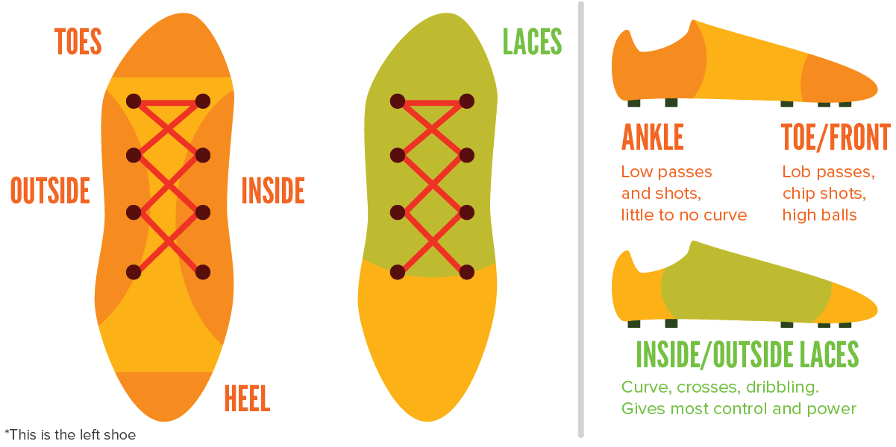
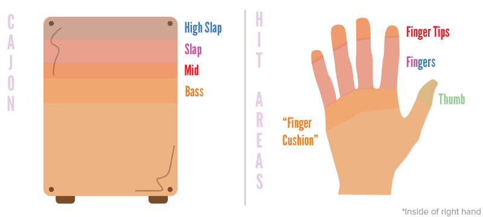
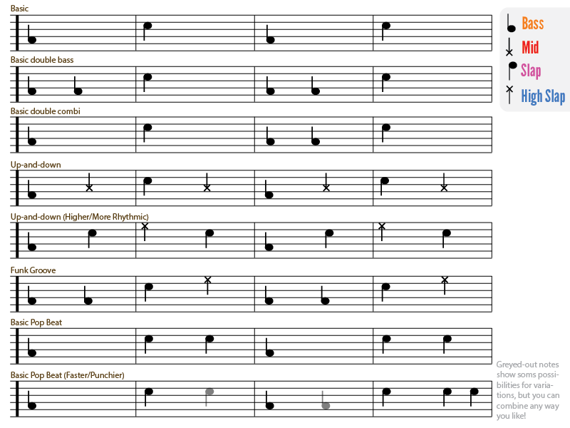

- id: 25 title: "The Complete Soccer Guide" post: "

Soccer is a beautiful game. It's the most famous sport in the world, and for a good reason. There's an awful lot of possibilities in the sport, more than in any other. And isn't it just amazing to watch that ball bending into the upper ninety from far out?

Well, it's even better if you shot that ball. And that's what this guide is for: to help you learn the basics/fundamentals and technique for every aspect of soccer, to vastly improve your game. It's not a very long read, and it covers pretty much everything. And with pictures.

## Overview of Contents

1.  The Very Basics
2.  Shooting & Passing Fundamentals
3.  Shooting
4.  Passing
5.  Ball Skills
6.  Headers
7.  Defending
8.  Off-the-ball movement

" slug: "the-complete-soccer-guide" cat: "Sports" subcat:
"Soccer" video: "" diff: 1 quiz: "" - id: 26 title: "\[Soccer\] The Very Basics" post: "

This article will explain the basic structure we'll be working with in this course, and a bit of the terminology that will be applied.

## Different play modes

When playing soccer, there are basically 3 different 'playing states' you can be in:

-   **Defending:** The opponent has the ball and is trying to score
    against you. You are trying to prevent this from happening.
-   **Attacking:** Your team has the ball, but not you. You're now
    trying to get into good positions to make sure your team keeps the
    ball and to keep the attack going
-   **You have the ball:** Your team is attacking, and now you have the
    ball. This is of course the most important moment to you, as you now
    need to decide whether to shoot, pass, or start dribbling/running.
    Most of this guide will be about how you can improve your own
    skills, but never forget the importance of knowing what to do when
    the other two states are current.

## Different touches

As you know, in soccer you're not allowed to use any part of both arms. The rest of the body can be used however you like. However, the parts most often used (as they provide the best control) are **thighs, chest, head **and of course your **feet**. You'll learn about using the other parts later (in 'receiving the ball'), now I'll just tell you all the different ways you can control or touch a ball with your foot.

-   **Inside** The inside of your foot is the part most people learn to
    use as they grow up, as it is the easiest and most natural movement.
    The inside of your foot can be used for anything (passing, shooting,
    dribbling), as it is the most accurate touch (but slower than
    others).
-   **Outside** The outside of your foot is the hardest to learn and
    use. This too can be used for anything, it just makes the ball move
    and bend in the opposite direction.
-   **Laces** Your laces refer to the upper part of your shoe. Shooting
    with this part of the foot gives you a lot of power, but sacrifices
    in accuracy. With combination of laces+inside/outside you can make a
    ball spin and go enormously fast at the same time.
-   **Heel** The heel is almost never used, because it requires some
    unnatural leg movement and much training to pull it off. You can do
    a backheel volley, but that's very hard, and it's best use is
    therefore a simple backheel pass on ground level.
-   **Bottom** The bottom of your foot is used for stopping and trapping
    a ball under your foot. It's often deployed to receive and control
    a pass, to protect the ball or as part of a certain trick to get
    past a defender. Also, in very tight situations in front of goal,
    you can slide or karate-jump towards the ball and hit it with the
    bottom. Success not guaranteed.
-   **Toes** You should never hit a ball with toes only, as that gives
    zero control or power, and it hurts very much. However, just as the
    bottom of the foot, it can be a decisive move to just slightly
    redirect the ball to get it where you want.

## Some definitions

Before we continue, just a few things to clarify what we're talking about all the time:

-   *Kicking Foot: *The foot that swings and kicks the ball
-   *Standing Foot (Non-Kicking Foot): *The foot that stands still and
    next to the ball as the other one performs the kicking.

" slug: "soccer-01-the-very-basics" cat: "Sports" subcat:
"Soccer" video: "" diff: 1 quiz: "" - id: 27 title: "\[Soccer\] Shooting & Passing Fundamentals" post: "

Shooting and passing is what you'll be doing 50% of the time. The other half is used by your ball skills. But, the one thing that decides matches, is goals, and you can't get those without shooting and passing. So I suggest, if you're really a beginner when it comes to soccer, you learn to pass and shoot really well before you continue to do anything else, because - if you have the ball, and you can shoot but not dribble, you can score goals or give the perfect pass to a teammate. If you can't shoot, but you can dribble\...you can dribble all you want, it's not going to help.

## Basics of every shot

Whatever type of shot you're going to pull off, you need to do a few thing:.

1.  **Give yourself some space.** Find some open space, put the ball
    there in a nice position, and get your body aligned correctly as
    well. Also, already know and imagine where you want the ball to go
    and which kick you're going to use, if you decide or have doubts
    later on, you'll never perform well.
2.  **Put down your planting foot**. Now place your non-kicking foot
    besides the ball, not too far away, but keep room for the swing.
    Make sure the planting foot is **pointing towards the target,** and
    your **knee slightly bend. **It depends on the type of shot how far
    before/after the ball you should place your foot.
3.  (Optional, but very much recommended) **Get your arms out**. Get
    your arms out, any way you like. However, the common way, is to move
    the **non-kicking foot arm** diagonally **back and up a bit**. The
    **other arm **is diagonally **down and forward**. What do arms do?
    They give extra balance, extra momentum and keep away any defenders.
4.  **Initiate the swing (back).** Actually, you should do that while
    planting your other foot firmly into the ground. As you put down the
    non-kicking foot, your kicking foot is already off the ground and
    swinging back (you can't run with two feet on the ground, can
    you?). Use this momentum to swing it back even more, because a lot
    of people are afraid to do this and tense up and do a very short
    swing, which isn't good at all. However, don't overdo it, as this
    will only hinder you and put you off balance.
5.  **Unleash the power.** Now you start to quickly move your leg
    forward. Your upper leg should move first, until your knee is
    roughly above the ball. Then, you need to add even more power and
    start the actual shot by swinging your lower leg to the ball, using
    the desired touch. This two-step leg movement should be done in a
    fluent motion, and not look like some sort of robot.\*
6.  **Follow through.** Now, depending on the shot, comes the follow
    through. After your first contact with the ball you continue to move
    your kicking foot in a certain direction and to a certain extent, to
    add more power, levitate the ball, add curve, etc.

\*The advantage of this motion, is that it requires good swinging technique to do, and it adds more power and accuracy (because the moment you hit the ball, is the moment your leg is at full speed and locked). So, make sure you don't have a stiff leg when shooting, and you  don't hit the ball too early or late in your swing by following the tips!

Of course, you can add your own little tweaks here and there, but try to stick to this basic, correct technique as much as you can. The next two posts will be about passing and shooting respectively, explaining all the different possibilities and types more in-depth.

" slug: "soccer-02-shootingpassing" cat: "Sports" subcat:
"Soccer" video: "" diff: 1 quiz: "" - id: 28 title: "\[Soccer\] Passing" post: "

Passing is used to get the ball to your teammates, which means it shouldn't be too difficult for them to get to and control/receive the ball you send their way. Therefore, good passing technique usually resides in giving the ball moderate speed and moderate (or no) spin. In theory, there are 3 methods used for passing: **ground push**, **cross**, **air lob.**

NOTE: When passing, the inside of the foot is almost always used. However, most people tend to quickly get their foot into normal (toe pointing forward) position when shooting, resulting in you hitting the ball with a weird combination of inside, toe and laces. So, remember to really keep your foot almost at a 90 degree angle with the normal position at the moment of hitting the ball.

## Ground Push

This is the simplest and most used one. It isn't necessarily a shooting technique, as it's more like pushing the ball straight to your teammate. To do it, follow these steps:

1.  Place the planting foot right beside it, at a good distance (rather
    too close than too far away though).
2.  Swing to the ball, hit it with the **inside of your foot**, not
    really with your foot or toes, but with the **part of your ankle**.
    This keeps the ball as straight/curveless and low as possible.
3.  Optional improvement detail: Move your foot a bit upwards, so that
    your toes point up. This really stops the ball from going up, and
    gives it that slight curve often seen in soccer.
4.  Follow through then doesn't really matter, but it's best to create
    the habit of always following through very well.

## Cross

Crossing the ball is used when trying to get the ball from one part or side of the field to the other. Around midfield it's used to switch the play from left to right or vice versa, and sometimes from one side to the other AND forward (diagonally). Close to the opponent's goal however, it's used to swing the ball into the box from the left/right, to the head or foot of your teammate. It goes like this:

1.  Run to the ball at an angle. Running straight to it, makes it very
    hard to create good spin and height, as you impede your own ability
    to swing.
2.  Crosses need to have height, either a bit or lots of it. Therefore,
    place your non-kicking foot a bit before the ball (closer to
    yourself), so that you lean back when you hit the ball. But remember
    to keep your shooting technique the same, so that you still get good
    contact. This leaning back, makes you scoop the ball a bit, and
    together with a nice follow through into the air, this gives the
    ball some nice height.
3.  Swing, and hit the ball with the **inside** of your foot. This time,
    you don't want to use the part close to your ankles, but rather the
    part of your foot **between ankle and toes.** This is the biggest
    part with the most surface and control.
4.  When you first hit the ball, you hit it more at the bottom, at the
    'corner' closest to you. Then, as your swinging continues, you
    move your foot upwards to hit the top far-corner just before the
    ball is released from your foot. Because of the angle of the run-up
    and your touch, you should have enough contact time with the ball to
    do this. However, because we want some nice spin and height, follow
    through is really important here.
5.  As you're striking the ball, turn your whole (upper) body with your
    swing, so that at the end of the shot, you're facing your target in
    all ways possible.
6.  So, what your foot is basically doing, is curling around the ball
    while hitting it, so that the ball takes over this curve when it's
    struck. But, make sure you're not striking it too much to the side
    to get the curve, as this really messes up your shot.
7.  Additionally, you'll want to play around with the amount of curve
    and height. Hitting the ball more with the toes results in higher
    shots, with less curve. If you have a lot of curve, you might
    consider making your non-kicking foot point a bit beside the target
    to make up for it. If you don't get enough height, follow through
    more and lean back more.

## Lob

A lob pass, is a straight pass through the air, with some backspin. So, it has no (sideways) curve, which makes it easier to predict and place well, and it has a bit of backspin to make it go quite high and down again quickly. '*Why don't they use this all the time then?', *you might wonder. Well, there are two sides to the story: being easier to predict, makes it easier to receive and control for your teammate, but also easier to defend or block. On top of that, it's a bit harder to pull off. So here it goes:

There are actually two techniques, and one is often called **chipping** and the other **lobbing** the ball. With chipping, you count on hitting the ball with the right part and positioning your body correctly to make it succesfull. It also has *a lot* of backspin, and less speed. When doing a lob pass, you're basically trapping the ball between your toe and shin and taking it with you in the swing, and then releasing it when your follow through has ended. This creates a straight ball, high in the air, (relatively) very fast, and almost no spin. Both types have their advantages and disadvantages, you can decide for yourself which you like or use (chipping is discussed in the shooting section though).

1.  Lobbing requires a straight run up (or 90-degree turn towards the
    box when performing it if you're going for some cross-lob
    combination, but that's a lot harder to do).
2.  Place your planting foot right next to the ball. With a lob, you're
    going to want full control over the ball until you release it.
    Therefore, putting the non-kicking foot too much before it gives you
    a great chance of having the ball bounce off your foot when trying
    to perform it. At the other end, placing it too much behind the ball
    makes it impossible for you to get the ball up into the air.
3.  Now swing your leg at it, while your toes are pointing down. You'll
    want to control the ball with the **laces**. But, you don't want to
    shoot it, so try to get your toes back pointing forward once you've
    hit the ball, so that it stays on your laces.
4.  Then you follow through as much as you can and keep your toes
    pointing forward. At a certain moment (though the later, the beter),
    the ball will fly off your laces, and into the air.
5.  If you want the ball to go high, simply try to get your foot as high
    as possible on the follow through. If you want the ball to mainly go
    forward (and fast), lean forward a bit on the follow through, and
    land on your kicking foot to help yourself. You might also try
    keeping your toes pointed a bit more downward, but that might go
    wrong and result in a blazing fast shot.

" slug: "soccer-03-passing" cat: "Sports" subcat: "Soccer" video:
"" diff: 2 quiz: "" - id: 29 title: "\[Soccer\] Shooting" post: "

Shooting is different from passing, in the sense that you want to give the ball a one-way ticket for a direct line towards the goal. You don't expect any teammate to touch it, and you don't want the goalkeeper or any defender to block or deflect it. Therefore, either enormously fast or greatly curved shots are preferred (or a combination, if you're getting really excited). Usually, goals are scored from inside the box or *just* outside it. However, it is perfectly possible to score from more distance, but then you'll need to be able to shoot very fast with lots of accuracy, and even some curve if you want to show off.

If you have the time, your best bet will usually be to do a **bending shot **(curving/spinning). This requires a bit of a setup, and isn't as fast as other shots, but it can curl the ball around the goalkeeper (and other obstacles) into the goal. Also, it makes it harder for the keeper to save, because he has to predict the curve of the ball.

However, if you have a straight shot at goal, the best option would be a **lace shot **(driven/instep). This is the fastest shot available, and can be shot in a perfectly straight line, and therefore be struck with great accuracy. In professional soccer though, most people also give the ball a nice swerving curve with this shot, which makes it seem like it's going into one corner, but it actually goes towards the other.

And last but not least, there's the **chip shot**. This is used when the goalkeeper (and any last defenders) are a good distance away from goal and about halfway between you and the goal. This shot then simply lifts the ball over them, out of their reach, and makes it come down to get under the crossbar and score a goal for your team.

Also, it's better to shoot wide than high. If the ball is too high, the ball will simply fly over the goal. If it's wide, there's a good chance the ball is deflected, pushed away by the keeper for a corner or that a teammate will pick the ball up. Furthermore, if you want to hit the upper ninety with your shot, it's better to keep the shot a bit lower and make it go in just below that sweet spot, than to just blast away and shoot the ball over the crossbar 90% of the time, with no chance of ever scoring.

The best spots to strike your ball home to therefore, are actually the lower corners. It's hard for a goalkeeper to dive far when he has to do it on the ground, and there's more chance of the ball going into the net. After that, the most goals are scored by shooting the ball through the keeper's legs, or just past him. It's hard for a goalkeeper to reach to a ball that's very close to him (but not right at him), especially when he can't really see it coming. And only after that, are most goals scored by shooting it into the upper corners.

## Bending shot

In the *passing* section we already discussed the **cross**. The cross is not much different from it, only in the fact that the bending shot usually gets more curve and speed. This is possible, because the shot shouldn't get much height, so the power of the kick goes into the other factors. Therefore, all you have to change is:

-   Place your standing foot less behind the ball, and more next to it.
    You can also place it before it if you want a ball on the ground,
    but that can quickly result in inability to freely swing your leg.
-   Try to get a bit more on your laces: lean into the ball/forward a
    bit.
-   And try some more curve: make your kicking foot go back to
    'toes-forward mode' as quick as possible, but retain proper
    technique ( = the right touch). When done correctly, this adds more
    spin to the ball, but also gets the ball more onto the laces and
    moving forward, instead of going up.
-   And if you've got that under control, you can try if you can put
    your momentum into the shot and make your leg swing so much inwards
    (in the follow through) that your whole body spins around with it.

## Lace shot (and outside)

This shot is all about enormous power, but I recommend you first get the technique down really well, because even an only slightly misplaced touch can result in the ball flying all over the place with this shot. I'll split the shot into two seperate forms: straight ones, and curving ones struck with the outside of the foot. So pay attention now:

##### Straight

1.  A straight run up, though an angle is perfectly possible.
2.  Place your standing foot right beside the ball, or even more
    forwards if you want to keep the ball low.
3.  Now swing your leg back, and while you swing forwards, **keep your
    toes pointed down** and **lock your ankle** for as long as you can.
    Hit the ball with your **laces**, and make sure you make full
    contact (and don't just poke it with the toes).
4.  Then follow through, still with toes pointing downwards, and then
    end this fluent motion with **landing on your kicking foot**.
5.  This should send the ball straight forward with enormous speed, and
    with some height (depending on how you place your standing foot, how
    much you lean forward/backward and how long you keep your toes
    down).
6.  At first, many people hit the ball too much on the left or right
    side of the foot. This isn't useful at all - make sure you hit the
    ball with the center of your foot (or a bit to to the left of that
    if that's too difficult).
7.  Also, most people are afraid of injuring their foot (or mostly their
    toes) when doing this shot. This only increases bad shooting habits,
    like straining the leg, holding back, hitting it incorrectly - so
    don't be afraid. However, these fears are not totally unfounded -
    there's a chance your toes collide with the ground if you don't
    watch out. So, first practice shooting with minimum speed but with
    proper technique. Only after that go wild and make that ball fly.

##### Outside curving shot

This shot basically works the same, but with a few crucial differences:

-   The run up is at an angle. Also, your standing foot will not really
    be pointing at the target, but a bit away from it (to allow room for
    the other leg to swing inwards).
-   Then, it's a common misconception that you must hit the ball with
    the outside of the foot to make it curve that way. No, you must hit
    the **outside of the ball** with all of your **laces** (try to get
    as much contact as you can, but on the outside of the ball).
-   So basically, you're swinging your foot inwards and hitting the
    outside of the ball with your laces, steering it into the other
    direction (almost perpendicular to your standing foot).
-   Success with this type of shot relies on hitting the outside of the
    ball with as much as you can, without making it into a straight shot
    (there's a fine line there). And on following through (in the same
    direction as your standing foot is pointing) very well.
-   Also, some people rotate their foot a bit towards the ball in the
    follow through, and 'scoop' it a bit and make it more into an
    outside foot lob shot. That's perfectly possible, but is harder to
    do than the standard method.

##### Chip shot

The chip shot is actually used 80% of the time in passing, and less in shooting. But, because there is a variant that is more useful for shooting than passing, I discuss both methods here in the shooting section. As stated earlier, the chip shot makes a ball go high into the air, and come back down quickly due to the backspin.

###### Variant 1 - Used most for passing

1.  A slightly angled run up is useful.
2.  Place your standing foot a bit before the ball, so that you lean
    back when shooting.
3.  Then swing your kicking leg at it, and hit it with the **inside** of
    your foot, with the part of your **toes**. The more you can hit it
    with your 'big toe', while still remaining decent contact, the
    higher it will go.
4.  Then, instead of following through, you can just stop the motion
    after you've hit the ball. So basically with this shot, you drive
    your foot into the piece of grass right underneath the ball, and
    using the slope of the shoe at the contact part it will fly up into
    the air with a lot of backspin.
5.  The ball should go straight into the direction your standing foot is
    pointing. If it doesn't, your kicking foot is either angled inwards
    too much, or you hit it too much with other parts of the foot. If
    the ball doesn't get medium height when applying mediocre power,
    you're again hitting it with the wrong part of the foot or have
    positioned your standing foot too much ahead of the ball.

###### Variant 2 - Used most for shooting (chipping over the keeper, hard-to-get bouncy balls)

1.  A straight run up.
2.  Then you place your standing foot *ahead* of the ball, but make sure
    you don't start leaning forward with this shot.
3.  Now, swing your kicking leg at it, and you actually want to hit the
    ball with the same part of your foot (inside toes), but do this
    while the ball is 'behind' you.
4.  Then, you have an awful lot of space to follow through, as you've
    already struck the ball early in your swing. Use this, as it creates
    lots of backspin on the ball (and not necessarily height) when done
    correctly.
5.  Because of the downward movement of the foot at the moment you hit
    the ball, you don't really send the ball into the air, but force it
    to pop forward with some height. Therefore, you can't really get
    this ball very far, but it can go over the keeper, and it has that
    nasty bounce that can make it hard to defend against (and with
    times, can make it bounce over a defender's foot).

" slug: "soccer-04-shooting" cat: "Sports" subcat: "Soccer" video: "" diff: 2 quiz: "" - id: 30 title: "\[Soccer\] Ball Skills" post: "

As said earlier, together with passing/shooting, ball skills make up the other half of your individual soccer skills. And when I talk about ball skills, I'm talking about being able to do whatever you want with any ball that comes near you. Receive it, have a good first touch, start running with it, dribble with it when there are defenders near, and perhaps do a nice trick if you see the time and space.

## Receiving

There are two ways to receive balls flying in the air: **supporting **and **trapping**. Receiving balls that just roll on the ground requires no specific or special technique, that's discussed further in the *first touch* section.

Receiving can be done with the **feet**, **thighs** and **chest**. The foot can then receive it with either the inside, laces, or outside. Inside is the safest, outside is sometimes needed and looks more awesome, and the laces are used if you want to quickly move forward when receiving the ball.

##### Supporting

Supporting means that you make the ball land on you. You support the ball with some part of your body, so that you can let it drop dead to the ground after you've managed to receive it well. So here, you put your body underneath the ball, make it bounce up a bit, and land right in front of you for further use.

##### Trapping

Trapping the ball is the opposite of supporting it. You put some part of your body on top of the ball at the moment of contact, so that you deflect the ball towards the ground. With feet this gives you great control as the ball's got almost nowhere to go when you trap it, but with other parts of your body the ball can bounce off a bit more wildly.

## Good first touch

A good first touch is more important than everyone thinks, because it allows you to immediately put the ball into the right spot for yourself, and it's the easiest way to go past one or two defenders near you. A good player can go any way with his first touch, which makes it hard to defend against.

NOTE: The tips we gave you about receiving the ball earlier count here, this section only explains which way to move the ball on receiving it.

Keep your eyes on the ball at all times, or you'll not even be aware of a ball coming to you. That's\...mostly embarassing, I think. Last of all, always check for defenders near you before receiving a ball!

##### With open space in front of you (towards the opposition's goal)

On receiving the ball you'll want to immediately push it forward
(either straight or a bit diagonally), as this makes the attack a lot faster. Even if you meet a few defenders only 10 meters further, you can simply pass to somebody else or backwards, and you'll have gained a little bit more ground on the opponent's half of the pitch.

##### When your back is turned (towards the opposition's goal)

If that's the case, I first have to say to you: don't ever let this happen! Always try to stand in such a way that you see the ball, but at the same time the other side of the pitch (often this means standing on the sideline if you're a winger, or standing diagonally). But if it happens, turn *before* you receive the ball. If you see the ball coming, already turn a bit one way or another, and turn even more with the ball once it's come to you. Of course, if you see there are defenders near as you turn, the ball is usually quickly passed back to where it came from.

##### With defenders behind you

Move your arms out, to defend the ball and feel where the defenders are. If you notice the ball is moving a bit slowly, move towards the ball yourself, or your defender will be there before you and intercept the pass.

Then, once you've received the ball, there's two things you can do on your first touch. Either make it go left or right and hope you're faster than your defender, or immediately stop the ball and shield it
(while you wait for some passing options, or you're preparing your next amazing trick).

##### In every other situation

In situations where there's some defenders, and some open space, you'll have to decide the best course of action yourself. If you see a gap somewhere, it's best to exploit it on your first touch. If you see a teammate running in good position, pass it immediately on first touch. If you see no way, it's better to pass the ball backwards or to the sides than trying to squeeze yourself through the opposition's defense.

## Dribbling

Dribbling is a vague term, as it means 'moving with the ball, without actually moving it much'. It sits between protecting the ball/standing still and running with the ball. What players often do, is run with the ball, and then some time before they hit a defender, they slow down and start dribbling. They do some fancy movements, slowly move the ball into different directions, until they think they see space and blast past a defender or give that golden pass. Dribbling is basically the simplest way to give yourself space and time and to get past defenders, while tricks are the harder way. So, how is it done?

-   Firstly, you must remember to keep the ball underneath your body
    (not in front or behind it) at all times. It's tempting to keep it
    behind you so the opponent cannot reach it, or to have it in front
    of you because you can see it easier that way, but don't do that.
    That simply makes it harder for you to reach the ball.
-   Then, you must learn to only use **sideways lace touches**. Never
    dribble the ball while touching it with the toes, or inside, or
    outside, or full laces. No, you want to use a combination
    of **inside+lace** for going left, and **outside+lace** for going
    right. This is achieved by pointing your toes down a bit, but not
    fully (like with the lace shot). And, you can rotate the foot a bit
    in the right direction, but there's generally not much room for
    movement in that part of the foot. These touches give more control
    over speed and direction
-   However, sometimes you're more in the mood for some straightforward
    dribbling, but then you'll be surprised that this is also done with
    these touches. Either you can angle your foot more, so that instead
    of left/right it goes almost straight, or you can use the **standard
    dribbling technique**. I recommend the latter.
-   Standard dribbling technique means using a variation of left/right
    to move in a certain direction. If you're varying your touches with
    inside/outside while moving straight, you can go left/right any
    moment. This makes it hard for a defender to get you, because if he
    steps in to tackle, you're able to dodge it easily.
-   Then, make sure that you **touch the ball **every time you move your
    foot. So, if you take the ball to the left, and then you need to
    take a few steps without touching it (because it's too far away),
    that's bad, because that's the moment the defender can easily step
    in and take the ball away. Prevent this, by moving the ball a bit
    every time you touch it, so that you move as though the ball was
    glued to your foot.
-   Optional, but highly recommended: Learn to do the basic movements
    with your *weak foot* as well. Lots of professional soccer players
    can only pass and shoot with their right foot, but
    dribble/run/receive with their weak foot also. Why is this so
    useful? You're unpredictable, and it allows for
    the **two-foot-touch**. This technique is simply starting with the
    ball around one foot, and then passing the ball to the other foot,
    and then quickly dribbling the other direction with the other foot.
    This gives you two times the normal movement in about the same
    amount of time.
-   And then some simple logic: if there's a defender on your right
    side, move and dribble with the ball on your left (and vice versa).
    If there's a defender in front of you, put the ball through its
    legs or burst to the left or right.

## Running

When I say running (with the ball), I don't mean dribbling at full speed. Dribbling at full speed can be very fast and disastrous for the opponent, but I already explained how to do that (all you need to do is perfect the technique and get fast).

First, let's discuss running without the ball. In soccer, at any moment, you may have to bend your run, receive a ball, jump into the air to perform a header, etc. Therefore, you need to have balance and control at any time. Running in soccer means that you keep your (upper)
**body straight** all the time and at the same time **look at the ball**. When in open space you make extremely long strides, when more people are around you must take smaller steps. While running, **move your arms** with you. This can create room around you, and it gives you more balance and speed.

Another action that calls for great running technique is em>counter attacking. Say you've just received the ball and have an enormous amount of space to run into.  Remember you still need to keep the ball underneath you, but this time you can hit it with **laces only**. This sends it straight, and fast. Then, once in about two or three steps you touch the ball again. To make yourself able to run this way with your body in perfect position, you'll have to run on your toes really and with ankle locked while your foot is in the air.

## Tricks

//Todo" slug: "soccer-05-ball-skills" cat: "Sports" subcat:
"Soccer" video: "" diff: 3 quiz: "" - id: 31 title: "\[Soccer\] Headers" post: "

Many people don't realize how important headers are in the soccer game. But the truth is, that lots of passes, crosses and goal kicks fly up into the air and are to be headed. Heading is a skill that is harder to learn than you might think, but it's also the one of the most valuable ones to learn. Heading doesn't involve just striking the ball with the right part of the body, no, you'll also have to win duels with defenders, jump high, get enough power, and give it the right direction.

NOTE: Before I move on, I must say that heading is very dangerous when done wildly and incorrectly!

Heading doesn't mean just putting your head against a ball, no, there's a lot of technique involved:

1.  First, you'll notice the ball is coming at you, and you'll
    estimate when it will be at the right level for you to head it. You
    move to that spot (if you've never done this before, getting a ball
    in the face is not unheard of - it's important to get this part
    about positioning right). Depending on how high the ball is, and
    whether or not there are defenders near you, you may decide to do a
    jumping header, for which you have to position yourself a little
    closer to the ball.
2.  Now, load your weapons! Just as with shooting, you have to swing or
    pull something back, in order to get power once released. So, **keep
    your neck and head straight**, and move your **upper body
    backwards.**
3.  Once you think it's the right time to head the ball (you need to
    keep your eyes open and fixed on the ball, otherwise you'll
    probably be too early), you move your upper body forward (and your
    head with it of course), and hit the ball with your **forehead**.
4.  And now, if you want to give the ball some direction, you need to
    rotate your neck towards your target (rotating your body doesn't
    necessarily help), while the ball is still touching your head.
5.  Now you should have performed a nice and clean header!
6.  You'll need to keep in mind that any ball that hits your forehead
    will move upwards, so keep/move your head a bit down if you want the
    ball to go low, which is mostly useful for scoring (very often,
    headers from corners go over the crossbar because of the lack of
    proper technique).

Now you know how to perform a header, but what if there's people around you that also want the ball for themselves? Use these tips:

-   Get your arms out - make yourself big and stand on the ground
    firmly. Make sure that your opponent can't get in front of you, but
    also can't push (or pull) you in any direction.
-   In the case of a goal kick (or another slow but very high ball) you
    want to stand **behind** your opponent. This is because these balls
    are quite impossible to control, so standing behind the other player
    either makes the ball fly back a lot towards the opposition's side
    of the pitch, or it simply flies into your territory and possession.
-   In any other case though, you want to either be **in front** of your
    opponent, or you want to **jump higher/above** him.
-   When close to the opponent's goal, there will be defenders pushing
    and pulling you. You need to either shake them off of you by running
    around a lot, or be strong enough to get them off your back. Then,
    once the ball comes, use the technique I described earlier to score.
-   When defending in front of your own goal, you want to head the ball
    high and away (and of course, now you're the one pushing the other
    players). Preferably, you want to head the ball towards the sides,
    because if you deflect it to somewhere in front of goal, there's a
    chance an opponent picks it up and shoots the ball into the net.
-   However, keep in mind: it's never allowed to put elbows/arms into
    other player's faces, or to lean or jump onto them in any way.
    Although, it depends a lot on the type of arbiter and how intense
    the game is.

" slug: "soccer-06-headers" cat: "Sports" subcat: "Soccer" video:
"" diff: 3 quiz: "" - id: 32 title: "\[Soccer\] Defending" post:
"

Usually, the casual soccer player defends by just running to the guy with the ball at his feet and trying to get his leg in between there somehere. Though part of this technique can be useful, it's of course not the best way to go. It drains the energy from you (you're running all the time), you can easily make fouls, and the opponent can even more easily dodge you and have free space to run into.

There are a few things a defender must be able to do: **intercept/block**, a **standing tackle** and a **sliding tackle.** Of course, positioning and marking plays a big role here, but that's described in the 'off-the-ball movement' section.

## Defending Fundamentals

So, you've got an attacker moving somewhere near you. First, you must learn to wait. Don't rush to him, try to **estimate where he will end up**, and get there moving at **about the same speed as him**. This makes you able to either perform a tackle, or quickly run with the attacker if he changes direction or does some sort of trick. If you run towards him too fast or too slow, the attacker will be able to dodge you or move past you with a simple acceleration. Also remember, to always **stay on your toes, **as this makes you able to quickly change direction.

So, now you're running at the proper speed, and you're at the point where you're going to bump into the attacker. You'll now want to stand **diagonally**, between the player and the goal (blocking a straight line to the goal). Lower yourself a bit (a lower center of gravity gives you more balance, strength and agility - but less speed), and keep your eyes fixed on the ball, and the ball only, Whatever fancy moves the opponent makes, only the ball can truly show you where the ball is going.

Now, the attacker has the option to try and move past you left or right
(cutting outside or inside). If he moves too close to you, or waits too long, you can perform the **standing tackle**. Otherwise you'll have to run with him and either block his shot/pass or get him off the ball with standing/sliding tackle if he loses control over the ball for a second. You're allowed to use some of your strength and body to take the opponent off the ball, but not very much, because that results in you making a foul. Other moments where **sliding tackles** are preferred, are when you're coming from an angle at a player with high speed, and you see the opportunity for a clean sliding\*, do it! Otherwise, it can be a last resort to block a pass or stop a player in dangerous position, but be careful with that.

\* This means: you're pretty sure where the ball is going to end up
(and the player is not going to end up, which is the case when a player is running with the ball and can't change direction quickly.

## Standing Tackle

The standing tackle is the easiest one. It can be executed if you're close enough to the ball to stick one foot out (while still standing on the other one) and kick the ball away or take it for yourself.

Standing tackles are performed with the **inside **of the foot, as this is the strongest part with the most surface. Basically, all you need to do is put this part of the foot to the ball, and make it go in any other direction than the attacker who first had the ball wanted it to go.

However, sometimes you'll make contact with the ball at the same time as your opponent, or he'll have enough space to move quickly and make it hard for you to get the ball. Then, you'll need to do everything to come out of this duel as the winner, because you're the defender!

Therefore, you first need to learn to close in on the attacker. **Make yourself big**, and make sure that whatever direction the other player is going, he'll bump into you, or you'll be able to do a standing tackle with one of your feet. Then, once you see the opportunity, **lean into the tackle**. Move your whole body forward and use your mass to make sure the attacker doesn't simply push you away.

And then, to give it a nice finishing touch, you can learn to determine the direction you want the ball to go after the tackle and quickly run there to get the ball for yourself. If you just tackle, most times the ball will bounce out of bounds (and you were the last one to touch it), or fly back to another player from the opposition. A good rule to follow here, is that you want the ball to diagonally move away from your goal. This moves the ball towards the sides, and not back into the feet of the attacker. This puts your team immediately into attacking mode, and you're less likely to lose the ball (with disastrous consequences) there.

## Sliding Tackle

A sliding tackle is a bit harder to do, and also has a few variations you'll need to master. Before we go on, a few things on performing safe sliding tackles:

**Keep your feet at ground level, always**. Whatever you do, any foot that reaches the knee or even higher is not only a yellow or red card for you, but also a danger for the player receiving such a tackle.

**Don't hit the ball with the bottom of the foot. **You may be tempted to slide to the ball, and kick it away to the side with the bottom of your foot. But, that's not smart, and also dangerous. You want to use your **laces** (but not your toes, watch out for that) to kick a ball away.

**You don't always have to slide.** Although they look wonderful when done correctly, you don't have to do them all the time once you've mastered them. Most of the times simply running your man into dangerous territory or a standing tackle will suffice. Forcing the opponent to play the ball backwards is also a win.

So, now we can go on to: *how is it done?*

Well, the first thing you must learn is of course the 'sliding' part. To slide, you need to have some speed, and then drop to the ground, sideways. While you do so, your **lower leg** (that's touching the grass), must be **bend** (so you're practically sliding on your knee/thigh) to get a good sliding movement. The upper leg is then stretched out and used for the actual tackle.

Another variation is where you do what I described above, but at the last moment you switch your lower leg to be stretched, and you upper leg to be bent backwards. This gives some extra power to the tackle, but has the disadvantage that you can only kick the ball far to the side this way.

That brings us to our last variation, where you keep the ball in possession. While you perform the tackle, wrap your foot around the ball, and quickly get on your feet and pull the ball towards you. This results in the cleanest possible tackle, because you keep the ball afterwards, and your tackle must be perfectly on the ball for it to succeed.

That's really all there is to it. Once you've got the basic technique, it just takes a lot of practice to get the timing, power and aiming right.

##### Intercepting/blocking.

This isn't really that hard, as it just means you must estimate how the ball will be passed or shot, and then get in the way (either with your body or by sticking a leg out). However, there are a few tips and tricks:

-   If the ball is shot from up close, keep your hands behind your back
    to prevent yourself from making hands.
-   If the ball is shot from the side of the pitch, you can use your leg
    and body to stop or deflect it.
-   However, if you're in front of goal, you want to stand still where
    you are once a ball is struck. This way the goalkeeper can see the
    ball all the way and correctly estimate where it will end up. If
    everyone just hopelessly tries to stop it, the ball might deflect,
    and that renders the goalkeeper useless.
-   If you're trying to intercept a pass, don't stand precisely
    between the ball and the man you're marking, but a little bit
    further to your own goal. This forces the opponent to pass the ball
    behind the other player, stagnating their attack.

" slug: "soccer-07-defending" cat: "Sports" subcat: "Soccer" video: "" diff: 3 quiz: "" - id: 33 title: "\[Soccer\] Off-the-ball Movement" post: "

Whenever you're not on the ball, the game is still moving. That means, you should be moving too. Whatever position you're playing, you can't just go sit down for a few minutes because they're busy on the other side of the pitch. Let's go over the roles for every type of player real quickly:

-   **Defender:** You're the last barricade the opponent must break
    through before he can score. Therefore, your job is to make sure
    you're always behind the ball, that you position yourself well and
    always mark your man. Then if you've stole the ball back for your
    team, it's your job to keep it and start building the attack.
-   **Midfielder:** The midfielders do a bit of defending and attacking.
    They must always be free to receive the ball, and run around a lot
    to achieve this. Whenever the ball is somewhere in their area, they
    must win it back or really put pressure on the opponent. And if
    you've got the ball, you must be able to pass it perfectly.
-   **Attacker:** Attackers are of course good for one thing: tearing
    the opposition apart and score the goal much-needed for winning the
    game. Therefore, they will not really help with defending, and stay
    somewhere around the opponent's line of defenders. Once the ball is
    in their possession or comes their way, the attackers try to make
    clever runs or dribbles or perform awesome tricks and passes to get
    closer to the goal, and then one of them will shoot.

##### Positioning

//Todo

##### Marking

//Todo

##### Clever Runs

//Todo

##### Team Tactics

//Todo" slug: "soccer-08-off-the-ball-movement" cat: "Sports" subcat: "Soccer" video: "" diff: 3 quiz: "" - id: 34 title:
"Complete Card Magic Guide" post: "

So, you want to impress friends, family, your crush, and anyone else with magic tricks? Well, you've come to the right place. Card tricks are the best ones to start with, because there are so many different tricks you can do with them, and all you need is a standard deck of cards (usually without jokers). What people usually do is teach you a complete card trick, from start to finish. But, what I will try to do, is teach you all the different components and basic tricks you can use with card magic, so you can assemble your own trick! However, if you just want to learn a trick from start to finish, I've got that covered as well.

## What do we need?

A standard 54-deck of cards. You can decide for yourself if you want to keep the joker(s) in there. Nothing else, the rest of it is just your own skill. There are, I must note, a lot of beginner card tricks that involve glue and pieces of paper and cards cut in half\....but I find those the ugliest tricks ever, I only teach 'clean' tricks here. Not only does this make you a better magician, it also saves you a lot of work and money. And, you can perform your tricks with any deck given to you.

And of course, you need the right attitude! Learning proper card magic requires a lot of practice from your side. Cards may fall out of your hands, they can slip, tricks can go wrong because you accidentally did an actual shuffle (instead of a fake one)\...it all happens, you just need to go on until you got it perfectly right. And when you've got it perfectly right, you can study a bit about *misdirection* to cover up the secret even more.

## The Basic Setup

For the people who've seen the movie "The Prestige", this quote may sound familiar:

The first part of a trick, is called "The Pledge". The magician shows you something ordinary and asks you to inspect it.\
\ The second part, is called "The Turn". The magician takes the ordinary thing, and makes it do something extraordinary.\
\ But making something disappear, of course isn't enough. That's why every magic trick has a third act, the hardest part, "The Prestige".

Well, sounds cool, but what's my point? That every card trick also has these three 'acts'. First, you show them the deck of cards so they see it's perfectly ordinary. You let them pick a card, study it, and put it back. Then, you do something extraordinary: you make the promise of retrieving the spectator's card. You shuffle the deck, make some cuts, perhaps do some other nice moves. And then comes the last part: you make the card come out of the deck! This can be in any way you like, by making it the top or bottom card, doing a nice reveal, letting the spectator grab the top card, etc. And that's the way you must also read this guide. I have tips and variations for every part\...enjoy it!

## A Basic Trick

But, to start you off, I present you a very basic trick you can already practice. For the spectators, it goes like this: they may choose a card, put it on top of the deck, you make a cut in the deck, and then you look into the deck and bring their card back! But for you, the magician, it goes like this:

-   Shuffle the deck (really, no fake one).
-   Let the spectator choose a card. But, while he does that, you look
    at the bottom card of the deck, and memorize it.
-   Then, the spectator puts his card at the top of the deck, and you
    make a random cut. This means you cut the deck in half around the
    middle of the deck, and put the bottom half on top of the top one.
-   What this does, is it places the bottom card on top of the top card
    (= the chosen card).
-   Then, all you have to do, is turn around the deck and look through
    the cards until you find the card you memorized. The card before it
    is the card the spectator picked!

Now of course, that is a very basic trick that anyone can see through after you've done it a few times. But it's a great example of how simple tricks can be, and it's an easy one to get you started with smooth card and audience control.

## Basic 'Sleight of Hand' Techniques

There are several areas in 'sleight of hand' that can (and/or must) be implemented into a trick, namely:

1.  Fake Shuffles
2.  Location Markers
3.  Passes & Breaks
4.  Card Forcing
5.  Card Hiding
6.  Card Revealing

Everything else essentially comes from these basic techniques, so let's get started!

NOTE: We recommend you follow the guide in the order presented above, as we'll be heavily using some methods learned in earlier chapters in later ones.

" slug: "complete-card-magic-guide" cat: "Miscellaneous" subcat:
"Card Tricks" video: "" diff: 1 quiz: "" - id: 35 title: "\[Card Magic\] Fake Shuffles" post: "

A trick in its simplest form, is having a spectator put a card on top
(or bottom) of the deck, then shuffle it (fake one), and show the audience (to its surprise) that the card is still on top. However, to not make the audience suspect anything, you'll need to learn multiple of these fake shuffles.

## Controlled Shuffle

The controlled shuffle makes you able to keep a card at the bottom or top. The rest of the deck is really shuffled. The controlled shuffle is almost the same as the basic shuffle everybody knows: hold the deck in your right hand, and take a portion from the back of the deck and throw them down at the other end, in groups. It works like this:

-   If you want to **keep a card on top:** The first time, instead of
    taking only a portion from the back, lift the entire deck, except
    for the top card. The top card will fall back, and you can put the
    whole deck on top of it. If done quickly, it's unnoticable. Then,
    you can just finish this shuffle, for the card will be at the bottom
    of the deck. The second round, do it the traditional way, and grab
    the back portion of the back and throw them in front. When you come
    to the last few cards, release them one by one so that the bottom
    card ends on top.
-   If you want to **keep a card at the bottom:** Do everything the
    normal way, but when you come to the last few cards, don't put them
    in front but simply return those few to the back. Again, this might
    seem obvious, but when done quickly it will not be noticed. A
    variation on this, is that you vary between putting cards at the
    front and at the back. It works the same way: simply keep the bottom
    card in your hand, and only release the other cards.

## Perfect Cut

This technique, if done quickly, makes it seem like you're just cutting the deck at random places (because you are). But, the trick is in the fact that you return those bits of the deck in the exact same order you cut them, so that the complete order of cards in the deck remains exactly the same. Here it goes, step by step:

-   Take  the deck of cards horizontally with both hands, thumbs on the
    back side (pointing towards you) and the rest of your fingers on the
    other side.
-   Then, take about 1/3 of the deck from the bottom with your right
    hand, and move it to the top. But, keep it seperated from the
    remaining cards in the other hand.
-   Then, with your left hand, again take 1/3 of the deck from the
    bottom and move it on top of the other 1/3 you just moved. These
    don't need to be seperated. *(if you want to do the shuffle very
    quickly, it's wise to lift your index finger and already start with
    the next step)*
-   Then, move whatever's left in your right hand (seperated from the
    2/3 above it), on top of that, and your deck is in the exact same
    order as it was before.

Do it quickly and multiple times, and people think the deck is completely shuffled, while it's EXACTLY the same.

## Swivel Cut - Simple Flourish

This one looks awesome, whatever you use it for. And, it keeps the complete order of the cards.

-   Take the deck into your right hand, vertically, thumb closest to
    you, the rest of your fingers at the side furthest from you. Your
    hand must be above the cards (so palm is facing the cards).
-   Then, cut 1/3 of the top of the deck and throw it into your left
    hand (**A**).
-   Then cut the remaining deck in two, again creating two cuts of about
    1/3 **(B **and **C**, top and bottom).
-   Then, switch **A** with C**. **So, C is now in your left hand and A
    underneath B in your right. Make sure to keep A and B seperate.
-   Then comes the swivel: use the **left index** and **right index** to
    rotate **B **180 degrees while transporting it from your right to
    your left hand.
-   Then throw the remaining cards in your right hand (A) on top of the
    ones in your left. And the order is restored to A,B,C.

The swivel throws some nice style and elegance into the shuffle, and isn't too hard to learn.

## One-handed cut

This method of cutting the cards serves two purposes: one is that it actually shuffles the cards and looks awesome, the other is that you can cut the cards quickly while distracting the audience with your other free hand. Here are the instructions for the *right hand.*

-   Keep the deck in your hand horizontally with index finger on the
    left side, middle and ring finger on the top side, pinky on the
    right side, and thumb on the bottom side.
-   Cut the deck in two (we'll call them **A** and **B**, top and
    bottom), by applying only pressure to the top half of the deck with
    your thumb.
-   Then release pressure from the index finger, and tilt your hand a
    bit so that **B** falls down into your palm, resting on your pinky.
-   Then, use this free index finger to push **B** towards your thumb,
    so that B and A form a 90 degree angle.
-   Once it's there, you can release your middle and ring finger so
    that **A** falls down into your palm.
-   And then a little push with your thumb makes **B** fall down on top
    of **A**.

" slug: "card-magic-fake-shuffles" cat: "Miscellaneous" subcat:
"Card Tricks" video: "" diff: 1 quiz: "" - id: 36 title: "\[Card Magic\] Location Markers" post: "

There are lots of different ways to mark the location of a card. There are two basic methods: marking the card itself, or marking the space/cards surrounding it so you can easily find the card.

## Spotting Card

The spotting card is the easiest: all you have to do is quickly look to the bottom of the deck and spot a card. While the audience is busy with something else (or you're using your misdirection skills), you simply take a quick look at the bottom and remember that card.

There's two ways this can come in handy: you can later make sure the card the audience picked is right next to this card, so you can easily find it (you're using it as a location marker). Or, you somehow move the chosen card to the bottom of the deck, and quickly look so that you know exactly which card the spectator picked. Then, you can do anything you like to throw off your audience, because you already know the card.

## Glide

The glide simply requires you to glide a card backwards/out of the deck, so that you can easily move/locate it. The common way is to use a glide on the bottom card of the deck, but it can be done on any card.

-   *Bottom Card*: Use your pinky or some pressure from the palm to
    slide the bottom card backwards, toward you. It can be extended
    quite a bit, the audience can't see it if you do it properly.
-   *Other Cards:* This is a bit harder. Subtly lift the cards on top of
    the one you need (with your left hand, deck lies in right hand), and
    use your thumb to slide the card backwards. The technique is often
    used to pretend to grab a certain card, but in fact you grab a
    different one. For example, if you glide the bottom card, you can
    now easily get the 2nd to bottom card of the deck, while the
    audience thinks it's the bottom one.

## Keepsake

This move is in some way the same as the glide, but has some extras attached to it and usually serves a different purpose. What you do is, you make the card your 'victim' picked subtly stand out of the rest of the deck. To make this invisible to the audience, it's best to make it really stand out at the back of the deck (the part that's facing you), and keep the front the same as always. As you might have guessed, a *glide* is needed somewhere in that move. Here are some examples:

-   *Putting a card back into a [fanned
    deck]{style="font-weight: bold;"}:* You first let a spectator choose
    a random card from a fanned deck, (look at it), and then he must put
    it back somewhere in there. The trick is, to apply pressure with the
    thumb on the 'root' of the deck, so that the card can't be put
    back completely, a little bit sticks out. Then you can simply rotate
    the deck 180 degrees while squaring it (to cover this up). Then you
    have the card your spectator chose sticking out in the back.
-   *Putting a card back somewhere random in a deck: *This is the other
    way cards are often returned to the deck. When the spectator puts
    his card back, you simply perform a mid-deck glide: while you put
    the top half of the deck back, use the thumb of that hand to slide
    the top card of the bottom half (the chosen card) back a bit. You
    can also push the card a bit diagonally, so that the chosen card
    rests on top of your pinky for further use. This however is tricky,
    because a diagonal card in the deck is easier to spot.

## Card Crimping

This is not exactly one of my favorites, but it is also an often executed method. What you do is, once you have the spectator's card isolated from the rest of the cards (using perhaps the methods above), you *fold the right corner at the back of the card* a bit. Then, you can just put the card back in the deck, and you can easily spot it. Be careful though, to grab the card at this corner when you display it to the audience. While you're pulling out the card, you can slide your fingers a bit to make the crimp undone.

## Passes & Breaks

Besides all of these, there are a few location marking techniques that can used for other things as well, and are much quicker and more powerful. Those are discussed in the next chapter." slug:
"card-magic-location-markers" cat: "Miscellaneous" subcat: "Card Tricks" video: "" diff: 1 quiz: "" - id: 37 title: "\[Card Magic\] Passes & Breaks" post: "

Passes and breaks are essentially the same thing, but their relation is like this: a pass is created by doing a break. When you do a break, you subtly seperate two cards or two halves of a deck or whatever. When you seperate them, an open space is created (a *pass*age) for cards to be put in there or pulled out of it.

## Pinky Break

This is the most common break, because it is easily hidden. The end result is always that you have a deck in your hand that looks normal to the audience, but at the back you have your pinky stuck between there to mark a certain spot. To get there, you can use multiple techniques.

NOTE: For all pinky breaks, for them to look as natural as possible: tilt the deck a bit forward, put extra pressure on the top with your thumb, and don't put your whole pinky in between but only a 'bit of flesh' so to speak. This makes sure people mostly see the front and top of the deck and never notice that the back is a bit larger.

-   [For seperating card(s) from the
    top. ]{style="font-weight: bold;"}Subtly move the top card(s) with
    your thumb towards your pinky. Lower the pinky to make the cards
    rest upon it, and then slide the cards back while holding the pinky
    between cards.
-   *[OR]{style="font-weight: bold;"} * apply a lot of pressure with
    your thumb at the top right corner. Use your middle finger (and
    perhaps the pinky too) to keep the bottom cards down. This way, the
    top cards' bottom left corner will jump up in the back so you can
    put your pinky in that gap.
-   [For seperating card(s) from the
    bottom. ]{style="font-weight: bold;"}Simply lower your pinky, while
    keeping the other fingers at their place to avoid raising suspicion,
    and use the part right under your nail to break as many cards as you
    like.
-   [For seperating card(s) somewhere in the
    middle. ]{style="font-weight: bold;"}Often, you randomly cut the
    deck and ask the spectator to put his card in there. There's no
    trick there, the trick comes when you put back the top half of the
    deck. As you do this, move your pinky a bit inward and/or apply
    inward pressure with it to keep a small break between the chosen
    card and the top half (doesn't have to be very large). Then all you
    need to do, is find a way to distract the audience and quickly move
    the bottom half to the top (make it look like your
    cutting/shuffling), and you've already recovered the card!

## Thumb Break

The thumb break is similar to the one with your pinky. Instead of having your thumb at the side of the deck, you want it at the back. Index and pinky are then on left and right, and middle and ring finger at the side opposite to the thumb. Your hand can be below or above the deck, but below is the more natural grip. Just as with the pinky break, you can use your thumb's flesh to create a break somewhere in the middle of the deck. To get cards from the top, you can do two things:

1.  Let all the other cards of the deck fall into your hand, and have
    only the remaining one or two cards from the top touching your
    thumb. This can be done quite smoothly.
2.  Use your other hand to do a quick* countback*. This means that, if
    you for example need the top two cards, you place your left hand
    over the deck and grab a portion of the top cards and quickly drop
    them again until you feel there's two left between your fingers.
    You can then pick those cards up, or use your thumb from the right
    hand to hold the break at the back of the deck.

" slug: "card-magic-passesbreaks" cat: "Miscellaneous" subcat:
"Card Tricks" video: "" diff: 2 quiz: "" - id: 38 title: "\[Card Magic\] Card Forcing" post: "

Card forcing is the act of letting the spectator think they are choosing their card at random, but you are forcing your card on them. There are two methods here: sleight of hand ones, and psychological ones. The sleight of hand are basically clever tricks to give the spectator the card that you want, while (s)he thinks it was the one she chose. Psychological ones require you to say and do things in a certain way so that the spectator starts to think of a certain card and eventually picks the one you've been forcing. However, keep in mind that most of these forces are tricky, and you need to be able to perform them smoothly or the trick is immediately done with.

## Riffle Force

This one is the simplest to perform, yet is very effective.

-   Before doing this, quickly spot the bottom card of the deck and
    memorize it. You're going to force this one.
-   Take the deck into your hand, vertically, normal (dealer's) grip
-   Then with your other hand, spread out the cards of the deck
    vertically, so the top cards are closer to you than the bottom card.
    This allows you to riffle.
-   But, what the audience doesn't know, is that you don't move the
    bottom card, so basically that stays about as close to you as the
    top card. Or, you could use the thumb from your other hand to glide
    it back.
-   Then, as you riffle through the deck (with the thumb, top to
    bottom), you ask a spectator to say stop.
-   When he says stop, you take the portion you've riffled through off
    the top of the deck AND the bottom card you slided backwards.
    Because you've prepared for it, it's easy and unnoticable to take
    that bottom card with you.
-   Then you quickly square this package up, and reveal the bottom card
    to be the spectator's chosen card.

Simple, but with a bit of practice, nobody can see the bottom card is in your hand during the riffle and is included with the package when you're squaring it up. This was the first force I learned, and I stuck with it for a long time because it was so effective.

## Hindu Force

If performed quickly, this one is just as simple but unnoticable.

-   Before you start, spot the bottom card of the deck, that's the one
    you'll force.
-   Take the deck between the thumb and middle finger of your right
    hand, with your hand above the deck (palm facing away from you).
-   Then with the thumb and middle finger of the left hand, hand
    underneath the cards (palm facing you), take a small portion of the
    deck from the top. Let them fall into your left hand like you would
    normally hold cards (dealer's grip).
-   Repeat this action, transporting a few cards from the right hand to
    the left every time, until the spectator says 'stop!'
-   Then, you show them the bottom card from your right hand. This is
    still the same, because you've only been moving cards from the top
    of the deck. However, this is hidden by your left hand, so the
    audience doesn't suspect anything. And if you do it quickly, it
    even looks impressive.

## Double Flip Force

The double flip force may seem somewhat strange to your audience, but works everytime. If you just talk smoothly while doing it, it should be alright.

-   Spot the top card, that's the one you'll force.
-   Hold the deck vertically in your right hand, thumb on top, and the
    other fingers supporting the bottom.
-   Then use your left hand's thumb to riffle through the side of the
    deck from top to bottom.
-   When the spectator says 'stop!' you turn the top portion you've
    gone through so far upside down (face up).
-   Then you continue riffling with the cards underneath the portion you
    just turned around.
-   When the spectator says 'stop!' you again turn around everything
    above the left thumb and take that portion off of the deck.
-   Now you have a group of cards with the first half of them facing up,
    and the rest facing down. Go through the face-up cards until you
    meet the first face-down card. That's the one you pick, and give to
    the spectator.

## Cross-Cut/False Cut Force

The false cut force depends more on how well you can present your tricks than real sleight of hand. What you basically do, is cut the deck and mark a certain location as the chosen card, while in fact it's just the top card of the deck you've memorized.

-   Show the audience it's a normal deck, while at the same time
    spotting the top card.
-   Then go through the deck in any way you like. Perhaps let the
    spectator cut the deck in two, as long as you have two halves in
    your hands after this move.
-   Then, place the half with the card you memorized on the table. Now
    place the other half on it, but perpendicular to it, to 'mark' the
    card the spectator chose.
-   Now, you need to cover up that you actually just marked the top card
    by some smooth talk. 'Okay, you can all confirm that I gave the
    spectator a regular deck, and he cut it completely at random, and I
    now marked the card he chose?' It does well, because everything is
    the truth except for the last statement.
-   Then, simply take the top card of the bottom half, which previously
    was the top card of the deck, and give it to your spectator.

## Glide Force

The glide force only requires you to be smooth with the *glide*, the rest is easy yet very convincing.

-   Spot the bottom card of the deck.
-   Hold the deck in dealer's grip, face down.
-   Ask the spectator to think of any number between 1 and 52. However,
    to make things a bit easier and faster, you can narrow it down to
    say 1 up to and including 15.
-   While he's thinking, subtly glide the lower card a bit back.
-   Now the spectator has said a number, e.g. 10.
-   Then you tell them you're going to take 10 cards from the bottom of
    the deck, and the tenth card will be theirs.
-   The first 9 cards you pick though, are actually the second to bottom
    card. Because you did a glide on the bottom card, it's easier to
    pick the second to bottom card and make it appear to be the bottom
    one.
-   Then, for the last card, you pick the actual bottom card. Do this as
    quickly and swiftly as with the others, to not raise suspicion. Put
    it down on the cards you previously laid on the table, and then
    raise it and show/give it to the spectator. If you give it to the
    spectator directly from your hand, they'll be focused on your hand,
    and might spot the difference.

## Elimination Force

This one depends a lot on quick thinking and your showman skills. It's used more often than you think, in a lot of different ways, but it's also easy to get caught on. I'll try to show you a very abstract way to do it

-   Say you have 6 groups of cards laying on the table, face down. You
    know that the spectator's card is on top of the 2nd group.
-   Now you ask the spectator to select one group.
-   If it's the correct group, simply say 'alright, let's magically
    turn the top card into your card!' You do some magical movements,
    and turn the top card over and reveal the spectator's card.
-   If it's not the correct one, say 'alright, let's remove this one
    from the equation! So, select another one' (or something like
    that). And repeat.
-   The reason it works is because people don't know what is done with
    the selected group. They just select one, and for all they know
    you're going to eat those cards.
-   The reason it's tricky, is because if the audience first picks two
    wrong groups and then the correct one, how do you explain you now
    suddenly don't remove the group? Therefore, often either a small
    number of groups is chosen or an explanation is already thought of,
    just say something like 'this is the third one you've chosen, and
    third time is the charm, so let's make it appear on this one!'

## Gravity/Cull Force

This one requires a little more skill than the others, but looks much more like the normal way of letting someone choose a card. You slightly fan the cards, going through them until a spectator says stop. Then you show them the card, but you've actually forced the bottom card.

-   Spot the bottom card.
-   Take the deck in your right hand. Let it lie on your palm, with
    thumb on the right and the rest of the fingers on the left.
-   Now, with the left hand, take the top AND bottom card and slide them
    a bit to the left and towards you (to conceil the bottom card).
-   At the same time, turn the deck over so it's bottom now lies on the
    fingers of your right hand. Your right thumb should be able to go
    through the cards, and your left thumb should be able to catch them.
-   Perform this motion, quite quickly, until someone says 'stop!'.
    You shouldn't do it too slow, because then you'll still be
    somewhere around the top of the deck, and the bottom card becomes
    too obvious.
-   Now, take out the portion you've just gone through + the bottom
    card, in one swift motion. Square it up to conceil the secret even
    more, and then simply show the spectator the bottom card of those
    cards, and give it to him to inspect it (always takes the attention
    off of what you're actually doing).

## Dribble Force

This one is the hardest of them all to do, but again looks more natural and convincing. What you do is *dribble* through the deck, until someone tells you to stop, and then you show them the card you've stopped at, which is exactly the card yu wanted them to pick. *Dribbling* through a deck of cards, means slowly dropping cards from your left hand down into your right hand. Like letting cards fall into your right hand, but in a more controlled way.

-   Get a thumb break with your left hand somewhere around the middle of
    the deck.
-   While you're still talking, spot the card you've cut at by subtly
    rotating the deck so it faces towards you.
-   Now, dribble the cards from left to right. Keep your hands close
    together to not reveal too much (and make no mistakes), and let one
    or two cards fall at a time, at a constant rate. If you let a big
    chunk of cards fall every other second, it doesn't look as good and
    the force is easily noticed.
-   When the spectator *starts saying* 'stop!', there's two
    possibilities: 1) You've already gone past your thumb break, so an
    almost complete deck already lies in your right hand. 2) Or you
    haven't reached that point yet.
-   In case 1, simply drop all the cards remaining and tell him he was
    too late and start again.
-   In case 2, now drop all the cards remaining until the thumb break.
    Then get the bottom card of the cards remaining in your left hand,
    which you've spotted earlier on, and show/give it to the spectator

The difficult part here is to learn to dribble nicely, the rest shouldn't be too hard.

" slug: "card-magic-card-forcing" cat: "Miscellaneous" subcat:
"Card Tricks" video: "" diff: 2 quiz: "" - id: 39 title: "\[Card Magic\] Card Hiding" post: "

Hiding a card is very useful. There are multiple ways which you can use to make it seem like a card has disappeared or switched places, while in fact it hasn't. While your audience is already baffled because of the disappeared card, you can bring it back easily because you've been (for example) holding it in your other hand all the time.

## Double Lift

A double lift is used *very very often*, and takes some practice to nail it down. However, if you can eventually perform the double lift, a whole world of tricks opens up for you!

So, a double lift basically means grabbing two cards from a deck, while presenting it as one. This way you can pretend that a certain card is another one, which always comes in handy in magic.

-   To do a double lift, you first need to have the two cards seperated
    from the rest of the deck. To just lift two cards from a deck like
    you'd do with one card is very hard.
-   So, create a pinky break, a thumb break, or subtly slide two cards
    off the deck with your thumb. With all methods, make sure you can
    seperate them quickly, and just as quickly pick up the two cards.
-   Now, you need to make sure both cards are squared up, but you want
    to handle the cards in about the same way you handle single ones.
    Here's a few options:
    1.  The easiest one is to pick up the double with multiple fingers,
        keeping the cards squared between them. With some training
        holding it between the thumb and index finger while keeping it
        squared should be possible. At that moment, you can bend the
        cards a bit or rotate them to give the audience the feeling
        you're just playing with a card.
    2.  Another one is more fancy: fetch the card at the bottom left
        corner, and rotate it around at the base of the thumb. This way
        you have control over two points (top left and bottom right),
        which should keep the double squared. Then once you've turned
        it around you can keep it in your hands and later reverse the
        motion or drop it again on the deck and just do the whole thing
        again to turn them upside down.
    3.  Another one that's often seen is where you don't really lift
        the cards in the air, so there's not much chance the two cards
        will split. For this, you fetch the card on the side with one or
        two fingers. Then slide it to the left until the right side of
        the double almost loses its touch with the deck. Now quickly
        turn it over and let it fall on the deck. Make sure to make it
        fall a bit to the side, so you can easily pick it up and turn it
        around again. If done quickly, this looks very convincing and is
        I think the method that's mostly used.
    4.  This one also looks fancy, but isn't really much. Lift the
        double between your thumb and middle finger, letting your index
        finger put pressure around the center of the cards and bend them
        a bit. Then, release your thumb and the cards should jump upside
        down and you now hold them between your middle and index finger.
        Quickly put them down (and keep a pinky break in the back for
        turning them face down again).
-   One last tip: make your touch very light. Not only do the cards
    naturally stay together and putting pressure on them only makes them
    seperate, it also makes it look like you're handling a single card.

## Palm Lift

The palm lift refers to the action of lifting the top card of a deck into the palm of your hand. Then at some later moment you can return it to the deck or reveal it.

-   First, make sure the top card is seperated from the rest of the
    deck. Create a pinky break, slide it a bit sideways with your thumb,
    whatever you like.
-   Then with your free hand, go over the deck and pretend to square it
    or start shuffling.
-   Get the card between the first knuckle of your fingers and the first
    one of your thumb. Curl your hand a bit while lifting the card up to
    make bend the card and press it against your palm.
-   Make sure your fingers are close together (so the card can't be
    seen through them) and no corner of the card sticks out.
-   Then simply keep your palm out of sight, and direct the attention to
    somewhere else.
-   You can do some fancy moves, and at any moment you can throw the
    deck into the hand that has the card palmed, and square it up
    quickly and the card is back on top again!
-   Another thing that works well, is splitting the deck in two and
    grabbing the top half into the hand that has the card palmed. That
    way the card is also easily returned to the top of the deck.

NOTE: Cards can sometimes retain their bend a bit when returned to the deck. Even out the card(s) before any spectator can ask questions!

## Back Palm

The back palm is a technique that could be a trick on it's own. While holding a card in your palm, you can quickly move it to the back of your hand (making it disappear) and show the audience your hand's empty!

-   Hold a card in your hand: thumb on one side, middle and ring finger
    on the other side. It's very important you hold it this way, and it
    also helps to hold the card at the bottom corner (instead of
    somewhere around the middle).
-   Then, curl your middle and ring finger inwards, but keep the card in
    position, so now that card is between your thumb and the first
    knuckles of your middle+ring finger.
-   Then, use your index finger and pinky (also curl them inwards) to
    get a hold of the top and bottom corner respectively. So now, you
    have the bottom corner of the card between your pinky and ring
    finger, and the top corner between the middle and index finger.
-   Now simply, while keeping a good hold on the card's corners, curl
    your fingers back into their initial position. The cards is now at
    the back of your hand, only held by its corners.

" slug: "card-magic-card-hiding" cat: "Miscellaneous" subcat:
"Card Tricks" video: "" diff: 3 quiz: "" - id: 40 title: "\[Card Magic\] Card Revealing!" post: "

Once you've got a spectator's card into a nice position, or you know which one it is, you can reveal it. However, simply grabbing the card and showing it doesn't feel very magic, so you can use some nice revealing methods.

If you know someone's card (through a force, spotting the bottom card, whatever), you can do three things:

1.  Simply turn over the deck and search the deck for the card. This is
    of course very simple, but is okay if you make it look cooler with
    some fancy movements and talking.
2.  Pretend to be a psychic ('I see a five\...no, looks like it, it's
    a nine! And black, it's black..it looks like hearts, but it's
    black, so it must be clubs! The nine of clubs!')
3.  Do a *Check your Pocket* (see below)

If you have someone's card at the top, you can do a *Snap Change* or *Magic Finger*.

If the card is at the bottom, you can do a *Slap the Deck * or *Say a Number*.

## Check your Pocket

This one requires some work to set it up, but is of course the most impressive reveal.  You pick a certain card, we'll use the 2 of clubs.

Before the show/trick starts, you hide a 2 of clubs from another deck somewhere (in a spectator's pocket, in the box, glued to the ceiling, whatever you think is cool).

Then, you simply force the 2 of clubs on a spectator. You let him put it into the deck, randomly. Then you need to make it disappear from the deck. You can palm the card, perform a double lift, or put all the cards back into the box (do some magical movements), and then take out the complete deck except for the 2 of clubs.

You then ask the spectator to go through the deck and confirm the card has indeed vanished. Then you tell them 'well, why don't you check your pocket?'

## Snap Change

-   Do a double lift so you have two cards in your hand: a random card
    and behind that the spectator's card.
-   Then, take the double between your middle+index finger and thumb.
    Keep it horizontally, face towards your audience.
-   Release pressure from the index finger, and use your middle finger
    to slide the front card downwards and backwards.
-   When you're done, you should have the spectator's card between
    your index finger and thumb, and the other card behind that held by
    your middle finger and thumb.
-   Do this quickly, and snap with your other hand to make it look even
    more awesome.

##### Magic Finger

-   Hold the deck in your left hand, between your thumb and middle
    finger. Hold it vertically, facing the audience, and keep the index
    finger for support on that side.
-   Then, you tap on the deck with your right hand's index finger a few
    times before raising a card out of it as if it was magic! How's
    this done?
-   Well, the last time you tap with the index finger you extend the
    pinky of that hand, and press it against the top card of the deck.
    You shouldn't put very much pressure on it. Then slowly move your
    hand up.
-   Keep in mind though, that at a certain point the card will start to
    rotate. Just before that, stop making it rise, and simply grab it
    and show it to the audience.

## Say a Number

This one is just like the glide force, but then as a reveal.

-   Ask the spectator to say a number between 1-52 (you can make it 5-15
    if you want, or anything else you think suits the trick best)
-   While he thinks, glide back the bottom card (which is the
    spectator's card, and you know that).
-   Then, let's say he says 10.
-   You take the second to bottom card from the deck the first 9 times.
-   And for the last time, you take the actual bottom card, and show it
    to the audience.

## Slap the Deck

This requires some training to get the impact of the slap right, but if you can do that you can even put the cards into the hands of the spectator to make this reveal even more impressive.

-   Take the deck between the knuckles of the middle and index finger.
    Though I recommend you somehow split the deck or take a smaller
    portion, because a complete deck for this reveal is a bit of an
    overkill.
-   Then, simply slap the deck a few times, making sure you don't slap
    it too hard (or too softly), and move your slapping hand away from
    the other hand while you do it.
-   This should release all cards, and make them fly in all directions -
    except for the bottom card!
-   *Why does this work? * The slap makes cards from the top of the deck
    slide off of it. You naturally want to keep a hold of the cards, so
    the best thing you can do after a few slaps is keep the bottom card
    in your hand. This is such a natural movement, it works every time.

" slug: "card-magic-card-revealing" cat: "Miscellaneous" subcat:
"Card Tricks" 

 142 title: "\[HTML5 Entities\] A" post: "

All HTML5 entities starting with **A**

  ----------- ----------------- -----------------
  Character   Entity Name       Hexadecimal
  Á           `Aacute`          `000C1`
  á           `aacute`          `000E1`
  Ă           `Abreve`          `00102`
  ă           `abreve`          `00103`
  ∾           `ac`              `0223E`
  ∿           `acd`             `0223F`
  ∾̳           `acE`             `0223E + 00333`
  Â           `Acirc`           `000C2`
  â           `acirc`           `000E2`
  ´           `acute`           `000B4`
  А           `Acy`             `00410`
  а           `acy`             `00430`
  Æ           `AElig`           `000C6`
  æ           `aelig`           `000E6`
  ⁡           `af`              `02061`
  𝔄           `Afr`             `1D504`
  𝔞           `afr`             `1D51E`
  À           `Agrave`          `000C0`
  à           `agrave`          `000E0`
  ℵ           `alefsym`         `02135`
  ℵ           `aleph`           `02135`
  Α           `Alpha`           `00391`
  α           `alpha`           `003B1`
  Ā           `Amacr`           `00100`
  ā           `amacr`           `00101`
  ⨿           `amalg`           `02A3F`
  &           `amp`             `00026`
  ⩓           `And`             `02A53`
  ∧           `and`             `02227`
  ⩕           `andand`          `02A55`
  ⩜           `andd`            `02A5C`
  ⩘           `andslope`        `02A58`
  ⩚           `andv`            `02A5A`
  ∠           `ang`             `02220`
  ⦤           `ange`            `029A4`
  ∠           `angle`           `02220`
  ∡           `angmsd`          `02221`
  ⦨           `angmsdaa`        `029A8`
  ⦩           `angmsdab`        `029A9`
  ⦪           `angmsdac`        `029AA`
  ⦫           `angmsdad`        `029AB`
  ⦬           `angmsdae`        `029AC`
  ⦭           `angmsdaf`        `029AD`
  ⦮           `angmsdag`        `029AE`
  ⦯           `angmsdah`        `029AF`
  ∟           `angrt`           `0221F`
  ⊾           `angrtvb`         `022BE`
  ⦝           `angrtvbd`        `0299D`
  ∢           `angsph`          `02222`
  Å           `angst`           `000C5`
  ⍼           `angzarr`         `0237C`
  Ą           `Aogon`           `00104`
  ą           `aogon`           `00105`
  𝔸           `Aopf`            `1D538`
  𝕒           `aopf`            `1D552`
  ≈           `ap`              `02248`
  ⩯           `apacir`          `02A6F`
  ⩰           `apE`             `02A70`
  ≊           `ape`             `0224A`
  ≋           `apid`            `0224B`
  '          `apos`            `00027`
  ⁡           `ApplyFunction`   `02061`
  ≈           `approx`          `02248`
  ≊           `approxeq`        `0224A`
  Å           `Aring`           `000C5`
  å           `aring`           `000E5`
  𝒜           `Ascr`            `1D49C`
  𝒶           `ascr`            `1D4B6`
  ≔           `Assign`          `02254`
  \*          `ast`             `0002A`
  ≈           `asymp`           `02248`
  ≍           `asympeq`         `0224D`
  Ã           `Atilde`          `000C3`
  ã           `atilde`          `000E3`
  Ä           `Auml`            `000C4`
  ä           `auml`            `000E4`
  ∳           `awconint`        `02233`
  ⨑           `awint`           `02A11`
  ----------- ----------------- -----------------

" slug: "html5-entities-a" cat: "Website" subcat: "HTML5 Entities" video: "" diff: 1 quiz: "" - id: 143 title: "\[HTML5 Entities\] B" post: "

All HTML5 entities starting with **B**.

  ----------- ---------------------- ---------------
  Character   Entity Name            Hexadecimal
  ≌           `backcong`             `0224C`
  ϶           `backepsilon`          `003F6`
  ‵           `backprime`            `02035`
  ∽           `backsim`              `0223D`
  ⋍           `backsimeq`            `022CD`
  ∖           `Backslash`            `02216`
  ⫧           `Barv`                 `02AE7`
  ⊽           `barvee`               `022BD`
  ⌅           `barwedge`             `02305`
  ⎵           `bbrk`                 `023B5`
  ⎶           `bbrktbrk`             `023B6`
  ≌           `bcong`                `0224C`
  Б           `Bcy`                  `00411`
  б           `bcy`                  `00431`
  „           `bdquo`                `0201E`
  ∵           `because`              `02235`
  ⦰           `bemptyv`              `029B0`
  ϶           `bepsi`                `003F6`
  ℬ           `bernou`               `0212C`
  ℬ           `Bernoullis`           `0212C`
  Β           `Beta`                 `00392`
  β           `beta`                 `003B2`
  ℶ           `beth`                 `02136`
  ≬           `between`              `0226C`
  𝔅           `Bfr`                  `1D505`
  𝔟           `bfr`                  `1D51F`
  ⋂           `bigcap`               `022C2`
  ◯           `bigcirc`              `025EF`
  ⋃           `bigcup`               `022C3`
  ⨀           `bigodot`              `02A00`
  ⨁           `bigoplus`             `02A01`
  ⨂           `bigotimes`            `02A02`
  ⨆           `bigsqcup`             `02A06`
  ★           `bigstar`              `02605`
  ▽           `bigtriangledown`      `025BD`
  △           `bigtriangleup`        `025B3`
  ⨄           `biguplus`             `02A04`
  ⋁           `bigvee`               `022C1`
  ⋀           `bigwedge`             `022C0`
  ⤍           `bkarow`               `0290D`
  ⧫           `blacklozenge`         `029EB`
  ▪           `blacksquare`          `025AA`
  ▴           `blacktriangle`        `025B4`
  ▾           `blacktriangledown`    `025BE`
  ◂           `blacktriangleleft`    `025C2`
  ▸           `blacktriangleright`   `025B8`
  ␣           `blank`                `02423`
  ▒           `blk12`                `02592`
  ░           `blk14`                `02591`
  ▓           `blk34`                `02593`
  █           `block`                `02588`
  =⃥           `bne`                  `0003D 020E5`
  ≡⃥           `bnequiv`              `02261 020E5`
  ⫭           `bNot`                 `02AED`
  ⌐           `bnot`                 `02310`
  𝔹           `Bopf`                 `1D539`
  𝕓           `bopf`                 `1D553`
  ⊥           `bot`                  `022A5`
  ⊥           `bottom`               `022A5`
  ⋈           `bowtie`               `022C8`
  ⧉           `boxbox`               `029C9`
  ╗           `boxDL`                `02557`
  ╖           `boxDl`                `02556`
  ╕           `boxdL`                `02555`
  ┐           `boxdl`                `02510`
  ╔           `boxDR`                `02554`
  ╓           `boxDr`                `02553`
  ╒           `boxdR`                `02552`
  ┌           `boxdr`                `0250C`
  ═           `boxH`                 `02550`
  ─           `boxh`                 `02500`
  ╦           `boxHD`                `02566`
  ╤           `boxHd`                `02564`
  ╥           `boxhD`                `02565`
  ┬           `boxhd`                `0252C`
  ╩           `boxHU`                `02569`
  ╧           `boxHu`                `02567`
  ╨           `boxhU`                `02568`
  ┴           `boxhu`                `02534`
  ⊟           `boxminus`             `0229F`
  ⊞           `boxplus`              `0229E`
  ⊠           `boxtimes`             `022A0`
  ╝           `boxUL`                `0255D`
  ╜           `boxUl`                `0255C`
  ╛           `boxuL`                `0255B`
  ┘           `boxul`                `02518`
  ╚           `boxUR`                `0255A`
  ╙           `boxUr`                `02559`
  ╘           `boxuR`                `02558`
  └           `boxur`                `02514`
  ║           `boxV`                 `02551`
  │           `boxv`                 `02502`
  ╬           `boxVH`                `0256C`
  ╫           `boxVh`                `0256B`
  ╪           `boxvH`                `0256A`
  ┼           `boxvh`                `0253C`
  ╣           `boxVL`                `02563`
  ╢           `boxVl`                `02562`
  ╡           `boxvL`                `02561`
  ┤           `boxvl`                `02524`
  ╠           `boxVR`                `02560`
  ╟           `boxVr`                `0255F`
  ╞           `boxvR`                `0255E`
  ├           `boxvr`                `0251C`
  ‵           `bprime`               `02035`
  ˘           `Breve`                `002D8`
  ˘           `breve`                `002D8`
  ¦           `brvbar`               `000A6`
  ℬ           `Bscr`                 `0212C`
  𝒷           `bscr`                 `1D4B7`
  ⁏           `bsemi`                `0204F`
  ∽           `bsim`                 `0223D`
  ⋍           `bsime`                `022CD`
  \\          `bsol`                 `0005C`
  ⧅           `bsolb`                `029C5`
  ⟈           `bsolhsub`             `027C8`
  •           `bull`                 `02022`
  •           `bullet`               `02022`
  ≎           `bump`                 `0224E`
  ⪮           `bumpE`                `02AAE`
  ≏           `bumpe`                `0224F`
  ≎           `Bumpeq`               `0224E`
  ≏           `bumpeq`               `0224F`
  ----------- ---------------------- ---------------

" slug: "html5-entities-b" cat: "Website" subcat: "HTML5 Entities" video: "" diff: 1 quiz: "" - id: 144 title: "\[HTML5 Entities\] C" post: "

All HTML5 entities starting with **C**.

  ----------- ---------------------------- -----------------
  Character   Entity Name                  Hexadecimal
  Ć           `Cacute`                     `00106`
  ć           `cacute`                     `00107`
  ⋒           `Cap`                        `022D2`
  ∩           `cap`                        `02229`
  ⩄           `capand`                     `02A44`
  ⩉           `capbrcup`                   `02A49`
  ⩋           `capcap`                     `02A4B`
  ⩇           `capcup`                     `02A47`
  ⩀           `capdot`                     `02A40`
  ⅅ           `CapitalDifferentialD`       `02145`
  ∩︀          `caps`                       `02229 0FE00`
  ⁁           `caret`                      `02041`
  ˇ           `caron`                      `002C7`
  ℭ           `Cayleys`                    `0212D`
  ⩍           `ccaps`                      `02A4D`
  Č           `Ccaron`                     `0010C`
  č           `ccaron`                     `0010D`
  Ç           `Ccedil`                     `000C7`
  ç           `ccedil`                     `000E7`
  Ĉ           `Ccirc`                      `00108`
  ĉ           `ccirc`                      `00109`
  ∰           `Cconint`                    `02230`
  ⩌           `ccups`                      `02A4C`
  ⩐           `ccupssm`                    `02A50`
  Ċ           `Cdot`                       `0010A`
  ċ           `cdot`                       `0010B`
  ¸           `cedil`                      `000B8`
  ¸           `Cedilla`                    `000B8`
  ⦲           `cemptyv`                    `029B2`
  ¢           `cent`                       `000A2`
  ·           `CenterDot`                  `000B7`
  ·           `centerdot`                  `000B7`
  ℭ           `Cfr`                        `0212D`
  𝔠           `cfr`                        `1D520`
  Ч           `CHcy`                       `00427`
  ч           `chcy`                       `00447`
  ✓           `check`                      `02713`
  ✓           `checkmark`                  `02713`
  Χ           `Chi`                        `003A7`
  χ           `chi`                        `003C7`
  ○           `cir`                        `025CB`
  ˆ           `circ`                       `002C6`
  ≗           `circeq`                     `02257`
  ↺           `circlearrowleft`            `021BA`
  ↻           `circlearrowright`           `021BB`
  ⊛           `circledast`                 `0229B`
  ⊚           `circledcirc`                `0229A`
  ⊝           `circleddash`                `0229D`
  ⊙           `CircleDot`                  `02299`
  ®           `circledR`                   `000AE`
  Ⓢ           `circledS`                   `024C8`
  ⊖           `CircleMinus`                `02296`
  ⊕           `CirclePlus`                 `02295`
  ⊗           `CircleTimes`                `02297`
  ⧃           `cirE`                       `029C3`
  ≗           `cire`                       `02257`
  ⨐           `cirfnint`                   `02A10`
  ⫯           `cirmid`                     `02AEF`
  ⧂           `cirscir`                    `029C2`
  ∲           `cwconint`                   `02232`
  ∲           `ClockwiseContourIntegral`   `02232`
  "           `CloseCurlyDoubleQuote`      `0201D`
  '           `CloseCurlyQuote`            `02019`
  ♣           `clubs`                      `02663`
  ♣           `clubsuit`                   `02663`
  ∷           `Colon`                      `02237`
  :           `colon`                      `0003A`
  ⩴           `Colone`                     `02A74`
  ≔           `colone`                     `02254`
  ≔           `coloneq`                    `02254`
  ,           `comma`                      `0002C`
  @           `commat`                     `00040`
  ∁           `comp`                       `02201`
  ∘           `compfn`                     `02218`
  ∁           `complement`                 `02201`
  ℂ           `complexes`                  `02102`
  ≅           `cong`                       `02245`
  ⩭           `congdot`                    `02A6D`
  ≡           `Congruent`                  `02261`
  ∯           `Conint`                     `0222F`
  ∮           `conint`                     `0222E`
  ∮           `ContourIntegral`            `0222E`
  ℂ           `Copf`                       `02102`
  𝕔           `copf`                       `1D554`
  ∐           `coprod`                     `02210`
  ∐           `Coproduct`                  `02210`
  ©           `copy`                       `000A9`
  ℗           `copysr`                     `02117`
  ↵           `crarr`                      `021B5`
  ⨯           `Cross`                      `02A2F`
  ✗           `cross`                      `02717`
  𝒞           `Cscr`                       `1D49E`
  𝒸           `cscr`                       `1D4B8`
  ⫏           `csub`                       `02ACF`
  ⫑           `csube`                      `02AD1`
  ⫐           `csup`                       `02AD0`
  ⫒           `csupe`                      `02AD2`
  ⋯           `ctdot`                      `022EF`
  ⤸           `cudarrl`                    `02938`
  ⤵           `cudarrr`                    `02935`
  ⋞           `cuepr`                      `022DE`
  ⋟           `cuesc`                      `022DF`
  ↶           `cularr`                     `021B6`
  ⤽           `cularrp`                    `0293D`
  ⋓           `Cup`                        `022D3`
  ∪           `cup`                        `0222A`
  ⩈           `cupbrcap`                   `02A48`
  ≍           `CupCap`                     `0224D`
  ⩆           `cupcap`                     `02A46`
  ⩊           `cupcup`                     `02A4A`
  ⊍           `cupdot`                     `0228D`
  ⩅           `cupor`                      `02A45`
  ∪︀          `cups`                       `0222A + 0FE00`
  ↷           `curarr`                     `021B7`
  ⤼           `curarrm`                    `0293C`
  ⋞           `curlyeqprec`                `022DE`
  ⋟           `curlyeqsucc`                `022DF`
  ⋎           `curlyvee`                   `022CE`
  ⋏           `curlywedge`                 `022CF`
  ¤           `curren`                     `000A4`
  ↶           `curvearrowleft`             `021B6`
  ↷           `curvearrowright`            `021B7`
  ⋎           `cuvee`                      `022CE`
  ⋏           `cuwed`                      `022CF`
  ∲           `cwconint`                   `02232`
  ∱           `cwint`                      `02231`
  ⌭           `cylcty`                     `0232D`
  ----------- ---------------------------- -----------------

" slug: "html5-entities-c" cat: "Website" subcat: "HTML5 Entities" video: "" diff: 1 quiz: "" - id: 145 title: "\[HTML5 Entities\] D" post: "

All HTML5 entities starting with **D**.

  ----------- ---------------------------- -------------
  Character   Entity Name                  Hexadecimal
  †           `dagger`                     `02020`
  ℸ           `daleth`                     `02138`
  ↡           `Darr`                       `021A1`
  ⇓           `dArr`                       `021D3`
  ↓           `darr`                       `02193`
  ‐           `dash`                       `02010`
  ⫤           `Dashv`                      `02AE4`
  ⊣           `dashv`                      `022A3`
  ⤏           `dbkarow`                    `0290F`
  ˝           `dblac`                      `002DD`
  Ď           `Dcaron`                     `0010E`
  ď           `dcaron`                     `0010F`
  Д           `Dcy`                        `00414`
  д           `dcy`                        `00434`
  ⅅ           `DD`                         `02145`
  ⅆ           `dd`                         `02146`
  ‡           `ddagger`                    `02021`
  ⇊           `ddarr`                      `021CA`
  ⤑           `DDotrahd`                   `02911`
  ⩷           `ddotseq`                    `02A77`
  °           `deg`                        `000B0`
  ∇           `Del`                        `02207`
  Δ           `Delta`                      `00394`
  δ           `delta`                      `003B4`
  ⦱           `demptyv`                    `029B1`
  ⥿           `dfisht`                     `0297F`
  𝔇           `Dfr`                        `1D507`
  𝔡           `dfr`                        `1D521`
  ⥥           `dHar`                       `02965`
  ⇃           `dharl`                      `021C3`
  ⇂           `dharr`                      `021C2`
  ´           `DiacriticalAcute`           `000B4`
  ˙           `DiacriticalDot`             `002D9`
  ˝           `DiacriticalDoubleAcute`     `002DD`
  \`          `DiacriticalGrave`           `00060`
  ˜           `DiacriticalTilde`           `002DC`
  ⋄           `diam`                       `022C4`
  ⋄           `Diamond`                    `022C4`
  ⋄           `diamond`                    `022C4`
  ♦           `diamondsuit`                `02666`
  ♦           `diams`                      `02666`
  ¨           `die`                        `000A8`
  ⅆ           `DifferentialD`              `02146`
  ϝ           `digamma`                    `003DD`
  ⋲           `disin`                      `022F2`
  ÷           `div`                        `000F7`
  ÷           `divide`                     `000F7`
  ⋇           `divideontimes`              `022C7`
  ⋇           `divonx`                     `022C7`
  Ђ           `DJcy`                       `00402`
  ђ           `djcy`                       `00452`
  ⌞           `dlcorn`                     `0231E`
  ⌍           `dlcrop`                     `0230D`
  \$          `dollar`                     `00024`
  𝔻           `Dopf`                       `1D53B`
  𝕕           `dopf`                       `1D555`
  ¨           `Dot`                        `000A8`
  ˙           `dot`                        `002D9`
  ⃜           `DotDot`                     `020DC`
  ≐           `doteq`                      `02250`
  ≑           `doteqdot`                   `02251`
  ≐           `DotEqual`                   `02250`
  ∸           `dotminus`                   `02238`
  ∔           `dotplus`                    `02214`
  ⊡           `dotsquare`                  `022A1`
  ⌆           `doublebarwedge`             `02306`
  ∯           `DoubleContourIntegral`      `0222F`
  ¨           `DoubleDot`                  `000A8`
  ⇓           `DoubleDownArrow`            `021D3`
  ⇐           `DoubleLeftArrow`            `021D0`
  ⇔           `DoubleLeftRightArrow`       `021D4`
  ⫤           `DoubleLeftTee`              `02AE4`
  ⟸           `DoubleLongLeftArrow`        `027F8`
  ⟺           `DoubleLongLeftRightArrow`   `027FA`
  ⟹           `DoubleLongRightArrow`       `027F9`
  ⇒           `DoubleRightArrow`           `021D2`
  ⊨           `DoubleRightTee`             `022A8`
  ⇑           `DoubleUpArrow`              `021D1`
  ⇕           `DoubleUpDownArrow`          `021D5`
  ∥           `DoubleVerticalBar`          `02225`
  ↓           `DownArrow`                  `02193`
  ⇓           `Downarrow`                  `021D3`
  ↓           `downarrow`                  `02193`
  ⤓           `DownArrowBar`               `02913`
  ⇵           `DownArrowUpArrow`           `021F5`
  ̑           `DownBreve`                  `00311`
  ⇊           `downdownarrows`             `021CA`
  ⇃           `downharpoonleft`            `021C3`
  ⇂           `downharpoonright`           `021C2`
  ⥐           `DownLeftRightVector`        `02950`
  ⥞           `DownLeftTeeVector`          `0295E`
  ↽           `DownLeftVector`             `021BD`
  ⥖           `DownLeftVectorBar`          `02956`
  ⥟           `DownRightTeeVector`         `0295F`
  ⇁           `DownRightVector`            `021C1`
  ⥗           `DownRightVectorBar`         `02957`
  ⊤           `DownTee`                    `022A4`
  ↧           `DownTeeArrow`               `021A7`
  ⤐           `drbkarow`                   `02910`
  ⌟           `drcorn`                     `0231F`
  ⌌           `drcrop`                     `0230C`
  𝒟           `Dscr`                       `1D49F`
  𝒹           `dscr`                       `1D4B9`
  Ѕ           `DScy`                       `00405`
  ѕ           `dscy`                       `00455`
  ⧶           `dsol`                       `029F6`
  Đ           `Dstrok`                     `00110`
  đ           `dstrok`                     `00111`
  ⋱           `dtdot`                      `022F1`
  ▿           `dtri`                       `025BF`
  ▾           `dtrif`                      `025BE`
  ⇵           `duarr`                      `021F5`
  ⥯           `duhar`                      `0296F`
  ⦦           `dwangle`                    `029A6`
  Џ           `DZcy`                       `0040F`
  џ           `dzcy`                       `0045F`
  ⟿           `dzigrarr`                   `027FF`
  ----------- ---------------------------- -------------

" slug: "html5-entities-d" cat: "Website" subcat: "HTML5 Entities" video: "" diff: 1 quiz: "" - id: 146 title: "\[HTML5 Entities\] E" post: "

All HTML5 entities starting with **E**.

  ----------- ------------------------ -------------
  Character   Entity Name              Hexadecimal
  É           `Eacute`                 `000C9`
  é           `eacute`                 `000E9`
  ⩮           `easter`                 `02A6E`
  Ě           `Ecaron`                 `0011A`
  ě           `ecaron`                 `0011B`
  ≖           `ecir`                   `02256`
  Ê           `Ecirc`                  `000CA`
  ê           `ecirc`                  `000EA`
  ≕           `ecolon`                 `02255`
  Э           `Ecy`                    `0042D`
  э           `ecy`                    `0044D`
  ⩷           `eDDot`                  `02A77`
  Ė           `Edot`                   `00116`
  ≑           `eDot`                   `02251`
  ė           `edot`                   `00117`
  ⅇ           `ee`                     `02147`
  ≒           `efDot`                  `02252`
  𝔈           `Efr`                    `1D508`
  𝔢           `efr`                    `1D522`
  ⪚           `eg`                     `02A9A`
  È           `Egrave`                 `000C8`
  è           `egrave`                 `000E8`
  ⪖           `egs`                    `02A96`
  ⪘           `egsdot`                 `02A98`
  ⪙           `el`                     `02A99`
  ∈           `Element`                `02208`
  ⏧           `elinters`               `023E7`
  ℓ           `ell`                    `02113`
  ⪕           `els`                    `02A95`
  ⪗           `elsdot`                 `02A97`
  Ē           `Emacr`                  `00112`
  ē           `emacr`                  `00113`
  ∅           `empty`                  `02205`
  ∅           `emptyset`               `02205`
  ◻           `EmptySmallSquare`       `025FB`
  ∅           `emptyv`                 `02205`
  ▫           `EmptyVerySmallSquare`   `025AB`
              `emsp`                   `02003`
              `emsp13`                 `02004`
              `emsp14`                 `02005`
  Ŋ           `ENG`                    `0014A`
  ŋ           `eng`                    `0014B`
              `ensp`                   `02002`
  Ę           `Eogon`                  `00118`
  ę           `eogon`                  `00119`
  𝔼           `Eopf`                   `1D53C`
  𝕖           `eopf`                   `1D556`
  ⋕           `epar`                   `022D5`
  ⧣           `eparsl`                 `029E3`
  ⩱           `eplus`                  `02A71`
  ε           `epsi`                   `003B5`
  Ε           `Epsilon`                `00395`
  ε           `epsilon`                `003B5`
  ϵ           `epsiv`                  `003F5`
  ≖           `eqcirc`                 `02256`
  ≕           `eqcolon`                `02255`
  ≂           `eqsim`                  `02242`
  ⪖           `eqslantgtr`             `02A96`
  ⪕           `eqslantless`            `02A95`
  ⩵           `Equal`                  `02A75`
  =           `equals`                 `0003D`
  ≂           `EqualTilde`             `02242`
  ≟           `equest`                 `0225F`
  ⇌           `Equilibrium`            `021CC`
  ≡           `equiv`                  `02261`
  ⩸           `equivDD`                `02A78`
  ⧥           `eqvparsl`               `029E5`
  ⥱           `erarr`                  `02971`
  ≓           `erDot`                  `02253`
  ℰ           `Escr`                   `02130`
  ℯ           `escr`                   `0212F`
  ≐           `esdot`                  `02250`
  ⩳           `Esim`                   `02A73`
  ≂           `esim`                   `02242`
  Η           `Eta`                    `00397`
  η           `eta`                    `003B7`
  Ð           `ETH`                    `000D0`
  ð           `eth`                    `000F0`
  Ë           `Euml`                   `000CB`
  ë           `euml`                   `000EB`
  €           `euro`                   `020AC`
  !           `excl`                   `00021`
  ∃           `Exists`                 `02203`
  ∃           `exist`                  `02203`
  ℰ           `expectation`            `02130`
  ⅇ           `ExponentialE`           `02147`
  ⅇ           `exponentiale`           `02147`
  ----------- ------------------------ -------------

" slug: "html5-entities-e" cat: "Website" subcat: "HTML5 Entities" video: "" diff: 1 quiz: "" - id: 147 title: "\[HTML5 Entities\] F" post: "

All HTML5 entities starting with **F.**

  ----------- ------------------------- -----------------
  Character   Entity Name               Hexadecimal
  ≒           `fallingdotseq`           `02252`
  Ф           `Fcy`                     `00424`
  ф           `fcy`                     `00444`
  ♀           `female`                  `02640`
  ffi           `ffilig`                  `0FB03`
  ff           `fflig`                   `0FB00`
  ffl           `ffllig`                  `0FB04`
  𝔉           `Ffr`                     `1D509`
  𝔣           `ffr`                     `1D523`
  fi           `filig`                   `0FB01`
  ◼           `FilledSmallSquare`       `025FC`
  ▪           `FilledVerySmallSquare`   `025AA`
  fj          `fjlig`                   `00066 + 0006A`
  ♭           `flat`                    `0266D`
  fl           `fllig`                   `0FB02`
  ▱           `fltns`                   `025B1`
  ƒ           `fnof`                    `00192`
  𝔽           `Fopf`                    `1D53D`
  𝕗           `fopf`                    `1D557`
  ∀           `ForAll`                  `02200`
  ∀           `forall`                  `02200`
  ⋔           `fork`                    `022D4`
  ⫙           `forkv`                   `02AD9`
  ℱ           `Fouriertrf`              `02131`
  ⨍           `fpartint`                `02A0D`
  ½           `frac12`                  `000BD`
  ⅓           `frac13`                  `02153`
  ¼           `frac14`                  `000BC`
  ⅕           `frac15`                  `02155`
  ⅙           `frac16`                  `02159`
  ⅛           `frac18`                  `0215B`
  ⅔           `frac23`                  `02154`
  ⅖           `frac25`                  `02156`
  ¾           `frac34`                  `000BE`
  ⅗           `frac35`                  `02157`
  ⅜           `frac38`                  `0215C`
  ⅘           `frac45`                  `02158`
  ⅚           `frac56`                  `0215A`
  ⅝           `frac58`                  `0215D`
  ⅞           `frac78`                  `0215E`
  ⁄           `frasl`                   `02044`
  ⌢           `frown`                   `02322`
  ℱ           `Fscr`                    `02131`
  𝒻           `fscr`                    `1D4BB`
  ----------- ------------------------- -----------------

" slug: "html5-entities-f" cat: "Website" subcat: "HTML5 Entities" video: "" diff: 1 quiz: "" - id: 148 title: "\[HTML5 Entities\] G" post: "

All HTML5 entities starting with **G.**

  ----------- --------------------- -----------------
  Character   Entity Name           Hexadecimal
  ǵ           `gacute`              `001F5`
  Γ           `Gamma`               `00393`
  γ           `gamma`               `003B3`
  Ϝ           `Gammad`              `003DC`
  ϝ           `gammad`              `003DD`
  ⪆           `gap`                 `02A86`
  Ğ           `Gbreve`              `0011E`
  ğ           `gbreve`              `0011F`
  Ģ           `Gcedil`              `00122`
  Ĝ           `Gcirc`               `0011C`
  ĝ           `gcirc`               `0011D`
  Г           `Gcy`                 `00413`
  г           `gcy`                 `00433`
  Ġ           `Gdot`                `00120`
  ġ           `gdot`                `00121`
  ≧           `gE`                  `02267`
  ≥           `ge`                  `02265`
  ⪌           `gEl`                 `02A8C`
  ⋛           `gel`                 `022DB`
  ≥           `geq`                 `02265`
  ≧           `geqq`                `02267`
  ⩾           `geqslant`            `02A7E`
  ⩾           `ges`                 `02A7E`
  ⪩           `gescc`               `02AA9`
  ⪀           `gesdot`              `02A80`
  ⪂           `gesdoto`             `02A82`
  ⪄           `gesdotol`            `02A84`
  ⋛︀          `gesl`                `022DB + 0FE00`
  ⪔           `gesles`              `02A94`
  𝔊           `Gfr`                 `1D50A`
  𝔤           `gfr`                 `1D524`
  ⋙           `Gg`                  `022D9`
  ≫           `gg`                  `0226B`
  ⋙           `ggg`                 `022D9`
  ℷ           `gimel`               `02137`
  Ѓ           `GJcy`                `00403`
  ѓ           `gjcy`                `00453`
  ≷           `gl`                  `02277`
  ⪥           `gla`                 `02AA5`
  ⪒           `glE`                 `02A92`
  ⪤           `glj`                 `02AA4`
  ⪊           `gnap`                `02A8A`
  ⪊           `gnapprox`            `02A8A`
  ≩           `gnE`                 `02269`
  ⪈           `gne`                 `02A88`
  ⪈           `gneq`                `02A88`
  ≩           `gneqq`               `02269`
  ⋧           `gnsim`               `022E7`
  𝔾           `Gopf`                `1D53E`
  𝕘           `gopf`                `1D558`
  \`          `grave`               `00060`
  ≥           `GreaterEqual`        `02265`
  ⋛           `GreaterEqualLess`    `022DB`
  ≧           `GreaterFullEqual`    `02267`
  ⪢           `GreaterGreater`      `02AA2`
  ≷           `GreaterLess`         `02277`
  ⩾           `GreaterSlantEqual`   `02A7E`
  ≳           `GreaterTilde`        `02273`
  𝒢           `Gscr`                `1D4A2`
  ℊ           `gscr`                `0210A`
  ≳           `gsim`                `02273`
  ⪎           `gsime`               `02A8E`
  ⪐           `gsiml`               `02A90`
  \>          `GT`                  `0003E`
  \>          `Gt`                  `0226B`
  ⪧           `gtcc`                `02AA7`
  ⩺           `gtcir`               `02A7A`
  ⋗           `gtdot`               `022D7`
  ⦕           `gtlPar`              `02995`
  ⩼           `gtquest`             `02A7C`
  ⪆           `gtrapprox`           `02A86`
  ⥸           `gtrarr`              `02978`
  ⋗           `gtrdot`              `022D7`
  ⋛           `gtreqless`           `022DB`
  ⪌           `gtreqqless`          `02A8C`
  ≷           `gtrless`             `02277`
  ≳           `gtrsim`              `02273`
  ≩︀          `gvertneqq`           `02269 + 0FE00`
  ≩︀          `gvnE`                `02269 + 0FE00`
  ----------- --------------------- -----------------

" slug: "html5-entities-g" cat: "Website" subcat: "HTML5 Entities" video: "" diff: 1 quiz: "" - id: 149 title: "\[HTML5 Entities\] H" post: "

All HTML5 entities starting with **H**.

  ----------- ------------------ -------------
  Character   Entity Name        Hexadecimal
  ˇ           `Hacek`            `002C7`
              `hairsp`           `0200A`
  ½           `half`             `000BD`
  ℋ           `hamilt`           `0210B`
  Ъ           `HARDcy`           `0042A`
  ъ           `hardcy`           `0044A`
  ⇔           `hArr`             `021D4`
  ↔           `harr`             `02194`
  ⥈           `harrcir`          `02948`
  ↭           `harrw`            `021AD`
  \^          `Hat`              `0005E`
  ℏ           `hbar`             `0210F`
  Ĥ           `Hcirc`            `00124`
  ĥ           `hcirc`            `00125`
  ♥           `hearts`           `02665`
  ♥           `heartsuit`        `02665`
  ...         `hellip`           `02026`
  ⊹           `hercon`           `022B9`
  ℌ           `Hfr`              `0210C`
  𝔥           `hfr`              `1D525`
  ℋ           `HilbertSpace`     `0210B`
  ⤥           `hksearow`         `02925`
  ⤦           `hkswarow`         `02926`
  ⇿           `hoarr`            `021FF`
  ∻           `homtht`           `0223B`
  ↩           `hookleftarrow`    `021A9`
  ↪           `hookrightarrow`   `021AA`
  ℍ           `Hopf`             `0210D`
  𝕙           `hopf`             `1D559`
  ―           `horbar`           `02015`
  ─           `HorizontalLine`   `02500`
  ℋ           `Hscr`             `0210B`
  𝒽           `hscr`             `1D4BD`
  ℏ           `hslash`           `0210F`
  Ħ           `Hstrok`           `00126`
  ħ           `hstrok`           `00127`
  ≎           `HumpDownHump`     `0224E`
  ≏           `HumpEqual`        `0224F`
  ⁃           `hybull`           `02043`
  ‐           `hyphen`           `02010`
  ----------- ------------------ -------------

" slug: "html5-entities-h" cat: "Website" subcat: "HTML5 Entities" video: "" diff: 1 quiz: "" - id: 150 title: "\[HTML5 Entities\] I" post: "

All HTML5 entities starting with **I**.

  ----------- ------------------ -------------
  Character   Entity Name        Hexadecimal
  Í           `Iacute`           `000CD`
  í           `iacute`           `000ED`
  ⁣           `ic`               `02063`
  Î           `Icirc`            `000CE`
  î           `icirc`            `000EE`
  И           `Icy`              `00418`
  и           `icy`              `00438`
  İ           `Idot`             `00130`
  Е           `IEcy`             `00415`
  е           `iecy`             `00435`
  ¡           `iexcl`            `000A1`
  ⇔           `iff`              `021D4`
  ℑ           `Ifr`              `02111`
  𝔦           `ifr`              `1D526`
  Ì           `Igrave`           `000CC`
  ì           `igrave`           `000EC`
  ⅈ           `ii`               `02148`
  ⨌           `iiiint`           `02A0C`
  ∭           `iiint`            `0222D`
  ⧜           `iinfin`           `029DC`
  ℩           `iiota`            `02129`
  IJ           `IJlig`            `00132`
  ij           `ijlig`            `00133`
  ℑ           `Im`               `02111`
  Ī           `Imacr`            `0012A`
  ī           `imacr`            `0012B`
  ℑ           `image`            `02111`
  ⅈ           `ImaginaryI`       `02148`
  ℐ           `imagline`         `02110`
  ℑ           `imagpart`         `02111`
  ı           `imath`            `00131`
  ⊷           `imof`             `022B7`
  Ƶ           `imped`            `001B5`
  ⇒           `Implies`          `021D2`
  ∈           `in`               `02208`
  ℅           `incare`           `02105`
  ∞           `infin`            `0221E`
  ⧝           `infintie`         `029DD`
  ı           `inodot`           `00131`
  ∬           `Int`              `0222C`
  ∫           `int`              `0222B`
  ⊺           `intcal`           `022BA`
  ℤ           `integers`         `02124`
  ∫           `Integral`         `0222B`
  ⊺           `intercal`         `022BA`
  ⋂           `Intersection`     `022C2`
  ⨗           `intlarhk`         `02A17`
  ⨼           `intprod`          `02A3C`
  ⁣           `InvisibleComma`   `02063`
  ⁢           `InvisibleTimes`   `02062`
  Ё           `IOcy`             `00401`
  ё           `iocy`             `00451`
  Į           `Iogon`            `0012E`
  į           `iogon`            `0012F`
  𝕀           `Iopf`             `1D540`
  𝕚           `iopf`             `1D55A`
  Ι           `Iota`             `00399`
  ι           `iota`             `003B9`
  ⨼           `iprod`            `02A3C`
  ¿           `iquest`           `000BF`
  ℐ           `Iscr`             `02110`
  𝒾           `iscr`             `1D4BE`
  ∈           `isin`             `02208`
  ⋵           `isindot`          `022F5`
  ⋹           `isinE`            `022F9`
  ⋴           `isins`            `022F4`
  ⋳           `isinsv`           `022F3`
  ∈           `isinv`            `02208`
  ⁢           `it`               `02062`
  Ĩ           `Itilde`           `00128`
  ĩ           `itilde`           `00129`
  І           `Iukcy`            `00406`
  і           `iukcy`            `00456`
  Ï           `Iuml`             `000CF`
  ï           `iuml`             `000EF`
  ----------- ------------------ -------------

" slug: "html5-entities-i" cat: "Website" subcat: "HTML5 Entities" video: "" diff: 1 quiz: "" - id: 151 title: "\[HTML5 Entities\] J" post: "

All HTML5 entities starting with **J**.

  ----------- ------------- -------------
  Character   Entity Name   Hexadecimal
  Ĵ           `Jcirc`       `00134`
  ĵ           `jcirc`       `00135`
  Й           `Jcy`         `00419`
  й           `jcy`         `00439`
  𝔍           `Jfr`         `1D50D`
  𝔧           `jfr`         `1D527`
  ȷ           `jmath`       `00237`
  𝕁           `Jopf`        `1D541`
  𝕛           `jopf`        `1D55B`
  𝒥           `Jscr`        `1D4A5`
  𝒿           `jscr`        `1D4BF`
  Ј           `Jsercy`      `00408`
  ј           `jsercy`      `00458`
  Є           `Jukcy`       `00404`
  є           `jukcy`       `00454`
  ----------- ------------- -------------

" slug: "html5-entities-j" cat: "Website" subcat: "HTML5 Entities" video: "" diff: 1 quiz: "" - id: 152 title: "\[HTML5 Entities\] K" post: "

All HTML5 entities starting with **K**.

  ----------- ------------- -------------
  Character   Entity Name   Hexadecimal
  Κ           `Kappa`       `0039A`
  κ           `kappa`       `003BA`
  ϰ           `kappav`      `003F0`
  Ķ           `Kcedil`      `00136`
  ķ           `kcedil`      `00137`
  К           `Kcy`         `0041A`
  к           `kcy`         `0043A`
  𝔎           `Kfr`         `1D50E`
  𝔨           `kfr`         `1D528`
  ĸ           `kgreen`      `00138`
  Х           `KHcy`        `00425`
  х           `khcy`        `00445`
  Ќ           `KJcy`        `0040C`
  ќ           `kjcy`        `0045C`
  𝕂           `Kopf`        `1D542`
  𝕜           `kopf`        `1D55C`
  𝒦           `Kscr`        `1D4A6`
  𝓀           `kscr`        `1D4C0`
  ----------- ------------- -------------

" slug: "html5-entities-k" cat: "Website" subcat: "HTML5 Entities" video: "" diff: 1 quiz: "" - id: 153 title: "\[HTML5 Entities\] L" post: "

All HTML5 entities starting with **L**.

  ----------- ----------------------- -----------------
  Character   Entity Name             Hexadecimal
  ⇚           `lAarr`                 `021DA`
  Ĺ           `Lacute`                `00139`
  ĺ           `lacute`                `0013A`
  ⦴           `laemptyv`              `029B4`
  ℒ           `lagran`                `02112`
  Λ           `Lambda`                `0039B`
  λ           `lambda`                `003BB`
  ⟪           `Lang`                  `027EA`
  ⟨           `lang`                  `027E8`
  ⦑           `langd`                 `02991`
  ⟨           `langle`                `027E8`
  ⪅           `lap`                   `02A85`
  ℒ           `Laplacetrf`            `02112`
  «           `laquo`                 `000AB`
  ↞           `Larr`                  `0219E`
  ⇐           `lArr`                  `021D0`
  ←           `larr`                  `02190`
  ⇤           `larrb`                 `021E4`
  ⤟           `larrbfs`               `0291F`
  ⤝           `larrfs`                `0291D`
  ↩           `larrhk`                `021A9`
  ↫           `larrlp`                `021AB`
  ⤹           `larrpl`                `02939`
  ⥳           `larrsim`               `02973`
  ↢           `larrtl`                `021A2`
  ⪫           `lat`                   `02AAB`
  ⤛           `lAtail`                `0291B`
  ⤙           `latail`                `02919`
  ⪭           `late`                  `02AAD`
  ⪭︀          `lates`                 `02AAD + 0FE00`
  ⤎           `lBarr`                 `0290E`
  ⤌           `lbarr`                 `0290C`
  ❲           `lbbrk`                 `02772`
  {           `lbrace`                `0007B`
  \[          `lbrack`                `0005B`
  ⦋           `lbrke`                 `0298B`
  ⦏           `lbrksld`               `0298F`
  ⦍           `lbrkslu`               `0298D`
  Ľ           `Lcaron`                `0013D`
  ľ           `lcaron`                `0013E`
  Ļ           `Lcedil`                `0013B`
  ļ           `lcedil`                `0013C`
  ⌈           `lceil`                 `02308`
  {           `lcub`                  `0007B`
  Л           `Lcy`                   `0041B`
  л           `lcy`                   `0043B`
  ⤶           `ldca`                  `02936`
  "          `ldquo`                 `0201C`
  „           `ldquor`                `0201E`
  ⥧           `ldrdhar`               `02967`
  ⥋           `ldrushar`              `0294B`
  ↲           `ldsh`                  `021B2`
  ≦           `lE`                    `02266`
  ≤           `le`                    `02264`
  ⟨           `LeftAngleBracket`      `027E8`
  ←           `LeftArrow`             `02190`
  ⇐           `Leftarrow`             `021D0`
  ←           `leftarrow`             `02190`
  ⇤           `LeftArrowBar`          `021E4`
  ⇆           `LeftArrowRightArrow`   `021C6`
  ↢           `leftarrowtail`         `021A2`
  ⌈           `LeftCeiling`           `02308`
             `LeftDoubleBracket`     `027E6`
  ⥡           `LeftDownTeeVector`     `02961`
  ⇃           `LeftDownVector`        `021C3`
  ⥙           `LeftDownVectorBar`     `02959`
  ⌊           `LeftFloor`             `0230A`
  ↽           `leftharpoondown`       `021BD`
  ↼           `leftharpoonup`         `021BC`
  ⇇           `leftleftarrows`        `021C7`
  ↔           `LeftRightArrow`        `02194`
  ⇔           `Leftrightarrow`        `021D4`
  ↔           `leftrightarrow`        `02194`
  ⇆           `leftrightarrows`       `021C6`
  ⇋           `leftrightharpoons`     `021CB`
  ↭           `leftrightsquigarrow`   `021AD`
  ⥎           `LeftRightVector`       `0294E`
  ⊣           `LeftTee`               `022A3`
  ↤           `LeftTeeArrow`          `021A4`
  ⥚           `LeftTeeVector`         `0295A`
  ⋋           `leftthreetimes`        `022CB`
  ⊲           `LeftTriangle`          `022B2`
  ⧏           `LeftTriangleBar`       `029CF`
  ⊴           `LeftTriangleEqual`     `022B4`
  ⥑           `LeftUpDownVector`      `02951`
  ⥠           `LeftUpTeeVector`       `02960`
  ↿           `LeftUpVector`          `021BF`
  ⥘           `LeftUpVectorBar`       `02958`
  ↼           `LeftVector`            `021BC`
  ⥒           `LeftVectorBar`         `02952`
  ⪋           `lEg`                   `02A8B`
  ⋚           `leg`                   `022DA`
  ≤           `leq`                   `02264`
  ≦           `leqq`                  `02266`
  ⩽           `leqslant`              `02A7D`
  ⩽           `les`                   `02A7D`
  ⪨           `lescc`                 `02AA8`
  ⩿           `lesdot`                `02A7F`
  ⪁           `lesdoto`               `02A81`
  ⪃           `lesdotor`              `02A83`
  ⋚︀          `lesg`                  `022DA + 0FE00`
  ⪓           `lesges`                `02A93`
  ⪅           `lessapprox`            `02A85`
  ⋖           `lessdot`               `022D6`
  ⋚           `lesseqgtr`             `022DA`
  ⪋           `lesseqqgtr`            `02A8B`
  ⋚           `LessEqualGreater`      `022DA`
  ≦           `LessFullEqual`         `02266`
  ≶           `LessGreater`           `02276`
  ≶           `lessgtr`               `02276`
  ⪡           `LessLess`              `02AA1`
  ≲           `lesssim`               `02272`
  ⩽           `LessSlantEqual`        `02A7D`
  ≲           `LessTilde`             `02272`
  ⥼           `lfisht`                `0297C`
  ⌊           `lfloor`                `0230A`
  𝔏           `Lfr`                   `1D50F`
  𝔩           `lfr`                   `1D529`
  ≶           `lg`                    `02276`
  ⪑           `lgE`                   `02A91`
  ⥢           `lHar`                  `02962`
  ↽           `lhard`                 `021BD`
  ↼           `lharu`                 `021BC`
  ⥪           `lharul`                `0296A`
  ▄           `lhblk`                 `02584`
  Љ           `LJcy`                  `00409`
  љ           `ljcy`                  `00459`
  ⋘           `Ll`                    `022D8`
  ≪           `ll`                    `0226A`
  ⇇           `llarr`                 `021C7`
  ⌞           `llcorner`              `0231E`
  ⇚           `Lleftarrow`            `021DA`
  ⥫           `llhard`                `0296B`
  ◺           `lltri`                 `025FA`
  Ŀ           `Lmidot`                `0013F`
  ŀ           `lmidot`                `00140`
  ⎰           `lmoust`                `023B0`
  ⎰           `lmoustache`            `023B0`
  ⪉           `lnap`                  `02A89`
  ⪉           `lnapprox`              `02A89`
  ≨           `lnE`                   `02268`
  ⪇           `lne`                   `02A87`
  ⪇           `lneq`                  `02A87`
  ≨           `lneqq`                 `02268`
  ⋦           `lnsim`                 `022E6`
  ⟬           `loang`                 `027EC`
  ⇽           `loarr`                 `021FD`
             `lobrk`                 `027E6`
  ⟵           `LongLeftArrow`         `027F5`
  ⟸           `Longleftarrow`         `027F8`
  ⟵           `longleftarrow`         `027F5`
  ⟷           `LongLeftRightArrow`    `027F7`
  ⟺           `Longleftrightarrow`    `027FA`
  ⟷           `longleftrightarrow`    `027F7`
  ⟼           `longmapsto`            `027FC`
  ⟶           `LongRightArrow`        `027F6`
  ⟹           `Longrightarrow`        `027F9`
  ⟶           `longrightarrow`        `027F6`
  ↫           `looparrowleft`         `021AB`
  ↬           `looparrowright`        `021AC`
  ⦅           `lopar`                 `02985`
  𝕃           `Lopf`                  `1D543`
  𝕝           `lopf`                  `1D55D`
  ⨭           `loplus`                `02A2D`
  ⨴           `lotimes`               `02A34`
  ∗           `lowast`                `02217`
  \_          `lowbar`                `0005F`
  ↙           `LowerLeftArrow`        `02199`
  ↘           `LowerRightArrow`       `02198`
  ◊           `loz`                   `025CA`
  ◊           `lozenge`               `025CA`
  ⧫           `lozf`                  `029EB`
  (           `lpar`                  `00028`
  ⦓           `lparlt`                `02993`
  ⇆           `lrarr`                 `021C6`
  ⌟           `lrcorner`              `0231F`
  ⇋           `lrhar`                 `021CB`
  ⥭           `lrhard`                `0296D`
  ‎           `lrm`                   `0200E`
  ⊿           `lrtri`                 `022BF`
  ‹           `lsaquo`                `02039`
  ℒ           `Lscr`                  `02112`
  𝓁           `lscr`                  `1D4C1`
  ↰           `Lsh`                   `021B0`
  ↰           `lsh`                   `021B0`
  ≲           `lsim`                  `02272`
  ⪍           `lsime`                 `02A8D`
  ⪏           `lsimg`                 `02A8F`
  \[          `lsqb`                  `0005B`
  '          `lsquo`                 `02018`
  ‚           `lsquor`                `0201A`
  Ł           `Lstrok`                `00141`
  ł           `lstrok`                `00142`
  \<          `Lt`                    `0226A`
  \<          `lt`                    `0003C`
  ⪦           `ltcc`                  `02AA6`
  ⩹           `ltcir`                 `02A79`
  ⋖           `ltdot`                 `022D6`
  ⋋           `lthree`                `022CB`
  ⋉           `ltimes`                `022C9`
  ⥶           `ltlarr`                `02976`
  ⩻           `ltquest`               `02A7B`
  ◃           `ltri`                  `025C3`
  ⊴           `ltrie`                 `022B4`
  ◂           `ltrif`                 `025C2`
  ⦖           `ltrPar`                `02996`
  ⥊           `lurdshar`              `0294A`
  ⥦           `luruhar`               `02966`
  ≨︀          `lvertneqq`             `02268 + 0FE00`
  ≨︀          `lvnE`                  `02268 + 0FE00`
  ----------- ----------------------- -----------------

" slug: "html5-entities-l" cat: "Website" subcat: "HTML5 Entities" video: "" diff: 1 quiz: "" - id: 154 title: "\[HTML5 Entities\] M" post: "

All HTML5 entities starting with **M.**

  ----------- ----------------- -------------
  Character   Entity Name       Hexadecimal
  ¯           `macr`            `000AF`
  ♂           `male`            `02642`
  ✠           `malt`            `02720`
  ✠           `maltese`         `02720`
  ⤅           `Map`             `02905`
  ↦           `map`             `021A6`
  ↦           `mapsto`          `021A6`
  ↧           `mapstodown`      `021A7`
  ↤           `mapstoleft`      `021A4`
  ↥           `mapstoup`        `021A5`
  ▮           `marker`          `025AE`
  ⨩           `mcomma`          `02A29`
  М           `Mcy`             `0041C`
  м           `mcy`             `0043C`
  ---         `mdash`           `02014`
  ∺           `mDDot`           `0223A`
  ∡           `measuredangle`   `02221`
              `MediumSpace`     `0205F`
  ℳ           `Mellintrf`       `02133`
  𝔐           `Mfr`             `1D510`
  𝔪           `mfr`             `1D52A`
  ℧           `mho`             `02127`
  µ           `micro`           `000B5`
  ∣           `mid`             `02223`
  \*          `midast`          `0002A`
  ⫰           `midcir`          `02AF0`
  ·           `middot`          `000B7`
  −           `minus`           `02212`
  ⊟           `minusb`          `0229F`
  ∸           `minusd`          `02238`
  ⨪           `minusdu`         `02A2A`
  ∓           `MinusPlus`       `02213`
  ⫛           `mlcp`            `02ADB`
  ...         `mldr`            `02026`
  ∓           `mnplus`          `02213`
  ⊧           `models`          `022A7`
  𝕄           `Mopf`            `1D544`
  𝕞           `mopf`            `1D55E`
  ∓           `mp`              `02213`
  ℳ           `Mscr`            `02133`
  𝓂           `mscr`            `1D4C2`
  ∾           `mstpos`          `0223E`
  Μ           `Mu`              `0039C`
  μ           `mu`              `003BC`
  ⊸           `multimap`        `022B8`
  ⊸           `mumap`           `022B8`
  ----------- ----------------- -------------

" slug: "html5-entities-m" cat: "Website" subcat: "HTML5 Entities" video: "" diff: 1 quiz: "" - id: 155 title: "\[HTML5 Entities\] N" post: "

All HTML5 entities starting with **N**.

  ----------- --------------------------- -----------------
  Character   Entity Name                 Hexadecimal
  ∇           `nabla`                     `02207`
  Ń           `Nacute`                    `00143`
  ń           `nacute`                    `00144`
  ∠⃒           `nang`                      `02220 + 020D2`
  ≉           `nap`                       `02249`
  ⩰̸           `napE`                      `02A70 + 00338`
  ≋̸           `napid`                     `0224B + 00338`
  ʼn           `napos`                     `00149`
  ≉           `napprox`                   `02249`
  ♮           `natur`                     `0266E`
  ♮           `natural`                   `0266E`
  ℕ           `naturals`                  `02115`
              `nbsp`                      `000A0`
  ≎̸           `nbump`                     `0224E + 00338`
  ≏̸           `nbumpe`                    `0224F + 00338`
  ⩃           `ncap`                      `02A43`
  Ň           `Ncaron`                    `00147`
  ň           `ncaron`                    `00148`
  Ņ           `Ncedil`                    `00145`
  ņ           `ncedil`                    `00146`
  ≇           `ncong`                     `02247`
  ⩭̸           `ncongdot`                  `02A6D + 00338`
  ⩂           `ncup`                      `02A42`
  Н           `Ncy`                       `0041D`
  н           `ncy`                       `0043D`
  \-\--       `ndash`                     `02013`
  ≠           `ne`                        `02260`
  ⤤           `nearhk`                    `02924`
  ⇗           `neArr`                     `021D7`
  ↗           `nearr`                     `02197`
  ↗           `nearrow`                   `02197`
  ≐̸           `nedot`                     `02250 + 00338`
  ≢           `nequiv`                    `02262`
  ⤨           `nesear`                    `02928`
  ≂̸           `nesim`                     `02242 + 00338`
  ≫           `NestedGreaterGreater`      `0226B`
  ≪           `NestedLessLess`            `0226A`
              `NewLine`                   `0000A`
  ∄           `nexist`                    `02204`
  ∄           `nexists`                   `02204`
  𝔑           `Nfr`                       `1D511`
  𝔫           `nfr`                       `1D52B`
  ≧̸           `ngE`                       `02267 + 00338`
  ≱           `nge`                       `02271`
  ≱           `ngeq`                      `02271`
  ≧̸           `ngeqq`                     `02267 + 00338`
  ⩾̸           `ngeqslant`                 `02A7E + 00338`
  ⩾̸           `nges`                      `02A7E + 00338`
  ⋙̸           `nGg`                       `022D9 + 00338`
  ≵           `ngsim`                     `02275`
  ≫⃒           `nGt`                       `0226B + 020D2`
  ≯           `ngt`                       `0226F`
  ≯           `ngtr`                      `0226F`
  ≫̸           `nGtv`                      `0226B + 00338`
  ⇎           `nhArr`                     `021CE`
  ↮           `nharr`                     `021AE`
  ⫲           `nhpar`                     `02AF2`
  ∋           `ni`                        `0220B`
  ⋼           `nis`                       `022FC`
  ⋺           `nisd`                      `022FA`
  ∋           `niv`                       `0220B`
  Њ           `NJcy`                      `0040A`
  њ           `njcy`                      `0045A`
  ⇍           `nlArr`                     `021CD`
  ↚           `nlarr`                     `0219A`
  ‥           `nldr`                      `02025`
  ≦̸           `nlE`                       `02266 + 00338`
  ≰           `nle`                       `02270`
  ⇍           `nLeftarrow`                `021CD`
  ↚           `nleftarrow`                `0219A`
  ⇎           `nLeftrightarrow`           `021CE`
  ↮           `nleftrightarrow`           `021AE`
  ≰           `nleq`                      `02270`
  ≦̸           `nleqq`                     `02266 + 00338`
  ⩽̸           `nleqslant`                 `02A7D + 00338`
  ⩽̸           `nles`                      `02A7D + 00338`
  ≮           `nless`                     `0226E`
  ⋘̸           `nLl`                       `022D8 + 00338`
  ≴           `nlsim`                     `02274`
  ≪⃒           `nLt`                       `0226A + 020D2`
  ≮           `nlt`                       `0226E`
  ⋪           `nltri`                     `022EA`
  ⋬           `nltrie`                    `022EC`
  ≪̸           `nLtv`                      `0226A + 00338`
  ∤           `nmid`                      `02224`
  ⁠           `NoBreak`                   `02060`
              `NonBreakingSpace`          `000A0`
  ℕ           `Nopf`                      `02115`
  𝕟           `nopf`                      `1D55F`
  ⫬           `Not`                       `02AEC`
  ¬           `not`                       `000AC`
  ≢           `NotCongruent`              `02262`
  ≭           `NotCupCap`                 `0226D`
  ∦           `NotDoubleVerticalBar`      `02226`
  ∉           `NotElement`                `02209`
  ≠           `NotEqual`                  `02260`
  ≂̸           `NotEqualTilde`             `02242 + 00338`
  ∄           `NotExists`                 `02204`
  ≯           `NotGreater`                `0226F`
  ≱           `NotGreaterEqual`           `02271`
  ≧̸           `NotGreaterFullEqual`       `02267 + 00338`
  ≫̸           `NotGreaterGreater`         `0226B + 00338`
  ≹           `NotGreaterLess`            `02279`
  ⩾̸           `NotGreaterSlantEqual`      `02A7E + 00338`
  ≵           `NotGreaterTilde`           `02275`
  ≎̸           `NotHumpDownHump`           `0224E + 00338`
  ≏̸           `NotHumpEqual`              `0224F + 00338`
  ∉           `notin`                     `02209`
  ⋵̸           `notindot`                  `022F5 + 00338`
  ⋹̸           `notinE`                    `022F9 + 00338`
  ∉           `notinva`                   `02209`
  ⋷           `notinvb`                   `022F7`
  ⋶           `notinvc`                   `022F6`
  ⋪           `NotLeftTriangle`           `022EA`
  ⧏̸           `NotLeftTriangleBar`        `029CF + 00338`
  ⋬           `NotLeftTriangleEqual`      `022EC`
  ≮           `NotLess`                   `0226E`
  ≰           `NotLessEqual`              `02270`
  ≸           `NotLessGreater`            `02278`
  ≪̸           `NotLessLess`               `0226A + 00338`
  ⩽̸           `NotLessSlantEqual`         `02A7D + 00338`
  ≴           `NotLessTilde`              `02274`
  ⪢̸           `NotNestedGreaterGreater`   `02AA2 + 00338`
  ⪡̸           `NotNestedLessLess`         `02AA1 + 00338`
  ∌           `notni`                     `0220C`
  ∌           `notniva`                   `0220C`
  ⋾           `notnivb`                   `022FE`
  ⋽           `notnivc`                   `022FD`
  ⊀           `NotPrecedes`               `02280`
  ⪯̸           `NotPrecedesEqual`          `02AAF + 00338`
  ⋠           `NotPrecedesSlantEqual`     `022E0`
  ∌           `NotReverseElement`         `0220C`
  ⋫           `NotRightTriangle`          `022EB`
  ⧐̸           `NotRightTriangleBar`       `029D0 + 00338`
  ⋭           `NotRightTriangleEqual`     `022ED`
  ⊏̸           `NotSquareSubset`           `0228F + 00338`
  ⋢           `NotSquareSubsetEqual`      `022E2`
  ⊐̸           `NotSquareSuperset`         `02290 + 00338`
  ⋣           `NotSquareSupersetEqual`    `022E3`
  ⊂⃒           `NotSubset`                 `02282 + 020D2`
  ⊈           `NotSubsetEqual`            `02288`
  ⊁           `NotSucceeds`               `02281`
  ⪰̸           `NotSucceedsEqual`          `02AB0 + 00338`
  ⋡           `NotSucceedsSlantEqual`     `022E1`
  ≿̸           `NotSucceedsTilde`          `0227F + 00338`
  ⊃⃒           `NotSuperset`               `02283 + 020D2`
  ⊉           `NotSupersetEqual`          `02289`
  ≁           `NotTilde`                  `02241`
  ≄           `NotTildeEqual`             `02244`
  ≇           `NotTildeFullEqual`         `02247`
  ≉           `NotTildeTilde`             `02249`
  ∤           `NotVerticalBar`            `02224`
  ∦           `npar`                      `02226`
  ∦           `nparallel`                 `02226`
  ⫽⃥           `nparsl`                    `02AFD + 020E5`
  ∂̸           `npart`                     `02202 + 00338`
  ⨔           `npolint`                   `02A14`
  ⊀           `npr`                       `02280`
  ⋠           `nprcue`                    `022E0`
  ⪯̸           `npre`                      `02AAF + 00338`
  ⊀           `nprec`                     `02280`
  ⪯̸           `npreceq`                   `02AAF + 00338`
  ⇏           `nrArr`                     `021CF`
  ↛           `nrarr`                     `0219B`
  ⤳̸           `nrarrc`                    `02933 + 00338`
  ↝̸           `nrarrw`                    `0219D + 00338`
  ⇏           `nRightarrow`               `021CF`
  ↛           `nrightarrow`               `0219B`
  ⋫           `nrtri`                     `022EB`
  ⋭           `nrtrie`                    `022ED`
  ⊁           `nsc`                       `02281`
  ⋡           `nsccue`                    `022E1`
  ⪰̸           `nsce`                      `02AB0 + 00338`
  𝒩           `Nscr`                      `1D4A9`
  𝓃           `nscr`                      `1D4C3`
  ∤           `nshortmid`                 `02224`
  ∦           `nshortparallel`            `02226`
  ≁           `nsim`                      `02241`
  ≄           `nsime`                     `02244`
  ≄           `nsimeq`                    `02244`
  ∤           `nsmid`                     `02224`
  ∦           `nspar`                     `02226`
  ⋢           `nsqsube`                   `022E2`
  ⋣           `nsqsupe`                   `022E3`
  ⊄           `nsub`                      `02284`
  ⫅̸           `nsubE`                     `02AC5 + 00338`
  ⊈           `nsube`                     `02288`
  ⊂⃒           `nsubset`                   `02282 + 020D2`
  ⊈           `nsubseteq`                 `02288`
  ⫅̸           `nsubseteqq`                `02AC5 + 00338`
  ⊁           `nsucc`                     `02281`
  ⪰̸           `nsucceq`                   `02AB0 + 00338`
  ⊅           `nsup`                      `02285`
  ⫆̸           `nsupE`                     `02AC6 + 00338`
  ⊉           `nsupe`                     `02289`
  ⊃⃒           `nsupset`                   `02283 + 020D2`
  ⊉           `nsupseteq`                 `02289`
  ⫆̸           `nsupseteqq`                `02AC6 + 00338`
  ≹           `ntgl`                      `02279`
  Ñ           `Ntilde`                    `000D1`
  ñ           `ntilde`                    `000F1`
  ≸           `ntlg`                      `02278`
  ⋪           `ntriangleleft`             `022EA`
  ⋬           `ntrianglelefteq`           `022EC`
  ⋫           `ntriangleright`            `022EB`
  ⋭           `ntrianglerighteq`          `022ED`
  Ν           `Nu`                        `0039D`
  ν           `nu`                        `003BD`
  \#          `num`                       `00023`
  №           `numero`                    `02116`
              `numsp`                     `02007`
  ≍⃒           `nvap`                      `0224D + 020D2`
  ⊯           `nVDash`                    `022AF`
  ⊮           `nVdash`                    `022AE`
  ⊭           `nvDash`                    `022AD`
  ⊬           `nvdash`                    `022AC`
  ≥⃒           `nvge`                      `02265 + 020D2`
  \>⃒          `nvgt`                      `0003E + 020D2`
  ⤄           `nvHarr`                    `02904`
  ⧞           `nvinfin`                   `029DE`
  ⤂           `nvlArr`                    `02902`
  ≤⃒           `nvle`                      `02264 + 020D2`
  \<⃒          `nvlt`                      `0003C + 020D2`
  ⊴⃒           `nvltrie`                   `022B4 + 020D2`
  ⤃           `nvrArr`                    `02903`
  ⊵⃒           `nvrtrie`                   `022B5 + 020D2`
  ∼⃒           `nvsim`                     `0223C + 020D2`
  ⤣           `nwarhk`                    `02923`
  ⇖           `nwArr`                     `021D6`
  ↖           `nwarr`                     `02196`
  ↖           `nwarrow`                   `02196`
  ⤧           `nwnear`                    `02927`
  ----------- --------------------------- -----------------

" slug: "html5-entities-n" cat: "Website" subcat: "HTML5 Entities" video: "" diff: 1 quiz: "" - id: 156 title: "\[HTML5 Entities\] O" post: "

All HTML5 entities starting with **O.**

  ----------- ------------------------ -------------
  Character   Entity Name              Hexadecimal
  Ó           `Oacute`                 `000D3`
  ó           `oacute`                 `000F3`
  ⊛           `oast`                   `0229B`
  ⊚           `ocir`                   `0229A`
  Ô           `Ocirc`                  `000D4`
  ô           `ocirc`                  `000F4`
  О           `Ocy`                    `0041E`
  о           `ocy`                    `0043E`
  ⊝           `odash`                  `0229D`
  Ő           `Odblac`                 `00150`
  ő           `odblac`                 `00151`
  ⨸           `odiv`                   `02A38`
  ⊙           `odot`                   `02299`
  ⦼           `odsold`                 `029BC`
  Π          `OElig`                  `00152`
  œ           `oelig`                  `00153`
  ⦿           `ofcir`                  `029BF`
  𝔒           `Ofr`                    `1D512`
  𝔬           `ofr`                    `1D52C`
  ˛           `ogon`                   `002DB`
  Ò           `Ograve`                 `000D2`
  ò           `ograve`                 `000F2`
  ⧁           `ogt`                    `029C1`
  ⦵           `ohbar`                  `029B5`
  Ω           `ohm`                    `003A9`
  ∮           `oint`                   `0222E`
  ↺           `olarr`                  `021BA`
  ⦾           `olcir`                  `029BE`
  ⦻           `olcross`                `029BB`
  ‾           `oline`                  `0203E`
  ⧀           `olt`                    `029C0`
  Ō           `Omacr`                  `0014C`
  ō           `omacr`                  `0014D`
  Ω           `Omega`                  `003A9`
  ω           `omega`                  `003C9`
  Ο           `Omicron`                `0039F`
  ο           `omicron`                `003BF`
  ⦶           `omid`                   `029B6`
  ⊖           `ominus`                 `02296`
  𝕆           `Oopf`                   `1D546`
  𝕠           `oopf`                   `1D560`
  ⦷           `opar`                   `029B7`
  "           `OpenCurlyDoubleQuote`   `0201C`
  '           `OpenCurlyQuote`         `02018`
  ⦹           `operp`                  `029B9`
  ⊕           `oplus`                  `02295`
  ⩔           `Or`                     `02A54`
  ∨           `or`                     `02228`
  ↻           `orarr`                  `021BB`
  ⩝           `ord`                    `02A5D`
  ℴ           `order`                  `02134`
  ℴ           `orderof`                `02134`
  ª           `ordf`                   `000AA`
  º           `ordm`                   `000BA`
  ⊶           `origof`                 `022B6`
  ⩖           `oror`                   `02A56`
  ⩗           `orslope`                `02A57`
  ⩛           `orv`                    `02A5B`
  Ⓢ           `oS`                     `024C8`
  𝒪           `Oscr`                   `1D4AA`
  ℴ           `oscr`                   `02134`
  Ø           `Oslash`                 `000D8`
  ø           `oslash`                 `000F8`
  ⊘           `osol`                   `02298`
  Õ           `Otilde`                 `000D5`
  õ           `otilde`                 `000F5`
  ⨷           `Otimes`                 `02A37`
  ⊗           `otimes`                 `02297`
  ⨶           `otimesas`               `02A36`
  Ö           `Ouml`                   `000D6`
  ö           `ouml`                   `000F6`
  ⌽           `ovbar`                  `0233D`
  ‾           `OverBar`                `0203E`
  ⏞           `OverBrace`              `023DE`
  ⎴           `OverBracket`            `023B4`
  ⏜           `OverParenthesis`        `023DC`
  ----------- ------------------------ -------------

" slug: "html5-entities-o" cat: "Website" subcat: "HTML5 Entities" video: "" diff: 1 quiz: "" - id: 157 title: "\[HTML5 Entities\] P" post: "

All HTML5 entities starting with **P**.

  ----------- ---------------------- -------------
  Character   Entity Name            Hexadecimal
  ∥           `par`                  `02225`
  ¶           `para`                 `000B6`
  ∥           `parallel`             `02225`
  ⫳           `parsim`               `02AF3`
  ⫽           `parsl`                `02AFD`
  ∂           `part`                 `02202`
  ∂           `PartialD`             `02202`
  П           `Pcy`                  `0041F`
  п           `pcy`                  `0043F`
  \%          `percnt`               `00025`
  .           `period`               `0002E`
  ‰           `permil`               `02030`
  ⊥           `perp`                 `022A5`
  ‱           `pertenk`              `02031`
  𝔓           `Pfr`                  `1D513`
  𝔭           `pfr`                  `1D52D`
  Φ           `Phi`                  `003A6`
  φ           `phi`                  `003C6`
  ϕ           `phiv`                 `003D5`
  ℳ           `phmmat`               `02133`
  ☎           `phone`                `0260E`
  Π           `Pi`                   `003A0`
  π           `pi`                   `003C0`
  ⋔           `pitchfork`            `022D4`
  ϖ           `piv`                  `003D6`
  ℏ           `planck`               `0210F`
  ℎ           `planckh`              `0210E`
  ℏ           `plankv`               `0210F`
  \+          `plus`                 `0002B`
  ⨣           `plusacir`             `02A23`
  ⊞           `plusb`                `0229E`
  ⨢           `pluscir`              `02A22`
  ∔           `plusdo`               `02214`
  ⨥           `plusdu`               `02A25`
  ⩲           `pluse`                `02A72`
  ±           `plusmn`               `000B1`
  ⨦           `plussim`              `02A26`
  ⨧           `plustwo`              `02A27`
  ±           `pm`                   `000B1`
  ℌ           `Poincareplane`        `0210C`
  ⨕           `pointint`             `02A15`
  ℙ           `Popf`                 `02119`
  𝕡           `popf`                 `1D561`
  £           `pound`                `000A3`
  ⪻           `Pr`                   `02ABB`
  ≺           `pr`                   `0227A`
  ⪷           `prap`                 `02AB7`
  ≼           `prcue`                `0227C`
  ⪳           `prE`                  `02AB3`
  ⪯           `pre`                  `02AAF`
  ≺           `prec`                 `0227A`
  ⪷           `precapprox`           `02AB7`
  ≼           `preccurlyeq`          `0227C`
  ≺           `Precedes`             `0227A`
  ⪯           `PrecedesEqual`        `02AAF`
  ≼           `PrecedesSlantEqual`   `0227C`
  ≾           `PrecedesTilde`        `0227E`
  ⪯           `preceq`               `02AAF`
  ⪹           `precnapprox`          `02AB9`
  ⪵           `precneqq`             `02AB5`
  ⋨           `precnsim`             `022E8`
  ≾           `precsim`              `0227E`
  ″           `Prime`                `02033`
  ′           `prime`                `02032`
  ℙ           `primes`               `02119`
  ⪹           `prnap`                `02AB9`
  ⪵           `prnE`                 `02AB5`
  ⋨           `prnsim`               `022E8`
  ∏           `prod`                 `0220F`
  ∏           `Product`              `0220F`
  ⌮           `profalar`             `0232E`
  ⌒           `profline`             `02312`
  ⌓           `profsurf`             `02313`
  ∝           `prop`                 `0221D`
  ∷           `Proportion`           `02237`
  ∝           `Proportional`         `0221D`
  ∝           `propto`               `0221D`
  ≾           `prsim`                `0227E`
  ⊰           `prurel`               `022B0`
  𝒫           `Pscr`                 `1D4AB`
  𝓅           `pscr`                 `1D4C5`
  Ψ           `Psi`                  `003A8`
  ψ           `psi`                  `003C8`
              `puncsp`               `02008`
  ----------- ---------------------- -------------

" slug: "html5-entities-p" cat: "Website" subcat: "HTML5 Entities" video: "" diff: 1 quiz: "" - id: 158 title: "\[HTML5 Entities\] Q" post: "

All HTML5 entities starting with **Q**.

  ----------- --------------- -------------
  Character   Entity Name     Hexadecimal
  𝔔           `Qfr`           `1D514`
  𝔮           `qfr`           `1D52E`
  ⨌           `qint`          `02A0C`
  ℚ           `Qopf`          `0211A`
  𝕢           `qopf`          `1D562`
  ⁗           `qprime`        `02057`
  𝒬           `Qscr`          `1D4AC`
  𝓆           `qscr`          `1D4C6`
  ℍ           `quaternions`   `0210D`
  ⨖           `quatint`       `02A16`
  ?           `quest`         `0003F`
  ≟           `questeq`       `0225F`
  "          `quot`          `00022`
  ----------- --------------- -------------

" slug: "html5-entities-q" cat: "Website" subcat: "HTML5 Entities" video: "" diff: 1 quiz: "" - id: 159 title: "\[HTML5 Entities\] R" post: "

All HTML5 entities starting with **R**.

  ----------- ------------------------ -----------------
  Character   Entity Name              Hexadecimal
  ⇛           `rAarr`                  `021DB`
  ∽̱           `race`                   `0223D + 00331`
  Ŕ           `Racute`                 `00154`
  ŕ           `racute`                 `00155`
  √           `radic`                  `0221A`
  ⦳           `raemptyv`               `029B3`
  ⟫           `Rang`                   `027EB`
  ⟩           `rang`                   `027E9`
  ⦒           `rangd`                  `02992`
  ⦥           `range`                  `029A5`
  ⟩           `rangle`                 `027E9`
  »           `raquo`                  `000BB`
  ↠           `Rarr`                   `021A0`
  ⇒           `rArr`                   `021D2`
  →           `rarr`                   `02192`
  ⥵           `rarrap`                 `02975`
  ⇥           `rarrb`                  `021E5`
  ⤠           `rarrbfs`                `02920`
  ⤳           `rarrc`                  `02933`
  ⤞           `rarrfs`                 `0291E`
  ↪           `rarrhk`                 `021AA`
  ↬           `rarrlp`                 `021AC`
  ⥅           `rarrpl`                 `02945`
  ⥴           `rarrsim`                `02974`
  ⤖           `Rarrtl`                 `02916`
  ↣           `rarrtl`                 `021A3`
  ↝           `rarrw`                  `0219D`
  ⤜           `rAtail`                 `0291C`
  ⤚           `ratail`                 `0291A`
  ∶           `ratio`                  `02236`
  ℚ           `rationals`              `0211A`
  ⤐           `RBarr`                  `02910`
  ⤏           `rBarr`                  `0290F`
  ⤍           `rbarr`                  `0290D`
  ❳           `rbbrk`                  `02773`
  }           `rbrace`                 `0007D`
  \]          `rbrack`                 `0005D`
  ⦌           `rbrke`                  `0298C`
  ⦎           `rbrksld`                `0298E`
  ⦐           `rbrkslu`                `02990`
  Ř           `Rcaron`                 `00158`
  ř           `rcaron`                 `00159`
  Ŗ           `Rcedil`                 `00156`
  ŗ           `rcedil`                 `00157`
  ⌉           `rceil`                  `02309`
  }           `rcub`                   `0007D`
  Р           `Rcy`                    `00420`
  р           `rcy`                    `00440`
  ⤷           `rdca`                   `02937`
  ⥩           `rdldhar`                `02969`
  "          `rdquo`                  `0201D`
  "           `rdquor`                 `0201D`
  ↳           `rdsh`                   `021B3`
  ℜ           `Re`                     `0211C`
  ℜ           `real`                   `0211C`
  ℛ           `realine`                `0211B`
  ℜ           `realpart`               `0211C`
  ℝ           `reals`                  `0211D`
  ▭           `rect`                   `025AD`
  ®           `reg`                    `000AE`
  ∋           `ReverseElement`         `0220B`
  ⇋           `ReverseEquilibrium`     `021CB`
  ⥯           `ReverseUpEquilibrium`   `0296F`
  ⥽           `rfisht`                 `0297D`
  ⌋           `rfloor`                 `0230B`
  ℜ           `Rfr`                    `0211C`
  𝔯           `rfr`                    `1D52F`
  ⥤           `rHar`                   `02964`
  ⇁           `rhard`                  `021C1`
  ⇀           `rharu`                  `021C0`
  ⥬           `rharul`                 `0296C`
  Ρ           `Rho`                    `003A1`
  ρ           `rho`                    `003C1`
  ϱ           `rhov`                   `003F1`
  ⟩           `RightAngleBracket`      `027E9`
  →           `RightArrow`             `02192`
  ⇒           `Rightarrow`             `021D2`
  →           `rightarrow`             `02192`
  ⇥           `RightArrowBar`          `021E5`
  ⇄           `RightArrowLeftArrow`    `021C4`
  ↣           `rightarrowtail`         `021A3`
  ⌉           `RightCeiling`           `02309`
             `RightDoubleBracket`     `027E7`
  ⥝           `RightDownTeeVector`     `0295D`
  ⇂           `RightDownVector`        `021C2`
  ⥕           `RightDownVectorBar`     `02955`
  ⌋           `RightFloor`             `0230B`
  ⇁           `rightharpoondown`       `021C1`
  ⇀           `rightharpoonup`         `021C0`
  ⇄           `rightleftarrows`        `021C4`
  ⇌           `rightleftharpoons`      `021CC`
  ⇉           `rightrightarrows`       `021C9`
  ↝           `rightsquigarrow`        `0219D`
  ⊢;          `RightTee;`              `022A2`
  ↦           `RightTeeArrow`          `021A6`
  ⥛           `RightTeeVector`         `0295B`
  ⋌           `rightthreetimes`        `022CC`
  ⊳           `RightTriangle`          `022B3`
  ⧐           `RightTriangleBar`       `029D0`
  ⊵           `RightTriangleEqual`     `022B5`
  ⥏           `RightUpDownVector`      `0294F`
  ⥜           `RightUpTeeVector`       `0295C`
  ↾           `RightUpVector`          `021BE`
  ⥔           `RightUpVectorBar`       `02954`
  ⇀           `RightVector`            `021C0`
  ⥓           `RightVectorBar`         `02953`
  ˚           `ring`                   `002DA`
  ≓           `risingdotseq`           `02253`
  ⇄           `rlarr`                  `021C4`
  ⇌           `rlhar`                  `021CC`
  ‏           `rlm`                    `0200F`
  ⎱           `rmoust`                 `023B1`
  ⎱           `rmoustache`             `023B1`
  ⫮           `rnmid`                  `02AEE`
  ⟭           `roang`                  `027ED`
  ⇾           `roarr`                  `021FE`
             `robrk`                  `027E7`
  ⦆           `ropar`                  `02986`
  ℝ           `Ropf`                   `0211D`
  𝕣           `ropf`                   `1D563`
  ⨮           `roplus`                 `02A2E`
  ⨵           `rotimes`                `02A35`
  ⥰           `RoundImplies`           `02970`
  )           `rpar`                   `00029`
  ⦔           `rpargt`                 `02994`
  ⨒           `rppolint`               `02A12`
  ⇉           `rrarr`                  `021C9`
  ⇛           `Rrightarrow`            `021DB`
  ›           `rsaquo`                 `0203A`
  ℛ           `Rscr`                   `0211B`
  𝓇           `rscr`                   `1D4C7`
  ↱           `Rsh`                    `021B1`
  ↱           `rsh`                    `021B1`
  \]          `rsqb`                   `0005D`
  '          `rsquo`                  `02019`
  '           `rsquor`                 `02019`
  ⋌           `rthree`                 `022CC`
  ⋊           `rtimes`                 `022CA`
  ▹           `rtri`                   `025B9`
  ⊵           `rtrie`                  `022B5`
  ▸           `rtrif`                  `025B8`
  ⧎           `rtriltri`               `029CE`
  ⧴           `RuleDelayed`            `029F4`
  ⥨           `ruluhar`                `02968`
  ℞           `rx`                     `0211E`
  ----------- ------------------------ -----------------

" slug: "html5-entities-r" cat: "Website" subcat: "HTML5 Entities" video: "" diff: 1 quiz: "" - id: 160 title: "\[HTML5 Entities\] S" post: "

All HTML5 entities starting with **S.**

  ----------- ----------------------- -----------------
  Character   Entity Name             Hexadecimal
  Ś           `Sacute`                `0015A`
  ś           `sacute`                `0015B`
  ‚           `sbquo`                 `0201A`
  ⪼           `Sc`                    `02ABC`
  ≻           `sc`                    `0227B`
  ⪸           `scap`                  `02AB8`
  Š           `Scaron`                `00160`
  š           `scaron`                `00161`
  ≽           `sccue`                 `0227D`
  ⪴           `scE`                   `02AB4`
  ⪰           `sce`                   `02AB0`
  Ş           `Scedil`                `0015E`
  ş           `scedil`                `0015F`
  Ŝ           `Scirc`                 `0015C`
  ŝ           `scirc`                 `0015D`
  ⪺           `scnap`                 `02ABA`
  ⪶           `scnE`                  `02AB6`
  ⋩           `scnsim`                `022E9`
  ⨓           `scpolint`              `02A13`
  ≿           `scsim`                 `0227F`
  С           `Scy`                   `00421`
  с           `scy`                   `00441`
  ⋅           `sdot`                  `022C5`
  ⊡           `sdotb`                 `022A1`
  ⩦           `sdote`                 `02A66`
  ⤥           `searhk`                `02925`
  ⇘           `seArr`                 `021D8`
  ↘           `searr`                 `02198`
  ↘           `searrow`               `02198`
  §           `sect`                  `000A7`
  ;           `semi`                  `0003B`
  ⤩           `seswar`                `02929`
  ∖           `setminus`              `02216`
  ∖           `setmn`                 `02216`
  ✶           `sext`                  `02736`
  𝔖           `Sfr`                   `1D516`
  𝔰           `sfr`                   `1D530`
  ⌢           `sfrown`                `02322`
  ♯           `sharp`                 `0266F`
  Щ           `SHCHcy`                `00429`
  щ           `shchcy`                `00449`
  Ш           `SHcy`                  `00428`
  ш           `shcy`                  `00448`
  ↓           `ShortDownArrow`        `02193`
  ←           `ShortLeftArrow`        `02190`
  ∣           `shortmid`              `02223`
  ∥           `shortparallel`         `02225`
  →           `ShortRightArrow`       `02192`
  ↑           `ShortUpArrow`          `02191`
  ­           `shy`                   `000AD`
  Σ           `Sigma`                 `003A3`
  σ           `sigma`                 `003C3`
  ς           `sigmaf`                `003C2`
  ς           `sigmav`                `003C2`
  ∼           `sim`                   `0223C`
  ⩪           `simdot`                `02A6A`
  ≃           `sime`                  `02243`
  ≃           `simeq`                 `02243`
  ⪞           `simg`                  `02A9E`
  ⪠           `simgE`                 `02AA0`
  ⪝           `siml`                  `02A9D`
  ⪟           `simlE`                 `02A9F`
  ≆           `simne`                 `02246`
  ⨤           `simplus`               `02A24`
  ⥲           `simrarr`               `02972`
  ←           `slarr`                 `02190`
  ∘           `SmallCircle`           `02218`
  ∖           `smallsetminus`         `02216`
  ⨳           `smashp`                `02A33`
  ⧤           `smeparsl`              `029E4`
  ∣           `smid`                  `02223`
  ⌣           `smile`                 `02323`
  ⪪           `smt`                   `02AAA`
  ⪬           `smte`                  `02AAC`
  ⪬︀          `smtes`                 `02AAC + 0FE00`
  Ь           `SOFTcy`                `0042C`
  ь           `softcy`                `0044C`
  /           `sol`                   `0002F`
  ⧄           `solb`                  `029C4`
  ⌿           `solbar`                `0233F`
  𝕊           `Sopf`                  `1D54A`
  𝕤           `sopf`                  `1D564`
  ♠           `spades`                `02660`
  ♠           `spadesuit`             `02660`
  ∥           `spar`                  `02225`
  ⊓           `sqcap`                 `02293`
  ⊓︀          `sqcaps`                `02293 + 0FE00`
  ⊔           `sqcup`                 `02294`
  ⊔︀          `sqcups`                `02294 + 0FE00`
  √           `Sqrt`                  `0221A`
  ⊏           `sqsub`                 `0228F`
  ⊑           `sqsube`                `02291`
  ⊏           `sqsubset`              `0228F`
  ⊑           `sqsubseteq`            `02291`
  ⊐           `sqsup`                 `02290`
  ⊒           `sqsupe`                `02292`
  ⊐           `sqsupset`              `02290`
  ⊒           `sqsupseteq`            `02292`
  □           `squ`                   `025A1`
  □           `Square`                `025A1`
  □           `square`                `025A1`
  ⊓           `SquareIntersection`    `02293`
  ⊏           `SquareSubset`          `0228F`
  ⊑           `SquareSubsetEqual`     `02291`
  ⊐           `SquareSuperset`        `02290`
  ⊒           `SquareSupersetEqual`   `02292`
  ⊔           `SquareUnion`           `02294`
  ▪           `squarf`                `025AA`
  ▪           `squf`                  `025AA`
  →           `srarr`                 `02192`
  𝒮           `Sscr`                  `1D4AE`
  𝓈           `sscr`                  `1D4C8`
  ∖           `ssetmn`                `02216`
  ⌣           `ssmile`                `02323`
  ⋆           `sstarf`                `022C6`
  ⋆           `Star`                  `022C6`
  ☆           `star`                  `02606`
  ★           `starf`                 `02605`
  ϵ           `straightepsilon`       `003F5`
  ϕ           `straightphi`           `003D5`
  ¯           `strns`                 `000AF`
  ⋐           `Sub`                   `022D0`
  ⊂           `sub`                   `02282`
  ⪽           `subdot`                `02ABD`
  ⫅           `subE`                  `02AC5`
  ⊆           `sube`                  `02286`
  ⫃           `subedot`               `02AC3`
  ⫁           `submult`               `02AC1`
  ⫋           `subnE`                 `02ACB`
  ⊊           `subne`                 `0228A`
  ⪿           `subplus`               `02ABF`
  ⥹           `subrarr`               `02979`
  ⋐           `Subset`                `022D0`
  ⊂           `subset`                `02282`
  ⊆           `subseteq`              `02286`
  ⫅           `subseteqq`             `02AC5`
  ⊆           `SubsetEqual`           `02286`
  ⊊           `subsetneq`             `0228A`
  ⫋           `subsetneqq`            `02ACB`
  ⫇           `subsim`                `02AC7`
  ⫕           `subsub`                `02AD5`
  ⫓           `subsup`                `02AD3`
  ≻           `succ`                  `0227B`
  ⪸           `succapprox`            `02AB8`
  ≽           `succcurlyeq`           `0227D`
  ≻           `Succeeds`              `0227B`
  ⪰           `SucceedsEqual`         `02AB0`
  ≽           `SucceedsSlantEqual`    `0227D`
  ≿           `SucceedsTilde`         `0227F`
  ⪰           `succeq`                `02AB0`
  ⪺           `succnapprox`           `02ABA`
  ⪶           `succneqq`              `02AB6`
  ⋩           `succnsim`              `022E9`
  ≿           `succsim`               `0227F`
  ∋           `SuchThat`              `0220B`
  ∑           `Sum`                   `02211`
  ∑           `sum`                   `02211`
  ♪           `sung`                  `0266A`
  ⋑           `Sup`                   `022D1`
  ⊃           `sup`                   `02283`
  ¹           `sup1`                  `000B9`
  ²           `sup2`                  `000B2`
  ³           `sup3`                  `000B3`
  ⪾           `supdot`                `02ABE`
  ⫘           `supdsub`               `02AD8`
  ⫆           `supE`                  `02AC6`
  ⊇           `supe`                  `02287`
  ⫄           `supedot`               `02AC4`
  ⊃           `Superset`              `02283`
  ⊇           `SupersetEqual`         `02287`
  ⟉           `suphsol`               `027C9`
  ⫗           `suphsub`               `02AD7`
  ⥻           `suplarr`               `0297B`
  ⫂           `supmult`               `02AC2`
  ⫌           `supnE`                 `02ACC`
  ⊋           `supne`                 `0228B`
  ⫀           `supplus`               `02AC0`
  ⋑           `Supset`                `022D1`
  ⊃           `supset`                `02283`
  ⊇           `supseteq`              `02287`
  ⫆           `supseteqq`             `02AC6`
  ⊋           `supsetneq`             `0228B`
  ⫌           `supsetneqq`            `02ACC`
  ⫈           `supsim`                `02AC8`
  ⫔           `supsub`                `02AD4`
  ⫖           `supsup`                `02AD6`
  ⤦           `swarhk`                `02926`
  ⇙           `swArr`                 `021D9`
  ↙           `swarr`                 `02199`
  ↙           `swarrow`               `02199`
  ⤪           `swnwar`                `0292A`
  ß           `szlig`                 `000DF`
  ----------- ----------------------- -----------------

" slug: "html5-entities-s" cat: "Website" subcat: "HTML5 Entities" video: "" diff: 1 quiz: "" - id: 161 title: "\[HTML5 Entities\] T" post: "

All HTML5 entities starting with **T**.

  ----------- --------------------- -----------------
  Character   Entity Name           Hexadecimal
              `Tab`                 `00009`
  ⌖           `target`              `02316`
  Τ           `Tau`                 `003A4`
  τ           `tau`                 `003C4`
  ⎴           `tbrk`                `023B4`
  Ť           `Tcaron`              `00164`
  ť           `tcaron`              `00165`
  Ţ           `Tcedil`              `00162`
  ţ           `tcedil`              `00163`
  Т           `Tcy`                 `00422`
  т           `tcy`                 `00442`
  ⃛           `tdot`                `020DB`
  ⌕           `telrec`              `02315`
  𝔗           `Tfr`                 `1D517`
  𝔱           `tfr`                 `1D531`
  ∴           `there4`              `02234`
  ∴           `Therefore`           `02234`
  ∴           `therefore`           `02234`
  Θ           `Theta`               `00398`
  θ           `theta`               `003B8`
  ϑ           `thetasym`            `003D1`
  ϑ           `thetav`              `003D1`
  ≈           `thickapprox`         `02248`
  ∼           `thicksim`            `0223C`
              `ThickSpace`          `0205F + 0200A`
              `thinsp`              `02009`
              `ThinSpace`           `02009`
  ≈           `thkap`               `02248`
  ∼           `thksim`              `0223C`
  Þ           `THORN`               `000DE`
  þ           `thorn`               `000FE`
  ∼           `Tilde`               `0223C`
  ˜           `tilde`               `002DC`
  ≃           `TildeEqual`          `02243`
  ≅           `TildeFullEqual`      `02245`
  ≈           `TildeTilde`          `02248`
  ×           `times`               `000D7`
  ⊠           `timesb`              `022A0`
  ⨱           `timesbar`            `02A31`
  ⨰           `timesd`              `02A30`
  ∭           `tint`                `0222D`
  ⤨           `toea`                `02928`
  ⊤           `top`                 `022A4`
  ⌶           `topbot`              `02336`
  ⫱           `topcir`              `02AF1`
  𝕋           `Topf`                `1D54B`
  𝕥           `topf`                `1D565`
  ⫚           `topfork`             `02ADA`
  ⤩           `tosa`                `02929`
  ‴           `tprime`              `02034`
  ™           `TRADE`               `02122`
  ™           `trade`               `02122`
  ▵           `triangle`            `025B5`
  ▿           `triangledown`        `025BF`
  ◃           `triangleleft`        `025C3`
  ⊴           `trianglelefteq`      `022B4`
  ≜           `triangleq`           `0225C`
  ▹           `triangleright`       `025B9`
  ⊵           `trianglerighteq`     `022B5`
  ◬           `tridot`              `025EC`
  ≜           `trie`                `0225C`
  ⨺           `triminus`            `02A3A`
  ⃛           `TripleDot`           `020DB`
  ⨹           `triplus`             `02A39`
  ⧍           `trisb`               `029CD`
  ⨻           `tritime`             `02A3B`
  ⏢           `trpezium`            `023E2`
  𝒯           `Tscr`                `1D4AF`
  𝓉           `tscr`                `1D4C9`
  Ц           `TScy`                `00426`
  ц           `tscy`                `00446`
  Ћ           `TSHcy`               `0040B`
  ћ           `tshcy`               `0045B`
  Ŧ           `Tstrok`              `00166`
  ŧ           `tstrok`              `00167`
  ≬           `twixt`               `0226C`
  ↞           `twoheadleftarrow`    `0219E`
  ↠           `twoheadrightarrow`   `021A0`
  ----------- --------------------- -----------------

" slug: "html5-entities-t" cat: "Website" subcat: "HTML5 Entities" video: "" diff: 1 quiz: "" - id: 162 title: "\[HTML5 Entities\] U" post: "

All HTML5 entities starting with **U.**

  ----------- -------------------- -------------
  Character   Entity Name          Hexadecimal
  Ú           `Uacute`             `000DA`
  ú           `uacute`             `000FA`
  ↟           `Uarr`               `0219F`
  ⇑           `uArr`               `021D1`
  ↑           `uarr`               `02191`
  ⥉           `Uarrocir`           `02949`
  Ў           `Ubrcy`              `0040E`
  ў           `ubrcy`              `0045E`
  Ŭ           `Ubreve`             `0016C`
  ŭ           `ubreve`             `0016D`
  Û           `Ucirc`              `000DB`
  û           `ucirc`              `000FB`
  У           `Ucy`                `00423`
  у           `ucy`                `00443`
  ⇅           `udarr`              `021C5`
  Ű           `Udblac`             `00170`
  ű           `udblac`             `00171`
  ⥮           `udhar`              `0296E`
  ⥾           `ufisht`             `0297E`
  𝔘           `Ufr`                `1D518`
  𝔲           `ufr`                `1D532`
  Ù           `Ugrave`             `000D9`
  ù           `ugrave`             `000F9`
  ⥣           `uHar`               `02963`
  ↿           `uharl`              `021BF`
  ↾           `uharr`              `021BE`
  ▀           `uhblk`              `02580`
  ⌜           `ulcorn`             `0231C`
  ⌜           `ulcorner`           `0231C`
  ⌏           `ulcrop`             `0230F`
  ◸           `ultri`              `025F8`
  Ū           `Umacr`              `0016A`
  ū           `umacr`              `0016B`
  ¨           `uml`                `000A8`
  \_          `UnderBar`           `0005F`
  ⏟           `UnderBrace`         `023DF`
  ⎵           `UnderBracket`       `023B5`
  ⏝           `UnderParenthesis`   `023DD`
  ⋃           `Union`              `022C3`
  ⊎           `UnionPlus`          `0228E`
  Ų           `Uogon`              `00172`
  ų           `uogon`              `00173`
  𝕌           `Uopf`               `1D54C`
  𝕦           `uopf`               `1D566`
  ↑           `UpArrow`            `02191`
  ⇑           `Uparrow`            `021D1`
  ↑           `uparrow`            `02191`
  ⤒           `UpArrowBar`         `02912`
  ⇅           `UpArrowDownArrow`   `021C5`
  ↕           `UpDownArrow`        `02195`
  ⇕           `Updownarrow`        `021D5`
  ↕           `updownarrow`        `02195`
  ⥮           `UpEquilibrium`      `0296E`
  ↿           `upharpoonleft`      `021BF`
  ↾           `upharpoonright`     `021BE`
  ⊎           `uplus`              `0228E`
  ↖           `UpperLeftArrow`     `02196`
  ↗           `UpperRightArrow`    `02197`
  ϒ           `Upsi`               `003D2`
  υ           `upsi`               `003C5`
  ϒ           `upsih`              `003D2`
  Υ           `Upsilon`            `003A5`
  υ           `upsilon`            `003C5`
  ⊥           `UpTee`              `022A5`
  ↥           `UpTeeArrow`         `021A5`
  ⇈           `upuparrows`         `021C8`
  ⌝           `urcorn`             `0231D`
  ⌝           `urcorner`           `0231D`
  ⌎           `urcrop`             `0230E`
  Ů           `Uring`              `0016E`
  ů           `uring`              `0016F`
  ◹           `urtri`              `025F9`
  𝒰           `Uscr`               `1D4B0`
  𝓊           `uscr`               `1D4CA`
  ⋰           `utdot`              `022F0`
  Ũ           `Utilde`             `00168`
  ũ           `utilde`             `00169`
  ▵           `utri`               `025B5`
  ▴           `utrif`              `025B4`
  ⇈           `uuarr`              `021C8`
  Ü           `Uuml`               `000DC`
  ü           `uuml`               `000FC`
  ⦧           `uwangle`            `029A7`
  ----------- -------------------- -------------

" slug: "html5-entities-u" cat: "Website" subcat: "HTML5 Entities" video: "" diff: 1 quiz: "" - id: 163 title: "\[HTML5 Entities\] V" post: "

All HTML5 entities starting with **V**.

  ----------- --------------------- -----------------
  Character   Entity Name           Hexadecimal
  ⦜           `vangrt`              `0299C`
  ϵ           `varepsilon`          `003F5`
  ϰ           `varkappa`            `003F0`
  ∅           `varnothing`          `02205`
  ϕ           `varphi`              `003D5`
  ϖ           `varpi`               `003D6`
  ∝           `varpropto`           `0221D`
  ⇕           `vArr`                `021D5`
  ↕           `varr`                `02195`
  ϱ           `varrho`              `003F1`
  ς           `varsigma`            `003C2`
  ⊊︀          `varsubsetneq`        `0228A + 0FE00`
  ⫋︀          `varsubsetneqq`       `02ACB + 0FE00`
  ⊋︀          `varsupsetneq`        `0228B + 0FE00`
  ⫌︀          `varsupsetneqq`       `02ACC + 0FE00`
  ϑ           `vartheta`            `003D1`
  ⊲           `vartriangleleft`     `022B2`
  ⊳           `vartriangleright`    `022B3`
  ⫫           `Vbar`                `02AEB`
  ⫨           `vBar`                `02AE8`
  ⫩           `vBarv`               `02AE9`
  В           `Vcy`                 `00412`
  в           `vcy`                 `00432`
  ⊫           `VDash`               `022AB`
  ⊩           `Vdash`               `022A9`
  ⊨           `vDash`               `022A8`
  ⊢           `vdash`               `022A2`
  ⫦           `Vdashl`              `02AE6`
  ⋁           `Vee`                 `022C1`
  ∨           `vee`                 `02228`
  ⊻           `veebar`              `022BB`
  ≚           `veeeq`               `0225A`
  ⋮           `vellip`              `022EE`
  ‖           `Verbar`              `02016`
  \|          `verbar`              `0007C`
  ‖           `Vert`                `02016`
  \|          `vert`                `0007C`
  ∣           `VerticalBar`         `02223`
  \|          `VerticalLine`        `0007C`
  ❘           `VerticalSeparator`   `02758`
  ≀           `VerticalTilde`       `02240`
              `VeryThinSpace`       `0200A`
  𝔙           `Vfr`                 `1D519`
  𝔳           `vfr`                 `1D533`
  ⊲           `vltri`               `022B2`
  ⊂⃒           `vnsub`               `02282 + 020D2`
  ⊃⃒           `vnsup`               `02283 + 020D2`
  𝕍           `Vopf`                `1D54D`
  𝕧           `vopf`                `1D567`
  ∝           `vprop`               `0221D`
  ⊳           `vrtri`               `022B3`
  𝒱           `Vscr`                `1D4B1`
  𝓋           `vscr`                `1D4CB`
  ⫋︀          `vsubnE`              `02ACB + 0FE00`
  ⊊︀          `vsubne`              `0228A + 0FE00`
  ⫌︀          `vsupnE`              `02ACC + 0FE00`
  ⊋︀          `vsupne`              `0228B + 0FE00`
  ⊪           `Vvdash`              `022AA`
  ⦚           `vzigzag`             `0299A`
  ----------- --------------------- -----------------

" slug: "html5-entities-v" cat: "Website" subcat: "HTML5 Entities" video: "" diff: 1 quiz: "" - id: 164 title: "\[HTML5 Entities\] W" post: "

All HTML5 entities starting with **W**.

  ----------- ------------- -------------
  Character   Entity Name   Hexadecimal
  Ŵ           `Wcirc`       `00174`
  ŵ           `wcirc`       `00175`
  ⩟           `wedbar`      `02A5F`
  ⋀           `Wedge`       `022C0`
  ∧           `wedge`       `02227`
  ≙           `wedgeq`      `02259`
  ℘           `weierp`      `02118`
  𝔚           `Wfr`         `1D51A`
  𝔴           `wfr`         `1D534`
  𝕎           `Wopf`        `1D54E`
  𝕨           `wopf`        `1D568`
  ℘           `wp`          `02118`
  ≀           `wr`          `02240`
  ≀           `wreath`      `02240`
  𝒲           `Wscr`        `1D4B2`
  𝓌           `wscr`        `1D4CC`
  ----------- ------------- -------------

" slug: "html5-entities-w" cat: "Website" subcat: "HTML5 Entities" video: "" diff: 1 quiz: "" - id: 165 title: "\[HTML5 Entities\] X" post: "

All HTML5 entities starting with **X**.

  ----------- ------------- -------------
  Character   Entity Name   Hexadecimal
  ⋂           `xcap`        `022C2`
  ◯           `xcirc`       `025EF`
  ⋃           `xcup`        `022C3`
  ▽           `xdtri`       `025BD`
  𝔛           `Xfr`         `1D51B`
  𝔵           `xfr`         `1D535`
  ⟺           `xhArr`       `027FA`
  ⟷           `xharr`       `027F7`
  Ξ           `Xi`          `0039E`
  ξ           `xi`          `003BE`
  ⟸           `xlArr`       `027F8`
  ⟵           `xlarr`       `027F5`
  ⟼           `xmap`        `027FC`
  ⋻           `xnis`        `022FB`
  ⨀           `xodot`       `02A00`
  𝕏           `Xopf`        `1D54F`
  𝕩           `xopf`        `1D569`
  ⨁           `xoplus`      `02A01`
  ⨂           `xotime`      `02A02`
  ⟹           `xrArr`       `027F9`
  ⟶           `xrarr`       `027F6`
  𝒳           `Xscr`        `1D4B3`
  𝓍           `xscr`        `1D4CD`
  ⨆           `xsqcup`      `02A06`
  ⨄           `xuplus`      `02A04`
  △           `xutri`       `025B3`
  ⋁           `xvee`        `022C1`
  ⋀           `xwedge`      `022C0`
  ----------- ------------- -------------

" slug: "html5-entities-x" cat: "Website" subcat: "HTML5 Entities" video: "" diff: 1 quiz: "" - id: 166 title: "\[HTML5 Entities\] Y" post: "

All HTML5 entities starting with **Y**.

  ----------- ------------- -------------
  Character   Entity Name   Hexadecimal
  Ý           `Yacute`      `000DD`
  ý           `yacute`      `000FD`
  Я           `YAcy`        `0042F`
  я           `yacy`        `0044F`
  Ŷ           `Ycirc`       `00176`
  ŷ           `ycirc`       `00177`
  Ы           `Ycy`         `0042B`
  ы           `ycy`         `0044B`
  ¥           `yen`         `000A5`
  𝔜           `Yfr`         `1D51C`
  𝔶           `yfr`         `1D536`
  Ї           `YIcy`        `00407`
  ї           `yicy`        `00457`
  𝕐           `Yopf`        `1D550`
  𝕪           `yopf`        `1D56A`
  𝒴           `Yscr`        `1D4B4`
  𝓎           `yscr`        `1D4CE`
  Ю           `YUcy`        `0042E`
  ю           `yucy`        `0044E`
  Ÿ           `Yuml`        `00178`
  ÿ           `yuml`        `000FF`
  ----------- ------------- -------------

" slug: "html5-entities-y" cat: "Website" subcat: "HTML5 Entities" video: "" diff: 1 quiz: "" - id: 167 title: "\[HTML5 Entities\] Z" post: "

All HTML5 entities starting with **Z**.

  ----------- ------------------ -------------
  Character   Entity Name        Hexadecimal
  Ź           `Zacute`           `00179`
  ź           `zacute`           `0017A`
  Ž           `Zcaron`           `0017D`
  ž           `zcaron`           `0017E`
  З           `Zcy`              `00417`
  з           `zcy`              `00437`
  Ż           `Zdot`             `0017B`
  ż           `zdot`             `0017C`
  ℨ           `zeetrf`           `02128`
  ​           `ZeroWidthSpace`   `0200B`
  Ζ           `Zeta`             `00396`
  ζ           `zeta`             `003B6`
  ℨ           `Zfr`              `02128`
  𝔷           `zfr`              `1D537`
  Ж           `ZHcy`             `00416`
  ж           `zhcy`             `00436`
  ⇝           `zigrarr`          `021DD`
  ℤ           `Zopf`             `02124`
  𝕫           `zopf`             `1D56B`
  𝒵           `Zscr`             `1D4B5`
  𝓏           `zscr`             `1D4CF`
  ‍           `zwj`              `0200D`
  ‌           `zwnj`             `0200C`
  ----------- ------------------ -------------

" slug: "html5-entities-z" cat: "Website" subcat: "HTML5 Entities" video: "" diff: 1 quiz: "" -

" slug: "mixing-tips-tricks" cat: "Music" subcat: "Music Mixing" video: "" diff: 3 quiz: ""  id: 110 title: "How to Play the Cajon" post: "

The Cajon has seen a huge increase in popularity the last decade. More and more artists start doing acoustic sessions or including acoustic versions with their songs, and for beginning musicians it is also less expensive to buy a Cajon instead of drum kit. Whether it's just used for a hobby or not: the Cajon is a simple, friendly instrument that is capable of creating a wide variety of beats.

This article will go over the basic structure of a Cajon, the basic ways to hit or strike it and discuss some of the most common beats. I am tempted to call it the fundamentals of the Cajon, but in reality there is not much more to know than this article teaches you. A lot is possible with this instrument, but you'll only invent new possibilities by experimenting yourself.

## What's a Cajon?

A Cajon is usually referred to as an acoustic drum. It is basically a wooden, rectangular box standing upright. At one side of the box is the special **striking face** \-\--this is where your hands strike the Cajon to create wonderful sounds. All other sides are also solid wood, but don't create as nice tones.

At the back is a circular hole, similar to the one found in guitars. When a sound is created, it resonates within the box and then leaves the Cajon through that hole. Not only does this increase the volume, it also creates a nicer timbre. It is, after all, only a piece of wood you're hitting, and it needs some love to make it sound nice with other
(acoustic) instruments.

Inside the more expensive ones, a **snare** is also added. The snare drum is an essential component of any drum kit, and adding one inside your Cajon makes it sound more like a drum kit. You can usually take it out or turn it off, which makes it sound more like actually hitting wood
(think of the sound when you hit two drum sticks against each other, or when you slam your thumb against a guitar for some rhythm).

## The Basic Strikes

A distinction is usually made between 4 strikes, but some think they sound too much alike and work with three. Either way, there are some fundamentals to learn:

-   **Bass**: the root and start of every beat. Sounds like the bass
    drum. Low on the Cajon. Hit it with the hard and strong part of your
    hand just before your fingers start (we'll call it the *finger
    cushion*). You can also hit it the usual way, more with your fingers
    and a flat hand, which will get the snare more involved.
-   **Slap**: the other essential part of a beat. Sounds like the snare.
    High on the Cajon. Hit it with your finger cushion and fingers.
-   **Mid**: a mid-tone between the bass and slap. Used as a transition
    between the two, to keep the beat flowing. Hit only with your
    fingertips (keep your hand slightly cupped).
-   **High slap**: for rhythmic/melodic notes once in a while. The
    highest on the Cajon\-\--every part of the hand, except for your
    fingers, should be above the striking face. Strike with fingers flat
    and a bit spread out, and use only your fingertips. Can also be hit
    one finger at a time, for very quick rhythms.

NOTE: Don't cup your hand with the bass and slap. They make the sound weak and flat. These two strikes are what you'll be doing most of the time, and you should have them perfected before you start doing anything else.

NOTE 2: Use **both hands**. It might be hard to do any rhythmic stuff with your non-dominant hand, but with training you should be able to get both hands at the same level. This has the huge advantage of being able to play more beats, faster and without making mistakes.

## Good Posture

Good posture is important, always. But, the Cajon is a somewhat awkward instrument: as you sit on it, you have to slightly bend over to let your hands reach every part of the striking face. To prevent back and/or shoulder injuries, follow these tips:

-   *Where should I leave my legs?* Most people have the tendency to put
    them symmetrically left/right of the Cajon. There's nothing really
    wrong with that, but there's another way:
    -   Place your left foot in front of the Cajon, and your right foot
        pushed against the right side of the Cajon. Don't turn your
        body with it\-\--just bend your knees to be comfortable in this
        position. This has two advantages: it frees up some space for
        your *dominant hand* (if right is not your dominant hand, do
        this in reverse), and you can use your *foot* for some extra
        fancy beats.
-   *Should I bend my back?* No. Bass notes are low on the Cajon, but
    not as extremely low as most people think. If you keep your back and
    head/neck straight, and lean only slightly forward, you should be
    able to reach everything easily.
-   Sit in the centre of the Cajon. Too far to the front or back makes
    it impossible to strike anything.
-   Maintain a good posture, but don't get all stiff and rigid. Move
    your upper body rhythmically as you play. It also looks cooler that
    way.

Also, don't get too enthusiastic with hitting the Cajon if you're just starting out. Your hands aren't used to striking wood, and will start to hurt or tire after a while. When you just start out, this means that you should take a break. If it still happens after a while, your smashing it *too hard*. You don't need massive power to make a good sound.

## Basic Beats

Theoretically, every beat can be transferred to the Cajon. Every rhythm you've heard the drum play in pop/rock songs can be converted to one on the Cajon (albeit simplified).

Every beat starts with the **bass**. Whatever you do, you need to get this right. It is the soul of a beat, it's what creates the rhythm and structure.

Then, to alternate the bass, is the **slap** or snare. Hitting a bass on each count is rather monotone or boring. The usual pattern is therefore that bass and slap alternate every count. Start with bass, snare at 1 second, bass at 2 seconds, snare at 3 and start the next beat (after 4 seconds) with a bass again\-\--repeat.

But, especially with slower beats, there's a lot of time between these fundamental tones where nothing happens. That is where the **mid** or
**high slap** come into play to create a sort of melody and transition notes.

Now on to some more specific info! These are very basic rhythms you should learn and master (these are all simple, regular 4/4\-\--4 seconds in a beat):

" slug: "how-to-play-cajon-basics-fundamentals" cat: "Music" subcat: "" video: "" diff: 1 quiz: "" 