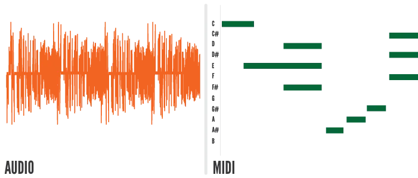
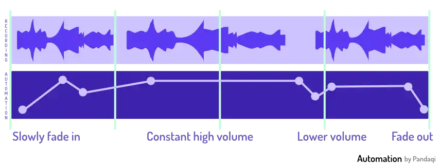
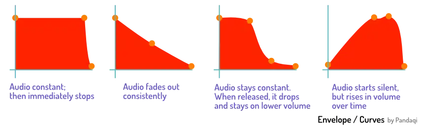

Alright, you've installed your software (DAW). You understand the general purpose of music mixing, what makes it hard and what to do about that. It's time to start our project!

This chapter explains the general buttons and interfaces every DAW will have. Next chapter gives specific tips for starting a new mix (well)

This course obviously isn't documentation for all DAWs in existence! But there is clear common ground. Some terminology and buttons that _every_ DAW will have. And they'll be big, hard to miss, and what you need 99% of the time.

## General 


    
        
    
    
        <!-- -->
    


The vertical axis of a DAW is **time**. When you play back your song, a cursor will move from left to right, stepping forwards through time.

The horizontal axis of the DAW are your **tracks**. The instruments and sound files that will actually be played.

To skip to a certain time ( = move the cursor there), click that position on the timeline. However, you must click around the audio parts. Otherwise the DAW think you want to select that _audio_.

Some DAWs have built-in functionality for doing multiple _takes_ (sometimes called _layers_). This means that a single track can contain many takes, so you can pick and choose the best parts for the final product. If a DAW doesn't support this, just use other tracks for other takes.

{}
I usually refrain from using the term "layers", because it's confusing. Do you mean a track? Or a take? Or part of a take? People use many different things, which makes the word useless for a guide like this.
{}

Often, multiple tracks belong to the same _instrument_ or the same _group_. For example, you might have four tracks for "guitar". One plays the chords, another adds some extra decorative notes, another adds rhythm, etcetera.

It would be nice to actually group them, right? To keep them together. To easily apply _one_ effect to _all guitars_ equally.

For this, many DAWs allow you to create a "group" or "folder" that holds multiple tracks. Now they are visually together in your interface. Often, you can fold/unfold such a folder.

This, however, does _not_ automatically mean that an effect applied to one of them will be applied to all. Instead, you often need to take an extra step to create a **bus** for that group.

The name says it all. A bus simply _reroutes_ input. In our example, 

* The guitar bus would accept all guitar tracks
* Then _do_ something with it (like applying one and the same plugin to them all)
* And then output the new signal further along the chain

For a fast (and error-free) workflow, it's usually wise to work through many busses. One per instrument group, and maybe more for specific effects or general sounds.

In the end, all those signals (and busses) will end at the same destination: the **master**. People use many words for this: master track, master channel, master fader, master output, ... 

As long as the word "master" is there, you'll be fine :p

When you export the song, you will get the output of that master as an audio file. As such, adding an effect there, adds it to the whole song. Lowering the volume of the master fader, lowers the whole song.

## Track Types

### Sound/Instrument

Each DAW has two types of tracks (at least): Sound and Instrument. (Or Audio and MIDI.) Usually, you pick this in the menu for creating new tracks. It can be changed later. 

**Sound**: holds audio files, recorded through a microphone. You can also do new recordings on them. This is the one with which most people are familiar.

**Instrument**: works in a different way. You input MIDI data: which notes to play and when. You can do this by hand, clicking the notes in some MIDI view. Or you can attach a MIDI keyboard you bought and _play_ the melody.

These tracks require one extra (crucial) step. On their own, these notes are meaningless. How should they sound? What instrument is supposed to play them?

You must add some instrument to the track, maybe a built-in soundpack or a VST ( = virtual instrument) you like. When this track is played, it feeds the notes through this instrument to _produce_ the sound live. If you've added a Grand Piano, now the notes will sound like a piano. If you've added strings, now your MIDI data will sound like an orchestra.

You can also see MIDI in action in my course on [Songwriting](../../songwriting/). It contains interactive examples that play (and visualize) simple MIDI sequences.

{}
You can usually export your MIDI track to an audio file with one click, called "bouncing". You bounce the track to one, fixed audio file. Then you can use that as you please on audio tracks.
{}

### Mono/Stereo

Additionally, each track can be **mono** or **stereo**. (Hopefully you remember these terms from [The Disconnect I](../the-disconnect-i).)

* Mono means it only sends one output: the same to both your left and right ear.
* Stereo means it sends two outputs: one to your left ear and one to your right ear.

Of course, simply using two mono tracks is the same as using one stereo track. The stereo version is simply a shortcut: you don't need to take all those extra steps. You get two (related) channels automatically!

## Tracks

Every track has a few important buttons and properties.

* **Mute**: mutes the whole track. You hear nothing of what's on it.
* **Solo**: you only hear this track; it automatically mutes everything else (that is not solo'd)
* **Mono/Stereo** (less common): switch a track between mono and stereo on the fly.
* **Phase** (less common): flips the sound waves upside down. If you've read my guide on [Recording](../../recording/), you know what phase is and how important this button can be while recording.
* **Record (Enabled)**: input will be recorded to this track
* **Monitor (Enabled)**: the output from this track will be send to your headphones (during recording)

Try it in the example below! Play with the controls and see what happens. (The mono and monitor buttons aren't present in my interactive examples, because I don't know the device(s) you use while reading these examples.)


    
        
    
    
        
    


The last two buttons are useful when _recording_, not when mixing. But it's still good to know them. You don't want to accidentally turn on recording and overwrite your previous work. 

{}
The alternative is, obviously, worse. You delivered a great performance ... only to realize you forgot to "record enable" that track and it recorded _nothing_ of it!
{}

## Track Controls

Besides that, every track has those three core controls I explained at [The 3D space](../the-3D-space).

* **Timing**: you can place recordings anywhere you want within the track (by dragging). Usually, you can also drag the start/end to make the recording play longer/shorter.
* **Volume**: each track has its own fader that controls volume. It's that `0` by default: it just reproduces whatever you put in. Lowering that number will make everything on the track less loud.
* **Panning**: how much of the track goes into the left ear and how much into the right ear. Default is `0` or `C` for "center". You can pull it to `L` (all the way left) or `R` (all the way right).

Try it in the example. Move the second guitar around to stay in time with the other. Maybe pan one to your _left_ ear and one to your _right_. Drag from the start or end to change the duration. Play with it!


    
        
    
    
        
    


As you follow this guide, you can also **play around with your own recordings**---if your device has a microphone. Just add a new track and "record enable" it. Click play. It will record whatever you say/sing. Click stop to finish the recording.

All other editing on a track will usually happen through _effects_. Most DAWs come with many built-in plugins, of which you can simply add an infinite number to the track.

## Advanced Tools

There are two more advanced concepts that I still wanted to mention. By the end of the course you'll understand _why_ they are more important than they appear.

The first is **automation**. This simply means _changing a value over time_. 

It's highly unlikely that one volume for a track will be correct at all times. Instead, you might want the drum to be _softer_ during the verse, then _louder_ during the chorus. Or maybe there's a few bars of silence in which you want to crank up the electric guitar for a nice riff.

All DAWs support automation. _How_ they implement it varies a lot. In Studio One, automation shows up as a "subtrack" of the track I'm editing. Then I simply draw points/lines for how the value should change at certain points in time.

As you gain experience, you'll realize why professional mixing engineers have this saying:

> At least 80% of mixing is automation.

The second tool is the **envelope**. It's like a cousin to automation. Most tools use envelopes to determine what they do. The envelope "wraps around" the track, providing boundaries that tell the sound what it can or can't do. But they are smooth, so the sound changes smoothly and isn't just cut off (or jarring).

{}
Let's say you have a piano VST. When you play a note, it plays a prerecorded sample ( = audio file) for that. But that's not all it does. That would sound horrible! In reality, once you've pressed a note, it slowly dies down until you don't hear it anymore. 

The envelope determines _how_ this decay happens. By modifying it, you can sustain notes for far longer. Or you can make the piano sound staccato, with notes that die immediately.
{}

This is an easy example. Many virtual instruments or plugins use envelopes for _everything_. Knowing they exist, and modifying them slightly, is often the difference between "this sounds ugly and not like I wanted" and "wow this is the exact sound I need!"

It's probably a bit vague now. More about this later.

