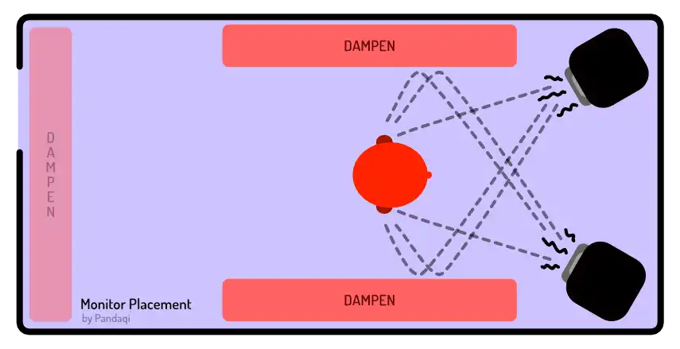

The verb monitoring simply means "observing" or "checking". In our case, it means that you _hear_ the sound you're producing. Sounds obvious, right? You can only mix music if you can hear it.

But just like microphones can't perfectly reproduce the sound they hear, speakers can't play it back perfectly. Ten different mics will record the same source differently. Ten different speakers will play your mix differently.

Your computer has built-in speakers, just like your phone. The problem is that they're small and weak. They will change how your mix sounds. Either because they _can't_ make the required sounds, or because the manufacturer "messes" with the sound to make their speakers sound more "high-end".

This makes mixing impossible. You might hear some nasty rumble on the recording ... which isn't actually there. Conversely, you might think your mix sounds balanced ... but it actually isn't. It just happens to sound good on that specific cheap speaker you used.

> To mix, you need monitors that are as _unbiased_ as possible. They reproduce your mix as faithfully as possible, at all possible frequencies and volumes.

## Monitors vs Headphones

Although largely the same, I still want to draw a distinction between _monitors_ (standalone speakers) and _headphones_ (or earbuds).

Headphones are pressed up against our ears. As tight as can be. In the real world ... we never hear a sound that way. We don't listen to someone talk by _putting our ear on their lips_. When we play our guitar, we don't put our ear right against the strings. We're most accustomed to sounds coming from some distance before reaching our ears.

For that reason, headphones are less natural than monitors. The difference isn't _huge_ or a deal breaker. Many engineers mix with headphones and do a great job.

But because the sound is pumped right into our ear, mixes automatically sound wider, louder and more aggressive. It's like the song plays right inside our own brain. An instrument panned all the way to the left will _only_ play in our left ear, enhancing the stereo width effect.

With monitors, there's "crosstalk". Our left ear will also hear some of what comes out of the left speaker. Our ears are free and hear the sound from a distance---what they were made to do.

It's just a different experience. But the monitors provide a more natural experience than the headphones.

That's why I'd recommend monitoring with _both_. Alternate between headphones and monitors while mixing, to make sure you don't start making choices in the wrong direction.

### Mix for the worst monitor

In fact, I recommend collecting as many different speakers you can. Especially very bad ones, like old phones or car speakers. If you want your mix to translate to _any_ device, you need to test it on _any_ device. If your mix sounds great on a cheap phone, it will likely sound even better on an amazing phone.

Don't make this an active quest. Just grab the opportunity to collect new speakers, once in a while, as you mix more songs over the years.

You might say: meh, if people really care about (my) music, they'll have good speakers! I'm only going to mix my song for those people! Which is a nice thought, but that's not how the world works. 

You don't know who will find your music. A radio station will only play your mix if they're pretty sure it will sound fine for all their listeners. Promoting music is hard enough as it is---you're shooting yourself in the foot by pushing away people without an amazing stereo setup.

## Don't blindly buy monitors

Let me tell you a story.

Long ago, I visited a music store near my home. I was serious about recording and mixing music. I asked an employee to explain what equipment I needed and why. To my surprise, the first equipment he named (and the most expensive one) was a set of monitors. Like most, I was skeptical.

So he was like: listen for yourself.

He turned on all the monitors they had. From tiny, cheap ones to the largest ones costing a thousand euros. And one by one, he played a piece of music.

The difference between monitors was like night and day. Anything below ~150 euros just sounded like crap. Like they were playing a completely different song. Once we crossed that threshold, the differences became smaller. All the monitors sounded good and mostly unbiased. Whatever the volume, they were good enough to reproduce the music faithfully and not change it in any way.

I was convinced. Of course I needed strong monitors, or I'd embarrass myself by making stupid mixing decisions!

Was this the right choice? No.

> Unless you're an experienced audio engineer, you don't need (very) expensive monitors. Because you don't know what to do with them. Your mistakes are more basic than that and your ears aren't trained yet.

For years, I basically ignored those expensive monitors. To me, _everything_ sounded good on them. Because they were amazing monitors. I was still a beginner and made many mistakes that no set of monitors could fix. Even now, their value to me is much lower than their price tag.

What's the lesson? If you're a beginner, or on a low budget (like me), just buy some headphones. They are _fine_. They are cheaper.
Once you're pretty experienced and confident, research monitors. Don't go for the cheap ones: they'll be useless. They will not reveal how your mix _actually_ sounds. And if you can't hear that, how could you ever make meaningful mixing decisions?

Due to the physics of sound, a _bigger_ monitor is always better. It needs that size to produce the volume or (low) frequencies you want. But until you know what you're doing, there's absolutely no need to make this expensive purchase.

{}
This is why I did not add "monitors" to the list of tools / equipment. Because I don't think they are essential. Spending money on them before you're ready to actually _use_ them, is just a waste.
{}

## Acoustic Treatment

Okay, so you have some way to monitor your mix. (Headphones, monitors, earbuds, all of them, whatever.) They reproduce the sound in an acceptable way.

That still doesn't mean you're set. The sound needs to travel from the speaker to your ear. It will bounce around your room, adding extra reverb or noise. 

This usually won't sound terrible. Because our ears are used to that reverb. But that's not the point. The point is that it _changes_ the sound, so you don't hear your mix as it actually is.

Another reason to stick with headphones at the start! They remove acoustics from the equation. The sound is pumped directly into your ears, so it doesn't matter how terrible your room sounds---you don't hear any of it.

Only invest in monitors, if you can also invest in great acoustic treatment. As mentioned before, I wrote a chapter about it for the course on recording: [Acoustics](../../recording/space-i-acoustics/). Replace "microphone" with "your ears", and all the explanation and images still work.

The general idea is that you place objects to _remove_ that reverb before it reaches your ears. Place the back of monitors against a wall, so their front (from where the sound originates) has the longest possible distance until it finds a wall. Angle the two monitors so the left one points at your left ear, and the right one at your right ear. (Your head forms a triangle with the monitors.)

But that article remains part of the _recording_ course. Because acoustics are useful for monitoring, but they are _crucial_ for recording. If you do any recording yourself, you should've handled your acoustic treatment before you got to the mixing stage.

## Mono is King

You can listen to your mix in two ways: mono or stereo. Stereo will be the original. When you set your DAW to mono (usually a clear button somewhere, otherwise a plugin), it sums all the tracks into one channel. If you wear headphones, both your left and right ear will hear the same.

In general, it's recommended to **monitor in mono** (99% of the time).

Why? 

* Because most _issues_ only reveal themselves in mono. (Such as [Phase Issues](../../recording/phase-issues/). Again, highly recommend you give that chapter, or the whole course, a read.)
* Because many people will hear your song that way.

{}
Phones usually have one speaker. Even if they have two, they'll be so close together (because a phone is tiny) that they're effectively mono.

My laptop has the same issue. I tested it once, and it _does_ have two speakers and stereo support. But the speakers are so weak and close together, that it's basically mono.
{}

_Mix_ your project to its fullest extent. Pan instruments left and right. Use stereo effects. Really apply that "3D space of mixing" I explained earlier.

But _monitor_ in mono most of the time. 

* If your song sounds good in mono, it will sound _great_ in stereo
* However, if your song sounds amazing in stereo, there's no guarantee (at all) that it will still work in mono

Monitor in mono to get the fundamentals right. Then toggle that stereo button and your mix will _open up_ and sound otherworldly.

## Objective listening

Finally, remember how adaptive our ears are. If you've been mixing for a while, you don't hear what you're doing anymore. If you've worn your headphones for a few hours, you forget you're even wearing them! (Which is a _great_ way to break your cord, as you unknowingly walk away and jank your headphones out your computer.)

You grow accustomed to the sound. You grow accustomed to any noises inside your mix, or mistakes in volume management, or the way the headphones color the sound.

So keep switching between speakers. Keep taking breaks. Take off the headphones regularly, to reset your ears and stay objective.

{}
And yes, with more expensive headphones / monitors comes a more objective sound reproduction. As you go into higher price ranges, they will "color" the sound less and less. Cheap headphones have their own quirks, their own ways in which they change all the sound they pass on.
{}

This also means protecting your ears. Monitor at safe, low volumes. Don't crank it up too high. Those breaks and switches prevent doing so accidentally (or when "in the flow"). Everybody knows a few stories of audio engineers who slowly lost their hearing at a relatively young age. Once your ears decline, you subconsciously put everything at higher and higher volumes---otherwise you can't hear it! Once you start the cycle of ear damage, it's hard to stop it.

So take care of your ears. Monitor safely.

Finally, I have some bonus tips. 

### Don't mix with your eyes

**Close your eyes**. Looking at your DAW (or other equipment) while listening can interfere with what you hear.

{}
If we **see** a spike in volume coming up, we'll already subconsciously prepare our ears for this loud sound. If we see a fader raising, an instrument slowly entering the mix, our ears will search for it. This focus will make it sound louder to us. Boom---we've stopped listening objectively, like somebody who just turned on the radio. What we see has changed how we perceive our mix.
{}

### Don't do (very) quick cycles

**Separate monitoring and mixing**. Maybe you start playback and hear something to fix right away. You'll be tempted to immediately hit that spacebar, stop playback, and go fix it.

Don't do this. A song needs to sound good in _totality_. Humans tend to get too focused on tiny details---especially musicians who are usually perfectionists. You'd spend hours trying to perfect that one millisecond of your song, never realizing that it doesn't matter in the grand scheme of things. This is also why I told you not to "solo" tracks too much, in an earlier chapter.

Instead, let the playback run for a bit. Listen, with your eyes closed, ears reset after a break. Write down anything you like or don't like. Write down any ideas.

But wait until the playback ends. Then go through the list and make your changes.

This _separates_ the monitoring and the mixing. When listening, you really listen, to a mix in context. When mixing, you're focused on making all the actual changes as fast as possible. Changes about which you were certain enough to write them down and keep them in your to-do list.

People often say that you should check all your changes. Make a change? Listen if it actually improved something. Make a change again, immediately listen again, and so forth.

While this sound very reasonable, in my experience the opposite is true. Music is such a balancing act. Everything needs to be _just right_ and it needs to work together. Changing one thing will rarely lead to a significant difference. Or a difference about which you can say, with confidence, that it's _better_. 

Rebalancing _multiple things_ and then listening again has a higher chance of success.

### An example to understand this
Compare it with writing a book. You've written the whole story with a main character who is jealous. This has consequences. This informs every scene and interaction.

Then you read your book and think: "man, this jealousy trait doesn't work for me after all, let's change it". You remove this aspect of the character from the first chapter.

Does this improve that chapter? Probably. Does it improve the book? Hell no. Now the 300 pages after that don't make sense anymore! Because all other parts of the book depended on how your main character reacted to stuff! Now these other scenes come out of nowhere!

Instead, you remove and rewrite _the whole book_. Everything that was _related_ to that trait of jealousy, is changed or rebalanced. Only once you've done the full edit, does it make sense to read your book again and see if it's better.