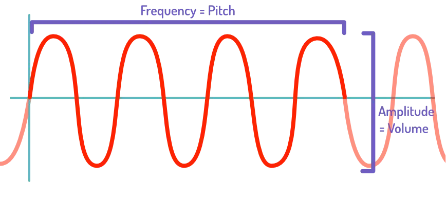
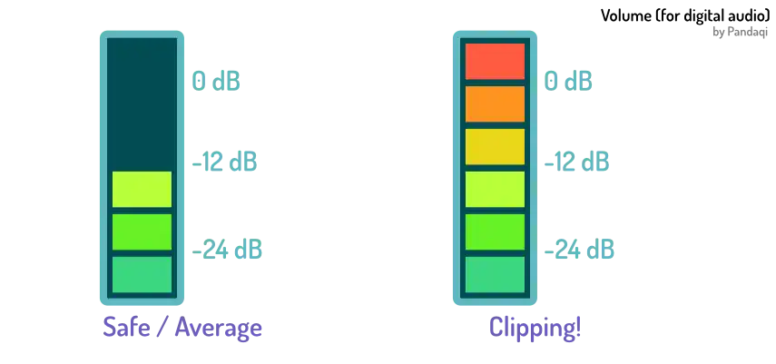
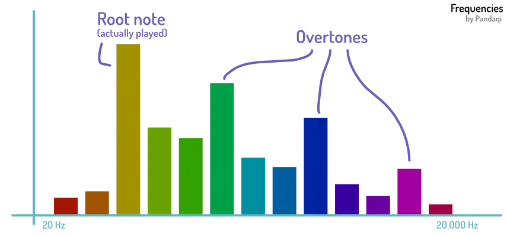

I want to give some basic terminology and understanding about what _audio waves_ actually are. These terms are very common in the field, so it's good to know them. It also explains more of the disconnect---and why all DAWs use the same setup.

## Sound Waves

Sound is a longitudinal wave. That means alternates between areas where air molecules are pressed together and areas where they are spaced out. Our ears interpret these _differences in pressure_ as sound.

But that's hard to visualize. So the standard visualization is that of a (sine) wave. But it means the same: imagine the peaks are "compressed" and the valleys are "stretched".

**Amplitude** determines volume. Greater amplitude = louder. This is simply the highest peak (the point with the largest distance to that center line).

**Frequency** determines pitch. How high or low the sound is.

## About loudness

We measure volume in **decibels** (dB). But that's not a linear scale, like most scales. Instead, it's defined as

* `+3 dB` means that the power of the wave is multiplied by 2
* `+10 dB` means the power of the wave is multiplied by 10

_Power of the sound wave?_ A wave transports energy. The power of a wave is the amount of Joules it transfers per second. Every sound therefore has a different perceived loudness based on its power (`W`). 

The formula is:

> Power = log( W ) - 12

The take away? You can't easily relate a change in decibels to a change in loudness. Going from `10 dB` to `20 dB` does _not_ mean going twice as loud. That's why decibels are as strange as they are: there's no better system, because volume doesn't scale like a nice straight line upwards.

This means you need to let your ears do the work, not the numbers. If you've been mixing for a while, you will have build an intuition for which values result in what loudness. But it's best to just try changes until the volume sounds right to you.

All of this feeds into the next point of "disconnect". In the real world, sounds can always get _louder_. A wave can always get more power, which means bigger amplitude, which means more volume.

In the digital world, this is reversed. The wave has to be saved in memory in a number of "bits". This means there's a clear _limit_ on the maximum volume.

> In the digital world, sounds have a maximum volume and can always get _less loud_.

That's why DAWs use negative decibels. If you look at the meters you'll see `0` at the top. The maximum volume we can store, or your system can reproduce, is the zero point. You can only go softer than that. So when mixing, you're setting tracks to values like `-18 dB` or `-4 dB`.

If you try to go over this maximum, it's called **clipping**. And it's bad. It distorts the sound, because the computer has to _throw away_ information it can't store. If your recordings are the right volume, they'll be a rather _low_ volume that leaves plenty of space. In fact, a good mix will never even be at risk of clipping, and still be quite soft when done. (That's when [Mastering](../mastering/) comes in, which is the final chapter of this course.)

As such, don't be afraid to mix at lower volumes. Do be afraid to clip.

{}
Don't take this to an extreme. When mixing, don't make tiny tiny changes in volume. Use big ones to really hear if it makes a difference. On the other hand, _never_ throw a track or recording over that 0 line. Yes, you can technically do that, the software won't stop you. But it might destroy your speakers or your ears if you're not careful.
{}

## About frequency

Frequency is measured in **Hertz** (hZ). It means "times per second". So a sound of 100 Hz oscillates (between peaks and valleys) a 100 times per second.

Humans can hear frequencies between 20 Hz and 20,000 Hz (or 20 kHz, kilohertz).

But again, our ears play tricks. Frequencies are _also_ not a linear scale. They are logarithmic.

{}
If you increase a sound's pitch from 20 Hz to 40 Hz, you might feel like you just made it "a little higher". But no---you actually moved it up a whole octave! In low frequencies, subtle differences have huge consequence. The higher frequencies need bigger change to see a consequence.
{}

Another cause for that "disconnect". Another unintuitive thing you will slowly understand as you mix more. (Although not as magically weird as the decibel scale :p)

It's useful to train your ears on how each frequency range sounds. So you can quickly identify and fix issues when you hear _that_ range.

## Overtones

The sound wave above is a pure wave. It's _one note_ at _one volume_. But in reality ... nothing is a pure wave.

First of all, because of those deflections ( = reverb), you usually hear a sound combined with other sounds.

But each sound also naturally creates **overtones** (or "harmonics").

The original pitch, the one you consciously hear, is the "tonic" or "root note". But it generates more sounds, which are always multiples of the original frequency, but at lower and lower volumes as you go higher.

These overtones are what make **singers and instruments sound the way they do**. The note "C4" on a piano sounds different from a guitar, or a human singer.

Why? It's the same note, right? Because of those overtones. The instruments (and your mouth) are _shaped_ in a certain way, which _shapes_ the overtones to produce the unique instrument sound. (Also called "timbre")

Once you look at those _equalizer_ plugins, you'll see this in action. The root note has a low frequency and is loudest. But looking from left to right, more frequencies keep appearing, higher and softer.

Remember that frequency is a log scale. That's why many plugins that show this are somewhat misleading. In the lower frequencies, a slight change can mean a different of a whole _octave_. In the higher frequencies, even big changes have little effect. This also causes the level of detail to be lower in the lower frequencies.

When mixing, you're usually not changing the root notes. If your instrument was tuned, and your song well-written, all these pitches are correct and fine. Instead, you are editing those overtones---the extra frequencies added---to sound better or work better with the other layers (in the same project).

{}
For example, a guitar often risks sounding muddy and boxy. Especially when a cheap guitar is recorded up-close. This doesn't mean the pitches is wrong or the microphone is wrong. It just means the overtones that were _recorded_ don't produce a nice result. So people often, by default, reduce those specific frequencies to make the guitar "shine" in the final song.
{} 

## Conclusion

There are many, many reasons for the disconnect between sound in the real world, and sound when mixed. And I haven't even covered them all! 

{}
I've left the importance of hearing yourself using neutral speakers for a later chapter. The one on [Monitoring](../monitoring/). Because it's that important.
{}

That's why music _mixing_ is different from being a good musician or being able to play/record well. It's an entirely different skill, because of that disconnect between _live_ (physical) sound and _recorded_ (digitized) sound.

Of course, being a good songwriter or having a trained ear will help immensely. You'll already understand many concepts I'll explain, perhaps intuitively.

As they usually say,

> A well-written song is easy to mix, and mistakes can be fixed. A badly written song cannot be saved, not by any amount of audio engineering.

If you don't do recordings yourself, this might take some time to accept. When somebody hands you material that's just terrible---a bad song, amateur recordings---there's only so much you can do. Even with the best tools and the most experience.