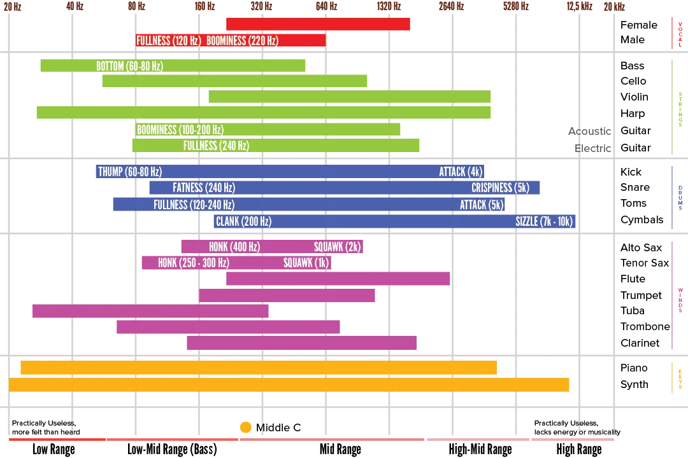

Below is an image showing which frequencies instruments use, or what general sound we associate with frequency ranges. Save it somewhere, reference it when needed, use it to train your ears!

## EQ Cheat Sheet

## The (Important) EQ Bands

Besides looking at EQ through instruments or sound, we can view it through frequency ranges. What are the general properties of each range? When would you boost or cut a specific range?

The overview below is generally true. But as always, there are no "rules" in music.

### 50--60 Hz

The absolute lowest frequencies that mean something.

* Essential to kick drum and low (booming) bassline.
* Mostly critical in dubstep and reggae
* If used too much, you'll mostly hear (and surely feel) the bass and not much else
* If used too little, a song will not have enough depth or weight. It misses the fundamental root notes.

### 100--200 Hz

The low midrange. Near the frequencies most common in instruments. The average frequency of the male voice.

* Essential to snare
* Adds a certain richness or warmth to most instruments
* If used too much, things will sound muddy, too much of the same and dull
* If used too little, the sound is thin and cold

### 200-500 Hz

The midrange. The most common frequencies. The low end of this is the average frequency of the female voice.

_Why mention that?_ Because our ears are most attuned to human voices. Those ranges are the most important to get right. It's what we listen for the most. As a consequence, any deviation in it, will sound unnatural.

* Essential in guitars, piano and vocals for warmth and weight
* If used too much, things will sound muddy again and like your stuffing too much into a single mix
* If used too little, the sound is thin and weak

### 500--1000 Hz

A difficult range to work with. No clear purpose or instrument that needs it. But it still needs _some_ content.

* Creates some weight, body and tone---but is not essential for any of them
* If used too much, instruments sound pale or hollow
* If used too little, the sound is thin and harsh, without a place

### 1--2 kHz

The high midrange. Adds aggression, urgency and loud clarity. This is where the "presence" of the human voice often resides. If used too little, the sound is warm and even ... but also dull and more like background noise.

* Adds aggression, urgency and loud clarity
* Gives some crunch, edge or punch to (electric) guitars and vocals
* If used too much, your mix will be overaggressive and painful for the ears
* If used too little, your mix will sound like it is muted, way too soft or lacking of life

### 5--10 kHz

Now we're entering the high frequencies. These add space, clarity, definition. Cheap microphones usually miss these frequencies entirely on their recording.

* Important for the higher parts of a drum kit, especially the very important snare
* Creates clarity, a sense of freshness and freedom, and life
* If used too much, your mix will sounds like it is grinding or scratching
* If used too little, your mix will lack any energy, importance or presence
  
### 10-16 kHz

Very high, nearing the limit of our hearing capabilities. This means this often _lacks_ on (poor) recordings, while you can actually add _a lot_ of these frequencies without destroying a mix. That's what many pop tracks do.

* Adds areal, sparkling, spacy, heavenly sounds. A sort of "shimmer"
* If used too much, your mix will sound artificial. Too electronic.
* If used too little, the mix will sound muted, dull, muddy. Like it was forbidden to really come to life.
