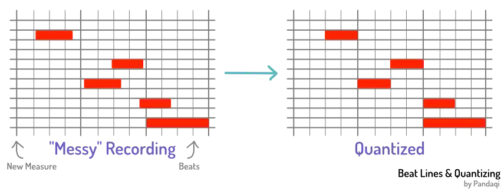
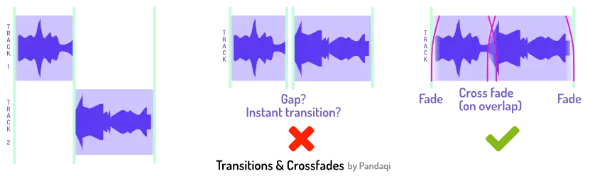

This one might seem obvious. Place audio files where they should start, right? Well, if you have audio files that all use the same rhythm perfectly, it _is_ simple to get timing right. 

But that's usually not the case. What if the audio goes on for too long? What if the timing is slightly off, can we fix that with editing? Can the DAW help me prevent mistakes with timing or tempo? Are there any "tricks" to make a track more groovy or more rhythmic?

This chapter tries to give some answers.

## Tempo in a DAW

Most DAWs ask you to set one tempo for your project when you create it. You can always change it later---but that's not recommended. Because, what should it do with your existing audio files? Keep them the same? Change them to match the new tempo? It's highly likely that changing tempo later will create issues.

Why set a tempo at all? Three reasons.

**Generally helpful:** the DAW will help you, every step of the way, to stay _true_ to that tempo! The software will draw vertical lines for all the beats. Often, it will also _snap_ tracks to those lines (or it's an option you can turn on).

By following this guideline, you can be certain that all your tracks neatly follow the same tempo.

**Metronome:** every DAW also has a _metronome_ you can turn on. This can help to check your timing. It's also incredibly useful if you need to do more recordings (for this project), which you obviously want to be in the same exact tempo.

**Quantizing:** if your recording ends up with some timing mistakes, you can _quantize_ it. The DAW snaps the notes to the closest beat in its grid. This is incredibly helpful, but does _not_ perform magic! If your timing is off by too much, it will snap notes the wrong way. Quantizing MIDI tracks is fine, but quantizing audio will quickly introduce "artifacts" that don't sound great.

The best thing---as always---is to ensure all your _recordings_ have perfect tempo. Trying to fix it during mixing is fighting an uphill battle.

{}
You might think you don't need a metronome. You might think you have a strong feeling for rhythm and know what you're doing. You're probably wrong :p I fell into this trap big time. Until you play and mix to an unyielding metronome for a few weeks, you don't know how bad your sense of timing can be.
{}

## Timing in a DAW

This part is simple. All DAWs support moving a track around by _dragging_ it. This is how you determine when it starts.

Additionally, you can choose to only use a _part_ of a recording. You can drag the _start_ or _end_ of the rectangle to select which part to play.

If you want finer control, you always have a _cutting tool_. You click somewhere in that rectangle, and it's _cut_ in two at that point. You can do this as much as you want. Remember, however, that the human ear hears sound as a continuum. If it suddenly stops or changes, that sounds bad to us. If you cut a vocal take to add some silence, so it matches the tempo better, that _will_ sound bad. Because the sound doesn't continue naturally.

Cutting should be done with care, and I'll explain some tips below.

{}
The biggest usage of cutting like a madman happens with pop vocals. Often, they do _many_ takes and then pick the best parts of each one. So the final vocal might be the result of twenty tiny slices of other recordings.

Why do they get away with this? Our voice is _most suited_ to cutting. Because we can instantly start or stop a sound. Additionally, pop vocals are heavily processed and usually have many layers, so imperfections are hidden.
{}

In general, you want one recording at a time on a track. If you want to play multiple recordings simultaneously, you use multiple tracks for that. (Not surprising, I hope.)

Most software, however, _does_ support placing multiple (overlapping) recordings on the same track. It either places the last-placed one, or all of them.

Why? What's the point?

To allow **nice transitions** between the different parts, using _cross fading_.

## Transitions are everything

Transitions are the key to getting this control right. It's not hard to place audio when it should play, and to remove the parts that shouldn't play.

What's harder is to _blend_ all those different recordings together. To transition nicely from one recording of the guitar (let's say the _verse_) to another (the _chorus_).

It usually doesn't work if you just stitch recordings together on a track. One recording will suddenly _stop_, then a completely different sound _starts_. It's not natural and it doesn't sound nice.

Instead, 

* Make the first end slightly later (so it overlaps with the start of the recording after it)
* Make the second start slightly earlier (so it overlaps with the end of the recording before it)

Now you can select both tracks and apply a "fade" or "cross fade". (This depends on your DAW. Some do it automatically when they see you overlap tracks.)

{}
For the same reason, apply fades to the start/end of _all audio files_. Some DAWs do this automatically. Otherwise, it should be a quick shortcut. Having audio start or stop out of nowhere often creates nasty side effects.
{}

When you play it back, you'll notice how the transition is smooth. It sounds like _one_ continuous take or performance. 

My interactive examples apply tiny fades to everything. Below, I've turned them off by default. Hear the "pop" (sometimes louder, sometimes softer) when sound suddenly stops or comes in.


    
        
        
        
    


Now select a part (click on it) and press `F` a few times to increase the fade, or `G` to decrease again.

The fade doesn't even need to be long. Most of the time, I use a very short one. In fact, if the fade takes too long, it becomes noticeable. The listener will hear an instrument magically dropping in volume for a second or so, before the new one finally kicks in.

Transitions between recordings matter. But they also matter between "sections" of your song. When your chorus kicks in, for example, it usually means that more tracks become active. You want that chorus to feel energetic---you want to start it with a _bang_.

The best way to _ruin_ that, is by starting all the instruments at slightly different times :p Move their files around so that the transients---the peak of that first note---all line up perfectly. Otherwise, it sounds like a stutter. Like your song lost confidence and didn't know when to start the chorus exactly.

## Don't start/stop immediately

Maybe you tried the tip above and the DAW didn't let you. You couldn't just make a recording longer or shorter. This is a _recording_ mistake I struggled with as well.

When I started, I'd start a recording _and immediately started playing_. And when I was done? I immediately stopped. This made the recording exactly as long as it should be. Nice, right? Why record the extra bits? Why record "silence"?

Now you know why: for the transitions. The recording should start a few bars before you actually make sound. And when you're done, let the recording go on for another few bars.

This ensures the recording is long enough to overlap others and use cross fades. Without it, each recording misses a few vital milliseconds at the start and end. They sound robotic and sudden, hard to mix.

Here's the _original_ (full, raw, unedited) recording of that guitar. Notice the empty space at the start/end, and how I play a little beyond that.


    
        
    


## Don't explode your number of tracks

Like most, my first mixes were filled to the brim with tracks. Surely, I needed 10 instruments for the chorus! I needed a regular vocal, a high one, a low one, and some more!

Now I know that a multitude of tracks actually makes a mix sound _smaller_. It's like you filled a container until it was _full_, leaving no space. It's better to take that same container and only fill it with a handful of important elements. This leaves space around the elements to make them stand out, to make the mix sound _big_ and _wide_.

Instead, use the _number of tracks_ to clearly indicate how powerful a section of the song should be.

A soft, first verse should only have a few tracks playing. In fact, many (pop) songs get away with just a vocal and a piano. Sometimes they start with only that vocal.

The final chorus can have five times as many layers at once. That _contrast_, that difference, is what makes the chorus powerful and the verse intimate. If both parts have twenty tracks playing simultaneously, they'll both sound same-y (and overly full).

## Tricks

### The drop

This is especially popular in dance or rock tracks. All of a sudden, the whole song just _stops_. Tracks are cut off. No tracks are played for a fraction of a second, leading to total silence.

That's a _great_ trick to emphasize rhythm and timing.

Why? Because of that silence, what comes _after_ it is enhanced. During that silence, our body _longs_ to hear the next strong beat, to continue the song. Wait until we can't take it anymore---then bring back the music.

Contrast is key in music, like in most creative disciplines. Your song might have a great rhythm, but if it's _the same_ for the whole song ... it will still feel boring after 30 seconds. Use the drop, the sudden stop of everything, to play with timing.

<!-- @TODO: AUDIO EXAMPLE (tool) -->

### Changing tempo

Another way to play with timing, is to obviously _change the timing_. All DAWs will allow you to change tempo mid-song. In fact, it's a sneaky common practice.

Most songs crank up their tempo---by just a few BPM---during the chorus or bridge. You don't _consciously_ notice it as the listener. But you do notice it, because you think "wow that chorus is _nice_!"

{}
"Rolling in the Deep" by Adele does this. A slight increase in tempo in the chorus. I once saw an interview with the producer, where they explicitly stated they tempo mapped the song that way from the start.
{}

Now, remember what I said at the start of this chapter. Changing tempo afterwards is possible, but unlikely to sound great.

That's why famous producers usually "tempo map" their song beforehand. Before they do any _recording_, they know exactly what the tempo should be for every section. And so, they record it in the right tempo from the start, removing any need to do this during mixing.

### Delay (the bad way)

A cheap "trick" to make a sound wider, as if it's 3D, is to play the recording twice but _delayed_. So copy the recording to a second track, then move it to start _slightly_ later. Listening in stereo, certainly on headphones, this sounds amazing. (This is often called the "Haas effect".)

However ... if you listen in mono, it will sound horrible! The two sounds are fighting each other!

Try it. First, listen to the stereo sound. Quite nice, right? Then move the pan slider so both sounds are in the center, effectively making it mono.


    
        
    
    
        
    


The sound _changes drastically_ based on how somebody listens to your song. Additionally, the mono sound is a bit thin and hollow.

Thus, I **don't** recommend doing this. Maybe for some background track. Maybe if you _want_ that kind of sound. Otherwise, use the real ways to make something wide and stereo: panning and reverb.

{}
The Haas effect works slightly better if you sufficiently "change" both tracks. Destroy them a bit with effects, cutting, etcetera, until they are so different that they don't fight each other anymore. But even that is a band aid solution.
{}

### Surprise

In my course on songwriting, I talked about strong and weak beats (see [Rhythm](../../songwriting/rhythm-i)). Mixing has quite some overlap with songwriting in general. In both cases, you try to arrange the parts of a song to work together as well as possible. (So I highly recommend checking out that course as well.)

The summary? The beats at the start and middle of each measure are "strong". The others are "weak". 

A good rhythm will allow many notes to fall on those strong beats. We expect that. Without it, we can't pinpoint what the timing of the song even _is_.

But that means _breaking_ the rule is what adds surprise and excitement. Once in a while, start something on a weak beat ("off-beat"). This can be an instrument, a longer recording, or just a tiny snippet of sound ("ear candy").

Balance that. Have most tracks neatly lined up, starting at the strongest beats. Then add surprising off-beat elements as the special sauce.

The example below shows a simple melody. It starts in a "perfect" rhythm. This is important, as you can only add "surprise" if there is some predictable pattern to begin with! But it's also kind of boring. So once it has established itself, it jumps around and does some surprising things. 


C3/2 B2/2 | C3/2 R/2 | C3/2 B2/4. E3/8 | C3/2 R/4 G3/8 F3/8 | E3/1 | D3/1 |


{}
Recently, I saw a video from the artist who created the hit song Fireflies breaking down the tracks in that song. It's a [fun short video](https://www.youtube.com/watch?v=0BuGBH6b5Ko)! Anyway, it shows the "ear candy" and the tiny surprising bits that are included. He left in a laugh somewhere. There's a whole melody line that only plays for _one tiny part_ of the song. All his instruments are on key, which means nobody noticed how one instrument just played entirely the wrong note somewhere :p
{}

### Staggering

Finally, an easy way to enhance timing or rhythm, is by _repetition_. Either exact repetition, or one that follows a pattern (like going slower or faster over time).

Want to end the song? Repeat the same chord or note, slower, and slower, and slower ... until the song is so slow that you can end it.

Want to build a strong transition to the chorus? Repeat a certain note faster, and faster, and faster ... until it "explodes" into the chorus.

Or maybe you have a slow section in the song. One with so little instrumentation or vocals that listeners might lose the rhythm. Add a simple repeating sound (could be a drum, could be a high chime, could be near inaudible) on the strong beats to keep the timing "alive".

See the example below. Very simple timing, but it feels _annoying_ when the sample stops at the end :p Because we've build up and you now want that tension released by exploding into a new section of the song.


:E3/1 | R/2 D3/4 F3/2 E3/2 G3/2 F3/4 F3/8 G3/8 A3/8 B3/8 |
:C3/1 | C3/1 | C3/2 C3/2 | C3/4 C3/4 C3/8 C3/8 C3/8 C3/8 |
