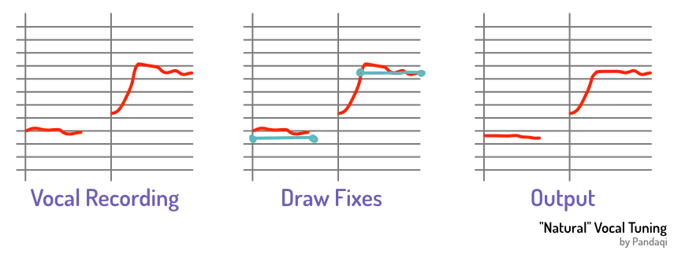

Numerous times, I've mentioned that vocals are _the_ most important element in a mix (that has lyrics). It's the loudest one. It's what grabs and keeps attention. It should be consistently at the front and intelligible.

Vocals are by far the part of mixing with which I struggled the most. There's so much to take into account. So many quirks of the human voice, so little you can do before it sounds "off". That's why I wanted to dedicate a full chapter to it.

## Sibilance

Due to how microphones work, they react badly to sounds with a lot of air behind them. We make those sounds with our mouth and they are called "plosives". The word explains itself: when you say these letters (such as "-p" and "-s"), an explosion of air enters the mic.

This often sounds bad. It creates an annoying, hissy sound over the vocal.

That's why most DAWs include a **de-esser** effect. It's tuned to the most common frequencies for plosives. When it detects one, it lowers the volume on that specific sound. Singers with good technique, or the right voice + mic combination, don't need it.

But most do. I usually throw a "de-esser" on the whole vocals bus.

You can also do this yourself, of course. Simply add an _equalizer_, find the frequency range that's most sibilant, then bring it down. (Bonus points if you can only bring it down _when above a certain threshold_. That's called "sidechaining" and a topic too advanced for this course.)

Guess what? Let's practice that! The vocal below is one of the earliest I ever recorded. It has quite some sibilance, especially at the start ("ssssomewhere in the dark"). 

It also highlights how dynamic the voice is. The volume of different notes can differ wildly.

Use the equalizer to identify this frequency and tame it. Use automation to tame the most annoying volume differences.


    
        
    
    
        
        
    


Here we circle back to my story about [Monitors](../monitoring/). If you have good headphones or monitors, these sibilant sounds will not be a problem. They are good enough at reproducing audio, that it just sounds ... natural. You're like: "yeah, that's what a voice sounds like, no problem"

You will **really** hear why this is an issue when you play your mix back on a cheap phone or laptop. Because they're so bad at playing audio, they usually "boost" the high frequencies (automatically, can't turn that off) to appear better. You guessed it: they boost the sibilant frequencies and your mix sounds terrible.

{}
I learned this the hard way. For the longest time, I had no proper phone. I trusted my good monitors to give me a good mix. Yeah, I published a few songs that aren't _bad_ per se, but they certainly have sibilance issues that could've been avoided.
{}

## Cut through the mix

Once I learned that the vocal should definitely be the loudest element, I entered a new problem. I increased the vocal volume ... but now the instruments were barely audible, so I added gain to those ... but now the vocal was too soft, so I raised its volume ... and so on.

This happens because of two reasons:

* A vocal with too wide a dynamic range
* A vocal that misses the frequencies needed for "presence"

As you've learned, the first issue is solved with compression! Usually, two compressors do the job for me. (They are both rather subtle, adding 2-3 dB reduction.) Any extremes---really soft or loud parts---are edited by hand (automation).

The second issue is solved with an equalizer ... or a better recording, if you can. If you listen to singers a few decades ago, they all sound really _strong_ and _present_. Mixing was more barebones and restricted back then. You _had_ to be able to project your voice and cut through the instruments.

Nowadays, this is mostly lost (to my dismay, as you might notice). Singers can mumble and stumble, and the mic will pick it up fine. You can increase the volume later---you can increase it a lot---but that will never solve the real issue. A voice without power or projection, will add too many low or "muddy" frequencies, and too little exciting frequencies.

I discussed this more in my [Recording](../../recording/) course. I know, sorry, I keep mentioning it! But it illustrates that mixing and recording are tightly linked. Good recordings lead to good mixes. You can't "edit" everything after the fact.

This "presence" frequency is around `5 kHz` for most voices.

Try it in the example below. My voice isn't that energetic or powerful here, while the rock song demands it. See if you can use the equalizer to make it cut through more (without merely making it "louder"). This could also mean cutting _away_ the presence frequency from the instruments ...


    
        
    
    
        
    


## Multiple voices

When you hear a mix, chances are you actually hear multiple voices. Sometimes this is obvious. Sometimes it might sound like just one.

The voice lends itself well for doubling (or tripling, or quadrupling). We all know that a group of voices sounds beautiful, even if some are off-key. They compensate for tiny mistakes and blend into one big, impressive sound.

So the first step is to simply record the same part many times and play some of them at the same time.

### Harmony in pitch and timing

But you can't get away with everything! If a note is _too_ bad (not the right pitch, not the right timing), it will stick out like a sore thumb.

If you can't get clean recordings, edit the vocals to ensure they

* Say the most important sounds at the same time
* Are tuned to the right pitch (more on that below)

It doesn't need to be pixel perfect. In fact, that would probably create phase issues or _reduce_ the stereo width of this effect. Instead, allow subtle variation and mistakes to exist. It will make the final sound bigger and more natural.

### Second voices

Often, besides the main vocal, a low and high part is recorded. The same melody is sung, just lower or higher on the scale. If it's a tough melody, this might be impossible to do (by the same singer). In that case, modify the melody a bit.

These takes can be far from perfect. In fact, if you'd listen to some of my low vocals, you'd mostly hear grunts like I just got out of bed and hate my microphone. (I have a high voice. It's tough to do low notes :p)

But these are _background vocals_. To mix them with the main vocal, you usually

* Add generous reverb
* Compress them heavily (so their dynamic range is small, never sticking out too much)
* Equalize that "presence" frequency away from them

On their own, they'll sound mediocre. But when combined with the main vocal, it sounds rich and strong.

Below is an example. Toggle the voices on/off to hear each part. Also notice how the background vocals are quite "imperfect", but that's fine, because they are _support_.


    
        
    
    
        
    
    
        
    
    
        
    


{}
I often just sing repeated notes for the second voice, especially that low one. So, at the same timing as the melody, I sing the same low note over and over. Maybe with one or two notes variation. This is often enough to create a nice, warm, bath of low notes for the vocals.
{}

## General mixing

I mentioned the _slap-back delay_ in the previous chapter. That's probably the biggest tip. Adding reverb to the main vocal pushes it back, which you never want. It should be front and center! It's the crucial part!

Instead, add a one-time delay to the whole vocal. If you listen to the vocal on its own, you hear the delay. When played in the mix, you don't consciously hear it.

Vocals lend themselves well for editing. They can start/stop on a dime, which allows you make many _cuts_ or _stitch different takes together_. This is how you remove annoying noises, or clicks, or general mouth sounds that humans might make. Simply cut out that entire part.

The same is true for parts where the recording accidentally got really loud or soft. Simply cut that bit into its own part, edit by hand (to a better volume), done.

Usually, after the first round of editing, my main vocal looks like sliced bread. Then I "bounce" the whole thing so it turns into one clean, final track again. This also saves precious computing resources on my old and broken laptop.

{}
And don't forget the "de-esser" and the "equalizer" mentioned above!
{}

## Tuning

Finally, we get to (auto)tune. Perhaps a hot topic, or one you've been waiting for.

For 99% of use cases, **don't use autotune**. It sounds ugly. It doesn't mix well with other recordings. It gives you an excuse to create bad recordings. Only use it for _background vocals_ that are, like, really far in the background. Then it's fine. It's a cheap way to get the whole vocal on pitch, and you won't notice the artifacts anyway.

{}
Or use it on purpose as an artistic choice. That's always an option in creative fields. Just say it was an intentional, artistic choice :p
{}

If you want to tune, use an **elastic tuner**. Reaper has a great one built-in: ReaTune. Logic Pro has this as its default tuner as well (if I remember correctly). In fact, I'd call this a _necessity_ if you do many mixes with vocals. Get a plugin, or _some_ way, to do this.

Below is an example of a raw recording and the the tuned version. You hear I'm slightly above/below some notes in the raw version. If you listen _really_ closely, you'll hear some minor artifacts. But it sounds natural and those discrepancies fall away when other instruments are added.


    
        
    
    
        
    


{}
Again, in this one recording this is ... fine. Recoverable with good support. But if you leave slightly wrong notes everywhere throughout the mix, you just make the end result messier and uglier for no good reason, with each layer added.
{}

How does it work? For each wrong note, you draw a line where it should've been. The algorithm will now smoothly _push_ the note to the right one. These two aspects are crucial: _you_ draw what the note should be, and its change is _smooth_.

It uses an "elastic" algorithm that stretches and bends your existing recording in a way that sounds natural to us. You can edit notes quite a lot without introducing that nasty "autotuned sound".

It's no magic bullet, of course. If you're too far off, if the recording is just terrible, this can't save you. But it can improve any recording that's at least decent.

And yes, I **do** recommend tuning your vocals. A few off notes here and there is fine for a live performance, for something you'll hear once (and which isn't pushed straight into your ears through headphones). But if you leave off-key notes on a song, listeners will hear it _every time_ they listen to the song. And they'll hear it loud and clear. It becomes annoying---and more so as time goes on.

Everyone does it. Even if you think they don't. Even the best singer-songwriters give a great performance ... and then do some slight tuning to make it _perfect_.

I like imperfections, as much as the next creative person. But after much resistance, I've had to accept this fact, and my musical work became better for it.

{}
Keep your best take for the main vocal. You want to "destroy" that as little as possible. Use worse takes, with much stronger / stricter tuning, for background vocals.
{}