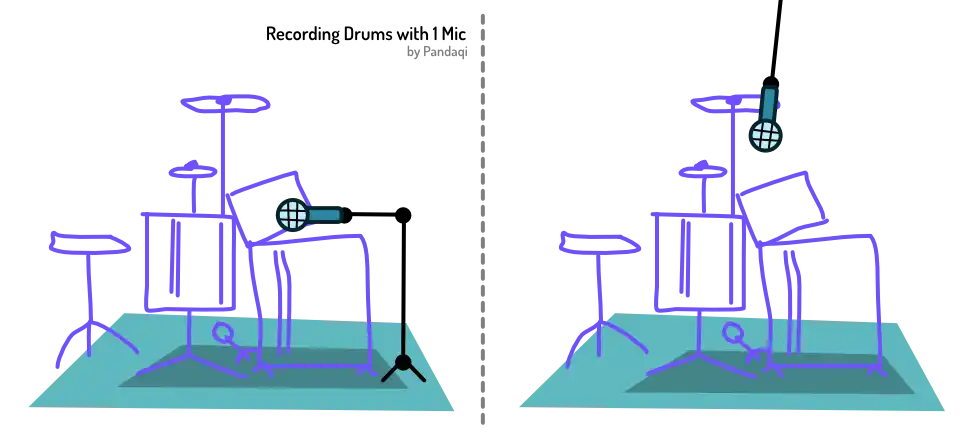

Drums are the third instrument I suggest you learn (well). They are the silent hero of most songs. Without them, the whole song falls apart or sounds lifeless. But ... nobody ever listens to a song and notices the _drums_. They give rhythm and groove, but then get out of the way so other instruments can shine.

Have you ever wondered _why_ a (classic) drum set is the way it is? It has this really low *kick drum*. Then some semi-low parts, like the *snare* and *toms*. And then really high and crisp *hi-hats* and *crashes*.

This is a _blanket_ around the other instruments. Piano and guitar live in the midrange. Our voice lives in the midrange. Almost all instruments live there.

The drum provides the _lowest range_ and the _highest range_. It fills in the gaps---the area where not much other sound appears. The lowest range adds "oomph" and rhythm. The highest range adds excitement, energy and fullness.

{}
Many songs add simple shakers or tambourines during the chorus. You can record these by simply waving them in front of any microphone. Very easy. But their high frequencies add lots of excitement to the track!
{}

## What does this mean?

Firstly, take this into account when arranging. It's often wise to start with drum. Lay down a solid drum recording, use that as the cue mix for any other recordings. This prevents you from recording other instruments for the lowest or highest frequencies. Now you already know those are filled by the drums and you don't need (much) more.

Secondly, this means recording drums with a single microphone is somewhat impossible. It has these two _very different_ ranges. Unless you manage to balance and capture them perfectly with that one recording, there's no saving it later. If you realize the low part needs to be much louder at some later point---tough luck. (Unless you want to spend hours being a mixing wizard.)

If you still want a single microphone capture, point one at the _center_. This mic can be very close: barely floating above the kick drum. Alternatively, hang one from the ceiling above the drum set. Above the player but slightly in front of them. (If the drummer is singing at the same time, as some drummers do during live performances, such a floating mic will be used for the voice instead.)

Otherwise, use _many_ microphones to capture a drum. Preferably one for each unique part. If that's not possible, try to capture multiple pieces within the same range on one microphone.

The _advantage_ of a percussive instrument, is that you can put the microphones _really close_ and it will be fine. They don't need much air or distance. In fact, that'll just make the sound washed out. Drums are loud---their echo will be loud as well.

The most important thing to get right are _not_ the pitches, but the _hits_. The _transients_. Don't start playing immediately when the recording starts---you'll miss that first hit. Similarly, don't record too soft or too compressed, as then every hit starts to sound the same. There would be no clear peaks or beats, which is a deadly sin for drumming.

Because they are so loud, they might **clip** your microphones ... even on their lowest volumes! That's why most microphones have a "drum pad" or "-10 dB pad" built-in. Turn it on, and the input of the microphone is lowered in volume before it even reaches the audio interface. This is often necessary to record loud drums.

## My recommendation

Honestly, recording a physical drum is very expensive and a lot of work. For those like me, it's not possible and not worth it.

Instead, I'd recommend an electric drum. You circumvent issues with microphones and recording: it's just a direct line into your interface. It's not as noisy and doesn't need as much tuning/replacement as a physical drum. 

But it still allows you to get realistic, lively, groovy drum patterns. Something that's not possible by tapping notes on a MIDI keyboard. The drum is designed the way it is for a reason. If you learn to play it, even just a bit, you'll understand rhythm and frequencies much better. 

You'll find _good_ and _fun_ patterns to record more easily. And those bring more life to your recordings than the tenth double of the same guitar.

I frankly didn't want this to be true. I told myself it was "fine" to play drums with my keyboard or to improvise my way around it. But it's not. It sounds so much worse, and makes it so much harder to really _understand_ rhythm and apply it well. Once I got serious about drumming, my feeling for tempo and groove improved immensely. And, by default, all my recordings improved.

{}
As you notice, this chapter is much shorter than the others. Now you know why. My experience with drums and properly recording them is new and recent, so I can't say much more.
{}

If an e-drum is too expensive, you can start with cheap percussive tools like _shakers_, _tambourines_ or maybe a cheap _cajon_. They'll set you on the right path. And even an egg shaker worth 1 euro can turn a dull chorus into a professional one.