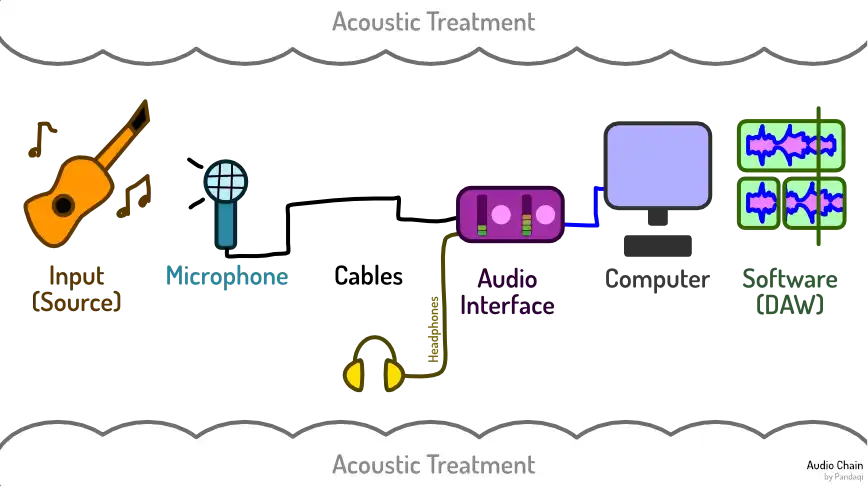

This chapter explains what you _surely need_ to start recording audio. The next chapter will only go over things that are certainly useful but not essential.

In short, you need some equipment for **every part of the audio chain**. Because if you don't, the chain is obviously broken and no audio will actually get recorded.

## Input

You need a sound source to record. For most, this will be either your voice or a guitar / piano. But anything that makes sound will obviously work.

{}
I make games, for which you need sound effects. For years, I'd search free ones online. When I bought my first "good microphone", I realized that I could do it myself now! Since then, I've thrown countless objects against each other to get all sorts of professional sound effects.
{}

In general, I maintain the motto

> Buy equipment that suits your status and skill level

There's no use buying a 1000 euro guitar, if your microphone is only 50 euros, or your skill with recording is minimal. Until you write amazing songs and every part of your chain is amazing, a 100 euro guitar is _fine_.

{}
I made this mistake big time. I have a beautiful guitar at home. Not 1000 euros, but not far off either. And it's sound is just _so massive and full_ that I couldn't record it. I didn't know how to. I needed a better room and more skill. So I actually shot myself in the foot with that. It's the dumbest, most regrettable purchase I've ever made.
{}

## Microphone

You need a microphone to pick up the sound. Just one is enough.

Again, buy equipment suitable to your level. You can get microphones for around 100-150 euros that are _more than good enough_. 

Often, they sell microphones in stereo pairs ( = two of the same one). Sometimes this means the total price is cheaper. 

Yes, I've discussed that _stereo_ is what we want. But this is _not essential_. Why? Because you can also achieve stereo by simply doing two recordings and playing them at the same time. That's called "doubling". More on that later.

I, like many, started out with a single microphone for a long time. For most, a **Large Condenser Microphone** (LDC) is ideal to start with.

{}
Of course, there are situations in which a stereo pair is crucial. For example, if you have a soft, plucked guitar piece, you'll want two or three microphones on that. Because you're highly unlikely to do two performances that are identical enough to be doubled.
{}

{}
I can personally vouch for sE Electronics and Lewitt. I've used cheap microphones of theirs for years, and they have never refused service or broken down. They also sound better, to me, than more popular brands such as Rode or Samsung.
{}

## Cables

The microphone needs to plug into something, so you'll need cables. I recommend a middle ground. 

* Go for cables that are **medium length**. Too short and it's impractical. Too long and the sound travels for so long that it's delayed.
* Go for cables that are **medium quality**. Cheap ones will sound only slightly worse. The real issue is cables breaking or destroying your other, more expensive equipment.

Almost all microphones use an XLR connection, so you're looking for **XLR cables**. But check with your microphone and interface, just to be sure.

## Audio Interface

This is a point of contention. Some might say this isn't essential. There _are_ USB microphones that plug directly into your computer. They'll use the small soundboard on every device.

But I don't recommend this. If you're on a budget, your computer probably also isn't the best. 

> Without a dedicated audio interface, it's highly likely that your device won't keep up. It will freeze, introduce pops and clicks, and harm the sound quality.

Buy a dedicated audio interface. Buy one with two inputs. You can plug everything in and forget about it. It will easily handle anything you throw at it, without straining it.

As always, for 100-150 euros you can find something that's more than fine.

Especially look for ...

* **Preamps**: short for pre amplifier. This is what converts your analog signal to a digital one---and is therefore the most crucial piece! You want one that doesn't introduce noise and which can turn up the volume of your signal immensely.
* **Noise floor**: how much noise is automatically added to all signals
* **Sensitivity**: less sensitive isn't necessarily worse, as it can also _hide_ imperfections. Find one that seems to fit with your other equipment or goals.
* **Monitoring**: it needs proper inputs for a headphone jack or speakers, and a volume control for them.
* **Practical controls**: easy buttons to modify volume, mute, solo, etcetera each channel. They'll pay for themselves in time not wasted.

{}
Why two inputs? They are only marginally more expensive than one input. But it'll give you more freedom and set you up for the future. If you buy an extra microphone, if you want to do anything more complicated than just recording yourself, you'll be glad you have that extra input.
{}

## Computer

This audio interface will plug into a device and _store_ the recorded sound on it. This can be anything. Most will use a laptop or desktop computer. But I've seen people use tablets and even (very high-end) phones.

The only requirement is that it's

* _Fast enough_ to store all the data coming in.
* Able to accept _USB_ input.

The number of warnings I've read about things being incompatible with Apple products---or long threads from annoyed customers discussing workarounds---is too darn high. 

For this reason alone, a standard Windows computer is my recommendation. It'll have plenty of USB ports. It'll be supported by all software / plugins / drivers. 

You probably already have a computer to use for this. If not, anything above 200 euros is probably fine.

{}
I've done all my recording on my university laptop. That thing is almost 10 years old now---and it just won't die! I've only lost a handful of takes because the computer couldn't keep up, and that's when I had four microphones plugged in.
{}

## Software

Just a computer isn't enough. You'll need _software_ to accept the audio. While your basic "recorder" app will probably work, it's not great. Those are meant for recording cheap built-in mics for video chats or voice memos.

You'll want a DAW: Digital Audio Workstation.

There are several free ones, such as [Waveform Free](https://www.tracktion.com/products/waveform-free) or [Cakewalk](http://www.cakewalk.com/). 

You also have [Audacity](https://www.audacityteam.org/), of course. Which is great (and open source)! But it has an archaic interface and is more suited for general (quick) audio editing. Although, they're working on a complete overhaul and might have finished that by the time you read this guide.

{}
I personally use Studio One (an older version by now). Despite some quirks---to be expected---it has the most friendly workflow and interface of anything I tried. And I tried a lot.
{}

## Monitoring

This is a side branch from the audio chain. Monitoring simply means "observing": it means you need to _hear yourself_ as you record. If you record a vocal, you need to _hear the other instruments_ while singing.

Obviously, you can't just play the backing track into the room at full volume. Because then _that_ would be picked up by the mic as well!

As such, you need some headphones or earbuds. These plug into that audio interface.

Solid headphones are 100 euros (again). They are nice. They'll sound better and be more comfortable. Additionally, their sound won't leak into the microphone (if your head is close to it).

But they're not essential. You can use cheap half-broken earbuds. (Yes, I say that from experience.) As long as they work, and you don't set them too _loud_, it's fine.

## Acoustic treatment

Yes, acoustic treatment is _absolutely_ essential. No doubt about it. Most people will tell you the same thing.

How you go about it, though, is a matter of discussion. You don't need to buy expensive "room treatment" packs that cover every inch with some type of foam. But you do need to do _something_.

{}
Like most, it took me too long to learn this. I spent a few weeks recording guitar tracks before I decided: "you know what, let's use some blankets and mattresses to create a recording booth". Then I heard how my _new_ recordings sounded. And I knew I could throw away the previous few weeks of work. The difference in sound quality is night and day.
{}

### Hear for yourself

Hear for yourself. Below are three recordings. The first was the original idea I recorded with my laptop mic. (Before I had any proper microphone, and before I had lyrics for the idea.)



It sounds _awful_ doesn't it? I'm not even playing or singing loud. But the recording is distorting all over. The general quality is abysmal.

Now the second recording. This one is with my first mic. That one cost just above 100 euros, and this was one of the first things I ever recorded.



It already sounds much better. But also notice how there's a lot of _rumble_ and _reverb_ on the recording. It sounds "fine" on its own. But it's too distant, too "smeared" or "washed out". With every recording like this, the volume of that reverb and rumble builds and builds in a track.

The third recording is the same idea, but with isolated vocal. You'll hear a bit of rumble, echo, "hiss" through the vocal. This is _not_ a microphone defect. This is _reverb_ from a room with bad acoustics, which degrades our recording.



Still think it sounds fine on its own? Well then, let's play a few of these recordings at the same time! And cringe! Cringe a lot!



{}
Please excuse any notes that are off-key or off-rhythm. These are random practice takes I retrieved from my old backups.
{}

### The general idea

The specifics will be explained later in the chapter on [Acoustics](../space-i-acoustics/). That also has more example songs.

But, in general, you need objects that are thick and soft. That _muffle_ sound when you yell into them, instead of reflecting or amplifying it. You need enough to cover a large area. Prime candidates are blankets, pillows, plush toys, mattresses, soft furniture.

But, remember what I said during the chapter [The Disconnect](../the-disconnect/)? We don't want to kill all natural sound. We want to reduce it _and_ make it prettier. We want **audio absorption**, but also **audio diffusion**.

This means scattering the sound in random ways. To achieve this, you just need a room full of random (large and tiny) objects. This is what makes certain rooms just "sound good". They usually have lots of furniture, plants, objects, all in a somewhat random layout. That diffuses the sound, which means _some_ reverb enters the mic, but most is lost elsewhere.

{}
This is partly why so many youtubers record themselves in front of book shelves, surrounded by plants, pillows, soft toys, etcetera. All that together makes their audio quality magically better.
{}

Especially as a beginner, there's no need for expensive purchases in this department. Just collect enough _stuff_ that dampens or diffuses sound. Then fill your recording space with that.

## Conclusion

That's it. Now you have something for each part of the audio chain. It's not free (or cheap), working with audio. But it doesn't have to break the bank either.

With this setup, you're looking at something like ...

* Input = free if you just use your voice; otherwise 100 euros for instrument(s)
* Microphone = 100 euros for a mic
* Cables = 40 euros total (get a few just in case)
* Audio Interface = 100-150 euros
* Computer = 200 euros (if you don't already have one)
* Headphones = 100 euros (if you don't already have one)
* Acoustic treatment = free if you use things you already have, otherwise 100-200 euros
* Software = free

You can get a _more than reasonable_ full audio setup for ~300-400 euros. Something that will last for years and years, and is enough for most projects.

As always, you can go cheaper. But you don't know what the future holds, what might break down, what you might need. In my opinion, anything below that budget is just throwing the dice on whether it works out or not. I am personally blessed with a talent for _bad luck everywhere I go_, so I didn't take that risk, and I'm happy with that.

## Equipment that's "too cheap"?

People like talking in extremes. 

Some say "you can't record anything _decent_ without expensive, high-grade, professional equipment!"

Others say "screw that, you can record professional albums on _anything_! No budget, it doesn't matter, if you work hard you can achieve that with terribly cheap equipment."

And as usual, both extremes aren't helpful. 

> Good, professional equipment is essential---up to a limit.

No, you don't need much equipment or the most expensive ones. There are many artists that share their tools or workflow on YouTube, and they just use cheap microphones they collected over the years.

But it's also not true that "anything goes". The first time you record something with a _proper_ microphone, and compare it to the same thing recorded with your phone or webcam, you'll hear a _world_ of difference. The first time you start stacking multiple recordings, creating layer after layer, you'll hear how this is impossible with phone recordings. As explained, recording without an audio interface is taking a huge gamble and shooting yourself in the foot.

{}
And, honestly, most smartphones these days cost _more_ than an expensive high-grade microphone. So it's not like recording on your phone is lower budget; it's likely higher budget.
{}

As I said, find a complete setup for sub 400 euros. Yes, the profession (or hobby) of recording will cost money. That's true for most skills. But most devices above 100 euros will be _more than good enough_ these days. Spending anything more is likely throwing away money. Your skill can't match the equipment. And the _minor_ increase in audio quality isn't audible to you anyways.