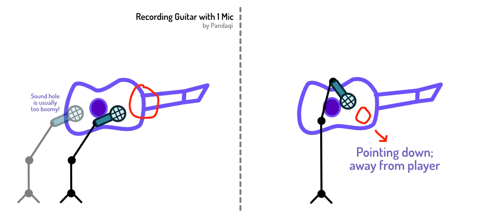
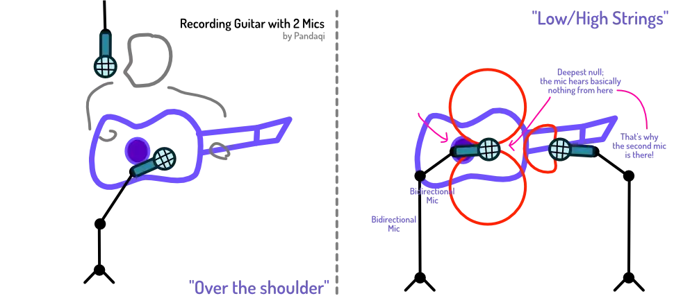

The second instrument I'd recommend to anyone, is guitar. It's a completely different array of _sounds_ and _rhythms_ than piano. I've often tried to play songs for guitar on piano, and vice versa, and it just won't work. You can't replicate groovy guitar strumming with piano. On the other hand, the sustained notes of a piano die down more quickly on a guitar!

I recommend learning both, to some degree. Together, they allow you to record nearly any sound or rhythm you come up with. (Although the true king of rhythm is, obviously, the drum.)

Recording a guitar is both the _easiest_ and the _hardest_. It depends on your purposes and your setup.

## Single Microphone

If the guitar part can be doubled, do so. Record it with one microphone, multiple times, and pick the takes that match best.

The percussiveness of a guitar (strumming, pick noise, scraping along strings, ...) blends really well with multiple takes. Even if the timing is slightly off. Even if the take is very much imperfect.

That's what makes guitar easy. You can pick any microphone, sit down, follow the simple ideas below, and you'll _likely_ get a reasonable recording.

But where do you put that microphone? This is where we learn our most important lesson about guitar:

> The guitar is a terribly unbalanced instrument

Look at it. There's this huge body on one side, and a tiny neck on the other. All the _volume_ and _intensity_ comes from the soundboard of the guitar.

So where do you point the mic? What is the "center"? What's the area where the sound is at its peak?

Ask ten different audio engineers and you get ten different answers.

Below, I'll tell you what _generally_ seems to be true, and what I often use.

* **Don't point** the microphone directly at **the sound hole**. This leads to a sound that's too "boomy". You miss all the nice extra sounds from the guitar and only get one intense blast of sound (out of that hole).
* Instead, point the microphone more towards the neck. In fact, a good spot is the location where the _neck_ meets the _body_.

Listen to the result. 

Still too much low end? Like you're missing the higher frequencies? Either move the microphone further up the neck, or _rotate_ it to point more along the neck.

Too much high end instead? You miss a sense of weight or fullness? Try the opposite. Move the microphone closer to the sound hole, or _rotate_ it to point more towards the body.

Personally, after _many_ experiments, I settled on pointing the microphone at the lower corner of the guitar. The piece of body _below_ where the neck starts. I place the microphone 10-30 centimeters away. This has a balanced sound _and_ retains that percussive nature of guitar.

**Tip**: place your microphone a bit higher, so you can point it _down_ towards your desired spot. This prevents your breathing (or singing) from getting into the mic. (Because now the mic points away from that.)

## Double Microphone

If you record a live performance, or something that _can't_ be doubled, you'll need two microphones again. To record one performance in stereo.

Any of the setups I explained in [Microphone Placement](../microphone-placement/) can work. 

The important part is to always check for [Phase Issues](../phase-issues/). Whenever you place your microphones, record a sample and check the phase. If your microphones hear the guitar signal at an unfortunate timing, they'll destroy the signal when combined.

{}
If both microphones are equally far away, the timing will be perfect and there are no issues. But it's pretty impossible to place them that perfectly. Instead, you'll likely be off by a few centimeters, creating lots of phase issues. My personal recommendation is just to ignore any symmetry and place microphones where you like, until it sounds good.
{}

But remember that the guitar is an unbalanced instrument. The big body produces much more volume (and low-end) than the neck.

Firstly, this means you need to search the guitar's "center" again. Find a spot where both microphones seem to pick up the same volume and don't lean too much towards one end of the frequency spectrum.

Secondly, this means many techniques will create that "unbalanced" sound. The one where the left ear has lots of _low end_ and the right ear lots of _high end_. Yes, you have a stereo images, but it's like that image is _leaning_ in one direction.

If that's fine with you, use the placement principle again: place these sounds as if the _listener_ is playing the guitar. This means higher frequencies to the right (neck-area) and lower to the left.

Otherwise, try a more unconventional setup. I know two popular ones that have worked (in my experience).

**Over the shoulder**: one microphone records the guitar like the single mic technique, as balanced as possible. The other hangs over the guitarist's shoulder. In a way, that one records what the guitar player hears. It's next to their ear.

**Horizontal Mic**: you need a bidirectional microphone for this. Place it parallel with the string (so it's horizontal), halfway the guitar. This means that the front records the lower three strings, and the back the other three strings. This creates a very nice and wide stereo image. But because the microphone is horizontal, there's no "leaning" of the stereo image---both front and back get an equal amount of the powerful soundboard. Any other mic is fine, but usually you simply place one next to it.

## Singing with Guitar

Like the piano, you want three microphones. Two on the guitar, to get a stereo image of that which fills the whole space. One on the voice alone.

These mics will "bleed" into each other. The guitar mics will hear the voice, and the voice mics will hear the guitar.

It's your job to either ...

* Minimize this bleed
* Or place all microphones such that the bleed is not an issue. ( = It has no phase issues. The bleed is inaudible or actually makes it sound better.)

The first step to minimize bleed is to point the microphones in a smart way. Point the guitar microphones _down_ and away from the singer. Point the vocal microphone _up_ and away from the guitar.

The second step is to pick the right microphone type. The **bidirectional** mic has the deepest "null": sound coming from the side completely vanishes. So point the _side_ of the vocal mic to the guitar, and the _side_ of the guitar mic to the vocal.

See the previous image about using the null of a bidirectional mic.

## Guitar Types

There are three major guitar types:

* Spanish: for classic and plucked music
* Western: for chords and pretty much anything (but _acoustic_)
* Electric: the digital version of a western

Spanish guitars are quite _soft_ in terms of sound and volume. When recording, you'll want a microphone that boosts more of the high frequencies _and_ which records at a high volume.

Westerns, on the other hand, are loud and harsh. Get a microphone that adds some more warmth and low-end to it. Place it further away, no need to raise the volume.

Electric guitars ... can be recorded directly! Most audio interfaces have dual connections: they accept both an XLR cable (for microphones) and a direct line in (from instruments). So just plug it in and record the channel as usual. You should get a clean recording, without noise, without issues. The sound of an electric guitar can obviously be shaped later (when editing), as much as you want.

When I started listening to my favorite songs with a critical ear, I noticed a few things.

* Almost all of them have an acoustic guitar (quickly) playing chords. It's not necessarily for the _sound_. (You won't hear those chord tones over the other instruments.) It's for the _rhythm_, for that percussive nature. Usually, all those acoustic guitars come in during the _chorus_ for extra energy.
* Singer-songwriters, or smaller artists, prefer using many layers of electric guitar. Now I know why: it's easier to record when you have no budget. All the issues with microphones _aren't there_, because you record it directly.

As such, if you have a terrible environment or setup, you can always go for completely digital recordings: all electric guitar and MIDI keyboard.

A good compromise is a **semi-acoustic guitar**. They are acoustic (usually Western), but have a pickup inside and a slot for a cable (usually the same one as electric guitar). This means you can record them in _two ways_ at the same time:

* With a microphone, physically
* Using that line output

The line will usually sound unnatural and harsh on its own. But when blended with other sounds---such as that live recording---it usually sounds great. Because the line recording is noise free, loud, but still clearly a guitar.

{}
Most of those guitars, however, have batteries for that pickup. On the inside. Which means you need to _remove all the strings_ to get to it and replace the battery. I learned this the hard way. I just replaced all the strings---which is hard work if it's been five years since you last did so---when I tested the guitar and realized the battery was drained.
{}

## Good technique

Lastly, here are some simple tips for getting the most out of whatever guitar you have.

A guitar often sounds best when **played at its loudest**. (Especially true for Spanish guitars.) This has the best sound, but also translates best to a recording. The loud notes will overpower noise or clicks. Turning down the volume afterwards is easy. Adding more volume on a thin and noisy recording is not.

Practice **clean playing technique**. Press strings deep into the neck. Hit the string you want to hit, and no other. Don't accidentally mute strings. Don't tick an accidental rhythm with your nails or pick while strumming.

{}
I thought I had good guitar technique. Then I recorded myself and was horrified. I kept ticking against the guitar or hitting an open string I wasn't supposed to hit. I'd often be quite slow with transitions, leading to tiny windows in which I just played nothing or wrong notes. Man, recording yourself surely brings out all the flaws.
{}

When using a capo, test if it **properly presses into the strings**. If it's too lose, or doesn't apply pressure to all strings, the sound becomes a mess. Some notes are fine, others are muted or lower volume. (Test this by hitting all strings both as _softly_ and as _powerful_ as possible. In all case, there should be no rumble or muting. The notes should sound clean.)

The **type of pick matters**. A thinner pick leads to more of that percussive sound being made (and thus recorded). A thicker pick makes almost no sound. There are picks with patterns on them that change how strings oscillate, which can completely alter the sound of your guitar.

Check the **age of your strings**. After recording an hour a day for 2-3 weeks, your strings are surely old and worn. When you replace them, you'll immediately hear the difference this makes to your sound. New strings are much brighter, louder, fuller.

Strings aren't that expensive. But changing them too often isn't cheap either. Find a nice middle ground. Also, for some styles (or to some ears) worn strings actually sound much _better_. Newer strings are too "bright and shiny" in those cases.

As always, trust your ears. Don't blindly follow rules written by some stranger online, do whatever works best for _your purposes_.