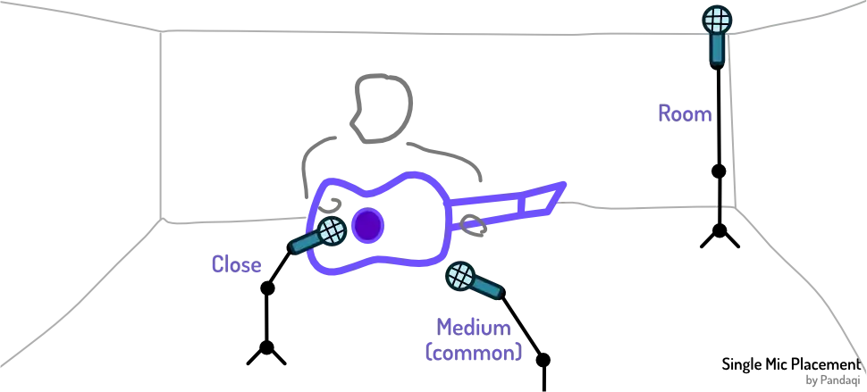
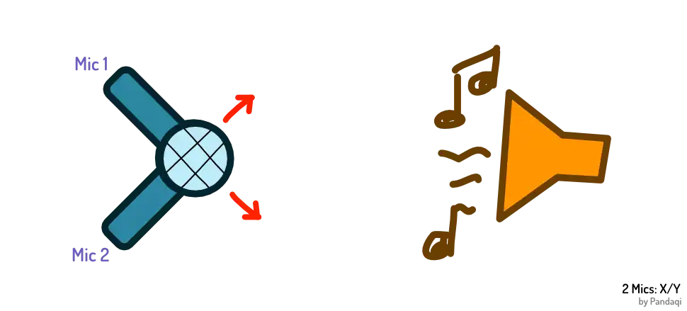
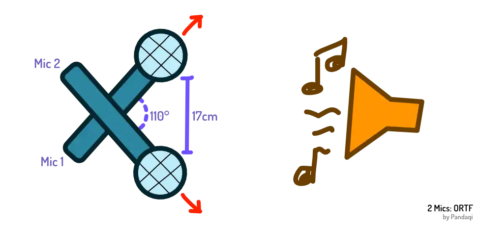
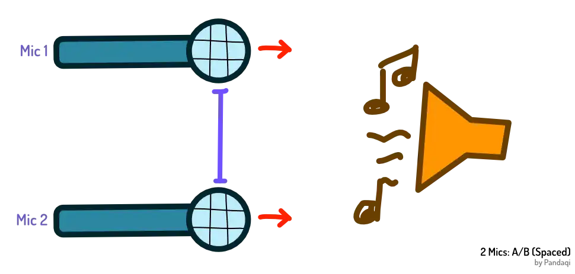
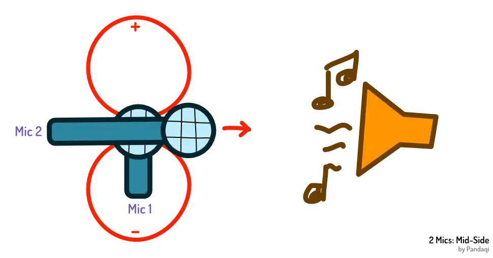
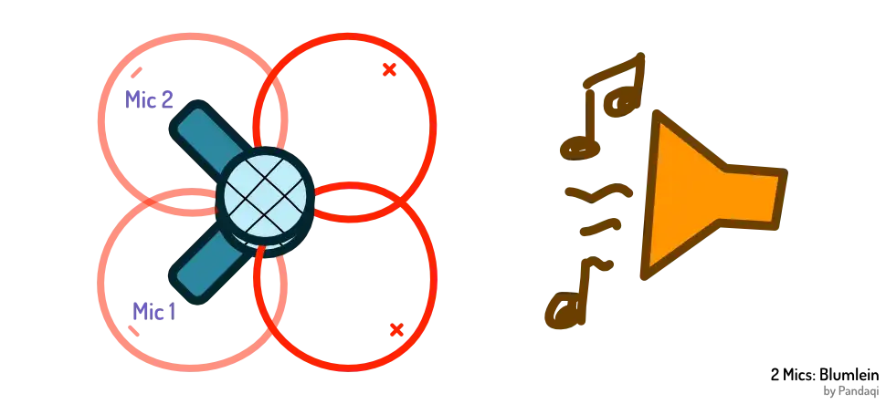

Yes, this chapter will tell you where to place your microphone. But there are no "rules", not really. You should try your microphones in many locations and pick the one that sounds best. To you, to your ears, for your purpose.

This is proven by the fact that I give _multiple options_ for every number of mics. There is no "one microphone placement to rule them all"

But first, let's look at some simple general principles.

## General 

No matter your instrument or mic, I've found this to be true.

* Always keep some _distance_. About 10-30 cm is often a sweet spot.
* Except for percussive elements. Those can and often _should_ be close-mic'd.

When we hear a guitar, our ear isn't pushed against its strings. We hear all sound from a distance. Recording it that way leads to a more natural and usable result.

In a similar vein,

* Point your microphone at the peak of your sound source. At the spot where it's most intense or has the most volume.
* However, don't point it _directly_ at it. Put it slightly off-center, off-axis, at an angle. 

The reason is the same as the one discussed in the [Acoustics](../space-i-acoustics/) chapter. A recording is better if it has a little reverb. If the audio is slightly "diffused". If you put the mic too "perfectly" on the sound source, the sound waves will hit and deflect too perfectly, leading to a dry or intense recording.

Additionally, this adds just a bit of color and variety. Also useful for that stereo image.

## Single Mic

If you remember one saying from this chapter, make it the following.

> Opposites attract.

If you have a loud source, place the mic further away (or pick a mic that records more softly). With a soft source, do the opposite: place the mic close or use one that's really sensitive.

If you have a source with mostly _low frequencies_ (like a bass guitar, or a male bass singer), use a microphone that adds some extra _high frequencies_. 

By doing this, you tame the most extreme parts of any sound source. It becomes more balanced and smooth on the digital recording. (And subsequently more usable in any mix or busy track with many recordings.)

I think it's worthwhile to just stick to this mantra for a while when you start out. Wait until you have enough experience (with recording or mixing) before trying more exotic mic combinations. It takes great skill to use a mic that doesn't _tame_ a source but actually _brings out the extremes even further_. If you pull it off, the sound will be unique and strong. If not, the sound will be absolutely terrible.

Besides that, a single mic can obviously be placed anywhere. Still, you could divide it into three different positions,

* **Close**: the mic is inside or right up against the source. Leads to a low boomy sound (due to that _proximity effect_). But reduces reverb and noise, while adding volume. With percussive sounds, this is ideal.
* **Medium**: this is the one you use 99% of the time. The microphone is _some_ distance away from the source, angled _somewhat_ towards it. This will get the best sound for most situations.
* **Room**: you place a mic on the opposite side of the room. The goal is not to record the instrument, but to record the _room atmosphere_ while playing.

Later chapters contain many more examples and images, when we delve into how to record specific instruments.

{}
This is another reason why a "pop filter" on your mic, by default, is useful. It forces you to move back from the mic. The pop filter has to fit between your mouth and the mic, so you naturally get a good distance. Without it, I've seen many people push the vocal mic nearly inside their mouth by instinct :p
{}

## Double Mic

When you use two microphones at the same time, the mantra "opposites attract" also applies to the _mics_.

If you use two bright mics on the same source ( = they capture more high frequencies), the recording will be _very_ bright. This, again, can only succeed if you have the skill and experience for it.

In general, pick two opposite microphones. One bright, one dark. From different manufacturers, even. This will tame any _bias_ or _extreme_ that one mic has, creating a more full and balanced stereo recording.

Your priority here should be on those [Phase Issues](../phase-issues/). Place the microphones such that they don't get in each other's way. (When you listen to both recordings at the same time, in mono, they destroy and weaken the final sound.)

With two mics, there are several common "placements".

### X/Y

The heads of the mics ( = the part that actually listens and records) are at the same location. Or as _close as possible_ to being at the exact same location.

But they are _angled_ differently, so they still record a slightly different sound. In general, they are angled 90 degrees from each other. That way, they are clearly different while still pointing towards the source (for the most part).

This is the easiest one to start with. It's rather intuitive, quick to setup, and usually works.

The downside is that the stereo image you get is rather _small_. Because the mics are in the same spot, they'll still 99% record the same thing, which somewhat defeats the purpose of having two mics.

It doesn't take much offset between the mics to introduce those phase issues. So this technique is only worthwhile if you're sure you can get the mic heads very close---consistently. (Cheap mic stands will usually "droop" or change slightly over time.)

{}
I once bought a cheap "stereo mount". This is just a metal bar that can hold _two_ microphones at once. This way, you can easily place them in X/Y. And when you move them around, you move _both_ at the same time, so the configuration stays the same.
{}

### ORTF

This is similar to X/Y, but used when you want a _wider_ stereo image. Instead of the mic _heads_ crossing, they move far apart, and the mics may cross each other at the _back_.

The recommendation is to space them 17 cm apart, with an angle of 110 degrees. Again, this is hard to match _exactly_, and I don't think you should worry about that.

Guess the distance and the angle. Then move them around until there are little phase issues and it sounds good to you.

I've recorded many things this way. It was my preferred method: easy to execute, wide stereo image. Until I became more experienced and was able to pick a _specific_ placement for my _specific_ purpose. 

{}
It also takes a while to really hear and understand phase issues. That's why I mention it so much in this course. It's a _major_ factor to your recording success, yet most guides brush over it with a few sentences like "yeah, just check if it sounds weird"
{}

### A/B (Spaced Pair)

The name says it all. You pick two microphones and space them apart. One points at the left side of the source, the other at the right. The further you place them apart, the wider the stereo image. But there obviously comes a point where you're not recording your source anymore, but the room instead.

Usually, these microphones point the exact same direction. They are _parallel_ to each other. It's literally like you took one microphone, _copied it_, then placed it to the side.

In my experience, it's often worthwhile to _angle_ them a bit inward. To point them both just a little more towards the same location, towards the center of your source. Because there is such a thing as "too wide a stereo image". If the mics are really far apart, it'll sound three dimensional, but mostly because it sounds like two entirely different spaces. It's not _one_ instrument anymore to our ears.

Many guides will give you the same specific recommendations again. Place them X centimeter apart. Use a 3:1 ratio: the distance between the two mics is three times their distance to the sound source.

I've tried all of that, many times, and it's just not useful. Yes, it can give you a _ballpark estimate_, something to start with. But remember that picture of my recording booth? The floor is uneven. I don't have the _space_ for that much distance. I wasn't able to cover one part of the wall, which means I _never_ want a mic pointing at that part.

See what I mean? Unless you have a great room and great budget, rules and ideals are not for you. Work with what you have. Try out different positions and listen to the result.

### Mid-Side

All the techniques above use the three most common mic types: dynamic, small diaphragm condenser ("pencil mic") and large diaphragm condenser. You _can_ use others, but it will usually not work out. They assume your microphones are _directed_ (not omni) and have one clear _front_.

You probably feel what's coming: what if we have a front and a back on one mic? What if we have a _bidirectional mic_?

Then you're in luck! Because you can do mid-side, and it's the best thing ever. You need 

* One bidirectional mic
* One mic of a common type (mentioned above)

Point the common mic directly at the center of your source. Or whatever area is balanced and sounds the best.

Now place the bidirectional mic underneath/above it, but _rotated_. It records the _sides_ that the common mic misses. If the common mic records dead-on, the bidirectional one records left and right.

Hence the name: mid-side.

There's one caveat, though. You need some extra setup to make this work. Because what do you get?

* One channel that has _both_ the sides
* One channel that has mid

How do you place that? The mid one should stay mid. Can we _split_ the sides into left and right?

We can! Send the "sides" recording to the left ear. Now duplicate the track and _invert_ the new one. Send that to the right ear.

In stereo, this sounds wonderful. You hear different things in both ears _and_ a strong support that's the same in both ears. When summed to mono? The sides _cancel_ each other _perfectly_. (Because, remember, they are the same recording, just inverted.) Which means you only hear the mid, which can't have phase issues with itself of course!

Especially with guitar, I feel this is the best technique. 

### Blumlein

What if you _only_ have bidirectional mics? Then you can take mid-side to the extreme and do Blumlein.

This is simply an X/Y placement, but using two figure-eight mics. This is usually touted as creating the best and most realistic stereo image. But that's also its downfall. Because the mics also record their _back_, the acoustics and quality of the room become the most important factor.

In an acoustically treated, noise-free room, bidirectional mics will trump anything else. In other rooms, they'll create a low noisy signal that's completely unusable.

## Triple Mic

You might wonder: _when will I ever need three or more microphones on the same source?_

You're right---you generally don't. Only very expensive or detailed recordings will place many microphones on the same instrument.

{}
Say you record samples for an expensive piano VST you want to sell. Such software usually allows you to toggle between different "mic positions". It allows you to toggle between different "areas" of the piano. As such, there might be 4, 6, 8, ... mics all pointing at other pieces of that piano while it's played.
{}

{}
If you work on a big budget Hollywood film, it's not enough to just record some of the environment and the actor's lines. These films will be played back in large studios, with _surround_ sound. You need to record scenes from many different angles and distances at the same time, if you want to really put the listener there. Additionally, this gives redundancy: one mic might fail, or have a nasty click, so just use the other one next to it.
{}

There are no "new" placements to learn. Because what would be the point of three microphones on the same source? We only have two ears. One mic goes to your left ear, one to your right, and the third ... ? It usually stays _center_: equally in the left and right ear.

What you're really using is one _duo_ (for a stereo recording) and one _single mic_ (to capture something else).

The most common application is a "singer-songwriter". Somebody who sings while playing. The two mics will be on their _instrument_ (to get a full stereo recording of that). The single mic will be on their _voice_ (to get a clean track with just their vocals).

The other common application is to use the third mic as that "room mic". Later, this is softly blended with the other recordings to add natural reverb and fullness.

As such, when using three or more mics, simply use the techniques I discussed above. Divide them into pairs and singles, place them accordingly.