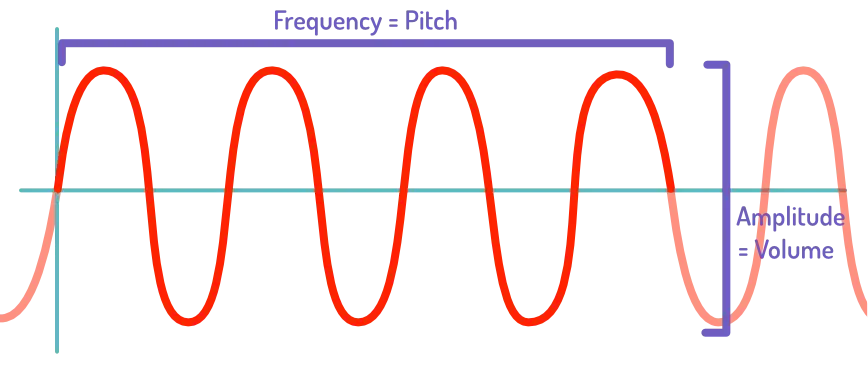
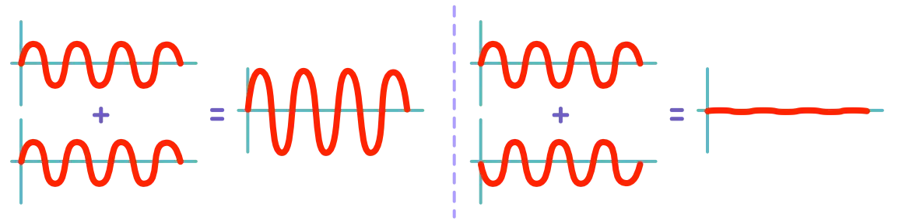
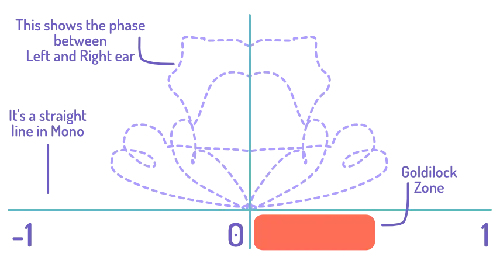

This is a rather advanced topic. But I wanted to discuss it now, because it explains _why_ the next chapters are the way they are. It's a rather simple idea that covers many issues you might encounter when recording. I'll keep it short and practical, as always.

## What is sound?

Sound is a wave. A wave goes up and down following a pattern. 

The number of times it goes up/down per second is the _frequency_. This determines the **pitch**. 

How high its peaks and valleys are is the _amplitude_. This determines the **volume**.

## What is phase?

This has an interesting consequence. It doesn't matter if you start the wave by going up ... or by going down. It doesn't change the frequency or the amplitude---so it doesn't change the sound.

In other words, we can have two identical sounds ... but their waveform is completely opposite!

What happens if we add those two sounds together? They _cancel each other_. Because when one goes up, the other goes down. Even though they are the same sound, their wave travels in opposite directions. So combining them will give you exactly _nothing_. They have **opposite phase**.

Similarly, if the sounds _did_ start in the same direction, they'd have the **same phase**. When you combine them, the sound just becomes twice as loud. Because now _two_ waves go up at the same time.

## An interactive example

I'll give you an example. Below, the same recording is copied to a second track and muted. Play it, and you'll just hear a regular guitar. 


    
        
    
    
        
    


Press the `P` and it inverts the phase. It sounds _exactly the same_, right?

Unmute the second one (press the `M`) and play the thing again. Suddenly you hear ... nothing. Because the first track has inverted phase, and the second doesn't, the audio cancels each other perfectly! (Undo the phase inversion and you get the guitar back, now twice as loud as before.)

## Why does this matter?

Hopefully you can already see the issue. Let's say you point two microphones at a guitar and record.

One microphone picks up the sound a little earlier than the other. But they both record the same performance on the same guitar---they both receive the same sound!

This means their waves will clash. They are **out of phase**. 

Sometimes, they'll be identical and make the sound **louder**. At other times, they'll be the exact opposite and **destroy** the sound.

This sounds very ugly. It usually means the recording varies wildly in terms of volume. And the essential frequencies---those that make the sound _nice_---are completely cancelled.

These are called **phase issues**.

You can't just place two microphones and think you're done. You can't do two takes and think you're done. There is _always_ a chance for phase issues to appear.

{}
I sometimes run into this when doubling. I'll play some part of the melody almost _identical_ to the other take. This means you lose the stereo effect, and for a second it just sounds like one _louder_ mono recording. Even though it's a completely different take! Recorded with one mic each time! 
{}

These issues can randomly appear. They are often the reason why recordings sound great on their own, but _not_ together. Even if they're from different takes or instruments.

And now you know how to spot them.

* Big jumps in volume (at random moments)
* The sound becomes thinner and more "distant", instead of the full sound of the original source

You will **not** easily spot these issues on great hardware when listening in stereo. Because the phase issue only appears when the left and right channel are _combined_. For that, you need a mono source, or one that's pretty terrible at reproducing the combined sound ( = cheap hardware).

On expensive speakers, or when listening in stereo on your nice headphones, phase issues won't be a big deal. But then you listen on your old phone ... and suddenly everything sounds like crap.

In the chapter on [Monitoring](../monitoring/) I already explained why you should always do so in mono. The same is true for this part: always record and monitor in *mono*, to spot phase issues instead of glancing over them. (Stereo is for mixing, for that pretty end product.)

And the only way to combat these issues, is by doing another take, or changing your microphone placement. It's a bit poetic, really. Human ears _want_ a tiny bit of randomness and chaos to recordings. Hearing two (near) identical takes of something will just sound ugly. So, if this happens to you, make _more_ mistakes and improvise a bit :p

## A warning

Many people will say to just "copy the recording" and change it a bit. Some call this the "Haas effect". 

You have one great take of your guitar? 

* Duplicate it
* Move it a few milliseconds forward/backward
* "Destroy" it by adding other plugins or edits everywhere, to make it significantly different from the first

Yes, with enough (skillful) editing this will work. I did it myself. (On my oldest instrumental tracks, on guitar, you can hear this.)

But it will _never_ sound as good as just doing another take or placing your microphones better. The phase issues will persist. It might take an hour to make it sound good---which is enough time to do a hundred more takes.

I say: don't waste time with that.

Again, I can show you this. Below is the same track doubled, but the lower one starts _slightly_ later. Play it, and it will sound fine!


    
        
    
    
        
    


But now pull both pan sliders (the horizontal slider to the left of the audio) to the center. This is what it sounds like to somebody listening with _one_ speaker or a _mono_ audio system. It suddenly sounds different and worse---a bit more thin and brittle. Because it's the same recording, played slightly later, it _fights_ the other one.

## Another warning

Once, I bought a second microphone to record guitar with two mics simultaneously. On its own, it sounded amazing! But when I combined the two recordings? It was ... thin, and soft, and bad. But no matter how much I moved around the mics, it didn't seem to change. 

That was odd.

Until I looked at the phase and realized: this second mic had, by default, an inverted polarity. It automatically recorded the sound waves in the _opposite_ way, compared to all my other mics.

Yes, of course that presents major phase issues! The two mics almost _completely_ canceled each other! Because they hear the same sound, but one saved the waves going up first, and the other saved them going down first.

Flipping the phase (or "polarity") on that second mic magically solved all that. Now I could move them around and actually _hear_ the sound getting better or worse. 

It saved me an uncomfortable talk with the music store, claiming the mic was broken when it clearly wasn't :p

## What if I don't hear that?

Don't worry! Use a plugin that shows you the phase of your song. In Studio One, it's called the "Phase Meter". It might be called a "Spectrometer" or "Spectrogram".

It simply shows the phase correlation of whatever sound you're playing. 

* If it's 0, the sounds are completely different. Completely "stereo" if you will.
* If it's below 0, the sounds are cancelling each other. They are negatively correlated: when one goes up, the other usually goes down.
* If it's above 0, the sounds are adding to each other. They are positively correlated: when one goes up, the other usually also goes up, simply increasing the volume of that sound.

Ideally, you want to hover around the 0-0.5 range. This means the sounds do not cancel each other, but they're similar enough to register as "one sound" to us. Not just completely different things put into our left and right ears.

This tool won't help you _fix_ them. But it shows if this is an issue. You can test any combination of sounds by placing this plugin on the master track and only enabling the recordings you want to test.

Most of all, use this while placing microphones. To check if the placement leads to any issues. To ensure your recordings will not clash, before you even record anything.

Hmm, how convenient, let's talk more about **microphones** and **placement** in the next chapter!