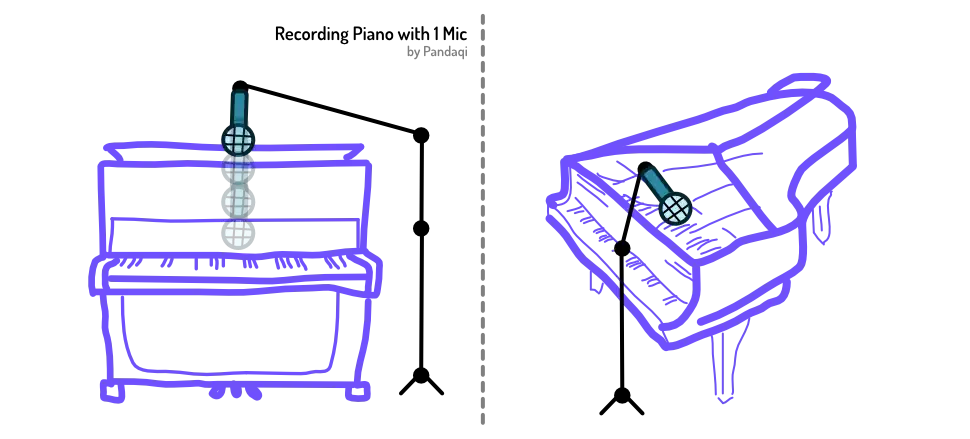

I'd recommend learning the piano to anyone. It's probably the easiest instrument to understand (in a short amount of time), but also the most versatile. With a MIDI keyboard, you can record audio for most other instruments. With a few simple piano chords, you already have a basic support for any song. And the notes of the piano are laid out in a neat, orderly manner. (The same octave repeating from low to high.)

This simplicity extends to recording ... for the most part. Let's look at how to record a piano

{}
A MIDI keyboard obviously isn't part of this chapter. You just plug that into your laptop's USB port and its sound is transmitted directly. No microphone or issues with real life getting in the way.
{}

## Single Microphone

If the piano is not the main instrument, a single microphone is fine. If needed, you can double the part by simply playing it again.

There are two pianos: _upright_ and _grand_. Most people have an upright version in their living room, because grand pianos are just too large and too expensive.

With an upright piano, you can **take off the top**. Usually quite easily, by just pulling or shoving it. This will reveal the large set of strings inside the piano.

Now you can get a microphone in there. Using a strong (long) microphone stand, move the mic close to the strings. The piano sound often becomes _better_ if the mic is almost _inside_ the piano. "Among the strings" But this might be hard to accomplish and might damage your mic. It's fine to keep it floating above the piano.

Point it at the center. Point it away from the one playing, otherwise you'll record a lot of breaths, sniffles or creaky chairs :p

A grand piano has a similar idea. Prop up the lid and point a microphone somewhere near the center of the strings.

## Double Microphone

If the piano is a very important instrument (or the only one), you want to record it in full stereo. You'll need two microphones.

> Instruments sound best when recorded as if the listener were playing the instrument.

Imagine your listener is sitting behind that piano. Then the lower keys would be to their left ( = left ear) and the higher keys to their right ( = right ear).

Those are the two parts you want to record. Point one mic at the left side and one at the right.

You can do this from above, directly at the strings. Or you can pull the mics back, so they point straight at each end of the piano (horizontally parallel with the floor).

The same is true for grand piano. But it obviously has no _upright_ part. So both microphones will be angled _downward_ and _inward_, in the pulled-back position.

Now remember the principle of "opposites attract" (from the [Microphone Placement](../microphone-placement/) chapter).

* The left side has lower keys, so pick a mic that focuses more on _high frequencies_.
* The right side has higher keys, so pick a mic that focuses more on _low frequencies_.

Without this, the sound will become ... unbalanced. The listener will _clearly_ hear a lot of bass in their left ear, and a lot of high stuff in their right. It tilts the overall song. It becomes even worse if somebody only has one speaker in their room (and the other in the other room) or shares earbuds with someone. They'd hear only _one_ side, and thus only a bunch of low stuff or a bunch of high stuff.

By matching frequency with an opposite microphone, you tame them. Just enough to balance and smooth out the overall soundscape.

## Pianos are LOUD

When recording a piano, acoustics and a nice open space are especially important. That's it---that's the whole tip.

{}
On one of my oldest (instrumental) tracks, the piano is recorded in our tiny hallway (its usual location). I thought the sound was great! Until I listened to the tracks and realized there is _so much reverb_. And I can't do anything to take it away. Pianos are just so loud and create great echoes.
{}

This loudness has some benefits, though. Piano will override most of the noise around it, including your own breathing. Your microphones can be quite _far away_, and at medium volumes, and they'll still capture the sound clearly.

## Singer with Piano

This is the other major downside of the loud piano. How do you record a singer on top of that? 

First of all, the singer needs good technique. They need to keep good posture while playing, project their voice, be loud. 

{}
And they need to keep their piano virtuoso in check. I am guilty of hammering on the piano like a madman, which is impossible to use while singing. Some more control and subtle piano play can make all the difference.
{}

Besides that, they need to be _really closely mic'd_. 

I've seen plenty live performances (usually at a radio station here in the Netherlands) where the artist plays piano and sings. They always push a large diaphragm condenser right up into their face. But they put it to the side, angled, so the player can still see the keys.

The piano will also need microphones placed more close-by. If possible, push them all the way to the edge of the piano, or _point them away_ from the singer. The piano is loud: it'll be picked up, even when recorded in unconventional ways.

Sometimes, people use lapel mics. Just a tiny mic clipped to their shirt, just below their chin. This loses _some_ audio quality, but gives you that clear vocal you're after.