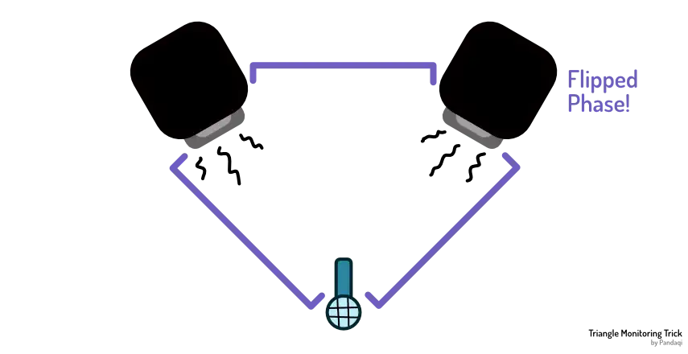

Vocals present the most problems when it comes to recording audio. And these problems mostly stem from bad _monitoring_. That's why I wanted to dedicate a full chapter to it. I've had a _long_ journey figuring out these issues and experimenting with solutions.

All these issues stem from a simple truth.

> Humans can only sing well if they can _hear_ themselves well.

If we can't hear ourselves, we'll be off-key, or at least without confidence. If our voice doesn't sound natural (e.g. it has no reverb at all), we also go wrong and feel uncomfortable.

Many people report singing worse, or just completely differently, when they wear headphones. But vocals should be the main point of the song! If they are delivered without confidence, emotion or skill ... the other recordings won't save it.

How to deal with that? How to sing your best while listening to a backing track in your headphones? 

I'll present solutions to try in the order I think is easiest, and most likely to succeed.

## Tip 1: feedback

Yes! When singing, feed your own voice back into your headphones. Into that monitor mix. 

If you _don't_, you'll barely be able to hear yourself. Which makes it hard to sing well.

It's unnatural for us to sing, but hear our voice _delayed_ or _much softer than expected_. So add your mic input to your cue mix. And try to get the delay down as much as possible.

## Tip 2: Use the correct volume

If your headphones are too loud, you'll sing off-key. Because, again, you can't hear yourself properly.

And you'll do it while _thinking_ you sound like an angel! (Because remember, louder = better to our ears.)

Some, like me, will start to sing "between keys". We purposely sing wrong notes, because that allows us to _hear ourselves_ better over the loud headphones. Because wrong notes stand out!

If your headphones are too soft, you'll barely be able to hear them. This is an issue when you try to sing to a backing track or a metronome / click track. You won't hear it, so you can't match the tempo or pitch very well.

The trick is to find a volume that makes you sound natural. You hear yourself just as loud as you would without headphones.

## Tip 3: Add reverb

Our voice is a very _directed_ sound. This means microphones pick it up rather well, without any other noise. That's great!

The downside is that you get a very _dry_ and unnatural sound, by default. This sounds wrong to our ears. Especially if we know our voice sounds _different_ in reality.

So add a simple reverb plugin to the track (on which you're recording the vocal). Nothing major. You're not trying to sound like a gospel choir on your own.

Just enough to remove the dryness of the sound. To make your voice sound natural and confident to your ears.

## Tip 4: Use open headphones

Most headphones are _closed_. The sound they produce stays inside and reaches only your ears. Others could sit next to you and not hear a single note of the music to which you're listening.

But there are also open variants. These are usually the same price, because there's only a slight difference. The back of the earcups are _open_, which allows outside sounds to reach your ears ... and its own sound to bleed out.

With these headphones, you can still hear yourself naturally. Your voice, at (mostly) full volume, with reverb from the room.

The downside is that their sound can bleed into the mic. So don't use them when _really_ close to the mic, or sing loudly enough to overpower that bleed. (Otherwise, a little bleed isn't the end of the world.)

## Tip 5: take one ear off

If all of that fails, just take the headphones off one ear. Clamp that side to the back of your neck, so it doesn't just project its sound directly into the mic.

Now you'll hear yourself quite naturally, as one ear isn't covered. But the other can clearly hear whatever cue mix you've made for yourself.

## General tip: change your voice tone

Because of health issues, I used to be very careful about using my voice. I didn't want to hurt my body any more, so I sung quite softly and "contained".

The consequence? The vocal sounds more _dull_. Even if it _is_ the right pitch, it doesn't mesh with the other instruments and its volume seems even lower.

I have performed quite a few times in a live setting, all throughout my life. People were always very positive about it. When listening back, _I_ was pretty positive about it.

So what goes wrong here?

Well, the main lesson is

> A technique that works live, doesn't necessarily work in the studio. And vice versa.

A live performance is a different setting. You can hear yourself reverberate off the walls of the room. You play your instrument while singing. There's lots of crowd noise---usually---masking some mistakes. You can _respond_ to how you sound in the room or what the crowd does. 

In the studio, every tiny detail is amplified and every single mistake heard. With headphones on, or stuck with a backing track, you have less freedom to adapt.

Learning to perform _in the studio_ is a separate skill from _learning to perform_.

One thing that significantly improved my vocal takes, was simply changing my singing technique to something that "cuts through the mix". (At least, more than before. I can't change my entire voice.)

How might you do that?

* Smile while singing. Nothing major; just a subtle smile. This brings the vocal sound more "forward"
* There are some vocal exercises that basically mean you imitate a _crying baby_ or a _siren_. You might compare it with imitating a very nasal folk or country singer. This also makes the sound more immediate, more "harsh", but it adds the frequencies you need to cut through other recordings. (First go to the extreme, then scale back to something reasonable.)
* Lean forward. (And/or imagine singing _forward_. As if you need to sing to someone who is miles away, and they need to hear you.)
* Stand further from the microphone

The last one has to do with the **proximity effect** I mentioned at the start: closer to the mic, more low frequencies are picked up. If your voice is already dull or "warm", instead of attention-grabbing, this is bad. Instead, move further away, and more higher frequencies are picked up.

But it also has a second reason. If you stand far from the mic, you feel the need to sing louder. The mic is so far away---you need to _reach_ it or _project_ to it.

This helped me a lot. I stepped further away from the mic and pretended that I needed to sing loud to reach it. In reality, I wasn't loud _at all_. But for me, it _was_ louder than before and more energetic.

If you can hear yourself better over the backing track(s)---because your voice cuts through the mix---you're more likely to give a good performance.

## If all else fails

It might take some training, to learn how to sing with headphones on. How to give a good performance while hearing yourself in a different or unconventional way. It was for me. I'm still not really used to it.

Which means I mostly used a different approach. 

If all else fails ... just stop singing with headphones. Do live performances, where you sing and play at the same time. Or sing and play, but accept that _some noise_ from the instrument will reach the mic.

There are metronomes you can wear. (They buzz or tap our arm on the beat.) Or you can use an app on your phone and look at it while playing, although that's not great.

I've used this compromise as a "bridge" towards singing with headphones. I'd often record a live performance, while wearing headphones _that weren't functional_. I just wore them to get used to singing while wearing headphones. But they had no sound and did nothing.

## The triangle trick

But what if that doesn't work for you? You need vocals, but can't play at the same time, or keep to the rhythm without a click track?

Well, I've learned one _very_ neat trick!

You'll need decent speakers for this, connected to your audio interface. Create a triangle with the speakers:

* One points at you from the left
* The other points at you from the right
* The distance between the speakers is roughly equal to their distance to _you_

Finally, _flip the phase_ on one of the speakers. This is usually an easy button (or standard plugin) in your DAW. 

Now just play your backing track through those speakers. Sing over it, record it.

You'll notice ... you can barely hear the track on the recording, if at all! It's just your voice!

What happened here?

* The sound from the speakers met the microphone at the same time. Because one is _flipped_, it _cancels_ the other, leading to almost no sound reaching the microphone.
* Additionally, the speakers are at the _back_ of the mic, which reduces their influence anyway.

You hear the backing track just fine. Because you have two ears, and they are a distance apart. But the mic won't.

Many artists, especially a few decades ago, used this to sing their vocals without any headphones. Just two speakers cancelling each other. And they'd sing on top of that.

_Wow, what's "phase"? Is that important?_ Glad you asked. Next chapter is all about it.