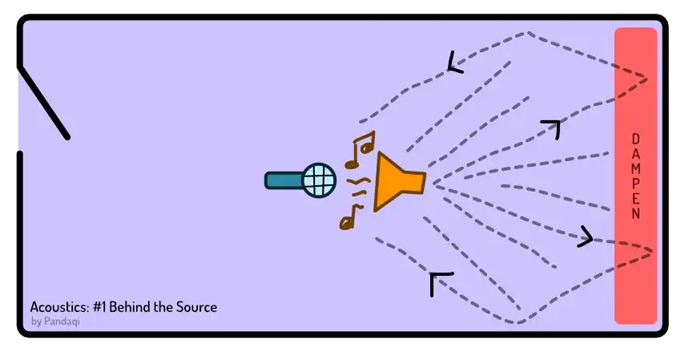
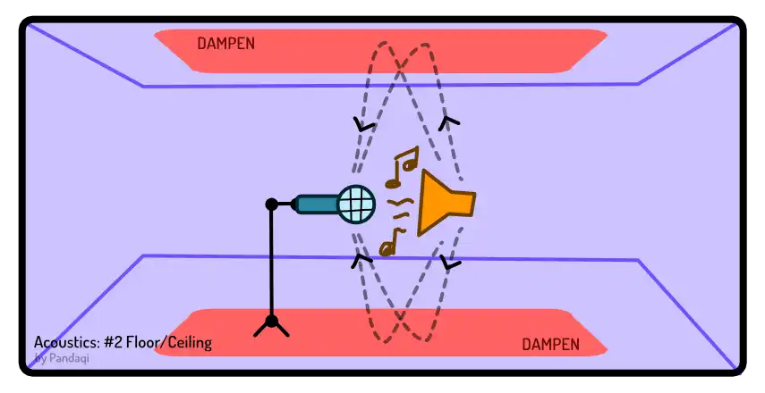
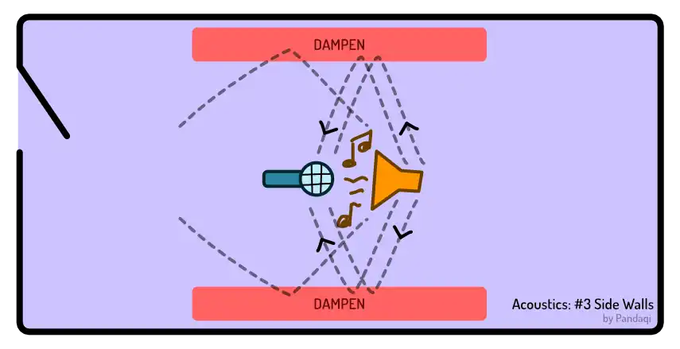
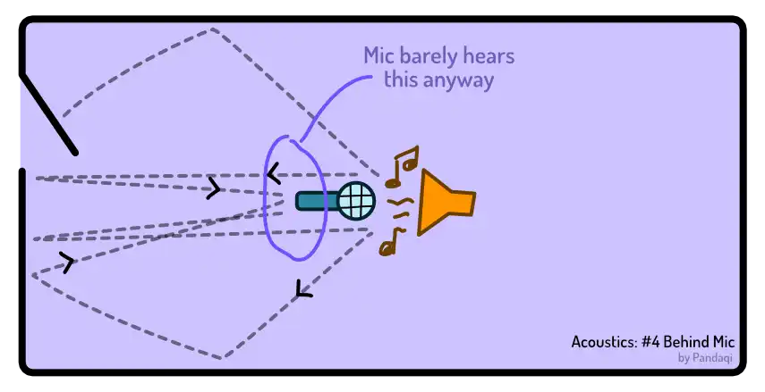
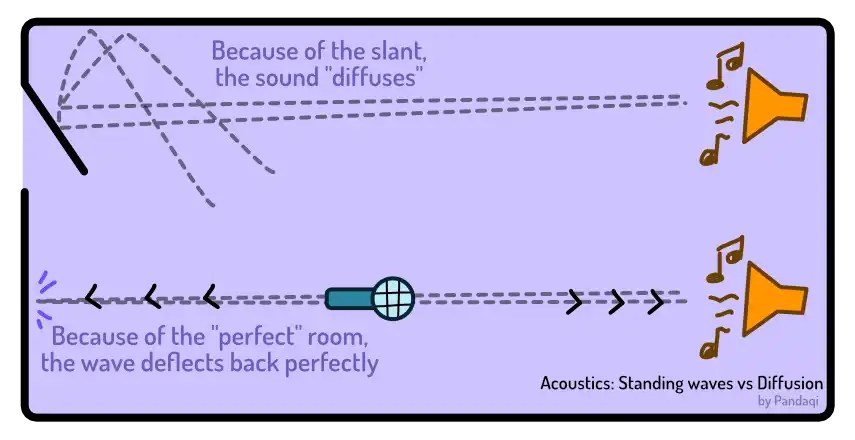
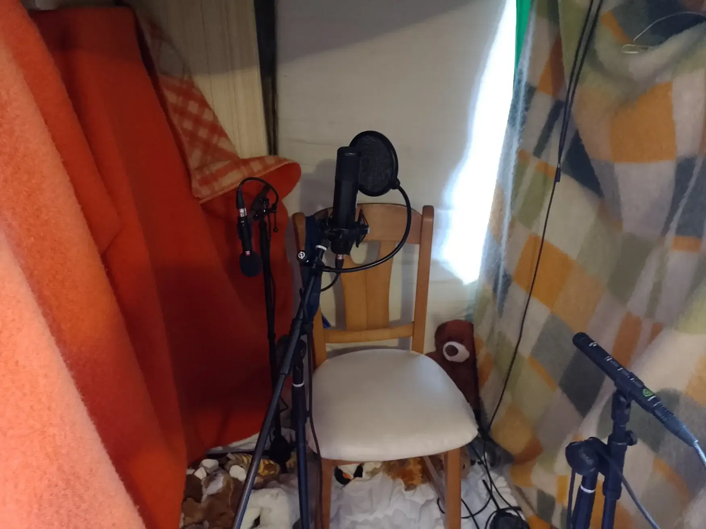

I've already given you an important intuition for acoustic treatment. This chapter will explain the practical side of it. What to place? Where? And why?

We'll do this using **points of interest**! I've ranked the different areas in a room based on how important they are. Based on how much they influence reverb and the final sound of a recording.

Remember, when you make a sound it will go in _all directions_. No matter where your guitar is facing, its sound will enter the room like an explosion in all directions. A microphone, on the other hand, only records in a targeted area.

## 1. Behind the source

The microphone points at its source. It's most sensitive in that direction.

That means it will pick up anything _behind_ the source. If you're singing and there's a wall behind you, that will cause the loudest reflections! Because the mic is looking right at it! 

{}
Of course, in this case your body is blocking some of that. But usually not enough.
{}

So soften the space behind you. I placed a spare mattress vertically against the wall behind me. You can hang blankets. If that's not possible, fill that space with a book shelf, or planets, or a myriad of other objects to _diffuse_ the sound.

## 2. Floor & Ceiling

Usually, a microphone is quite close to the floor. That's where the second loudest reflections come from. Fortunately, that's the easiest to solve! Place down a rug or carpet. Boom, you're done. It will even make the room nicer.

The ceiling is the second culprit. One that's much harder to treat. You'll probably want to _attach_ something soft to the ceiling.

This is why recording studios have _very high ceilings_. (Churches and cathedrals have them as well, which is why they sound so pretty.) That circumvents the whole problem.

So, if possible, record in a room with a high ceiling. A _slanted_ ceiling is the second-best thing, as it diffuses the sound. Otherwise, place your microphones lower to the ground on purpose.

## 3. Side walls

A microphone usually isn't pointed _perfectly parallel_ to the side walls. It's at an angle, seeing more of one wall than another. That wall will influence sound quite a bad. The other won't: it's more near the back of the mic, which is an area it won't pick up on.

Fortunately, this is also easy to treat. It's quite easy to hang something on the wall. Again, go for blankets, put a mattress upright, place a diverse array of objects (plush toys, books, plants) on a shelf or desk pushed against the wall.

Whatever you do, don't pick perfectly flat and reflective objects. For example, paintings or photo frames are very reflective. If your wall/desk is filled with them, you're making the problem worse instead of better.

## 4. Behind the mic

Not important. If you create a "recording booth", this is the side that you leave open (for entering and exiting). This is where the door is. Mics barely pick up sound from behind.

You can test this. Make a sound at a consistent volume into your mic, then turn it 360 degrees (slowly). You'll hear the sound disappearing at the back.

## Why bedrooms are especially awful

I've mentioned how a flat ceiling is worse than a slanted one. How reflective objects, like photo frames, are bad. This is because they reflect the sound back perfectly straight. That means it's as _loud_ and _fast_ as can be. (Diffused sounds have bounced around the room more, becoming softer _and_ arriving later at the mic.)

That's also why bedrooms are especially awful. They are usually shaped like a perfect square or rectangle. Which means all walls create this "perfect" reflection that leads to the worst interference. These are called **standing waves**, because they just stay where they are without diffusing or going anywhere.

If possible, pick a room that's not so perfectly shaped. Otherwise, _design_ the interior of the room to break up any symmetry or patterns. With audio, randomness and diffusion is what we like.

## Hear it in practice

First, I'll give you a picture of my own "improvised" recording booth.

This was free to build. It took a few hours to arrange the boxes, find the space, _secure_ everything (so the top doesn't fall on my head at any time).

Now let's hear the difference. The first recording was a demo (with improvised lyrics) I recorded spontaneously, using my phone or laptop mic.



Then I got my good microphone. The guitar and voice now sound _much_ better. (It's exactly the same guitar, and voice, of course.)





Notice how the recordings are very _washed out_. They sound fine, especially on their own, but there's a _ton_ of reverb and noise on them. Once you start adding multiple tracks, this problem amplifies into something unsurmountable.

This is what a good microphone but _no acoustic treatment_ gets you.

Now listen to this recording after I built that booth. (Unfortunately, it's a different song. I could find no takes from a single song across such a large time span.) It's one take, with one mic, using a soft Spanish guitar that's notoriously hard to record.



Hopefully, you hear how clean and smooth it sounds. There's no noise. No echo interfering with the vocals, breaking it down. It sounds _natural_. And the only difference is that booth. Otherwise, these things were recorded with the same instruments and at the same location. (The microphone wasn't even positioned with much care. As long as it was still inside the booth, I knew it would be fine.)

{}
These sound files are not edited and also heavily compressed (to reduce strain on my website).
{}

## More extreme quotes

Again, people like talking in extremes. Many sound engineers will say something like ...

> No! Acoustic treatment with blankets / household items never works! At all! You need to reserve at least a few thousand euros to professionally treat a whole room!

Such advice just isn't useful ... ever. Everything depends. People are different. Situations are different.

Saying something is always wrong or right just closes the door on 99% of the people. It shuts down innovation, experimentation, and ... alternative routes for scrappy people without any budget (like me).

I've tested it. I've tested loads of setups and items. This _works_. You _will_ be able to find a setup, a combination of audio absorption and diffusion, that makes your room sound acceptable. Just keep trying.

Extreme advice (such as the above) stops people from _doing_ something. And, in my view, _doing_ always beats _not doing_---even if it's a fool's effort.