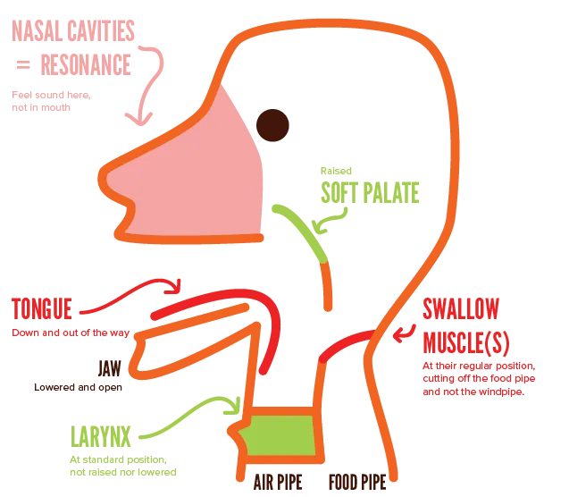

Well done! You've finished the guide on proper vocal technique!

Here I just want to recap all you've learned. A quick summary, as a reminder and a reference.

## The training process

Train _habits_ through daily exercises. When actually performing, forget all that. Don't think about technique at all.

Train in this order:

* Breath support. (Relax abs to let it in, compress abs to control the flow out.)
* Relaxation. (Make sure no other muscles are tense before singing.)
* Onset. (Make sure you can immediately, cleanly start a note.)
* Articulation. (Strengthen your jaw and tongue, so they support your speech, instead of blocking it.)
* Pitch. (Find your range, smooth breaks, and hit each pitch perfectly.)
* Timbre. (As you get more control, play with vibrato, timbre, sound, etcetera)

It's better to do vocal exercises regularly (but short), than to do a huge session once in a while. For example, do a few minutes when you wake up, and a few minutes after dinner. That's all. Doable, right?

Most issues come from bad habits and fear. Bad habits can be lost by _not doing them_ (once you're aware) and overwriting with good habits. Fear comes from a mindset, usually one of overthinking. Learning to "let go" is a crucial mindset for singing (and speaking, to a lesser extent).

## What every part should do

Let's revisit that picture from the start of the guide. The one with all the parts used when singing. What have we learned? Where should they be?

**Vocal chords:** they should connect nicely when making sound, and completely unconnected otherwise.

**Larynx**: should be in the same position as when you're relaxed, just breathing in and out. This is usually around the center of your neck, perhaps a bit higher. Keep it in the same spot, even when singing very high or low.

**Jaw**: down, open, loose. For good diction and a clear sound, your jaw should probably be way lower than it is now.

Don't _force_ it down. Through relaxation and control, allow it to just drop down as far as it wants. If you have good technique, it _should_ be just as easy to sing with only a slightly opened mouth. It's simply harder to control (and do freely), and will sound worse.

**Tongue**: out of the way (on vowels / sung notes)! Down and touching the lower teeth. When making consonants, the tongue should obviously just do what it needs to do. When at rest, the tip should rest against your upper row of teeth.

For good diction, exaggerate consonants and vowels, and make sure you actually _pronounce_ all of it. A strong tongue will also remove issues with swallowing.

**Swallow Muscles**: these should not be engaged in any way. Eating before or while singing is a terrible idea. Vocal exercises are meant to relax them.

**Soft Palate**: should be _raised_ when singing. (Automatically closes when eating or drinking something.) Lowering your jaw further, like a "yawn", will automatically raise it. You'll notice if it's up, because the sound travels higher into your mouth, to that "mask" we talked about. When closed, it will not, pinning the sound inside your throat.

## Conclusion

That's it! Hopefully this taught you great exercises that will improve your voice. If something isn't clear, let me know. If you want more information on something, let me know.

As I said, I'm not an expert or a vocal coach. But as the plentiful anecdotes and examples show, I've been trying to improve my voice---despite severe health issues---for almost two decades. What I explain in this guide, is hard-earned knowledge about what actually _worked_ (and surely _did not work_).

If you recorded some beautiful song with your newfound vocal freedom, send it to me :) I'd love to hear the results.