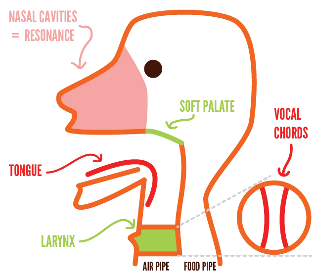

This is a more technical part of the guide. But I wanted to start with it so I can refer _back_ to it in all subsequent chapters. Because every element is important to understand.

Essentially, singing is just "exhaling with purpose". You exhale. The air travels past your vocal chords, which modify the sound by how they are shaped. Longer folds means a higher note. If they _barely_ touch, your voice becomes a whisper.

Below is a (very simplified) drawing of all the components

## Vocal chords

A group of muscles controls two "vocal folds": one left and one right.

When you breathe, they are far apart. Air can pass through without obstruction.

When you sing, they are pushed together to create pressured air waves (some parts are compressed, others stretched). That's the definition of sound!

Stretching them creates higher pitches. As such, singing _higher_ just means training your muscles so they can maintain a far stretch. Conversely, each person has an absolute _lowest_ note they can sing. Your lowest note is when the folds are completely loose, and not stretched at all. You can't, magically, make your folds _even shorter_ than that.

When your folds are irritated or hurt, they usually can't close properly anymore. Either because their lining is rough (so they don't fit perfectly together), or the muscles around it are just too tired.

## Voice box (larynx)

This _holds_ your vocal chords. It's called like this because it has the shape of a box.

This can move up and down the neck. Men can easily spot it ("Adam's apple"), women less easily.

It's normal, relaxed position is roughly halfway. You can actually push it even _lower_ (if you want), though must people pull it _higher_ (especially when they try to sing higher).

This changes your tone and creates more tension.

## Jaw

I was tempted to say "mouth" here, but that was too vague.

In my experience, many singing problems are actually _jaw problems_ (or _tongue problems_). People can hold a tune. Their vocal chords are strong and able. They have solid breathing.

But their _jaw_ just tenses up. They barely lower it, which makes it really hard for sound to come out (cleanly). Sometimes, this means people trained themselves to sing through their _nose_ (because their jaw is closed that much). This isn't great, unless you are a country singer.

Many relaxation exercises specifically allow you to _drop_ your jaw down easily.

As always, it's about relaxation. I spent a few years _forcefully_ pushing my jaw down ... but that is just as bad, as it adds that dreaded _tension_.

## Tongue

Your tongue is responsible for articulation: sounding vowels and consonants clearly. At the same time, your tongue can completely block sound from escaping.

This means a _strong_ and _flexible_ tongue is crucial to singing. It's just a giant muscle, so it can absolutely be trained.

The issue with people who slur their words is, usually, a weak tongue. It just isn't strong enough to move between all the positions, so every sound blends together, while all of it is a bit "muted".

This part will get a lot of attention as well.

## Swallowing Muscles

These are located just below your jaw---the bridge between your neck and your head.

When you swallow, you'll notice your larynx moves up. (And other parts of your mouth change, to block your air hole and open the one that accepts food :p)

This reveals that you do _not_ want these muscles engaged when singing. If you feel these, swallow once (exaggerated) to clear your throat.

This is why singing right after eating, or eating the wrong thing, can be really difficult. 

## Soft palate

The what now? This is a crucial spot on the roof of your mouth, around the back. (The front part is called the _hard palate_)

This one also moves when you swallow. It _closes_, to prevent food or drink from entering your nose. (Very annoying, very painful.)

When singing, you want it to be open. So the sound can travel freely around and resonate inside your whole skull.

This one is hard to train or explain, as you can't clearly _see_ or _feel_ it. You will notice when it opens---which hopefully happens after some exercises. Your mouth will feel more open and spacious, and your tone more full.

## As always

Don't try to memorize all this. Don't try to improve all these at once. This is just a primer, a reference to which you can return while reading the rest of the guide.

It's good to understand all the different parts. How important they are and when they might come into play. But from now on, we'll go to practical exercises that _target_ these parts.

Let's start with the obvious first step: breathing.