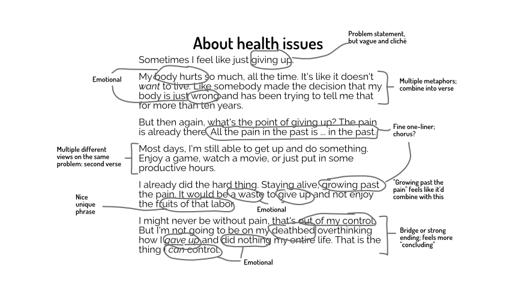

Last chapter talked about putting lyrics to a melody you already have. Now we start with lyrics and try to put a melody to that. (And, finally, bring it all together by applying the principles of songwriting once more.)

## You have lyrics, what now?

Now we assume you have a finished text. Maybe a poem, maybe an existing one. It might be the whole song, or just the chorus.

But you have some finished (polished) text that should become lyrics, set to music.

What to do? You can't create the melody from scratch, using what I've taught. Because the notes need to follow the lyrics you already have.

Sure, you can use such a melody as a starting point. But you'd _still_ need to be able to manipulate it to match.

In these cases, you add a **hierarchy** to your lyrics.

## Hierarchy

In the [Rhythm](../rhyhtm-I/) chapter, I explained how songs subdivide into smaller and smaller sections. This needs to happen anyway. If you don't do it yourself, you'll just _accidentally_ create some structure in time.

So do the same for your lyrics. Divide it into ...

* Sections (verse, chorus, bridge, outro, ...)
* Phrases (one sentence sung between breaths)
* Optional: measures (parts within the sentence that stand on their own)

This reduces your problem to something simpler: you have _one_ phrase to set to music. Once you have the melody for it, you can copy, repeat and rhyme for subsequent phrases.

Additionally, you can divide the text based on importance or emotion.

* Find the sentences that are _most emotional_ or _most important_ => these should probably be your chorus.
* Find single _words_ (or sounds) that are emotional => these are probably the highlight of your verse. (The highest and most attention-grabbing note in the verse melody.)
* Find good start or end words => some words sound like an accident if they start or end a phrase

By filling in these details, your lyrics slowly turn into a hierarchy of tiny repeating pieces. This reduced your problem to one about finding a few melodies to _fit those pieces_.

{}
It's like revising a book. You go over the text and mark all the places where you could stop a sentence, or where a new paragraph should start. You also mark the most important (emotional) passages, to make sure you keep them and perhaps increase their emotion further. Once you have all these markings on the page, they are basically an easy list of "fixes" or "changes".
{}

Below is an example. I quickly wrote down some thoughts. At this time, my chronic health issues were really playing me apart. So I decided to pick that as the topic and wrote a few paragraphs. Freely, without a melody or song in mind. 

Then I structured it, wrote down what's important. 

Then I turned that into a more lyrical format. I tried to make sentences the same length, tried to add rhyme, used the most powerful words where possible. Hopefully, while reading the second version, you can already hear some possible melodies in your head that would fit. It's that _priming_ again: you put your text into a format that makes it very easy for your brain to associate music with it.

{}
Sorry about the slightly depressing example. You don't have many happy examples if most of your life has been about fighting illness with everything you have. Pretend I wrote a text about being extremely in love, or something :p But I've been telling you to put emotion and personal story first, so it'd be wrong if I lied to you with some made-up example.
{}

## Tug of war

It's unlikely that any text you wrote will perfectly transfer to a set of melodies. (Unless you're already experienced at writing poems or lyrics. Then you automatically stay true to a rhythm or meter, perhaps subconsciously.)

This means a **tug of war** takes place between lyrics and melody.

They'll both influence each other. They'll both need to reach a compromise in many locations. Sometimes you need to rewrite that one sentence because it's just too long. Other times, you can't just repeat a melody because it wouldn't fit the next phrase.

Which side wins depends on your preference. If you want the song to be more about lyrics or more about melody. If _you_, as a musician, are more about language or music.

## Applying the principles

Let's bring it all together.

* When writing lyrics, focus on things that _sound_ good and emotional. 
* Meaning comes later. Proper grammar comes later. Don't preach or teach; _explore_ a personal feeling or topic.
* Use rhyming schemes. It's not childish---it sounds better than not doing it.
* Subdivide your lyrics into sections, phrases, and most important / least important. Now that you've broken it down, you can more easily write melodies for those smaller parts. Let exciting notes fall on exciting words. Let safe and weak beats fall on the least important words.
* Use patterns. For example, you might start every sentence with the same word. Or you might end every verse with a _similar_ sentence, but one or two words changed.

As always, the _patterns_ are the general truth holding it all together. Good lyrics don't just rhyme their last word, nor do they repeat an identical sentence 8 times in the chorus.

They vary a lot, but add structure through patterns.

### Landslide

The first example that sprang to my mind is "Landslide" by Fleetwood Mac

> Oh, mirror in the sky, what is love? 
> Can the child within my heart rise above? 
> Can I sail through the changing ocean tides? 
> Can I handle the seasons of my life?

Nobody will call that melody or lyric _boring_ or _too predictable_. It's structured in way that's still varied.

* They're all questions. 
* Only the last three start with "can". 
* Only the last two start with "can I" and follow the same general structure
* *Love* and *Above* rhyme. *Tides* and *Life* doesn't rhyme, but it's close.

That's all you need to do. Find one sentence that works for you. Then repeat it, but change things slightly. Follow the general idea, but change words. Start with the same words. Rhyme in the _middle_ of a sentence, instead of the end.

### Mr. Brightside

Everyone I know likes this song: "Mr. Brightside" by The Killers. 

Nice to listen to, nice to sing. The lyrics find a nice balance between just _sounding_ good (but repeating themselves or being slightly meaningless), and actually conveying a clear idea.

The verse,

> Coming out of my cage 
> And I've been doing just fine 
> Gotta gotta be down (_repetition!_) 
> Because I want it all 
> It started out with a kiss 
> How did it end up like this? 
> It was only a kiss, it was only a kiss (_repetition!_)

We immediately start with a clear picture and situation. The lyrics focus completely on _emotion_, nothing else. No setup, no complicated sentences to explain something. ("I've been doing _just fine_", "because I _want it all_", "how did it _end up_ like this?")

The chorus,

> Jealousy, turning saints into the sea 
> Swimming through sick lullabies 
> Choking on your alibis 
> But it's just the price I pay 
> Destiny is calling me 
> Open up my eager eyes 
> 'Cause I'm Mr. Brightside

Many unexpected rhymes. Some longer words. The first line is _great_: immediately relatable, without being cliché.

Also notice how both verse and chorus rhyme at some places ... but not at others. That's skillful application of the principles: repetition & variation.

Finally, you can understand what he's saying. The general message and emotion is clear, but it's not _stated explicitly_.

### Final tips

Some final tips.

* When rhyming, don't be predictable. Choose a word that won't be the expected rhyme by 100% of the listeners
* Create play between words and notes. For example, if a note is _low_ ... place it on the lyric "low"!
* Find a balance between _literal_ and _figurative_. Use poetic language or comparisons where necessary, but don't overdo it. You'll sound pretentious. (See "Landslide" again. All the sentences are metaphors, but they're easy to understand, and not so far removed from a literal thought.)