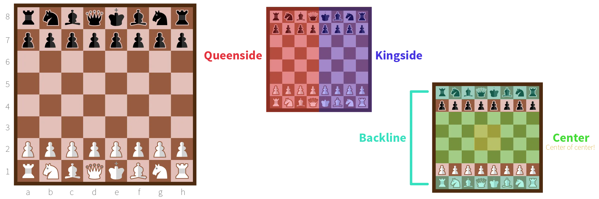

The chess board is a collection of squares: 8 columns and 8 rows. That means there are 8 x 8 = 64 fields on which to play. Do not mistake it for a checkers board---that is 10 by 10.

To clearly reference fields, we _label_ them.

* The rows are numbered **1** to **8**. Sometimes they are called _ranks_
* The columns are lettered **a** to **h**. Sometimes they are called _files_.

This has no influence at all on a game. It's just for reference. To help notate a match, or so that I can easily teach you rules or positions in this course 😉

The squares alternate---both horizontally and vertically---between black and white. (Or another contrasting colour combination. I have one board with red.)

This is the *checkers pattern*. It helps distinguish the individual squares. It also makes tactics and strategy easier.

{}
For example, a bishop can only move diagonally. So they'll always stay on squares of the same color. If you know the opponent only has a light-squared bishop left, you only have to focus on that part of the board!
{}

## Setup

In the image, the starting position for black and white is shown. This is the setup at the start of every game. 

How to remember this?

* The *queen* always starts on a field with the *same colour* as herself. So white queen on white square, black queen on black square.
* The *king* is always in the other central square, next to her.
* And then it's bishop, knight and rook; mirrored left and right.
* The other row is all pawns.

## Areas of the board

Different areas of the board also have their own names. 

-   **Queenside:** the four columns at the side where the queen starts the game.
-   **Kingside:** the four columns at the side where the king starts the game.
-   **Backline:** the last row of the board, where the kings start. Sometimes also used for the last two rows of the board.
-   **Centre** (or center): the middle rows of the board, numbers 3 to 6. The four squares in the centre of the whole board are generally regarded as the most important ones in the whole game. You want to control them, and never let go.

This, again, helps quickly see or describe tactics or ideas.

{}
Players often count how strong the opponent is at each side. If they have fewer pieces on the kingside, well then, let's focus our own attack on the kingside!
{}

{}
Pieces at the backline are usually very safe. They are probably behind other pieces, they cannot be attacked from the back, they are furthest away from the opponent. Conversely, pieces at the centre are very vulnerable and open, but this also means they have the most attacking options!
{}

All of these examples are just previews. We go more in-depth in the rest of the course, but it helps to clarify definitions and terminology. Otherwise I'd have to interrupt the course later to explain things like this. Now you already have time to think about and understand these terms.

## Stages of a Game

We distinguish three stages or "phases" to a chess game.

-   **Opening:** White starts. Both players are building their defence, making room for pieces, setting up solid structures. Maybe they will attack a pawn or threaten a piece every now and then, but nothing major. Many standard openings are known by professional chess players. It usually depends on the opponent what they choose to use.
-   **Middle game:** Both sides have their basic setup done. This is the longest phase, and where the most interesting things happen. Your options are endless: play defensive, offensive, improve position, slowly but steadily advance pawns, etcetera.
-   **End game:** Many pieces have been captured. Some defensive structures have been destroyed. Both players are left with a handful of pieces, and one of them usually has a clear advantage (more pieces, a better position, etcetera). If that player is smart, he wins the game in maybe ten or twenty moves. If he isn't smart, or he is too careful, the opponent may turn the odds by a very good move (which is possible, because the game is so open).

Now it's finally time to learn all the pieces and their capabilities!