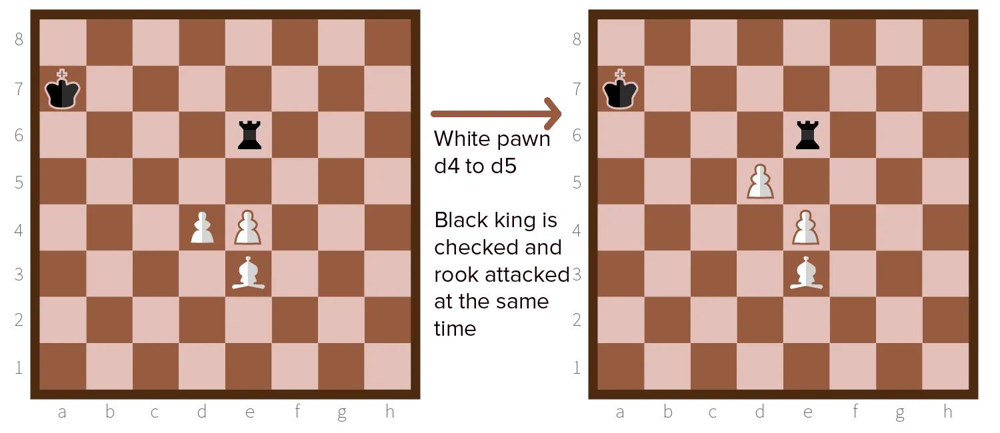

Unlike the fork, discoveries need **two** attacking pieces. In a discovery, you move one piece (**unmasking piece**) out of the way of another (**unmasked piece**). This unleashes an attack on two enemy pieces at the same time. 

* The unmasking piece has moved to a threatening spot
* The unmasked piece can now see further and capture something

The enemy can only protect one---you take the other. As you can see, it takes more work to set up this kind of attack, but it's therefore also easier for your opponent to miss.

## How do I do it?

Discoveries can be done by **bishops, rooks, knights** and **pawns**. Queens can also be involved, but only in *check discoveries*.

The most common ones are with *bishops*, either as unmasking or unmasked piece. Bishops have a very wide range of attack, which is usually only limited by your *own* pawns or pieces. 

That's why moving one of these out of the way suddenly unleashes as bishop.

For the non-diagonal attacks, *rooks* are the way to go. They are usually pointed at the opponent's king or queen from the back rank, with, again, your own pieces covering their eyes. Move that out of the way, and you can launch a discovery.

*Knights* and *pawns* can only be used as *unmasking pieces*. 

Why? Knights can jump over pieces and pawns have only a one-square attacking range. You can never *change* their attacking range! 

Nevertheless, moving a pawn forward to launch a discovery is usually a better plan than using two pieces in an attack. You want your pawns to move forward anyway, and they are worth less than any piece (in case things go wrong).

## Check discoveries

Just like forks, the most powerful type is a **check discovery**: one of the threatened pieces is the opponent's king.

The king has to move, which means you can freely capture the other piece you were attacking.

Check discoveries are the only moment you can (and should try to) use your *queen*. The queen has the most wide attacking range of them all, which means she makes it easy to set up a discovery. Usually a knight in front of your queen is moved away to check the enemy king.