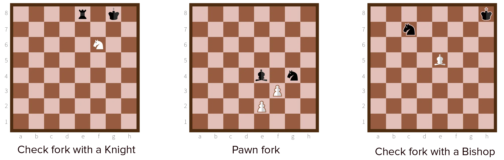

Forks are the simplest method for placing a double attack. A fork is nothing more than placing a piece such that it attacks two pieces at once. No other piece is involved---just this single forking piece.

Therefore, being forked by your opponent is something you can (and should) see coming. Losing a piece to a fork is regarded almost as bad as losing a piece because you were careless. You can use this to your advantage: even the *threat* of a fork will force most opponents to do moves they don't want to do.

## How do I do it?

The fork can be executed with all pieces and pawns, except for the king of course. A fork doesn't have to be a one-move thing. It's perfectly possible to spend 2 or 3 moves building up to the fork, because the reward is worth it: you capture a knight, bishop, rook or even queen.

The most common forking tool is the **knight**. The fact that it has an odd way of moving, and can jump over pieces, makes it possible to attack two pieces at once while not being threatened yourself. 

{}
There's even an opening where you start with bringing your knights out. Within a few steps you can fork the opponent's king and rook, which means you win a rook!
{}

After the knight, the most common forking tool is actually the **pawn**. Sometimes the opponent will place many pieces into the centre of the board. Relentlessly pushing your pawn forward will eventually attack two of them at once. To resolve such a fork,  the opponent will usually just capture the pawn, so always cover it with another pawn.

The **bishop, rook** and **queen** have similar forking capabilities, all of them of minor use. It's hard to find opportunities to fork where you actually gain a points advantage. 

{}
A bishop will usually be impeded by pawn structure and knights pointed at the center. This means the opponent could simply capture your piece if you try to fork. 
{}

{}
Similarly, the rook and queen are very valuable pieces, which are better at directly attacking the king or another piece than forking.
{}

## Check forks

The most **powerful** fork is obviously one that **checks the king**.

This forces your opponent to solve the check and leave the other piece in the fork where it is. Which means a free capture for you!

If you look for this, you'll find it more often than you think.

*Why?* Because when players see that you have the ability to check them, they only see that there's a way out, and they're happy. (Maybe there's a piece they could put in the way, free squares for the king to move to, etcetera.) They don't bother checking for forks that would create issues.

This ties in directly with what I said in the [Tactics & Strategy](../tactics-and-strategy/) chapter. Make your only objective to checkmate the king. On every move, at least *look into* opportunities to put the king under pressures. You will find check forks, or prevent check forks against you, which are very powerful tools.