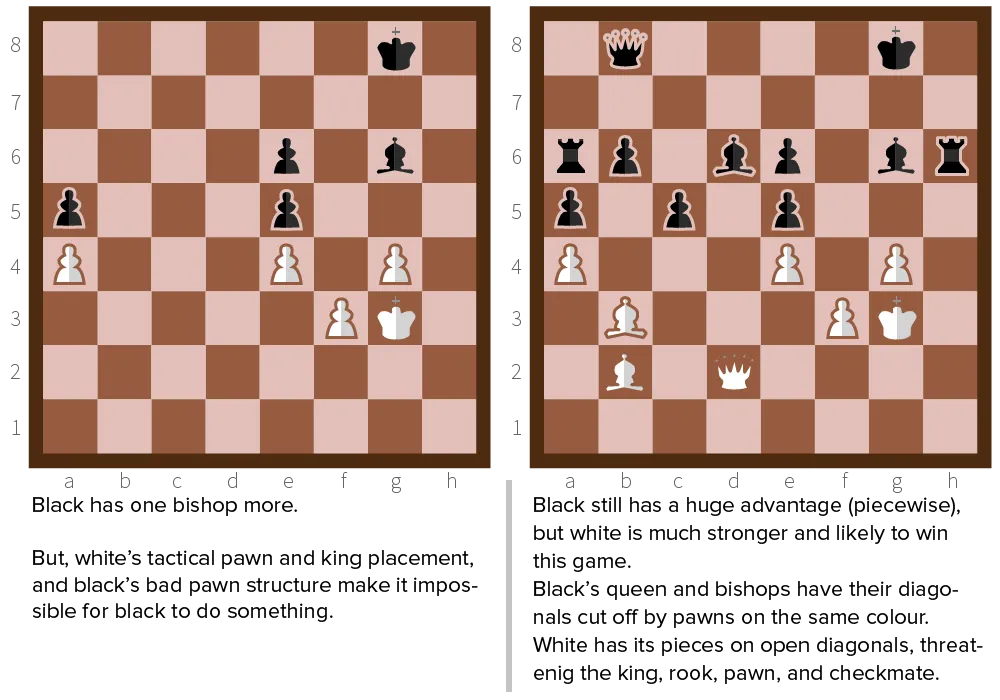

I thought about this for a long time. Should I include this information in a chess course only about _fundamentals_? It is quite an advanced and detailed strategy, but I eventually decided it was important enough to mention.

**Light** and **Dark** squares simply refer to the colour of the squares---white and black.

Many pieces move or capture diagonally. And what does that mean? That they **always** stay on squares of the same colour! 

A pawn on a light square, will only be able to capture or guard pieces on light squares. A bishop on a light square will stay on the light squares for the rest of the game. If you're able to restrict horizontal and vertical movement, the queen will also only move through squares of the same colour.

Conversely, a knight always alternates between *light* and *dark* squares. If he's on a light square, any move will bring him to a dark one, and vice versa.

Because of this close relationships between pieces and the colour of the their squares, you can use this information for simple tactics.

## Defensive

Especially near and during the endgame, the light-dark square tactic is important. If your opponent has pieces that work (mainly) diagonally, you can render them _completely useless_ by placing your own pawns, king and perhaps other pieces strategically.

{}
The opponent only has a dark-squared bishop. Create your pawn structure on the dark squares. Put your king on a light square. And voila: your opponent can't do _anything_.
{}

{}
If you place a bishop running through the center early on in the game, it will be hard for your opponent to build and develop. The only pieces that can cross that diagonal line are the rooks, and they are still locked in their position. 
{}

{}
If you place your knights just outside the center and on two squares of different colour, you are able to jump to and defend any colour in case of an attack.
{}

If the opponent builds their attack diagonally, your rooks are of no use, and may even work against you. If you have focused your defence on the right colour, your rooks should be the pieces preventing the opponent from attacking via the other one.

## Offensive

The advantage of the light-dark square tactic is mainly offensive though.

First of all, there are so-called **bad bishops**. Those are bishops that can't really do anything because the squares of their colour are occupied or threatened. A bad bishop will usually stay bad for a very long time, and it is a good idea to exchange it for the **good bishop** of your opponent. 

The good bishop is the one that can move freely. It is on the same colour as your king. You don't want to run into an early check and have to move your king (and perhaps lose a piece). If that's not possible, exchange it with a knight.

Secondly, the strongest attacks are usually along one colour. Open diagonals can be exploited easily. They are the only major weakness if your opponent has a good pawn structure. The only way you could get lots of pieces gracefully working together is by focusing solely on one colour.

Preferably, the one colour that is the weakest link in your opponent's structure.