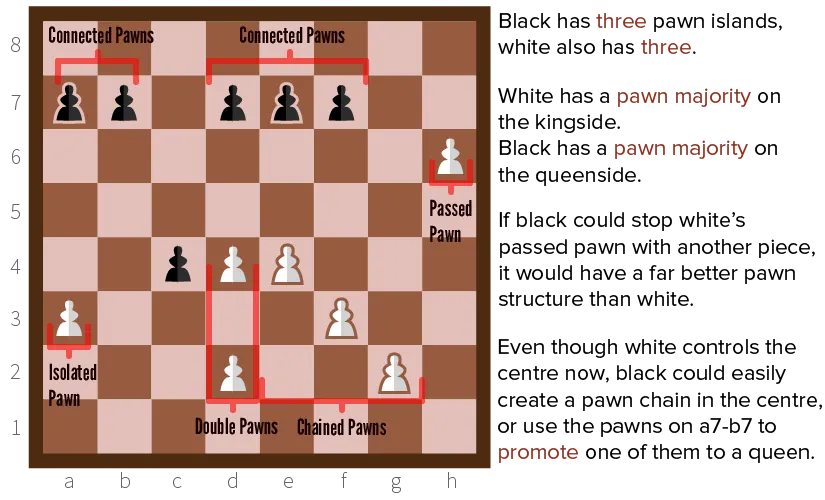

A grandmaster of Chess once said: "pawns are the *soul* of the game." Not queens, not the king, not any major piece---he was full of pawns. Of course, you have 8 of them, and they are at the front of the battlefield.

But why are they so special or important?

Because they are worth so little, but can do so much. A chain of pawns is the ideal defence, because no player wants to sacrifice their pieces (which are worth more) just to break through. 

A pawn that reaches the back rank can be promoted to the most valuable piece in the game: the queen. 

A group of pawns focussed on the center can seriously limit your opponent's movement options. 

That's why you should always strengthen your **pawn structure**. And break the enemy's pawn structure.

I'll first introduce the concept of *pawn islands*. Then I'll discuss three types of pawns you **do** want to have, and two types you **don't** want to have.

## Pawn Islands

Pawn islands are groups of pawns, isolated from each other. A pawn is isolated if there's no pawn in the 8 squares around it. The rule here is:

> The fewer pawn islands, the better.

A group of pawns will always be able to guard each other, or attain such a position within one or two moves. It therefore creates an impenetrable fortress on that part of the board. 

On the other hand, if a pawn of yours is lonely, it is often unwise and hard to guard it. It will be captured easily. The best pawn structure is one consisting of a maximum of 2&ndash;3 islands. 

The most ideal structure is one where all pawns are **connected** and / or **chained**.

## Connected Pawns

Pawns are connected if they stand right next to each other. They not only threaten the four squares in front of them, the squares they occupy are also considered **strong squares**. 

*Why?* Because if one of them is threatened, it only takes a single move to solve the problem. Step one pawn forward, and now you have *chained pawns*.

## Chained Pawns

Pawns are chained if they are offset diagonally, such that every pawn is defending another. This creates a chain that starts from the pawn that is most to the front, and ends with one pawn in the heart of your defence.

Chained pawns are actually _weaker_ than connected ones.

* They threaten fewer squares
* They leave a diagonal gap.
* That one pawn at the heart is an overworked piece.

As such, at least ensure you guard that last pawn in the chain very well. If that one falls, the whole structure crumbles and your defence is almost lost.

As such, _don't_ chain pawns unless you _have to_. By keeping pawns connected, you keep your options open, and the opponent guessing. Chaining pawns prematurely actually shows your hand and reduces your options.

## Passed Pawns

Passed pawns are pawns that won't get into trouble if they walk right into the opponent's defence. There is no enemy pawn on their file or the ones right next to it. An opponent will rarely sacrifice a piece for a pawn, which means passed pawns are relatively safe and can do a lot of damage if used properly.

## Double Pawns

We speak of double pawns if there is more than one pawn (of yours) on the same file. This can happen over the course of the game when a pawn captures something.

Double pawns are *dreadful*. The pawn at the back is completely blocked by the one in the front. It's almost useless, as it also can't defend the pawn in front of it. They also leave vertical gaps in your defence.

They are only good if you have double pawns in the center or near the opponent's back line. There, they can wreak havoc with the four squares they threaten.

## Isolated Pawns

Isolated pawns are lonely pawns. They can't receive support from your other pawns (because they are more than one file away), but they also can't just walk through your opponent's defence because they *do* have a pawn that can block it. 

You **don't** want to have these.

It usually means you will lose that pawn, somewhere during the game, and won't be able to gain anything from it.

## Pawn Majorities

In the endgame, having a **pawn majority** becomes very important. If you have more pawns than your opponent at the kingside/queenside, you can simply burst through their pawn structure by force. This weakens the opponent's defence. And if you're lucky, you can promote your leftover pawns or use them for checkmate.

In general, you want to keep your pawn structure strong and intact during the opening and middle game. But, if you find a way to safely advance your pawn into enemy territory, you should do it. An advanced pawn can restrict the opponent's options and aid in devastating attacks.

Also, timing is crucial in advancing your pawns. If you start the game by advancing all of them ... you might create an intricate pawn structure, but there's acres of space behind it and not much to guard the weakest links in the chain. 

Only advance a pawn if it can be done safely, which sometimes means one or two pawns enter the game very, very late.