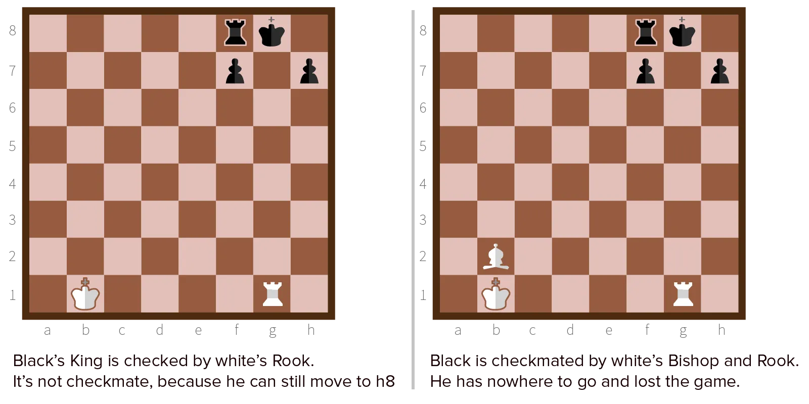

You start each chess match with 16 pieces: 8 pawns and 8 other pieces. The pawns are very limited, but also very powerful when they work together. 

The other pieces have more movement options, but it's harder to make them work together. They are:

-   One king.
-   One queen.
-   Two bishops.
-   Two knights.
-   Two rooks.

Sometimes, the king, queen and rook are called **major pieces**. And the bishop and knight **minor pieces**.

Let's study the legal moves everything has!

## General Rules

All pieces ...

-   Can end on an **unoccupied square** without problems
-   Will **capture** a piece, if they land on a square occupied by the opponent
-   Can **not** end on a square already occupied by yourself
-   Can **not** jump over other pieces. (The knight is the exception.)
-   Don't change their movement depending on if they capture or not. (The pawn is the exception.)
-   Are **not obliged** to perform a capturing move if it is available. You can choose, unlike checkers.

Your move can never result in a position that leaves your king is checked.

Always remember: *if the opponent captures your king, you've lost the game*. So, never move the king to a spot where it can possibly be captured, nor move other pieces such that they leave your king checked.

## King ('Infinite points')

{}

Your most important piece. Protect it at all costs. Allowed to move **one square** in **any direction**.

The king should always be safe. It has little offensive use. You should therefore keep it at the backline, preferably a bit to the left or right. The only moment you should start moving your king or getting it involved is at the _endgame_, when there aren't many pieces left that can attack it.

## Pawn (1 point)

{}

Allowed to move **one square** horizontally, but only forwards. But pawns are a bit special. They have _two_ exceptions to the general rules:

* Is it the first move? It's allowed to move **two squares** instead of one. This isn't required, it's optional.
* The pawn cannot capture pieces with its movement. Instead, it has a special capture movement: **one square diagonally**.

At the beginning of the game, your pawns form a brick wall, and are one of the only pieces that can move. Most games, therefore, start by pushing pawns forward, trying to control the center _and_ open the door for your major pieces. (Pushing the pawn on the **d** or **e** file forward is a common opening move.)

Because pawns capture diagonally, you can create intricate "pawn structures": a chain of diagonally placed pawns protecting each other. It's also a good idea to make the king hide behind a wall of pawns.

## Bishop (3 points)

{}

Allowed to move in a single direction **diagonally**, as far as you want. You can move it one square, or two squares, or as many squares as possible. Your choice.

Note the words "single direction". It cannot change direction halfway the movement, or bounce from the edge of the board like it's a ball. As soon as it hits another piece or the side of the board, it has to stop.

Together with the knights, you want to get this piece away from the backline and into the center as quickly as possible. Another option is to *point* them towards the centre, to control it from far away.

## Knight (3 points)

{}

This one confuses people at first, but is actually very simple. 

It moves **one square diagonally**, followed by **one square horizontally/vertically**. 

Or an alternative view: it can move in an **L** shape in all directions. 

You can check if you got it right this way: 

> The knight should always land on a square of the opposite colour as the one he started on.

The knight is the only piece that can **jump over other ones**. That, combined with its odd L-shape movement, makes it hard to predict or defend against. 

However, they have a limited range. Even more so when they are positioned to the sides. They are therefore seen as equally useful as the bishop.

Working together, knight and bishop are the life of your army, and should be the ones breaking through your opponent's defence.

## Rook (5 points)

{}

Allowed to move in a single direction **horizontally** or **vertically**.

When the game starts, they are tucked away in the corners. It will take some time before they get involved in the game. They are therefore mostly used in the endgame, when most of the other pieces are gone. 

But, don't think that you should leave them alone until then. When you find the space, get them out of the corners to support pieces from the backline. 

## Queen (9 points)

{}

By far the most powerful piece. Allowed to move in **any** single direction.

Losing the queen usually means you've lost the game. Therefore, it is advised to not bring the queen into the battlefield until the mid or end game. Her starting position is at the backline, in the center, which is (for the queen) an ideal position when opening the game. Getting

Generally speaking, keep the queen close to your king. It is called the queen for a reason. She has to stand alongside the king, protecting him, working together to withstand the opponent's attacks.

{}
Yes, in a sense, a queen is a bishop and rook in one. It can move diagonally, horizontally and vertically in a straight line, as far as she wants.
{}

## What's with the points?

They are guidelines. Every piece is assigned a value based on how much it's worth in general, when it comes to offensive and defensive strength. This system is used to teach people about whether to capture or not.

Capturing a queen with a pawn is terrific. You've removed a 9 point queen with a 1 point pawn!

Capturing a rook with a bishop is also considered a good trade. You are now 2 points ahead of your opponent.

However, capturing a knight with a bishop, should only be done if that knight is harmful. The points are equal, so the only reason to do the capture is if that knight was being annoying. (Threatening your queen, checking your king, defending its own king, etcetera.)

Do note though, that these "rules" can be ignored in favour of a greater plan. If you have a solid plan to checkmate your opponent by sacrificing your queen, go ahead!

## Checkmate Example

Now that you know the pieces and what they do, I can explain the concept of check and checkmate again. This time with an image!

