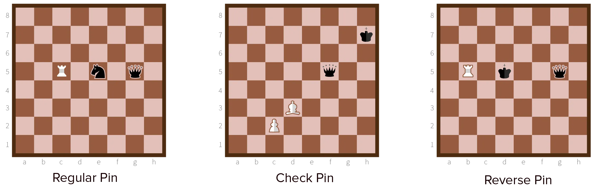

All information so far is usually known by novice chess players. Most people are somewhat familiar with the rules, the board, and some simple strategies for playing.

Let's now go beyond that! Forks and discoveries common. But the **pin** and **reverse pin** are a level higher.

A pin involves one of your own pieces and **two enemy pieces** on the same diagonal, horizontal or vertical line. 

> Pin = place your piece such that it runs through both enemy pieces (**pinned** piece and the **target** piece), but can't be captured. 

If the opponent moves the piece in front, you capture the one at the back, and vice versa. Usually though, the target piece is more valuable than the pinned one.

Such situations are hard to find, if they occur at all. But it is a more valuable tool than forks or discoveries.

*Why?* Because the pinned piece can't (or probably won't) move. The opponent likely won't just give a more valuable piece to you. 

Therefore, pinning a piece means it is fixed to that square and can't do any defensive or offensive work. You've basically taken it out of the game, without actually capturing it. The opponent will try to resolve this by adding backup for the pieces, or move the target piece out of the pin.

* In the first case, you can respond by adding more backup yourself. If that's not possible, you can try to use your move to exploit gaps your opponent has left by creating that backup.
* In the second case, the pin is gone. The only thing you can do is capture the *pinned piece*. Or forget about it and start planning something else.

## How do I do it?

Pawns and knights cannot help here. The same is true for the queen or king, because they are the most valuable pieces and will therefore not benefit from a pin. This leaves the **bishops** and **rooks**. Which is only logical: pins can only be created on the same diagonal, horizontal or vertical line.

Bishops are the most common pinning tool at the start and during the game. Rooks are used, instead, in the endgame to form pins with the enemy's king. Which brings us to...

## Check Pins

A **check pin** has the king as the **target**.

These pins are very powerful. You are now _certain_ the pinned piece can't move! That would check the king, which is not allowed. 

The opponent can only move the king to resolve the pin. Not only are you then able to capture the pinned piece, it also forces the enemy king into a bad position.

## Reverse Pins

These are exactly what the name implies: the most valuable piece is at the front, while an equally or less valuable one is at the back. Roles of the pinned and target piece are reversed:

* The opponent will probably opt to move the front piece (which is a queen, king or rook) out of the way. 
* Then you can safely capture the piece at the back. (Usually a knight or bishop.)

Again, a **reverse check pin** exists. Because the king is the pinned piece (and not the target), you are now _certain_ that this piece will be moved, and the target opened up.

## Creating Pinning Opportunities

Sometimes, a pin is available, but the pinned piece is able to *bite back*. It can just capture your piece if you decide to do the pin. 

It's usually still wise to capture the pinned piece. The opponent will have it guarded and recapture yours with some other type of piece. Now the same pin is still there, but with different pieces that you can take advantage of.

Other times, a pin is almost possible, but the opponent's king just needs to move one step. Then you can simply use a check or other threat towards the king to force it to move. The opponent will probably move it out of the way in a random direction without thinking too long. If you're lucky, you just created a pinning opportunity!