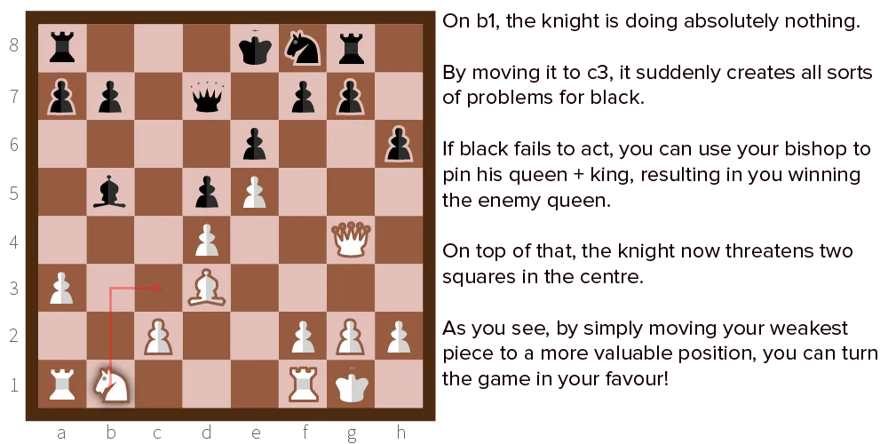
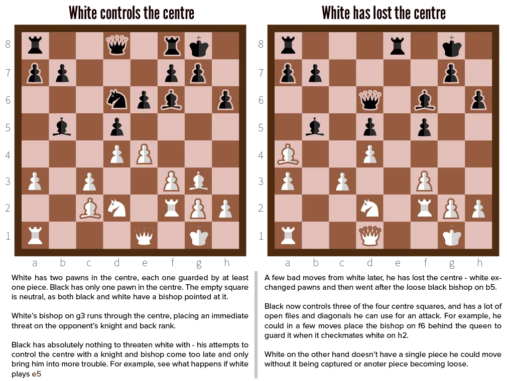
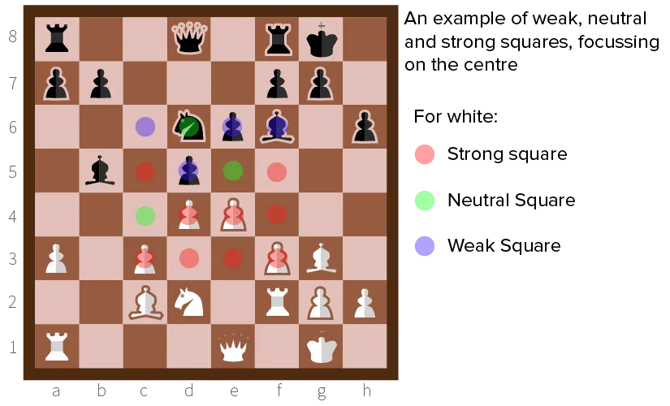
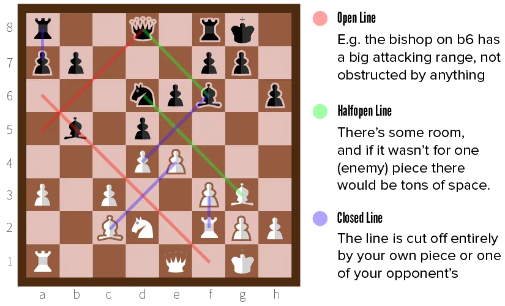

Positional play in chess is one of the main skills that separates the grandmasters from the rest. Most people are inclined to launch their pieces forward quickly and start assaults on the opponent's most precious pieces. This aggressive tactic can be called a "playstyle", but a competent player will simply position so that your attacks are worthless, and then exploit the gaps you left.

That's when this concept of "positional play" steps in. It is based on only one single, very true principle.

## The Positional Principle

Remember this:

> Move that one of your pieces, which is in the worst plight. Unless you can satisfy yourself that you can derive immediate advantage by an attack. 

These words were said by Adolf Anderssen. (That guy from that first mating pattern from previous chapter.) They should be the first thing in your decision making process.

You basically choose between the same two options each turn: attack or defend. 

* If you can convince yourself that attacking is by far the best way to go, you should do it. If the opponent just captured one of your pieces or threatens to do so, attack the piece and/or resolve this problem. 
* But, if those are not the case, you should switch your mind-set towards positional play. Trying to attack or be agressive when there's nothing to be gained, is the easiest way to lose quickly.

Positional play is nothing more than finding the **weakest link** in your defence and moving it to a **better position**. 

Maybe there's a rook just sitting behind some other pieces, restricted in its movement and defending absolutely nothing. 

Or maybe one of your knights is in a dangerous position it doesn't need to be in. 

Go over all of your pieces and see which ones are doing the least or are in the gravest danger if not moved. Then find a better home for them.

## Applying the Positional Principle

There are three things you can do to improve a piece's position:

### Improve placement

Some suggestions:

-   Make it threaten/attack the centre
-   Move it out of a dead spot into one it could defend or attack
-   Rob the opponent of certain (double) attack strategies (like a fork or pin) by moving the piece out of harm's way and back  into your own defensive system
-   Reduce the amount of "safe squares" the opponent has.
-   Reduce the value of an enemy piece by closing off its attacking lines.

### Apply pressure
Apply pressure on a weakness in your opponent's defence.

A loose piece, a lonely pawn---any enemy piece that is in a bad position. 

Do note that this is positional play, which means you merely have to *threaten it*. If a piece is doing nothing, you can increase its value by making it attack anything, even a heavily guarded piece. Because from that moment on, this threat will make decisions for your opponent harder.

Even if you never really intended to actually follow through on the threat.

### Aid in an attack
Aid in attack, either one upcoming or one already begun.

If you look multiple moves ahead and see the opportunity for a brilliant attacking combination, you want to start getting all your pieces ready and involved.

Simply moving your rook a few squares without attacking anything will seem harmless to your opponent, while it might be the essential step in checkmating him.

### What if that doens't work?

If a piece cannot participate in the game---defence or offence---we call it an **inactive piece**.

Positional play is all about making all your pieces **active pieces**.

Below I'll explain some more ways to activate pieces.

## Controlling the Center

This is a recurring theme throughout this chess course. And for a good reason! 

Pieces and pawns in the centre have the most attacking possibilities, which means that the person that controls the centre has a very high chance of winning. 

A good pawn structure is usually decisive in these matters. (You will learn about that in the upcoming [Pawn Structure](../pawn-structure/) chapter.)

If you can move a piece into the center, or such that it _points_ to the center, it's almost always a good idea.

## Strong & Weak Squares

Every square on the board has a value for you: *weak, neutral* or *strong*.

* A **weak** square is one that is controlled by your opponent
* A **strong** square is one that is controlled by you
* A **neutral** square is one that is empty and under no influence of any kind by both players.

When I say "controlled", I mean that there's either

* A piece able to attack the square if neede
* Or a guarded piece that occupies it

If the piece that occupies it is not guarded, it is actually a *weakness* that the other player can abuse. Because it's a free piece to threaten or capture!

Things get nasty when multiple pieces from both players want to control the same square. Generally, the square is then said to belong to the one with the most pieces attacking it (e.g. two knights against one). 

But, say a square is controlled by a pawn. It would then be foolish to attack it with two rooks, because a rook is 5 points and a pawn only 1, so in that case the square is still considered strong for the player with the pawn.

*What can I do with this information?* Your objective with positional play is to create many strong squares for yourself. Leaving neutral squares in the process is okay---it's the weak ones you have to watch out for. 

Moving a piece should always upgrade a weak or neutral square, to a neutral or strong one.

## Open & Closed Lines

The three most valuable pieces---Bishop, Rook and Queen---all move in a straight line, as many squares as they want. 

* When they have that freedom, they are deadly. 
* But if they don't, even pawns can inflict more damage than them!

As such, you want these pieces on _open_ lines. Remove your own pieces, move it, whatever is necessary so it can see as far ahead as possible.

Conversely, don't let the opponent do this. Place your pawns, or cheap guarded pieces, to cover their eyes all the time. 

As I said, a rook on a closed line is more useless than a pawn, but a rook on an open line is almost the strongest piece in teh game.

## The King's Role

During the three different stages of the game, the king takes on a different role. Because the king must be protected and has limited attacking powers, using your king well has everything to do with positional play.

-   **Opening:** During the opening you should never move your king or make it possible for the opponent to check it. You want to bring out all your other pieces, and perhaps castle your king into safety.
-   **Midgame:** Still, your king is safe and it should stay that way. Your other pieces are strengthening the defence and fighting off the enemy, your king should not be used as a piece to guard anything, nor should it (or the pawns in front of him for that matter) change position.
-   **Endgame:** Fewer pieces left on the board, so the king has just become a more valuable. Leaving the king out in the open is a bad idea. Always keep it very close to other pieces, so it guards them, and they guard the king. When you don't see another positional move, get the king towards the spot where the last few pieces are fighting it out. Because now it's an extra piece for your army.

You should always consider your king. Even if you can easily see it is impossible for the opponent to threaten him in any way. If you don't have a better move, increasing the king's position at the right moment and in the right way can make all the difference.