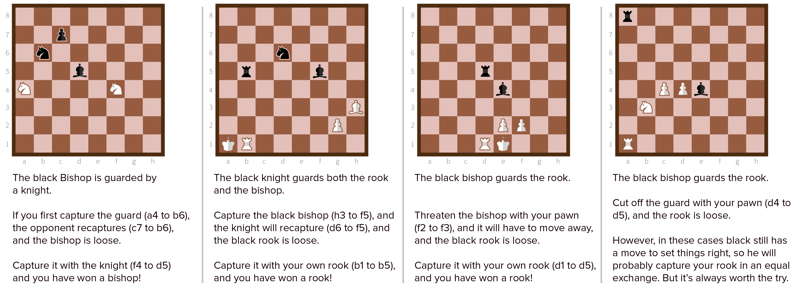

This type of double attack is last on the list. Not because it is the least important, but because it is the most advanced. If you see an opportunity for it in a game, it seems so simple and obvious. But if you're not looking for it, you'll never find it.

When you threaten an enemy piece, the opponent will usually refuse to move it. Instead, they move a different piece to **guard** it---to cover it. 

That's when a double attack opportunity arises. Because, if you can get the guard out of position or off the board, the threatened piece is immediately loose again and can be captured without consequences.

There are four ways to remove this guard:

-   **Capture it.** Simply capture the guard, and make sure the opponent can't recapture with another guard.
-   **Distract it.** Capture or at least threaten some other piece, which forces the guard to recapture or move away.
-   **Attacking it.** Forcing the guard to move by threatening it with something (of less value).
-   **Blocking it.** Putting a piece in between the guard and the guarded piece, which usually loosens both pieces.

In general, a great tip is to look for the **overworked piece**.

An overworked piece is one that has multiple defensive responsibilities. So, if you can get it out of the way, suddenly _multiple_ pieces are all hanging, free to capture.

If no such piece exists, you can create it. Threaten a few pieces that the opponent is likely to guard with the _same_ piece. (You can even make it look like they're a genius for so easily deflecting your attacks!) Now you've created an overworked piece and can take advantage.

This guard removal can be done by any piece (except for the king). It usually includes an exchange: both sides lose pieces of the same value, e.g. bishop for bishop, pawn for pawn.

What's the conclusion? Whenever your opponent introduces a guard, look for ways to destroy it. Because, as long as that guard lives, you can't take the piece you originally threatened.