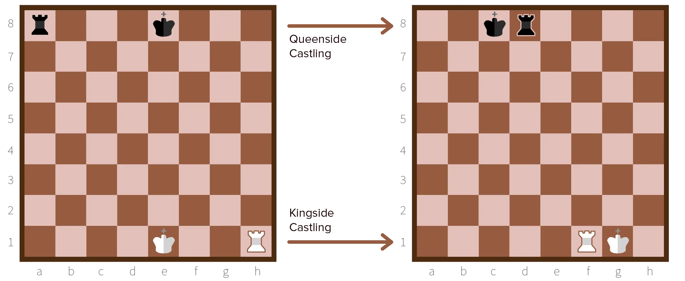
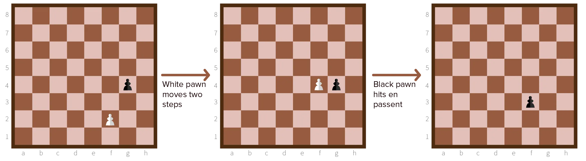
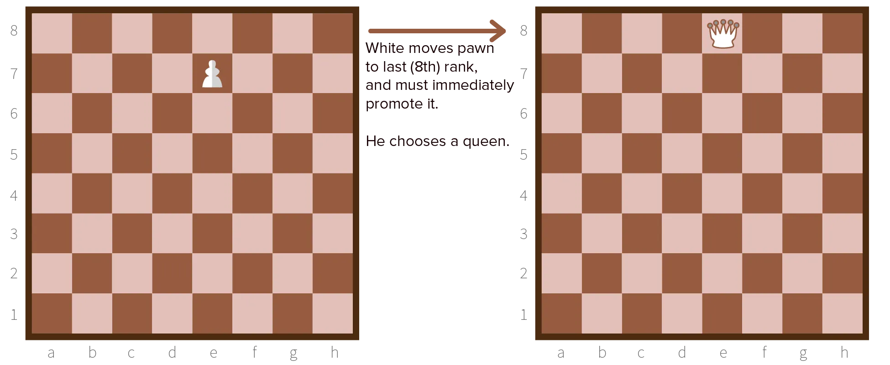

Once you play a few games, you will see that these rules are pretty great ... but can still lead to some undesirable situations. For example, because you can only capture, the board can quickly empty and many matches end in a draw. That's why, over time, special moves were added to the game of chess:

* Castling
* En Passent
* Promotion.

## Castling

I've explained how useful it is to lock away your king to the right/left. And to bring your rook out of the corner into the battlefield. 

With the current setup, however, it would take *a lot* of steps to get into that situation!

Therefore, a very useful shortcut has been created.

**Castling:** The act of moving your king 2 squares left or right, and teleporting the corresponding rook to the other side of the king. It's hard to explain in words, so please look at the image for clarification. 

To prevent people from overusing this trick, more rules were added. 

Castling is **not allowed** if ...

-   There's a piece between king and rook
-   The king is in check
-   The king or rook has been moved
-   One of the empty squares between king and rook are in check (*under attack*).
-   After castling, the king would be in check.
-   You've already castled.

Usually, the game starts by moving knights and bishops away from the backline. And then---at the first possible moment---both players castle. 

If you're a more offensive person, you can save it for later and use that move to setup an attack. Just make sure you don't move your king or rook, and you can castle any time you want in the game.

## En Passent

Pawns can get locked very easily. They can only move forward, so they can only get on another file if they diagonally capture something. 

If that doesn't happen, they are completely stuck the first time they hit a wall (opponent's piece or pawn). To make sure they never get off their own file, your opponent could just wait until your pawn reaches its own row of pawns, and then suddenly move two squares forward! 

To solve this, we have the *en passent* rule. It's French for *as it passes* or *while passing*.

**En Passent:** Your opponent moves its pawn two squares forward, so that it stands next to a pawn of yours. Now you are allowed to move diagonally *behind* the opponent's pawn, and *capture* it this way! 

This move can sneakily destroy a whole defence, so you should always watch out. However, 

> You can only capture a pawn "en passent" the first turn after that pawn moved.

If you wait even one more turn, the opportunity is gone.

## Promotion

The last problem has to do with pawns again. When a pawn reaches the opponent's backline, it has absolutely no use anymore! It can't move forward, it can't capture anything, it can't do anything.

Additionally, we only keep _losing_ pieces in the game, downgrading our strength, which isn't nice.

Therefore, when a pawn reaches that point, it *must* be **promoted**. 

> Promotion = replace the pawn with a **queen, rook, knight** or **bishop**.

Most people choose queen, because it is the most powerful. But, sometimes you need a knight for immediate checkmate, or you want a bishop or rook to prevent *stalemate*.