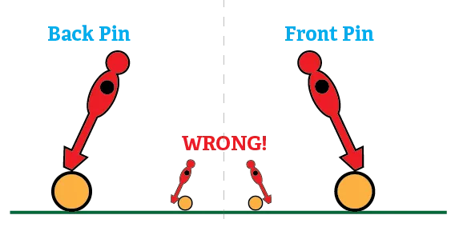

In any ball sport, I've learned that ball control is most important. Because what are you doing most of the time? You're trying to gain control of the ball, you're keeping it in possession, until the moment you shoot or pass. If you can never stop a ball, or dribble it, or move it between players ... then having an amazing shot is useless.

Most new players exploit the method of just shooting every ball that comes near their rod immediately. But that's wrong. Against a newbie it might score many goals, but once you play a competent opponent, you will lose.

In ball control, we can distinguish 2 styles. 

* **Dribbling**: moving your men around the ball so that it stays in your possession.
* **Pinning**: you trap the ball between the toe (or heel) of your man and the field. In a split second, the ball is stopped completely and now in your possession.

Many people recommend you learn pinning first, but I'm against it.

*Why?* Because pinning a ball is a one-chance thing. If you miss your pin, the ball just continues to move towards your goal/opponent at the same speed. And to make it worse, the defender of your team probably expected you to have the ball, but you don't, so that's one goal against you. 

I recommend, therefore, to first develop a feeling for how much pressure to put on a ball, and how a ball moves and behaves with different touches.

ALWAYS use your possession. Once you have a ball, don't let go of it easily. Don't just boom it forward, have a _strategy_, know where you want the ball to go. 

Especially in foosball, your opponent can score from any part of the table, in a split second. In real soccer, losing a ball to your opponent is already quite bad, but imagine what could happen in the dangerous game of table soccer...

## Ball Control Exercises

### 1. Knowing where the ball will end up.

The first skill in ball control is, of course, actually getting the ball in your possession. To be able to do so, you must be able to instantly put your men where the ball will end up. This requires some training, for which I like the following exercises:

-   Pass the ball back and forth between two of your rods. 
-   **Randomly** pass the ball. But, it's hard for people to be truly random. So here's a fix: put a small object under one of your table's legs, so the table is slanted. Now every ball is curved into a certain direction, making everything as good as random. Now try to keep the ball in your possession.
-   Ask someone to shoot balls at goal. Try to save them.
-   Push/shoot the ball against the wall with your man. This way the ball bounces off in a random direction. Now stop that ball and regain possession as quickly as possible.
-   Something a bit more advanced: ask someone to shoot at your goal from their defense. Try to position your midfield and attackers in such a way that you can stop every ball.

**Angle your men a bit backward.** This means a ball is slowed down when it hits your players, increasing the probability it stays with you. If your men are perfectly straight (or slightly forward), any ball you stop ... will just bounce back to your opponent.

### 2. Keeping a ball in your possession

Alright, you've had your first touch. What now?

The trick is _thinking ahead_. Look at the ball, look at the position of the men, and you will already _know_ what will happen next.

If a ball from the right is stopped by your man, it will bounce back to the right a bit. If a ball is traveling diagonally downwards the table, you know that once you hit the ball it won't just neatly bounce back in front of you.

Prepare for that. Already position for what will happen _next_.

A good defender will always bounce any ball coming towards them in such a way that they keep the ball. 

{}
I once played against a really good defender. Every angled ball that hit his defenders, would bounce off vertically to his other defender, so that he almost always immediately had an open shot at goal.
{}

Exercises for this ...

-   Place the ball in front of your man. Now just start moving the ball back and forth, left and right a bit, but keep it in possession. 
-   Once you're comfortable, start moving the ball back and forth _betwee two different rods_.
-   Ask someone else to shoot balls at you. (Or try to roll them in yourself, but it's quite hard to do properly.) Try all possible angles. Your task is not to just _hit_ or _deflect_ a ball, it's to _keep it in your possession_ when you stop it.

There are basically 2 ways to keep a ball in your team. 

* Angle your men backward. Once the ball hits you, move with it for a few centimeters, slowly slowing it down, until it rests at your feet.
* The second method is different for every shot.
  -   Shots coming from the side (angled shots): hit the ball with the side of your man, so that it is immediately passed to another men of yours.
-   Straight shots: these can be shot back immediately. Why? Because usually when somebody shoots a straight shot, performing the shot doesn't keep their men in the same position. Therefore, if you're quick, you can immediately catch the opponent of guard when they're still recovering from their own shoot.

The first one is the safest. The second one is harder but much more difficult for the opposing team to handle.

### 3. Pinning a ball

Once you've mastered the basic controls, and you (almost) never lose any balls anymore, it's time to go advanced. To make sure every ball coming towards you is immediately in your possession. 

This is where pinning comes into play.

As said earlier, pinning is when you trap the ball between the toe/heel of your man and the field. As long as you don't lift your man, the ball isn't going anywhere. Therefore, if executed properly, this is the best way to catch any ball and then keep it in the team. 

At first it will be **very hard** to get the right timing. You will miss the ball often. Or pin it too hard, so you accidentally shoot it in a random direction.

But with the following exercises you should be able to master this craft!

-   Place the ball in "back pin" position. Now try to move the ball to the "front pin" position, never losing contact. Repeat, go back and forth.
  -   The trick here, is to move the tip of your man in _circles_. Slowly move your rod and change pressure, until the ball has circled to the front pin.
-   Shoot the ball from any rod on the table to your next rod. Try to immediately pin the ball on the receiver side. 

Try everything from both sides. 

For example, first shoot with your midfield to your attackers (and let your attacker pin the ball with a front pin). Then shoot from your attackers to your midfield (and let the midfield do a back pin). 

Why should you try it both directions? Because the first direction is for when you're attacking, and the other way is useful for when you're defending.