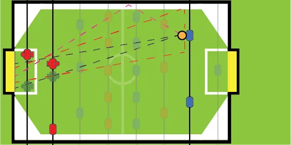
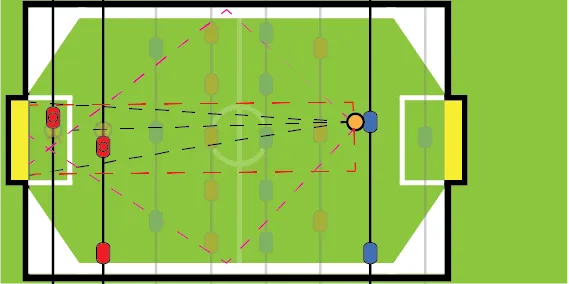
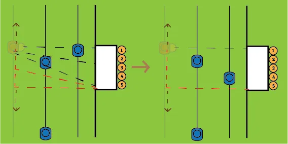

Defense doesn't win matches, but it makes winning much more likely. If you take away all the possibilities for the opponent to score, well, you only need to score _one_ goal to win! And in foosball, every moment the other team has the ball, you should be defending.

Many people make the mistake thinking that only the *goalkeeper + defenders* are for defence. They rely completely on those to save every shot. But truth is, those two just can't save every shot. Plus, the earlier you intercept the ball, the earlier you can start attacking.

What does this mean? The person holding the midfield and attackers has an *equally important* defensive position as the person holding the goalkeeper and defenders. If the midfielders are positioned in a certain way, the defender must position themselves somewhere _else_. Otherwise they both defend the same thing---they both plug the same hole in defence, leaving all other holes wide open. 

Below I will show you different situations in the game and the best way for the defending player to behave / move. The attacking player's duties will be discussed next chapter.

## Defending in general

If you're holding the defending rods, you should always be alert. Wherever the ball is in the field, there's always a good chance it will come flying towards goal. 

Your goal as a defender is: any ball that comes near your 2-rod (the defenders) should be stopped and controlled there. 

Any shot that isn't a goal, will hit the wall next to your goal or hit your keeper and bounce off. Which means ... you have one chance to control it, and that's the role of your 2-rod. 

> Any ball that passes your 2-rod (towards your goal), should be controlled before it goes back to the midfield again.

The opponent has _one_ chance to shoot. After that, your 2-rod should have the ball.

> Cover the easiest shots. These are "open shots": when you're able to draw a line from the ball directly into your goal. 

This way you *force* your opponent to try a more difficult shot. Which will, most of the time, fail.

## Defending against opponent's backline

Let's say the ball is around midfield or further up the field.

### In front of goal

Is the opponent's position within the range of your goal? Then a straight shots available. You know what to do: defend those. 

But don't make the mistake of just placing your men directly in the shot line. You have _two_ rods. You can cover a wider area:

* Place your men about one cm apart
* Aligning that *gap* with the straight shot the opponent can make.
* This gap looks like an open shot, but is too small for a ball to actually go through it.

Now the opponent _has_ to do something else. It has to move out of the way and go around your block.

 

### At the edge

Is the ball to the edge of the table? The only open shot is an _angled_ shot towards your goal. The corner of the goal nearest to the ball, is called the _near corner_. The one on the other side is called the _far corner_.

You should always defend near corner. It's the easier shot and the faster shot. A shot in the far corner, _if_ placed correctly, gives you more time to react.

{}
The vague dark green men in the picture show the best setup for if the ball is on the lower part of the table.
{}

_I see you're rotating the men?_ This depends on your qualities and playing style.

If your toe points forward, you have a bigger range of shots you intercept. But! If you hit the ball, it most likely bounces away.

If your toe points backward, any ball you deflect will more likely stay in your control.

That's why I prefer rotating the 2-rod _backward_, and the keeper _forward_. Balls that bounce off the keeper will go to my 2-rod anyway, so that's fine.

This also allows you to leave a larger _gap_ between them when it comes to angled shots.

In a sense, you have to ask yourself the question: are my reflexes quick enough to make up for that loss of range?

And always ask yourself: what _can_ the opponent do? From the defensive line, the most common options are:

* Pass to midfield
* Push/pull the ball a bit and shoot angled. (Because of the pulling, the ball's momentum is already angled, which makes this shot easier.)

With the setup shown above, many shots are guarded. But you still need to keep an eye open for these kind of shots. Those shots are usually a bit slower, so if you see one coming you should have enough time to move one of your men to that ball. 

Any other shot: simply do not move your defences. Trust that there is no way in, unless you _know_ the attacker is creative or can take crazy shots.

{}
I can't count the number of times goals were scored because someone _panicked_. They actually had the shot saved, but frantically moved out of the way.
{}

## Defending against opponent's attackers

Now, let's ay the ball is on the opponent's 3-rod (attackers). Things get a little bit trickier. 

The distance between the 3-rod and your goal is not so large anymore, which makes a lot of 'easy' shots available.

{} 
The options are largest for the middle man. As such, a somewhat capable attacker will automatically bring the ball to the middle man. Be prepared for that.
{}

The techniques described above are still the best way to defend. But now you need to step it up a notch. With two key improvements:

* _Great_ reflexes and prediction of the game.
* Psychological defense.

Why the reflexes? The attacker will likely constantly change the placement of their men and the ball. You need to instantly know what to do and setup your defences correctly.

But, a better way to defend is ...

> Never let your attacker control you. You control the attacker.

This is called psychological defence. It takes some experience---and a bit of poker face---to get used to it.

What usually happens when the attacker receives the ball on the 3-rod? Something like this: 

* They get the ball
* They control the ball
* They look at an opening in your defence
* They set up the ball
* They shoot.

While they get the ball and control it, you need to get your defensive men in the best positions (as described above). Then the attacker will look at your defence. 

Now it's your job to estimate when the attacker is done looking at your defence ...

... because once your opponent has seen your defence, he probably won't look again and will start executing the right shot.

That will give you an opportunity to switch positions. And repeat. Constantly switch your position _slightly_. Any time you think the attacker is comfortable or confident, change it again. 

Pretend to leave something open. Defend using the rules above for 90% of the game, but sometimes suddenly switch to some completely different configuration. Make the attacker unsure.

{}
You can obviously combine this with trash talk or something similar. Not required, of course. Something simple like "score it then, score it in the near corner, I'll leave it open for you" can do wonders.
{}

## An example

An attacker receives the ball at their middle men.

You know: cover the straight shot. Position your keeper and 2-rod to leave a gap just small enough to stop the straight shots.

The attacker has checked out your defence and saw that a straight shot is hopeless. But he spotted the upper corner is _just_ out of your reach.

They subtly switch hand position, or stop looking. 

That's the moment when you subtly move your keeper to cover that other side. And your defender a little bit upwards to make it look like the straight shot is still covered, just in case. 

Hopefully, the attacker doesn't reconsider the straight shot again, and just hopelessly rams the ball against the exact place your keeper is now.

The reverse is also possible: make it look like a very easy shot can be made, but in reality have it covered. An example of this could be where you leave a certain shot *just* open, but your hand is ready to clamp down and instantly shut the opening. When when the attacker shoots, you quickly close it.

Again, this is mostly _psychology_ and _prediction_. You could be wrong. You could close a gap, but the opponent shot somewhere else anyway, and now they scored. The trick is, of course, to be _right_ more often than you're _wrong_.

Most players don't even think this far ahead. They just think "shoot, shoot, shoot". These tricks will be enough to throw anyone off their game.