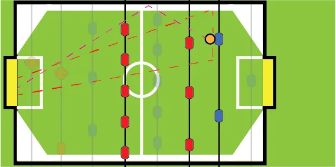

Your midfield has 5 men on it, your attacking zone has 3. A quick calculation shows that the majority of your men are in that part of the field. 

Therefore, if you position both rods correctly, you should be able to block any dangerous shots on goal.

The idea is, just as with defence, that you don't cover the same hole twice. 

* Your attacker should always be right in front of the opponent's defensive man
* Your midfield should always have 2 people covering the holes next to your attacker. 

However, you are the attacker. You are _not_ the "last line of defence". Which allows more leeway. Don't statically sit in front of the attacker. _Move around_, constantly. Switch positions. Switch between toe forward and toe backward. If a ball goes past you, your defender _should_ have it covered anyway.

So take that risk, and you will often score easy goals because the attacker just hits _your_ attacker, and the ball bounces into their own goal.

If your opponent is shooting from the side of the table a bit, it's wise to place your attacker a little bit closer to the goal (so it has a slight angle with the defenders). Any shot taken from the side at goal will be angled anyway.

Perhaps most important is **control over the midfield**. Once the ball is around the opponent's midfield, that's your best chance to stop the attack from the other team and start attacking yourself. 

Why? Because the midfield is hard to control, but "easy" to defend, as you have 5 men. 

Earlier, I explained the  **brush pass**: a soft pass that can be very accurately angled).

That's the way to go when passing with the midfield. Once you can do that quickly and swiftly, you can try passing the ball around on your 5-rod. This will force the opponent to reposition all the time, and that's hard to do with the 5-rod, as it has _limited range_. Also, performing a brush pass via the walls almost always throws off an opponent

In general, you want the midfielder's toes pointed _backward_. Because you have so many men there, you don't need the extra range from pointing forward. You need the _control_ and safety of pointing backward.

Ideally, your midfield:

* Immediately pins a ball
* Moves it to the side to pass _between_ midfielders
* Or to the front to do a _brush pass_ to your attackers
* So your attacker rod can receive the ball and instantly shoot

If you can streamline this, you literally turn defence into a goal instantly. As they say, offence is the best defence.

_But how do I intercept the ball?_ Assume that your opponent can do brush passes just like you. (Either accidentally or not.) 

Move your midfield all the time, subtly, up-and-down, circling around all the options the opponent has. Keep changing speed and range all the time, otherwise the opponent can predict when you will leave which hole uncovered. 

If you're playing against the same player for a longer time, you _learn_ their preferences here. Maybe they greatly prefer passing via the wall. Or they try to be fast, which makes them sloppy. Position yourself against that.

But never become static. Your midfield is _the_ rod the constantly switch around.