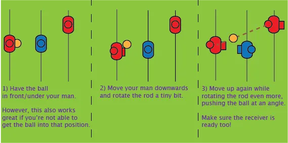

Great! You're able to catch a ball and keep it in your possession. It's time for you to do something useful with it---like scoring some goals. 

Many people who start playing foosball only know how to shoot. In fact, they think all you do in foosball is very rapidly shoot balls towards the opponent's goal. 

But the truth is: learning to pass the ball is even more important. 

Why? The whole idea of passing is to move the ball to a _better_ position from which you can score. If you always immediately shoot, you will often shoot from areas with a 0.001% of scoring. In any good area, your opponent will just stand in front of you and block everything. 

You're predictable. You take chances that aren't really a chance.

Instead, constantly

* Identify the best location to shoot from (at that moment).
* And pass the ball until it gets there.

## Two different ways to pass that ball

Passing a ball in foosball is a very subtle thing. Overpowering a pass almost never does you any good, at least not if you're a world class player. There are 2 types of passes, which we can categorise as

* **Vertical**: on the same rod.
* **Horizontal**: between the different rods.

**Vertical** passing means passing from one man to another on the same rod. 

How? Push or pull the ball with the **side** of your man. Then receive that ball with the side of one of the other men on the rod. 

Why is this useful? Constantly passing on the same rod will make it difficult for the opponent to keep following and defending you. They never know which of them will take the next shot! Therefore it creates holes through which you can then horizontally pass to the next rod.

It's hard to pass vertically and perfectly straight. Therefore, from time to time, a ball will roll a bit away from the rod. 

That's why I taught you ball control first! You should be able to instantly recover that situation and not lose the ball.

Receiving a ball with the side of your man is similarly hard, because a ball can easily bounce off in weird directions. Therefore, vertical passing is _subtle_, and it's best to _follow_ the momentum of the ball. This means that the receiver follows the direction of the ball for a about an inch, so that the ball is _eventually_ stopped next to them.

**Horizontal** passing means passing from one rod to another. (Usually forward, but in some situations it could be quite surprising to suddenly pass backwards, I must say.) 

Straight horizontal passes are _predictable_ and _easy to intercept_. I mean, there's literally a full rod of players standing in the way!

Therefore, for horizontal passing we use the **brush pass** method.

When you brush pass, you gently brush the ball in a certain _angled_ direction. 

* This gives you almost 100% certainty that the ball will go in the direction you wanted.
* It is hard to predict, as you don't need a big setup or "swing" before it
* It's hard to judge, as it's an angle and a weird speed.

Of course, the whole thing can be reversed to pass the ball downwards. The ball can also be brushed via the walls of the table---in fact, it's recommended---but that takes more training.