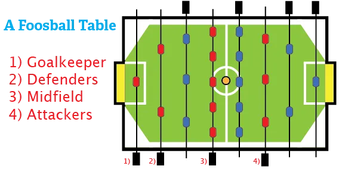

You can't play a game without knowing the general rules or structure. So let's get that out of the way.

A foosball table consists of a *soccer field*. It has a *goal on each side*. The rest of it are *walls (slightly sloped)* and *4 rods* for each team:

* 1 keeper
* 2 defenders
* 5 midfielders
* 3 attackers

{}
If you're looking for a foosball table to buy, or how to maintain them, here's an article I recommend: [Foosballzone \| Foosball Tables](http://www.foosballzone.com/foosball-table/)
{}

One team's defenders face the other team's attackers. The midfield-rods face each other. 

Most of the time, you play in teams of _two_. 

* One to defend (holding the goalkeeper-rod and the defenders-rod)
* One to attack (holding the midfield-rod and the attacker-rod)

Playing alone against one person can also be done, but is less fun in my opinion. 

{}
Goals are mostly created because the ball bounced weird and you just _weren't there_, because you only have two hands and four rods.
{}

The goalkeeper-rods can move only from the left corner of the goal to the right corner. All other rods can be moved up and down until one of the men hits the wall. All rods can be rotated a full 360 degrees.

If a table doesn't follow all these properties above, it's not a proper table. I mean this as buying advice: get another higher-quality table. It leads to more fun, more skill, and more durability.

## Objective

The objective, obviously, is to win the game by scoring more goals than your opponent.

## Where to stand?

Stand far enough from the table that you can comfortably pull both your rods all the way down. It helps to stand diagonally: left foot forward, right foot backward. This gives the needed space for your right hand, which always holds the rod that moves further.

Put all your weight on your feet. Do not lean on your rods: this damages them and only makes playing harder for you.

Grab the handles of your rods as if you are about to shake hands with them. Your thumb should face up, diagonally.

## The Rules

The rules for official tournaments have many details that are useless to anyone just playing casually. (For example, you only have a time span of mere seconds on a particular rod, then you _must_ shoot.) 

I will present the rules as they are applied by most (casual) players.

-   **NO SPINNING.** Spinning occurs when you spin your rod 360 degrees without touching the ball. To prevent this, simply never let go of your handle. Spinning might add a lot of power behind shots, but it also means you can't aim or control anything, and you destroy the table.
-   Every new ball can be put into the field in different ways. Most tables have a hole on the side through which you put the ball. Otherwise, the ball is rolled from the center to the midfielders of the team that was scored against.
-   All rods are allowed to score. However, if you score using your midfielders, the next ball will be worth 2 points (and this ball none). If you score the last goal with the midfield, you lose.
    -   An alternative is that midfield goals don't count.
-   Whatever happens, as long as the ball ends up in the goal of the opposition, you are awarded a point. The opponent may slightly touch  the ball, or the ball might go in via the walls, etcetera, we don't care: in is in.
-   **"Attacker is king"**. If an attacker shoots a ball, and it first hits some other things and then goes in, it's always a goal from the attacker. However, if for example your defenders shoot a ball, and it hits the midfield and then it goes in, it's a midfield goal.
-   **Clinker**: when someone scores a goal, but the shot was so fast that the ball comes out of the goal, back into play again! Usually, this is awarded 2 points and play continues. (As, you know, the ball is already back on the field.)
    -   An alternative is that the team that scored gets only one point, but the opposition has one point removed. And yes, counting below zero is allowed.
-   **Crawling**: When a team loses having scored 0 goals, the team must 'crawl': crawl under the
    table from left to right. This is to humiliate them for being rubbish. Though I understand if you don't want this rule, it's completely optional.

The official rules also say the following things, which you can decide for yourself whether you want them as rules in your game:

-   **NO JARRING.** It's also called "sawing", because it is the same movement you would make with a saw in your hands. Jarring is when a player slams his rods to the sides of the foosball table. This can be done to make the opponent lose possession of the ball, or just as a method of defending. Whatever your reasons, most players hate this and forbid this. It's also not as effective as you'd think.
-   If the foosball lies dead between 2 rods (no rod can get to the ball, and the ball isn't moving anymore), the ball needs to be served again. If you think that's boring, then you can lift the table a bit until the ball rolls back into someone's possession.
    -   If the ball cannot be reached by neither *defenders* nor the *opponents attackers*, the ball automatically goes to the defenders.
- If a ball is **lifted** (it jumps up from the table, maybe even completely off the table), the ball needs to be served again. However, if the ball is still on the field, I recommend you just play on. This is because a ball flying through the air only makes things more fun. (Really good players are able to pass or shoot the ball through the air. That's beautiful to see.)