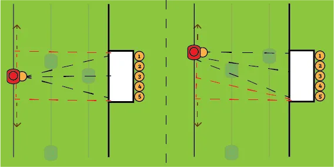
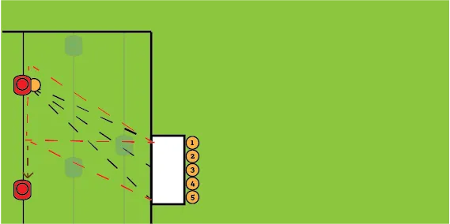
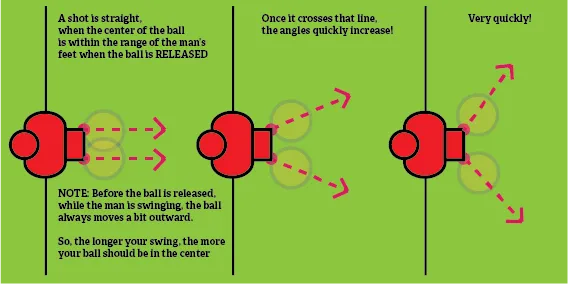
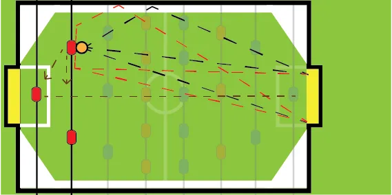

With shooting, it's always a trade-off between **accuracy** and **power**. You can shoot a ball blazing fast, but then you lose control and won't be able to aim it accurately. On the other hand, there are shot types that have a certain speed limit, but are easy to control and aim.

## Three different ways to shoot that ball

There are 3 main ways to shoot a ball: **wrist flick**, **handle roll** and **backflip**.

The **wrist flick** is the most standard shot that everybody knows. Just throw / flick your wrist down while holding the handle, which quickly rotates all men.

Do not flick your hand **down**. This merely puts pressure on the rod and makes twisting it *harder*. Think of it as turning your wrist until it can't be rotated further, until it "locks". This might sound dangerous, but it really isn't. So when doing the wrist flick, just rotate your wrist with all the power you have until it stops automatically.

This is the easiest one to execute, but also the slowest.

The **handle roll** can, if trained properly, be executed just as quick and precise as the wrist flick. Bbut it's a much faster shot. 

As the name implies, you roll the handle in the palm of your hand. For this to happen, you need to *partially* let go of the handle, and only let the palm of your hand touch it. 

Now, without losing touch, you can roll the handle. As soon as it hits your fingertips, you can close your hand, increase grip, and voila---the handle is safe in your hand again. If executed properly, this is _fast_, but also _controlled_ and does not go further than a 360 degree turn.

The **backflip** is a blazing fast shot, but requires a lot to be executed properly. You need to switch to a difficult grip, the timing is different, and control is almost impossible without *a lot* of practice. 

The fun thing about backflips is that they are so fast that the opponent _cannot physically_ react in time. Even if you miss, it makes the ball do unexpected things. 

To do one, you need to have the ball in a **front pin**. Now let go of the handle: only let your wrist touch it. Guickly move your hand up, until you're able to grab the handle again. (Similar to handle roll.) Your man should have made a full backflip. This is allowed, as it hits the ball just before the full flip is done.

## Shooting: a few examples

Now you know the different techniques available. It's time for you to start being creative. There are numerous ways to shoot on goal, which mostly depend on 

* Your position on the field
* And your opponent's defence.

## Attacker

We shall first discuss the possibilities for your **attacker** rod.

* The **black** arrows indicate shots that can be taken immediately at goal.
* The **brown** arrows indicate that you can of course always pass to another man.
* The **red** arrows indicate that you can also move (pull/push) the ball first, and then shoot.

The size of the men is a bit bigger in the drawings than in real life. The blue men in the drawings are just an example of a possible defence.

### The Middle Man (of the 3-rod)

### The Outer Man (of the 3-rod)

### Famous Shots

The **push shot**: using the middle man, move a bit up and then shoot the ball straight into the upper corner of the goal. (The moment you rod "stops" or "locks" should make the middle attacker line up precisely with the goal corners.)

The **pull shot:** reverse of the push shot. Move the middle man down and shoot the ball straight into the lower corner of the goal.

The **pull-kick:** starting with the upper-man of the 3-rod, pull the ball to the middle man, and then rapidly shoot with that man.

The **push-kick:** reverse of pull-kick. Start with the lowest man of the 3-rod, push the ball to the middle man, and shoot.

The **snake shot:** start with the ball in front pin for your middle man. Then slightly move either left or right, lifting your man off the ball in the process, and then at, any any moment, shoot straight at goal. Can be done with a backflip as well.

The **push/pull shot** (using your outer man): start with one of the men on the outside of the 3-rod, and the ball inwards. Then move the ball towards the middle a bit (keep the ball close to your man!), and then shoot at an angle (towards the far post) or straight (into the near post).

The **spray shot:** any angled shot is called a "spray shot". Angled shots are very hard to defend against, but are also very hard to master as an attacker. The angle of a shot is determined by the ball's momentum at the moment it's released from the man. Once the ball is released, it will always keep traveling in the same direction until it hits something. That is, unless a certain effect is put on the ball, but it's very very hard to consciously put an effect on the ball.

## Defenders

As I said, the great thing about foosball is that _every_ part can score and be relevant. These are the possibilities for shooting with your defenders.

