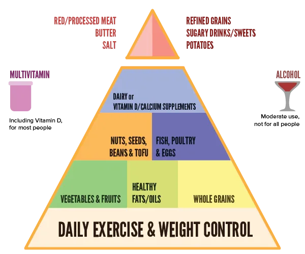
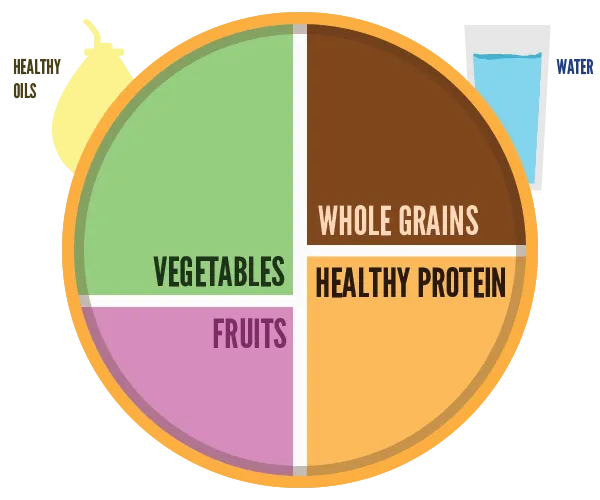

Some general diet guidelines have been established a long time ago. They are, as always, imperfect. But they provide a good enough starting point.

## Healthy Eating Pyramid

As a kid, you were probably told to adhere to the *Healthy Eating Pyramid*. You hated it, but sadly enough, all the wisdom it claims to possess is there. 

The pyramid shows _what_ we need to eat every day, and _how much_ (relative to one another). It doesn't specify exact portions, but rather the ratio between all the different products.

### Foundation

The foundation always comes from **daily exercise & weight control**. 

* Exercising daily makes sure everything you eat is used and not stored as fat
* Weight control is the only way to really check where your weight is going. Even if you eat the right things, overeating will still lead to being overweight.

### First layer

The first layer has the most important trio.

-   **Whole Grains:** mainly used for their *carbohydrates*, or energy. Every big meal has a foundation or core with this type of food.
    -   Examples: oatmeal, whole wheat bread, whole wheat pasta, brown
        rice.
-   **Vegetables & Fruits:** contain the necessary vitamins and nutrients to help build and repair your body. Should be eaten as much as whole grains, which means including them as well with every big meal.
    -   Examples (fruit): mango, pomegranate, guava, raspberries, orange, avocado
    -   Examples (vegetable): kale, Brussels sprouts, broccoli, artichoke, bell pepper, spinach
-   **Healthy fats/oils**: to be eaten in lesser amounts than the previous two. We've already established that the body needs some fat, and it should be the _healthy_ fat type (unsaturated, unmodified). They are usually only included with dinner, which means you should make them a big part of that meal.
    -   Examples: olive, canola, soy, corn, sunflower, peanut, other vegetable oils & trans-free margarine.

### Second layer

The second layer has the somewhat-important duo.

-   **Nuts, Seeds, Beans & Tofu:** these are also full of vitamins, minerals, protein and fiber. They could be called the *plant foods*. Research increasingly shows how important they are for the body.
    -   Examples: black beans, navy beans, garbanzos, lentils, almonds,  walnuts, pecans, peanuts, hazelnuts, pistachios.
-   **Fish, Poultry & Eggs:** fish is recommended by everyone in the food industry because they contain *omega-3 fats*, which are amazing for your body and brain. Poultry and eggs usually contain lots of protein together with only a low amount of saturated fat or cholesterol.
    -   Examples: chicken, turkey, and well, eh, fish and eggs.

### Third layer

The third layer is less important and contains one thing.

-   **Dairy** or **Vitamin D/Calcium Supplements:** These should be limited to 1&ndash;2 servings per day. In the old days, everybody was told to drink as much milk as they can. Now we know this is only really beneficial when you're young. When older, you don't need it, or are actively harmed by it.
    -   Examples: milk, cheese, yoghurt, cottage cheese

### Top layer

The forbidden byproducts float on top of the pyramid, in a small rectangle. These should all be **consumed sparingly**.

-   **Red/Processed Meat & Butter:** They contain lots of saturated fats. Most of the nutrients they contain can also be received from products that are lower in the pyramid and much healthier
    -   Examples: beef, pork, bacon, hot dogs
-   **Salt:** salt is crucial to our body. It keeps all fluids in our system balanced. It is therefore closely regulated by ourself! If you eat too much salt you will upset this system, leading to complications. Salt is sprinkled on top of everything these days so you can't avoid it, but try to pick only foods with low *sodium values*.
-   **Refined Grains, Sugary Drinks/Sweets, Potatoes:** The so-called *refined* grains are altered whole grains. Altered in such a way that the good stuff is removed and replaced with bad stuff that tastes better. Together with sugary products and potatoes, they create fast and wild fluctuations in blood sugar, which leads to weight gain, diabetes or heart failure.
    -   Examples: white bread, white rice, white pasta

### Outside

Lastly, there is a part outside the pyramid. It contains optional things that can sometimes do a lot of good, and sometimes do a lot of harm. It's these two I'm talking about:

-   **Multivitamin:** most people don't get enough of that from their regular daily eating habits, so using this creates a sort of nutritional backup. It shouldn't _replace_ healthy eating. Don't think a few magic pills can save you. But it's a great addition if you lack some vitamins.
-   **Alcohol:** you should refrain from it as much as you can. But, studies have shown that one glass of wine a day actually has lots of *benefits*---including lowering the risk of heart disease.

## Healthy Eating Plate

A newer addition to the guidelines, is the healthy eating plate. It shows what your plate should look like at _dinner time_, according to the latest research.

It has many of the same elements, so I won't explain again.

## Growing muscle

These are the important nutrients if you are very physically active: 

* Proteins (dairy products)
* Carbohydrates (pasta, cereal, grains)
* Healthy fats (nuts, beans, soy, oil, fish)

Proteins are the building blocks for muscle. The body wants to use them for that specific task, but if there is no muscle to grow, it is quick to store it as fat. So only eat this a lot, if you are going to exercise a lot.

Carbohydrates are important whether you exercise or not, but you might want to increase these as well. They give you energy that is needed for the exercises and controlling muscle growth. However, these are even more likely to be stored as fat, so watch out.

Therefore, it is recommended you don’t up your carbohydrates dosage, but draw your energy from the healthy fats instead.

## Some numbers

All bodies are different, no numbers will ever fit _you_. But I understand it if you want some guidelines. Here are the most common formulas or thresholds for nutrient intake, per day.

> **Calories:** 2500 for men, 2000 for women

You can look up the calorie intake per product, and the calorie usage per (common) activity online. To give you a sense of what the numbers mean. 

But remember that most calories are burned while _at rest_. They are burned to keep your body and brain active. If you exercise a lot, you are more _muscular_ and your body requires more energy _at rest_. When you read "100 calories burned for 30 minutes of walking", that only talks about what you need for the act itself. It doesn't take into account all the extra calories burned afterwards, because your body is more muscular and your lung capacity greater.

As such, physical exercise is _much more effective_ than the numbers shown.

> **Vegetables:** around 200&ndash;250 gram

> **Fruit:** around 200&ndash;250 gram. 

Fruit and vegetables are often lumped together, to say ~500 grams in total per day. I don't know how fair this is. They have decidedly different functions and I feel vegetables should take the overhand.

> **Protein** (in *grams*) = body weight (in *pounds*) x 1.5

Again, protein also comes from nuts, seeds, vegetables. Not just dairy products or "protein shakes".

## In conclusion

This is why I started the guide by explaining the two purposes of food:

* To maintain energy levels
* To acquire building blocks for growth and repairs

These guidelines show this in action. You need carbohydrates and fats for energy; you need an equal amount of vegetables, fruits and protein for growth. 

An active lifestyle means you need more of _both_. A passive lifestyle---not recommended---means you need less of both.

Stay away from these things: 

* Processed food
* Refined grains
* Sugary products (choose unrefined sugars or get your sweetness from fruit)
