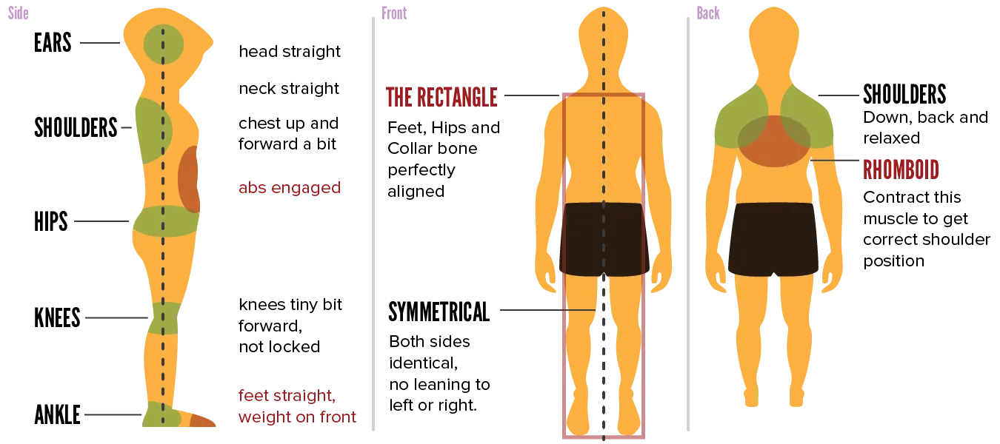

All physical improvement should start with posture. Why? Because it's literally the one thing that's relevant _all the time_. You won't be exercising 24 hours a day, but you will have _some_ posture at all times. If it's a good one, you are strong and fit. If it's a bad one, you use the wrong muscles and hinder yourself.

As stated before, it does not help to tell yourself to "sit up straight". Reminding yourself, time and time again, to consider your posture will only have negative results.

Instead, you must

* Do exercises that specifically improve posture.
* Keep a good posture _while doing exercises_. This way, your body is trained to stay composed, even when under stress or when doing tough activities.
* Keep an active lifestyle that allows you to constantly vary your posture.

Good posture becomes a habit. You should _not_ have to think about it or consciously compensate all day.

## Is bad posture really that bad?

Yes. It's even worse than I make it seem! A bad posture means

* You compensate with the wrong muscles. Muscles that should be strong, are now weak, and vice versa. This adds a lot of strain on your body while making you weaker in comparison.
* The vital connection between brain and body, through your spine, is interrupted. If you posture is really bad, vital nerves can get blocked, or organ function is hampered.
* You are off-balance, which means even more compensation and stiffening of muscles. (Remember, when a muscle is weak or unsure, it will tighten and stiffen to regain some security.)

And remember, these negative effects occur _all day_.

## Okay, so what is good posture?

An image will provide the most clarity. But I'll explain some of the key points below.

First of all, nobody is perfectly symmetrical. You will have slight differences, preferences in hand or leg, which also lead to a difference in bone and muscle mass.

Secondly, a "straight" back is a very misleading term. Because if you look from the side, you'll notice our back (and neck) has an **S-shape**. Trying to remove this natural curve is terrible for your body. So no, straight doesn't mean your back / body looks like a flat plank.

It means that you can draw a **straight vertical line** ...

* From your ears
* To your shoulders
* To your hips
* To your knees
* And finally the middle of your ankles

These general rules help:

* Don't lock your knees. Keep them slightly bend, which keeps your posture and legs _active_.
* Similarly, put your weight more on your _toes_. People like to hang back and put the weight on their ankles. But this, again, is a very passive pose that promotes bad posture.
* Keep an even weight on both your left and right leg. If this isn't the case, you can often see that your _shoulders_ or _hips_ aren't symmetrical. Because they are compensating!

But as I said, don't try to forcefully learn these rules. You can merely use this to _check_, once in a while, how you're doing.

## The workhorses

Our body has two huge muscles. They are our workhorses, our load bearers. _They_ should do the most work when maintaining posture, and not your other muscles.

* The **rhomboid**. A huge muscle in your back. Contracting it pulls your shoulders backward. When lifting something, the rhomboid should give you strength, not the muscles around it.
* Your **abs** ("abdominal muscles"). Both front and side. By engaging your abs, you ensure other muscles are used properly, as most of the load is on your abs.

As such, correcting posture by pulling your shoulders *back* or *down* isn't great. Instead, the rhomboid should be strengthened and activated. If that happens, your shoulders are *automatically* kept at the right position.

Similarly, when doing exercises, people tend to forget their abs. When you lift heavy weights, but don't engage your abs, where do you think the strength comes from? Exactly, other muscles around it, which are _not_ up for the task!

Near the end of the course, I'll provide specific exercises. Now you know why I put them in this order:

* Core (abs, hips, lower back)
* Legs
* Uppper body

Strength in the upper body, comes from the lower body. Good posture starts with the workhorses that are supposed to do it. People spend a large part of the day _standing_. If you stand off-balance and don't use your abs, other muscles will start compensating.

Here's one last "weird" trick. (Gosh, I sound like a guru now. "Use this weird trick doctors don't want you to know about! Stand upside down and eat three crabs for a six-pack!")

> Throw your crotch forward.

I am serious here, don't laugh. All my friends that play sports at a (really) high level do this, I noticed one day. Their hips are pushed forward, which makes them lean on their toes and increases the S-shape in their back. More importantly, this means they rely almost entirely on their _abs_ to stay upright!

Just try it. While standing, don't hunch forward, also don't passively hang backward. Instead, push your hips forward and engage your abs.

This simple change did a lot for me. It _will_ pronounce your belly, so it also made me realize I was getting fat, which is an unfortunate side-effect. But in the end, this is obviously a good thing.

## Achieving good posture

I named three elements at the start. Let's discuss them one by one.

### Exercises for posture

These exercises can be quite fun and freeflowing! Because we're not trying to grow a specific muscle, we're just trying to use our body in different ways.

I recommend varied **balance exercises**.

Buy a **water bag**. Place it on your shoulders / in your neck. Now just ... walk around. The sloshing water will constantly throw you off-balance, forcing you to engage your whole body, otherwise you can't take a single step.

Once you can do that, you can incorporate this bag into any other activities. (There are alternatives as well, search for things like "instability ball".) All these tools do is _throw you off-balance_. Even the simplest activity becomes slightly harder and forces you to have a good posture.

{}
A balance board is also a great tool here. For example, instead of doing squares normally, do them while standing on a balance board. Infinitely harder. But not in a way that is tough to maintain or will lead to compensation, in a way that your body is just not used to.
{}

Another common balance exercise works by **eliminating one side of the body**.

Stand on one leg, and do a certain exercise. (Like, extend the leg, lift something, do a squat, whatever. The point is that you cannot compensate with your other leg, because it's out of the equation!)

The same thing for your arms: do an exercise with one part of your upper body, while removing the other part. This cancels compensation. It usually reveals just how much your compensating. (For example: one arm can do an exercise perfectly fine, while another can't do it at all.)

Obviously, after doing this with one side, do the same exercise with the other side! Even if one side is considerably stronger or weaker, _train both sides equally_. Otherwise you're merely making the difference _worse_.

I give many more exercises later in the guide. They were all selected, on purpose, to lead to good posture.

### While doing other activities

Before you start exercising, _engage_ your core. The balance exercises above are a great way to start. Just do them for a few minutes, no need to make them very hard or intensive. Now your body is activated, and it will automatically keep a better posture during the activity.

Otherwise, consciously engage your abs when doing ... anything. When you compress your abs, your hips should rotate a bit upward. The front of your body _compresses_ (becomes smaller), while the back _stretches_ and becomes more straight.

It's as simple as that. Lifting boxes? Keep your abs tight. Doing lunges? Keep your abs tight.

### Active lifestyle

Most bad posture comes from _sitting_ or _leaning_. This is fine, of course, as long as you vary your posture often.

These are simple tips:

* Get a standing desk
* Get a balance board, stand on it while doing other things
* Buy a yoga ball, or some other balance chair, and sit on that. (They are shaped such that you automatically keep proper posture or stay active.)
* Try to do activities **with both hands** (or **both legs**). You normally brush your teeth with your right hand? Teach yourself to do it with the left hand. You use your (computer) mouse with one hand? Regularly use the other as well. With some effort, you can teach yourself to do common activities with both sides of your body. By varying this, you automatically regain balance and good posture, as both sides are used equally.

## Conclusion

These are the takeaways:

* Our bodies aren't straight, so a "straight back" is actually a loose S-shape.
* Regularly throw yourself off-balance or do exercises that eliminate one half of your body. This removes compensation and forces your body to be balanced globally.
* Before doing exercises, activate your core.
* Your rhomboid and abs should bear the load. Train them on their own, and you will automatically improve posture.
* Prefer doing exercises _correctly_ (with good posture, abs engaged, no compensation), over doing them _a lot_ or _with heavy weights_.
* Trust that exercises and lifestyle will slowly improve posture. Don't try to force it or tell yourself to "sit straight" all the time.