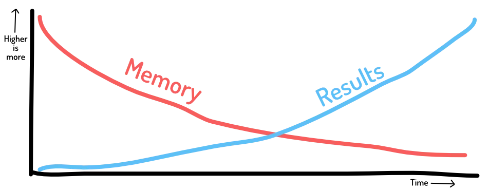
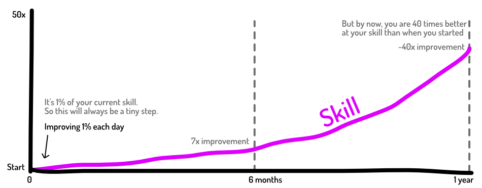

Humans are creatures of habit. If we do the same thing a few mornings in a row, it has now become a habit. Our body / mind _expects_ it now. We can't start the day without it. Even if it's absolutely not relevant anymore.

Conversely, if we don't perform our habits every day, we quickly lose them and forget about them.

This is the difference between habits and discipline. We _like_ habits. We feel _good_ for executing them. 

At the same time, we don't feel like it's a _burden_ or _too complicated_. Most habits are just a tiny activity that doesn't mean much on any single day. Their power comes from the repetition: doing that tiny good thing _every day_ for a longer time.

## The important graph

Remember this graph for the rest of your life.

This is the reason why habits are amazing, yet people think they are useless.

* Our _memory_ degrades over time. When we've just done something, our head is filled with that information. But if you've done something every day for the past year, you won't remember all that.
* But _results_ only get stronger over time. When you've just exercised, you're not immediately more muscular. But if you've exercises every day for the past year, you're way more fit than when you started.

The first few weeks of trying a new habit, you _will_ have this thought: "I've been doing this every day! And nothing's happening! This is stupid, I quit."

Ignore it. The graph above clearly explains why this happens, and why it's wrong.

If you get past that stage, your brain will change the message: "Huh, my muscles are quite nice. But I haven't even exercised that much?" You've forgotten all the effort, but the results are significant now.

{}
I keep using exercise / visual fitness as an example, because it's just very easy and general. This works for _anything_.
{}

## Tiny steps have use results

And to achieve this, the steps you take can be _really really small_. A tiny improvement a day, will lead to huge improvement over a year. 

Like this other graph. (I promise, after this we're done with graphs.)

_How is this calculated_? A 1% improvement means multiplying by `1.01`. If you do this 365 times, a full year, you take that number to the power `365`. This yields roughly `37.8`. This is not a near 40% improvement, it's 4000%.

Below I will give more explanation and detail about what that "1%" might mean to you. But an easy way to find it, is by simply calculating _time_ (or other numbers related to the habit). 

Let's say you lift weights every day. Normally, it would take you 10 minutes to go through your exercises. Improving by 1%, means you do the same exercises faster: in six fewer seconds. That's achievable, right?

Or, normally you'd use 5kg weights. Adding 1% means you now use 5.05kg weights. 

It will be hard to find fitness material with such granular level of control 😆 But you get the idea. 

In this case, you can compound the effect. Once every _ten days_, increase your weights by 0.5kg. (Because, `5 x 1.01^10` =~ `5.5`.)

## How to build good habits

Here's the trick.

> Make your task simpler and simpler, until it's so simple that you don't have much reason **not** to do it anymore.

Once you've done something several days in a row, it has become a habit. Once it's a habit, you can change and improve it. 

But you need to get over that first hurdle.

{}
You want to exercise each day. If you look online, you find training schedules and exercise sets. This is probably _too much_. You will not find the motivation to build that habit.

Instead, find the absolute _smallest_ set of exercise that you're willing to do. If that is just a _single push up_, then that's what it is. If you can't run for more than a minute---so be it.
{}

This is perhaps the most powerful statement in this guide. The most important thing in _any_ activity, is the fact that you will be able to do it again tomorrow.

{}
Many websites state that you "should" eat in the morning, because it's healthier. Actual health experts don't do this. They say "pick whatever moment that makes it easiest for you to _eat healthy_". 

If you're not hungry in the morning, or never motivated to pick healthy options, don't force yourself to eat in the morning. Form your habits around something that you can maintain.
{}

## How to get rid of bad habits

The first step is obviously to _identify_ those bad habits. They often sneak up on you, unseen and unwanted. They are often the result of _systems_ around you, like the education system in which most people are forced to spend their whole youth.

How to get rid of them? The exact same way as learning a new habit.

> Find the smallest change in the habit that you can execute. Repeat until the habit has become so small and irrelevant, you can eliminate it entirely.

This takes time. This takes conscious effort. Maybe you have to write it down on a piece of paper: the specific tiny steps you'll take until the habit is gone.

{}
I used to drink lemonade and other sugary drinks the whole day. It was very unhealthy, to say the least. But I couldn't stop it. My body craved that sugar, couldn't concentrate until I'd executed my _habit_ of drinking sweet stuff.

How did I remove it? By swapping _one_ glass of lemonade for a glass of water. I could do that. I maintained that for a week. Then I swapped another glass for water. I repeated that for a few weeks, until I was suddenly drinking water all day. Within a month, I removed this extremely unhealthy habit from my life, completely.
{}

{}
Our education system is very good at teaching completely unhealthy and useless habits when it comes to learning. For example, it teaches you that you have _one chance_ to pass something, to show what you can do, and that's it.

The consequence? I could never finish anything, because it had to be _perfect_, and I only had _one chance_ to show the world.

How did I lose this? I noticed that I could pick an idea I thought was _bad_ and create a very _tiny project_ from that. Because I wasn't so invested, I had no trouble doing multiple versions, just trying stuff and publishing it online. It was a throwaway idea.

After I did this for ~5 projects, my habit of perfectionism and "I have only one chance" was gone.
{}

## What are good habits?

Ah, that's basically the rest of this guide. Specific examples of habits and tricks that worked for me, or which are recommended by science.

Spoiler: they are _not_ the things that most schools teach you or that parents try to teach their children. Unfortunately.

But first, we can take this one step further. What's even better than habits? Environment.