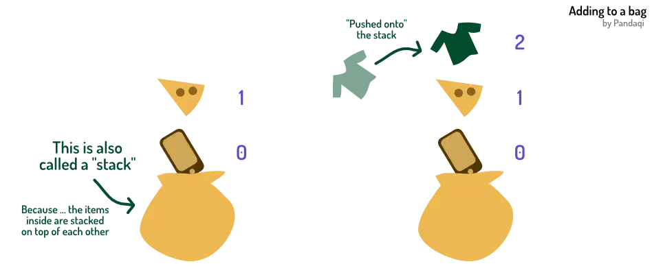
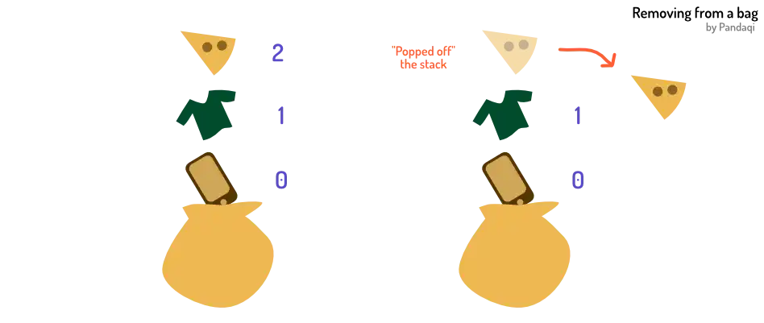

What can we do so far? We can define a bag and get what's inside. But that's not all you can do with a bag. We'd also like to **add** new things to it, or **remove** things from it.

More often than not, you _don't_ have all your information beforehand. Bags will start empty and will receive elements as the code executes.

Similarly, you might be done with an element at some point. It should be considered or executed anymore, so it has to be _removed_ from the bag.

Languages usually provide several ways to do this. As always, I give you the two basic syntaxes you need 99% of the time. (And from which you can create all the others.)

## Adding

Sometimes, this is called `push` or `append`. For my language, I just wrote this as a sentence.

> To add an element to a bag, use `add ELEM to BAGNAME`

{}

But _where_ is the element added?

Well, say you have a bag in real life. You throw something new in there. Where will it end up? At the top! On top of all the other things already in the bag!

The new element will always be the _last one_, at the highest index.


bag cart holds
  "Milk"
  "Water"
  "Wine"
&nbsp;
add "Crisps" to cart
say cart


Other languages might allow you to add elements at the _front_ or anywhere in between. This is ... fine, but not recommended.

Why? Think about it. If you add a new element at index `0` ... all the other elements need to _move_. They need to be moved to a new spot, one index higher. To make space for that new element at the start.

This is both costly (to calculate for a computer) and will introduce all sorts of bugs (because your bag order keeps changing).

As such, try to never do this. Pushing new elements to the end is what you want. Sometimes, this means you must save your bag in a different way to make this possible.

This is another advantage of numbered lists. You have a clear start and end. If you named your items ... what's the last one? What's the first one? You don't know, so these useful functions don't exist for named bags. 

Of course, each programming language _does_ provide a way to add or remove elements from a named bag. But I decided that was just one step too far for this introductory course on coding.

## Removing

This is often called `pop`: you pop the last element out of the bag. My languages uses a sentence that explains itself.

> To remove the last element, use `take out of BAGNAME`

{}

Often, you're not just interested in _removing_ it, you also want to know _what you removed_. As such, this action will usually give you the removed item.


bag cart holds
  "Milk"
  "Water"
  "Wine"
&nbsp;
say "Last element: " + (take out of cart)
say "Cart is now: "
say cart


Why the _last_ element? Same reason as before. No elements need to be moved around to fill the space. It's faster for the computer _and_ prevents silly indexing bugs.

Again, aim to never remove other elements than the last.

## CRUD

We've now covered all you can do with a bag:

* **C**reate it
* **R**ead data from it
* **U**pdate elements inside it
* **D**elete from it

Woah ... what a coincidence ... the first letters spell CRUD. Just like the heading for this section!

CRUD is an acronym for the four basic actions you can perform on data. No matter what you're making, no matter your language, they _will_ have syntax for these four things. If you learn a new language, research the syntax for the CRUD, and you'll be able to solve most problems.

Any "thing" that supports these is called a **data structure**. My language only has one: the bag. Other languages might have many more.

Most importantly, when coding you _create your own data structures_. For example, in a game you might have a data structure called "Player". It holds _everything_ related to the player: their name, their level, where they are right now, the 3D model to load on screen, etcetera.

Whenever you create such a structure, start with the CRUD. Start by writing clean code to

* Create new players (or properties of the player)
* Read the current status of the player
* Update the player when something happens in the game
* Delete the player (or their properties) when done with them

Once you've done this a few times, this is easy---maybe even "boring". But if you don't start with this, you'll run into issues later. Your code won't be set up for one of these basic actions, and you either need a huge rewrite to support it, or your code grows messier by the minute.

Because just like all code are data transformations, all data needs the CRUD to do 99% of its work.

## Exercises

### Exercise 1: check duplicate usernames

You're writing code for creating a new account (on your website). Obviously, no two users may have the same name!

Write code that ...

* Creates a bag of usernames
* When given a username, checks if it already exists
* Only if _not_ the case, add the user to the bag

{}





bag users holds
  "CoolBoy"
  "PizzaPlayer"
  "MisterZebra"
&nbsp;
now newUserName means "Jimmy"
now userExists means false
search users's values
  if (bamboo value) is newUserName
    now userExists means true
    stop
&nbsp;
if not userExists
  add newUserName to users
&nbsp;
say users


As always, experiment. Try adding names that already exist or not. Change the users bag.

### Exercise 2: player login

You're building an online game. At any moment, players can join the server. Every thirty seconds, however, the player in last place is kicked from the game.

Write code that ...

* Creates a bag of players
* If a new player joined, add their name to the bag
* If a player is kicked, remove the last element from the bag
* (Yes, for simplicity, we assume that the player list is sorted constantly. So the player in last place is also at the last index.)

{}





bag players holds
  "CoolBoy"
  "PizzaPlayer"
  "MisterZebra"
&nbsp;
now playerJoined means false
now newPlayerName means "CandyCrusher"
if playerJoined
  add newPlayerName to players
&nbsp;
now playerLeft means true
if playerLeft
  take out of players
&nbsp;
say players


## Modulus

Before we leave our world of bags, I want to introduce one more operator. And I want to do it here, because it is _especially_ useful here.

You (likely) already learned this in elementary school. But under a different name: "division with remainder". The fancy, official name for this is the "modulo" operation.

But it's the same thing. 

> To apply modulus, use `NUM mod NUM` (or `NUM % NUM`)

{}


5 mod 2
7 mod 4
13 mod 2.5


This operator

* Divides the first number by the second.
* Gives back whatever remains

It's a lesser known operator, but it becomes very useful when working with bags. 

Why? The modulo is sometimes called the cycling operator. With it, you can ensure your indices stay within the bag bounds. Instead of going higher and higher, a number _cycles_ back to 0 once it reaches a maximum.

### Example: an error

The code below errors.


bag data holds
  0
  5
&nbsp;
now index means 0
say data's index
&nbsp;
change index by 1
say data's index
&nbsp;
change index by 1
say data's index


We try to access index `2` ... but the bag only has indices `0` and `1`!

How do we keep our index within bounds? 

### Fixing the error

You guessed it: by applying a modulo. By doing our index _modulo the size of the bag_, it will cycle back to 0 once it goes above that threshold.


bag data holds
  0
  5
&nbsp;
now dataSize means data's size
now index means 0 mod dataSize
say data's index
&nbsp;
now index means (index + 1) mod dataSize
say data's index
&nbsp;
now index means (index + 1) mod dataSize
say data's index


When working with bags or loops, you'll need this modulo _very often_. It's also useful any other time you need a number to stay within a certain range.

Here's a quick exercise to see if you understood. How would you use the modulo operator to **check if a number is even or odd**? 

No worries if you can't figure it out: I'll use this in an upcoming example. But I'd still like you to think about it and figure it out on you own.

{}
The final operator supported by most languages is the **exponential**. You create it with `^` or `exp`. So, two squared is `2^2`. More on that in a few chapters.
{}