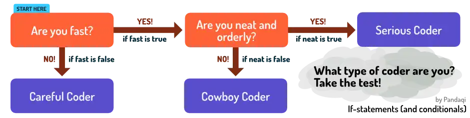

What you've learned so far is already very _powerful_. Hopefully you've played around with the examples, tried writing your own little programs. Calculate something, store it, output it. Exactly the steps in our "problem solving" loop from the beginning.

But there are clear limitations. You can't write any complex game or app with just this. Previous chapter mentioned the fact that we can't do anything with numbers yet, like _rounding_ it to the nearest value. 

Or what if you want an app that says different things depending on the type of day? "Good morning" in the morning, "Good evening" in the evening, and so forth. Now our code just executes _everything_ (from top to bottom). It would give _all_ the greetings, always!

What do we need? What would help us solve problems even faster?

* To change what is or isn't executed.
* To transform the data further.
* To _collect_ multiple values into one variable.
* Similarly, to _repeat_ code easily. (As opposed to copy-pasting it and changing it slightly.)

The rest of this course will fill in these gaps. Let's start with the first two. Like before, I use the order of _booleans_, _numbers_ and then _strings_

## Conditionals

The word "conditionals" might seem daunting. But it means a simple thing.

> Execute something only if a certain _condition_ is met

Is it morning? Say good morning. Is a user logged in? Redirect to their account page. Is the spacebar pressed? Jump.

In terms of coding, it means we **check if a bool is true**. That's it. That's the whole thing. The syntax is exactly as you'd expect.

> Define a conditional with: `if someBooleanHere`

{}

It's like those decision trees you'd find in kid's magazines, often disguised as "identity tests" or "find out your favorite X".

It's a simple idea. Hidden within, though, is a very powerful tool. Blink and you miss it.

Because a boolean is just `true` or `false`---but there are _many_ questions you can ask that have a "yes" or "no" answer.

## Grouping

Before we can dive into that, however, I need to explain one more thing. How does it _know_ what code belongs to the conditional? What part should or shouldn't be executed?

There needs to be some way to say: "hey, this is a group of code that belongs together". Only if the conditional is true, you execute the first group after it.

Different languages "group" code in a different way. (Often they are called _code blocks_ or _scope_.) Many use symbols like `{` and `}`.

As always, I leave symbols out of my introductory language. Which means I simply use **space**.

> After a conditional, mark the group by adding a space or tab before the lines

You'll understand this immediately when you see the examples.

## Equals

You probably already guessed this one.

> Ask if two values are the same with `is`

{}


if 5 is 5
    say "Same!"
&nbsp;
if "hello" is "HELLO"
    say "Nope, won't say this"


Only the first is true. Hence, only the code group after it is executed.

Here's where you can see the first magic! Because remember, a conditional just checks if a boolean is true. That's the default behavior. So, when you type `5 is 5` you actually created a _new_ value. A boolean, one that is true.

In other words, all the keywords you learn in this chapter can be used to transform data again. You can store the results of these inside variables---which is something I often recommend.


now myVar means 5 is 5
if myVar
    say "Same!"


See that? The `5 is 5` is just a bool. One we can give a name and store in a variable. 

Data transformations! All coding is data transformation! By simply typing `is` between two values, we _transform_ them into one boolean. Which is true if they're the same, and false otherwise.

This means ... that the easiest if-statement you could write ... is just using something that's already a boolean!


now userLoggedIn means true
if userLoggedIn
    say "Welcome back!"


This code reads just like English. By giving our variable a nice name, the code says exactly what it does. Nice!

Don't worry if you don't immediately grasp the full consequences. As you work through this chapter, you'll realize its power.

## Not (negate)

What if we want to check if something is _not_ true? Then we invert or negate it. If it's true, it has now become false. It it's false, it has now become true.

> Invert a bool with `not` before it

{}

In other words, you ask if the value inside is _false_ instead of true.


now passwordCorrect means false
if passwordCorrect
    say "Welcome!"
&nbsp;
if not passwordCorrect
    say "Try again!"


## And

Okay, so we can turn any data into one boolean. Numbers, strings, it doesn't matter. For example, typing `"hey" is "hey"` gives you a boolean that's `true`.

What's the next step? _Combining_ multiple booleans into one new conditional!

> Combine two bools using `both VAL1 and VAL2`

{}

In other words, you ask if both of these are _true_ at the same time.


now day means 14
now month means "February"
if both (day is 14) and (month is "February")
    say "Valentine's Day!"


Aha, we encounter an issue! We need to put brackets around the two booleans. Why? Again, because of how computers work.

A computer needs to know, _for sure_, what you're saying. Both the word `is` and `and` can create a new boolean. So, if you type the if statement all in one go (no brackets) ... it doesn't know where to start.

It sees "day is 14 and month is February". It might interpret that as 

* `day is   (14 and     (month is February))`
* `((day is 14)     and month)  is February`
* ... or any other order

By adding brackets, we tell it

* Hey, determine these two booleans _first_
* Then _combine_ them with the `and` keyword

Operation order is a common cause of "ninja errors". The code often does **not** crash. It will **not** tell you there's an error. The computer just executes what you wrote, according to its own rules. 

But the _result_ is wrong. The error is silent, but deadly. The booleans are evaluated ( = given their "yes"/"no" response) in the wrong order.

{}
Most languages will not error in this case. Mine does because it requires the `both` keyword in front. Why did I add it? Firstly, because it's intuitive. Secondly, because the word `and` is already used by another part of my language. So I couldn't use it again---on its own---here! For precisely the reason I just stated!
{}

## Exercise 1

Let's do a quick test. Not about syntax, but about good coding habits.

Knowing what you do now, how could you make the code above _even better_? Not faster or shorter, but _better_. So it tells you exactly what it does in regular English.

It's a simple change that adds one line of code and requires a good variable name.





now day means 14
now month means "February"
now valentinesDay means both (day is 14) and (month is "February")
&nbsp;
if valentinesDay
    say "Valentine's Day!"


This statement is already quite long. I wouldn't make them any longer, if I were you. How do you prevent that? You guessed it: save the bools inside even more variables!

If you really wanted, you could rewrite the above to ...


now day means 14
now day14 means (day is 14)
now month means "February"
now monthFeb means (month is "February")
now valentinesDay means both day14 and monthFeb
&nbsp;
if valentinesDay
    say "Valentine's Day!"


Maybe you think that's too much, maybe not. The idea is that you _can_. Because conditionals just give you a boolean you can store and reuse. Try changing `day` or `month` in the examples above and check if the output is correct. In fact, try adding your own favorite special days to the code! Like your birthday, or Christmas.

## Exercise 2

Write code for a game about defeating monsters. 

* The monster should grunt "ARGH" when it it's almost dead
* And it should say "YOU WIN" when it dies.

Remember the data transformations. What's your specific output? What do you need as input for that?

Well, our output is a statement (ARGH or YOU WIN) _if a certain condition is met_. So we need a conditional that checks if the monster is dead or almost dead.

Okay. How do we check that? What is "dead" in numbers? You probably thought of a _health bar_ or _lives_. And dead is defined as `0`: no health left.

{}

Knowing this, putting it into code is merely the final step. You've already written what every line does. Now you just write it in the way the computer understands it.





now lives means 2
&nbsp;
if lives is 1
    say "ARGH"
&nbsp;
if lives is 0
    say "YOU WIN"


You're already on your way to a game here! You only need to _change_ the lives variable when the monster is hit. If you're up for a real challenge, try to write the extended code with the full cycle of: 

* Player presses a key
* Change lives
* Output result

Just remember what booleans are. If you can turn something into a "yes"/"no" question, you want to create a conditional. Does the player press a key? Yes or no. Is the monster dead? Yes or no.

Also remember the importance of using variables to give things useful names. The example above could be written more clearly as ...


now lives means 2
now almostDead means (lives is 1)
now dead means (lives is 0)
&nbsp;
if almostDead
    say "ARGH"
&nbsp;
if dead
    say "YOU WIN"


Next chapter talks about more conditionals and a few edge cases. Like ... what happens if you compare two different data types with `is`? Maybe you already tried that---maybe you want to do that now.