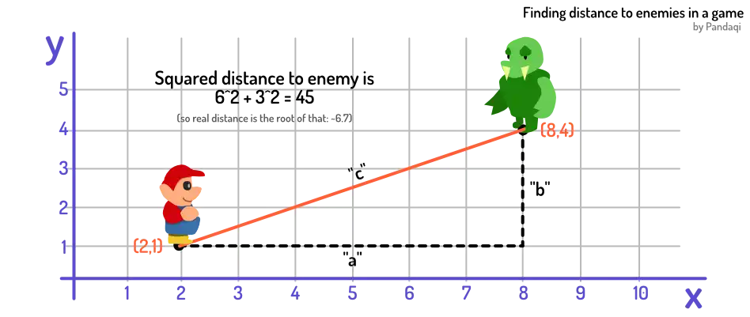

As you know by now, I am fond of recreating functionality yourself. Even if a language supports something (with an easy keyword), I think it's a _great_ exercise to try and code it yourself.

It's the difference between "memorizing a word" and "actually understanding how coding works".

As such, this chapter we will recreate two math operators ourselves: **exponential** and **modulus**

## Exponential

Let's remind ourselves of what it does. 

{}


now twoSquared means 2^2
now fourCubed means 4^3


It multiplies the _first number_ with itself, as many times as the _second number_. If you're completely new to coding, this might seem like a useless thing to have. When would you use this? Why would you ever want to do that?

Well, maybe you remember the **Pythagoras Theorem**? It says `a^2 + b^2 = c^2`. In other words, given a triangle with a right angle, the square of each short side (summed) is equal to the square of the long side.

Maybe you still don't think much of it. How often do I need to calculate triangles?

Triangles are _everywhere_. For example, think back to our example of a player inside a game. Their position is defined with X and Y coordinates. How do we get the _distance_ between the player and an enemy? You guessed it: triangles and exponentiation.

A data transformation, again. Given two inputs (two positions), change it to become one number (the distance between them).

### Writing it ourselves

Let's pretend our language can't do this. We want to create a **machine** that does exponentiation. How do we implement this on our own? 

Think about the definition.

* It requires two numbers. Hence, our machine will need two inputs
* It outputs one number. Hence, we need to combine the inputs in some way.
* It multiplies itself _as many times as_ the second number. Hey, that sounds like ... a **loop**!

Try to turn this overview into code. Then check my solution below.





machine expo wants a and b
  now num means 1.0
  repeat b times
    now num means (a times num)
&nbsp;
say (give 2 and 2 to expo)
say (give 4 and 3 to expo)


## Modulus

We saw the modulus operator at [Bags III](../bags-iii/). 

{}


5 mod 2
7 mod 2.5


I already explained why it's important, so let's dive into recreating it immediately.

It's division with remainder. What does that mean?

* The input is two numbers: a starting number and a divider
* The output is one number (that's always between 0 and the divider)
* We need to _keep making our number smaller_ until our output is valid. (It's between 0 and the divider.) That is the remainder. 

Hey, that sounds like a **loop** again!

Write a machine to perform modulus. Then check my solution below.





machine modulo wants a and b
  now num means a
  repeat 
    if num below b
      stop 
    now num means (num minus b)
  num
&nbsp;
say (give 5 and 2 to modulo)
say (give 7 and 2.5 to modulo)


### More advanced

There's an even faster way. Without a loop. 

Think about it. It's _division_ with a remainder. So shouldn't we be able to do something with division?

Yes, we should. Here's the idea.

* The calculation `a / b` gives us exactly how often "b" fits inside "a".
* But we're looking for how often "b" fits inside "a" if it has to be a _whole number_.
* So we `floor` the result!

Now we know how often `b` fits inside `a` exactly. Then we remove the bite that this takes out of `a`. We're left with the remainder.


machine modulo wants a and b
  now numTimesItFits means floor (a divide b)
  now bite means (numTimesItFits times b)
  now remainder means a minus bite
&nbsp;
say (give 5 and 2 to modulo)
say (give 7 and 2.5 to modulo)


Maybe this makes sense, maybe you think this is weird dark magic.

But I give these examples (and exercises) because they build intuition for problem solving. They are supposed to be hard, because you need to grow in understanding. Your brain has to take a "mental leap" to more logical and mathematical thinking. 

{}
We don't have this talent by default. And schools work very hard to _remove_ logical thinking from our brain.
{}

Once this leap has been taken, you'll notice how so many coding problems just became easier and simpler. Memorizing syntax is easier, yes, and also useless.

You now understand what math operators do behind the scenes. You understand the tricks to change data and get what you want out of it. If your programming language misses some feature, you now understand that you can create it yourself. 

Or, at least, your path _towards_ understanding has begun!