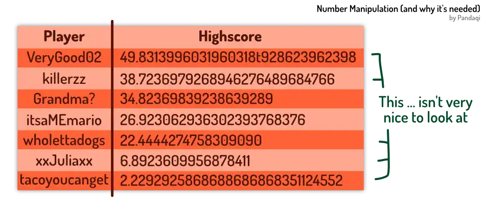

This chapter is probably most fun if we use an example throughout. (Otherwise, numbers easily become abstract and, well, boring.) Many courses leave chapters like this for last---or leave them out entirely.

To me, that's one of the reasons many beginners form bad habits. Or they finish a course ... and then have no clue where to go! Because---say it with me---all coding is about simple _data transformations_. 

Any problem can be solved if you know how to convert any _input_ (bools, numbers, strings) to any other _output_.

That's why I include chapters like these early on!

So let's start our example. We are building an app (again) and want to display some sort of _leaderboard_. High scores, results, a ranking, something of that kind. The end result is to display all users as a row with two values: their username + their score. 

## Rounding

Our highscores can be anything. A player might get `12909.290` points, or `2.348`. That's not nice to display, is it? It might make the table so _wide_ it doesn't fit on the screen! 

Instead, we want to _round_ this number. You probably learned this in school:

* If the fraction is below 0.5, we round to the first whole number _below_ the current value.
* Otherwise, we round to the first whole number _above_ the current value.

Any language will provide a quick `round` keyword. Just like mine :)

{}


now score means 120.3898
now scoreRounded means round score
say "Score is: " plus scoreRounded


In a way, this converts between two numbers: _integers_ and _non-integers_. Between whole numbers and numbers with a fraction ("floating point numbers", or `floats`).

Maybe you think this is unfair. If somebody gets `10.5`, their highscore is `11`. Much higher!

* For this, you get the `floor` keyword. It always rounds _down_. 
* Similarly, the `ceiling` keyword always rounds _up_. 

I support all three. Try it! But not all programming languages have this support. 

Why? Because you only need one to also create all the others.

### Exercise 1

This is a great exercise for you! Think about it. If you have only _one_ of these functions, how can you do the other actions? 

When I realized this simple trick, it was like I suddenly understood. Understood how powerful coding can be if you think out of the box. If you think logically.




Ready for the solution? 


now score means 12.35
&nbsp;
say floor score
say floor score plus 1.0
say floor score plus 0.5


Let's say we only have `floor`. It always rounds down to the nearest integer. 

* How can we do a ceiling (round up)? By adding `1.0` to the number we're changing!
* How can we round? By adding `0.5` to the number we're changing!

Let that sink in for a moment. It's a very simple example of how coding works. You only get a handful of tiny, simple words to tell the computer. It's your job to find creative ways to turn those into a _solution_ to any puzzle!

A smart change in your input can often solve everything.

### Exercise 2

This is another example of that principle. Let's say we want to round the number, but still keep a few decimals. We're fine with highscores like `2.23` instead of `2.23869`.

How? How do you do it? You already have everything you need. 

You only need one of those rounding functions. Be smart about how you _transform_ your data.





now score means 2.23869
now scoreRound means round (score times 100)
now scoreFraction means scoreRound divide 100
say scoreFraction


The answer?

* First you multiply the number by 100
* Then you round _that_
* Then you divide by 100 again

Because you added and removed 100, the number stays the same. But because you divided the number after rounding, you get two decimals back. 

Of course, change 100 to another number (10, 1000, ...) to get fewer or more decimals.

## Absolute

Now we track something else in our table. Maybe our game has a second thing you can do: you can find special treasure chests!

Let's say two players are battling each other. We want to display, on the screen, the _difference_ between their treasure count. For example, if player 1 has found 3 chests and player 2 has found 5, their difference is 2.

How do we do this? You probably know the answer: subtraction. But this doesn't work. Why? We might get a negative number! 

If we start with player 1, we get `3 - 5 = -2`. That doesn't make sense. The "difference" between two things can never be a negative number.

How do you solve this? By taking the **absolute value** with `abs`. It says: "does our number have a negative sign? remove it!"

{}


now treasure1 means 3
now treasure2 means 5
say abs (treasure1 minus treasure2)


### Exercise 1

This exercise is the same one as last time. You can write the same code _without_ that keyword. 

How would you do it? How would you ensure the numbers are subtracted in the right order? (Highest one first.)

Try it yourself first. Then check my solution below.





now treasure1 means 3
now treasure2 means 5
&nbsp;
if treasure1 above treasure2
    say treasure1 minus treasure2
&nbsp;
if treasure2 above treasure1
    say treasure2 minus treasure1


### Exercise 2

Now try making treasure1 and treasure2 _the same_. It won't print anything. Why? Think about it, before reading my answer.

The `above` keyword is "greater than". Not "greater than or equals". So if the values are the same, both if-statements _fail_ and nothing is said!

How would you solve this? How can you turn "greater than X" into "greater than or equal to X"?

It's the same trick as before 🙂 Reduce X by 1. Change the input, in a smart way, to get your output.


now treasure1 means 3
now treasure2 means 3
if treasure2 above (treasure1 minus 1)
    say treasure2 minus treasure1


## Conversion

Oh no! We're still in trouble. Let's say we wrote code to set a new highscore, but made a mistake.

We never check if the new highscore is actually _higher_ than the previous! (A rookie mistake ... that I still make.)

So, we grab the old value, try to compare it and ... it fails?


now oldScore means "3.290"
now newScore means 4.59
if newScore above oldScore
    say "Updated!"


You see what I see? The old score is a _string_. Of course! It's a piece of text we pulled from that highscore table! To compare it with a number---properly---we first need to turn it into an integer.

{}
Yes, I turned off the type coercion just for this example. Most dynamic languages would just coerce the string to a number automatically (making the if-statement true), while all static languages will error and completely stop you from doing this.
{}

Most languages will have a dedicated keyword for converting a string to a number. For my language, it's simply `number`.

{}


now oldScore means number "3.290"
now newScore means 4.59
if newScore above oldScore
    say "Updated!"


## Warnings

There are some number transformations that can blow up in your face.

First is **division by zero**. You can't! Some languages strictly forbid this. Others try to produce some value, like "Infinity". But now your variable holds "Infinity"---and you certainly can't do calculations with that!

As such, if your program gives wildly inaccurate numbers ... you probably divided by zero somewhere.

Secondly, computers **can't store all numbers**. They only have finite memory. They can't store _all numbers in existence_. (Which is an infinite amount, by the way.) They only store _some_ numbers.

That means that you can enter numbers that are "too high". The computer can't store them. What happens then is ... unpredictable, but it's never nice.

It also, thirdly, means you get **float rounding errors**. That's why I mentioned that word, `float`, earlier. It simply means a number with decimals.

If you save a value the computer doesn't have, it will _round_ that to the closest one it knows. Over time, these rounding errors can make your program _wrong_. What started as `1.23456` suddenly became `1.23457`. 

That's why it's recommended to not rely on these "exact" decimals. 

* Write your code such that you can often round your numbers. Now you know how to do that!
* Don't check equality between floats. If you check `number is 0`, but that number could be `0.001`, then the bool will be unpredictable and often `false`! Even if it's _very close_ to `0`.

These might seem like "advanced" tips. But these computer quirks are likely (frustrating!) errors a newbie will encounter ... and not understand.

## Conclusion

Now you can convert anything into a number! Or convert numbers into different formats. You're becoming a master of data transformation.

Finally, let's look at how we can transform **strings** in fun ways.