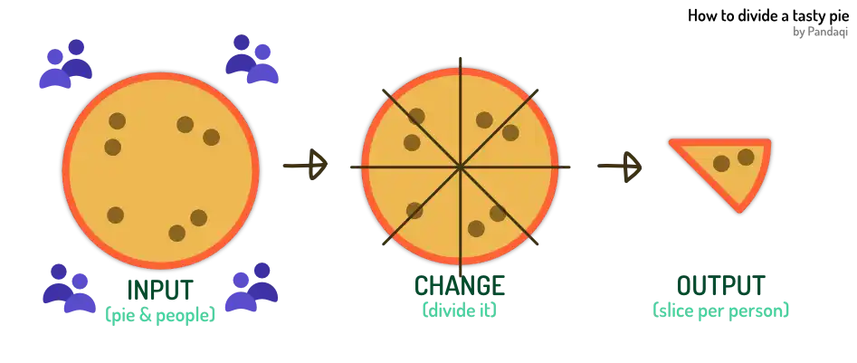
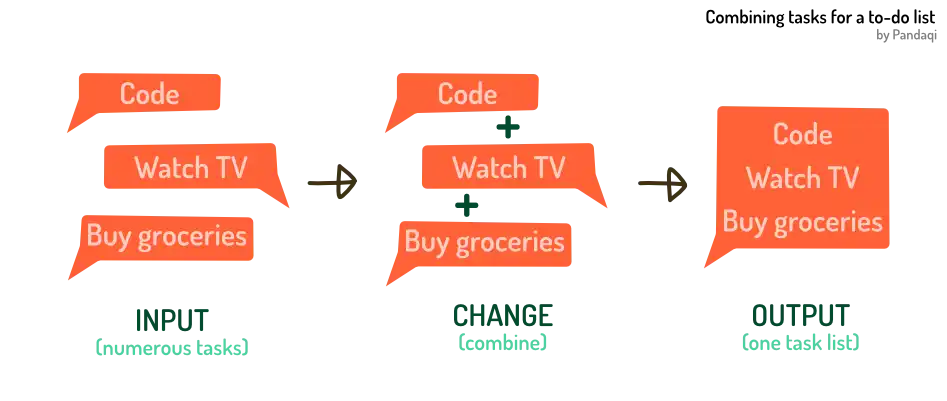
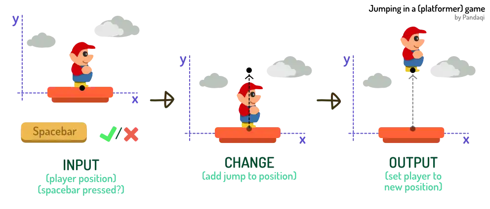

You have something you want to do. A problem to solve---or a _puzzle_, that sounds more fun. 

Say you're making a game. You want the character to **jump** when the player presses spacebar. It won't happen magically. Hey, that's a puzzle we need to solve!

How do you get that character to jump? How do you know when the player presses spacebar? _How do you tell the computer how to solve this problem?_

And that's where programming (or coding) comes in.

It provides a language, a _grammar_, for communicating your idea with the computer. For telling it what "jumping" means, or what "spacebar" means. The computer doesn't know! It's just a calculator! It only knows numbers and arithmetic.

{}
I once heard a fun quote about this. "Which one is smarter, a shoe or your smartphone?" The answer ... it's a tie. They're both equally dumb.
{}

## The coding loop

This means programming _always_ has the following steps. You ...

* Find your problem
* Ask **input**: the information you need. (What's the status of that spacebar key?) 
* Turn it into numbers
* Get **output**: convert the numbers into what you wanted to do. (How much should the player move upwards?)
* Apply that to solve your problem!

The formal term for this is **"data transformation"**. It just means you get some numbers as _input_,  _change_ them, then do something with that _output_. Because numbers are "data". And "transform" is just another word for change.

As you read this course, you'll see that coding is just this loop over and over. And I'll give more tips about how to code _well_, now that you know about data transformations.

In fact, I'll remind you about this every time. Whenever I introduce a new idea or syntax, I'll add a little icon () and state the data transformation happening. On wide screens, these appear to the side (with the other side notes). On small screens, they appear within the text.

{}

## Example 1

Let's see our first example. We have a delicious pie and want to divide it among everyone at the party. Obviously, we want everyone to get an equal slice of pie!

What do we do?

* We collect our input: the pie and how many people there are
* We transform it: divide the pie by that amount of people
* We output it: print what percentage everyone gets (on our screen)


now pie means 100
now numberOfPeople means 10
now slice means pie / numberOfPeople
say slice


Try it! Change the number of people to another number.

Yes, you've learned your first keyword: `say`. Whatever comes after it is printed on the page! Use this to get feedback on what the code is doing, throughout this course.

{}
Results from examples always show below the code block. All languages have this and usually call it **logging**. Because its main purpose is to log errors, warnings or output while you try to develop.
{}

{}
Press the "settings" icon (top right) to change what the examples print to your browser.
{}

## Example 2

Maybe I'm designing an app for keeping a "to-do list". I want to display the whole list to the user at the home screen. 

What do we do?

* We collect our input: all the tasks on the list
* We transform it: we add them together
* We output it: we print this list to the user


now task1 means " - Do the dishes"
now task2 means " - Fix that code"
now taskList means task1 plus task2
say taskList


All programming languages can handle text like above. Pretty much all of them place text between quotes (`"`)---but more on that soon.

Try it! See if you can add more tasks to the list.

## Example 3

Let's finish this chapter with a more challenging example. Let's try to write code for our "player jumping" example. (Like in a platformer game, such as Mario.) 

Try to figure out the general idea---before reading the code. Think about the data transformation: what information do you put in? And how do you need to change it? 

Sometimes it helps to make it more specific: what _exactly_ do we want as output? Can we turn that into a _number_?

Jumping means going _up_, vertically, right? This means the computer needs some concept of _horizontal_ and _vertical_. Fortunately, any software will have that by default. They are called the **x-axis** (horizontal) and the **y-axis** (vertical). 

But that's not enough. What is _up_? The computer doesn't know---it knows nothing. We need to _tell_ it what we think  is "up". In our case, let's say that _higher numbers_ means up. (So Y = 5 is more up than Y = 4.)

Now we've turned our problem into _numbers_!

To make the player go up when spacebar is pressed, we also need this data:

* Where the player is _now_. We can't go "higher than we are" if we don't know where we are now!
* Whether spacebar is pressed: either yes or no. In coding, this is often called `true` or `false`

Any "game engine" will have a simple function to check whether a key is pressed. (Or the mouse used, or a joystick moved, etcetera.)

Our wanted _output_ is this new position of the player. What is this? It's their _old_ position plus the _change_.

Bringing it together, the code might look like this.


now playerY means 15.0
now spacebarPressed means true
now jumpPower means 10.0
&nbsp;
if spacebarPressed
    now playerY means (playerY plus jumpPower)
&nbsp;
say "New player position: " + playerY


Voila!

## A real example

I want this course to be _practical_. So let me tell you what I'm working on _right now_. An actual, real-life, application of the ideas above.

### Getting a random word

I publish games under the [Pandaqi](https://pandaqi.com) name. Lately, I had many ideas for _word games_. 

Which gave me a problem: how do I get a random list of English words a player could draw / use?

Let's identify our data transformation.

* **Input**: a big wall of text
* **Change**: convert the text into individual words
* **Output**: tell the player this selected word

Where do we get our input? You probably just said: a dictionary. But ... a paper dictionary obviously wouldn't do. Nor would an online website. Computers don't understand clicking, buttons and interfaces. 

Computers calculate and see patterns, that's all. So they'll only understand the words if I give them in a predictable _pattern_.

I ended up creating a new text (`.txt`) file for each category of words. Within, I wrote every word on _its own line_. Then I can use code to detect when a new line starts: what follows will be a single word.

Tada! Now my code transforms the data correctly. It takes a file (input), cuts them into individual words (change), then gives me one random word from that list (output)

I've spent the past few weeks building this dictionary. Others have had the same idea ... but I couldn't use theirs. My games have more specific requirements, such as words being easy enough that even a child would understand. 

As you code more, you'll see this is often the case. Copy-pasting somebody else's code can be the solution. But your _problem_ to solve is often (slightly) different, which means coding your own solution is better in the long run.

### Generating images

Similarly, I've created board games where you can _randomly generate_ a board! (Such as [Timely Transports](https://pandaqi.com/timely-transports) or my first word game [Keebble](https://pandaqi.com/keebble).)

The data transformation is clear.

* **Input**: the settings a player wants to use. (Number of players, paper size, difficulty, etcetera.)
* **Change**: convert these to visual marks on the page. (For example, place a "starting square" for each player.)
* **Output**: the final graphics as an image to download / print

Look at any digital project with this perspective. You'll start to notice the data transformations making it all happen. Once you have an intuition for that, you're already 90% a professional programmer.

## Conclusion

Next chapter will dive into actual code writing. Let's continue this adventure!