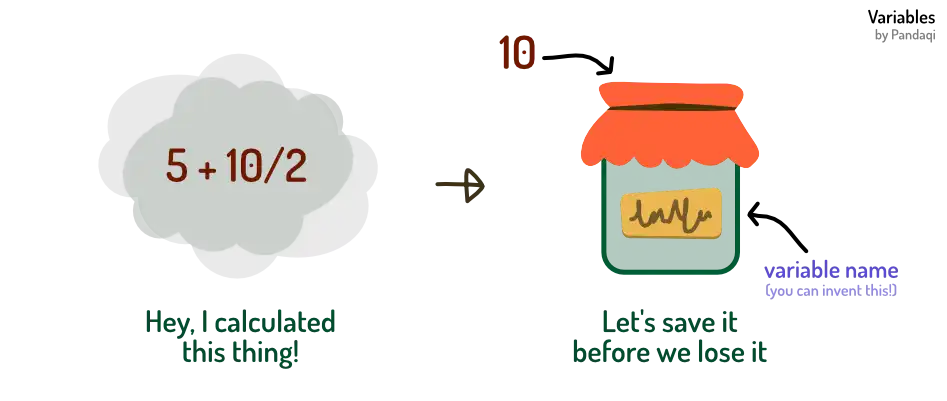

Alright, you can now define data (bool, number, string) and do some calculations. But once you have your result, you want to _store_ it somewhere. You want to put your data on a shelf with a clear label that says what's inside. Otherwise, you'd have to redo the whole calculation every time!

This is called a **variable**.

## Data flies away

To give an analogy, imagine your data as a butterfly. If you don't catch it, it will fly away and disappear. The computer didn't know you wanted to keep that! It's dumb---you need to _tell_ it.

So you trap the butterfly inside a box, a jar, something. And you put a label on it saying "Butterfly".

That's what a variable is. A label for some data you collected, so you don't forget.

Why "variable"? Why not "data container"? Firstly, because that sounds horrible 😉; Secondly, because you can also _change_ it as you go. The data can _vary_. Pretty useful, seeing that coding is just changing data. 

In my analogy, this is like opening the box and swapping the butterfly with another insect. Like a spider. You can still find the jar if you search for the label "Butterfly", but the data inside changed.

This analogy, hopefully, also shows the dangers. A jar labeled "Butterfly" is pretty confusing once it contains a spider. Useless, one might say.

As such, it's vital to

* Invent a _good_ name that fits
* Never change the nature of what's inside (so the name becomes incorrect)
* Prevent overwriting a value you wanted to keep with a new value

## Syntax

From now on, most chapters will introduce some "syntax". Syntax simply means: "what word must I type to achieve this?"

These will appear inside blue boxes. They explain how to do this thing in _my_ example language. It will often be very close to how others do it, albeit simpler and more readable.

### Define

You already know this syntax. In all the examples so far, I've used it!

> Define a variable with `now NAME means VALUE`

To change it, simply put a new value inside. Yes, you can use the old value for those calculations. In fact, that's what you do most of the time.


now myNum means 10
now myNum means myNum + 10
myNum + 10
say myNum


Notice how the output is 20, not 30. That third line (`myNum + 10`) calculates it, but never stores it! The butterfly was spotted ... then flew away.

### Change

Changing a variable and _saving it back in itself_ is so common that most languages have a "shorthand". A quicker way to do it.

> Change a variable (numerically) with `change NAME by VALUE`

{}


now myNum means 0
change myNum by 10
change myNum by -5
say myNum


I only provide one. That's all you need for this course. 

But if you ever see something like `+=` or `*=` in other languages, it's a shorthand for this. Something like `var += 2` is identical to `var = var + 2`.

This is one of the major stumbling blocks for newbie coders. This idea that you need to _store_ everything you do. And this weird notation with multiple symbols after each other. That's why, for my introductory language, I try to ignore symbols and write everything in simple sentences.

Just remember the butterfly analogy---and everything will be alright.