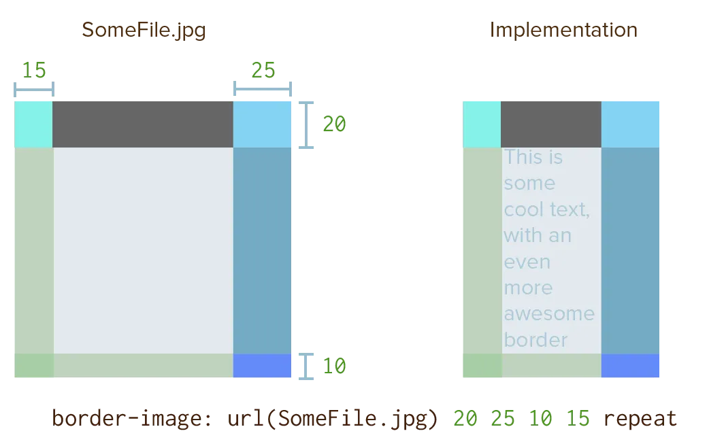

When I explained the box model---quite some chapters ago by now---one of the four properties was the **border**. By default, this is invisible, which allowed me to ignore it until now.

Why? Because it's really powerful, but also requires a bit more explanation of new ideas.

## A simple border

The border of a CSS element has **three** properties.

* Thickness
* Style
* Color

If you don't set all three, the border will not show up. 

{}
This is a common frustration for beginners: they set a border color, but it doesn't show up! Why? Because they haven't also given a thickness and type to the border!
{}

As usual, you can set all three at once with the `border` property. But in this course, we'll always start by being explicit and setting them one by one.

* `border-thickness`: a number (with unit!) 
* `border-style`: a style from a list of named values. (The default, which you need 99% of the time, is `solid`.)
* `border-color`: any color.




Lorem ipsum dolor sit amet, consectetur adipiscing elit, sed do eiusmod tempor incididunt ut labore et dolore magna aliqua. Ut enim ad minim veniam, quis nostrud exercitation ullamco laboris nisi ut aliquip ex ea commodo consequat.



p {
  margin: 20px;
  border-thickness: 5px;
  border-style: solid;
  border-color: black;
  /* border: 5px solid black; */
}



{}
This is a reminder that this course is **not** a documentation. If you want to know all the values that `border-style` can take, visit the [MDN Docs](https://developer.mozilla.org/en-US/docs/Web/CSS). This course is a practical beginner guide that efficiently leads you into the world of CSS.
{}

## A rounded border

One easy way to make the designs less ... "boxy" is by making the corners of the border _rounded_.

Use the `border-radius` property for this, which receives a number. 




Lorem ipsum dolor sit amet, consectetur adipiscing elit, sed do eiusmod tempor incididunt ut labore et dolore magna aliqua. Ut enim ad minim veniam, quis nostrud exercitation ullamco laboris nisi ut aliquip ex ea commodo consequat.



p {
  margin: 20px;
  padding: 10px;
  border: 5px solid black;
  border-radius: 1em;
}



{}
A value of `50%`---half the font size---is maximum roundness. If you set the border-radius to that, the box ... simply becomes a circle!
{}

## Outline

One border is nice. But what if you could have ... two borders?

The **outline** is a border drawn _outside_ the element (so also outside the border). It's ignored when calculating the element's dimensions, which means it might overlap the elements around it.

There are some advantages to this property.

* The border can be moved further away from the content.
* You can add a double border, perhaps because the original border is displayed as an image (see the section below).
* This border does not affect dimensions.

It has the same components as `border` (thickness, style, color).

But it adds one extra property: `outline-offset`. It's a number that determines how far away the _outline_ is from the original _border_.




Lorem ipsum dolor sit amet, consectetur adipiscing elit, sed do eiusmod tempor incididunt ut labore et dolore magna aliqua. Ut enim ad minim veniam, quis nostrud exercitation ullamco laboris nisi ut aliquip ex ea commodo consequat.



p {
  margin: 20px;
  padding: 10px;
  border: 5px solid black;
  outline: 10px solid purple;
  outline-offset: 5px;
}



## Border Image

The _real_ power of borders is that you can use an _image_ instead. For this, use the `border-image` property.

Anybody who has ever created user interfaces or video games will recognize this as a "nine slice rectangle".

* You provide an image, preferably square
* Then you define how to slice it into _nine parts_. (Two horizontal cuts, two vertical cuts.)
* The center part can be used to fill the background of the element or just ignored.
* The other 8 parts are now used to fill in the _borders_ of the element.

Below is a (very simplified) example of what that looks like.

These are all the individual properties.

* `border-image-source`: URL to the base image
* `border-image-slice`: the four locations to slice the image. (If you add `fill` to the end, it uses the center slice to fill the background of the element. By default, it doesn't.)
* `border-image-width`: the thickness of the border
* `border-image-outset`: how far to move the border away from its original position
* `border-image-repeat`: how to repeat slices to fill all the available space

There are, however, _many_ options. How to cut, how to repeat the border sections, whether to fill it in or not, etcetera. 

Giving all the options would just overwhelm you and achieve nothing. (Also, as said before, this is not a documentation!)

Instead, I've always used a simple visual _tool_ to generate my border-image settings for all my website. I like this one: [Border Image Generator (MDN)](https://developer.mozilla.org/en-US/docs/Web/CSS/CSS_Backgrounds_and_Borders/Border-image_generator).

Below is an example from a fantastical border image I use on my Saga of Life website. Try changing the dimensions of the div and see how the border still fits like a glove. Also try changing the other properties, especially `outset`, and see what happens.






div {
  width: 200px;
  height: 100px;
  margin: auto;
  border-radius: 10px;
  background-color: yellowgreen;
  border-style: solid;
  border-image-source: url(/tutorials/programming/websites/css/border/saga_of_life_border_image.webp);
  border-image-outset: 10px;
  border-image-slice: 32 32 32 32;
  border-image-width: 10px;
  border-image-repeat: round round;
}



{}
Click [here](/tutorials/programming/websites/css/border/saga_of_life_border_image.webp) to download the original image used for the borders in the example above. The best border comes from really simple base images.
{}

Notice how I still have to set a `border-style`, even when I use an image. That remains the same: if not set, no border will display.

Remember from the [Gradients](../gradients/) chapter that gradients are considered images as well. So you can supply a gradient to the `border-image` if you want!