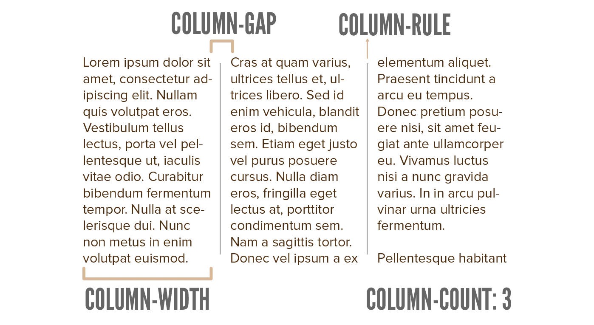

Previous chapters explained how to determine the **size** and **position** of one element. Usually, though, you want to do both at the same time, for multiple elements.

Consider a _grid_ of tiles. Many websites, especially on the homepage, feature such a grid. It might even be a dynamic one, with tiles having different sizes, some with an image and some without.

How would you do that? You certainly don't want to move around every element _individually_. It might even be impossible.

Instead, CSS provides several different approaches for the general _skeleton_ or _template_ of your layout. Some simple properties to set on a container, which automatically turns what's inside into a usable format (such as a grid).

This chapter starts with the first and the easiest: **columns**. 

To turn the content of any CSS box into columns, use the `columns` property.

## Columns

When I say columns, most people will immediately think of _text_. But these are webpages we're talking about. The content of a box can be _anything_---any collection of boxes with any styling.

As such, many fancy website layouts ... are secretly just multicolumn containers behind the scenes!

Because what do columns actually do? They say ...

* Divide the content of this box ...
* Into multiple horizontal sections which are roughly equally tall.

They distribute the content in a fair and spread-out way.

This explanation also reveals the two values you can set.

* A length indicating the **width of every column**.
* Or a number indicating **how many columns** you want.

You can also set both, with a space between them. If you want the browser to fit the columns on their own, without your input, use the `auto` value (for "automatic") instead.



<article>
  
Lorem ipsum dolor sit amet, consectetur adipiscing elit, sed do eiusmod tempor incididunt ut labore et dolore magna aliqua. Ut enim ad minim veniam, quis nostrud exercitation ullamco laboris nisi ut aliquip ex ea commodo consequat. Duis aute irure dolor in reprehenderit in voluptate velit esse cillum dolore eu fugiat nulla pariatur. Excepteur sint occaecat cupidatat non proident, sunt in culpa qui officia deserunt mollit anim id est laborum.

  
  
Lorem ipsum dolor sit amet, consectetur adipiscing elit, sed do eiusmod tempor incididunt ut labore et dolore magna aliqua. Ut enim ad minim veniam, quis nostrud exercitation ullamco laboris nisi ut aliquip ex ea commodo consequat. Duis aute irure dolor in reprehenderit in voluptate velit esse cillum dolore eu fugiat nulla pariatur. Excepteur sint occaecat cupidatat non proident, sunt in culpa qui officia deserunt mollit anim id est laborum.

</article>


article {
  columns: 3 auto; /* 3 columns, auto size them */
}
&nbsp;
img { 
  max-width: 120px;
}



As you see, the image nicely follows along. Now imagine replacing this text with big tiles or pretty images, and you can see how this simple change can create a very nice, dynamic layout for an entire page.

## Column Properties

As shown in the image, there are several other properties that can change the column layout.

* `column-count`: set the number of columns directly
* `column-width`: set the column width directly
* `column-gap`: how much empty space there should be between columns (horizontally)
* `column-rule`: a thin border to display between the columns. (This follows the same values as the `border`. Don't worry about this now, I will explain it at the [Border](../border/) chapter.)



<article>
  
Lorem ipsum dolor sit amet, consectetur adipiscing elit, sed do eiusmod tempor incididunt ut labore et dolore magna aliqua. Ut enim ad minim veniam, quis nostrud exercitation ullamco laboris nisi ut aliquip ex ea commodo consequat. Duis aute irure dolor in reprehenderit in voluptate velit esse cillum dolore eu fugiat nulla pariatur. Excepteur sint occaecat cupidatat non proident, sunt in culpa qui officia deserunt mollit anim id est laborum.

  
  
Lorem ipsum dolor sit amet, consectetur adipiscing elit, sed do eiusmod tempor incididunt ut labore et dolore magna aliqua. Ut enim ad minim veniam, quis nostrud exercitation ullamco laboris nisi ut aliquip ex ea commodo consequat. Duis aute irure dolor in reprehenderit in voluptate velit esse cillum dolore eu fugiat nulla pariatur. Excepteur sint occaecat cupidatat non proident, sunt in culpa qui officia deserunt mollit anim id est laborum.

</article>


article {
  column-count: 3;
  column-gap: 5em;
  column-rule: 2px solid green;
}
&nbsp;
img { 
  max-width: 120px;
}

