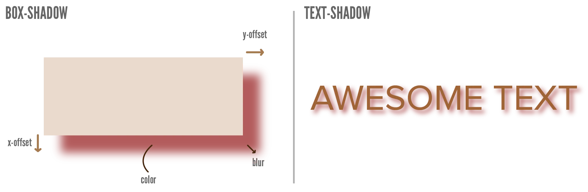

We're almost done with our chapters about the _biggest_ decisions in your design. We've seen how to change the dimensions of an element and its overall shape. We've seen how to take a group of elements and display it in a nice, orderly way (such as a grid).

Now there are two properties left that can have a _huge_ impact on any element, with just one line of code. (After that, we continue with smaller visual changes, such as styling an element's background and text.)

This chapter explains the first of those two properties: the `filter` property.

If you've ever worked with design software (or did any design outside of this course), you might know these as _adjustment layers_ or _visual effects (FX)_. 

The filter property allows a myriad of values that apply a simple effect to the _entire_ element.

I'm applying it to an image in all the examples, but as always, it can be applied to _any element_. (Paragraph, video, links, whatever.)

Also remember what I explained in the [Units](../values-i-units/) chapter about _percentages_. They can always be input in two ways (`100%` or `1.0`).

## Blur

Use `blur(amount)`.






img {
  display: block;
  max-width: 100px;
  margin: auto;
  filter: blur(5px);
}



## Brightness

Use `brightness(percentage)`.

A 0% brightness means the element is completely black, whereas 100% brightness is the original image. You can also go higher than that for a _really_ bright element.






img {
  display: block;
  max-width: 100px;
  margin: auto;
  filter: brightness(0.2);
}



## Contrast

Use `contrast(percentage)`. 

The value `100%` means nothing is changed. A lower value means all colors are pushed closer to the same (average) gray, reducing contrast. A higher value means bright colors are pushed closer to _white_ and dark colors closer to _black_, increasing contrast.

Play with the example below to see what this means.






img {
  display: block;
  max-width: 100px;
  margin: auto;
  filter: contrast(150%);
}



## Drop-Shadow

Use `drop-shadow(offsetX offsetY shadowBlur color)`.

This adds a nice shadow to the element. A higher `shadowBlur` means a _larger_ shadow.






img {
  display: block;
  max-width: 100px;
  margin: auto;
  filter: drop-shadow(5px 5px 5px black);
}



There is also a CSS property called `box-shadow`. It might seem to do the same, but it doesn't.

This _filter_ applies the shadow "realistically". It ignores empty/transparent pixels and applies the shadow to the _actual_ edge of the element. (See how, in the example above, the shadow forms around the Panda, not around the image's rectangular borders.)

The `box-shadow` property, as the name implies, always applies a shadow as if the element were a rectangle. Its only _advantage_ is that you can add the word `inset` to get an _inner shadow_. (Instead of this effect, which is called an _outer shadow_ or _drop shadow_.)

Similarly, there's a `text-shadow` property that does the same but has slight advantages in certain cases. (This is discussed later in the course.) 

I created an image for this long ago, but honestly, it's better to just play around with the interactive example above.

## Grayscale

Use `grayscale(percentage)`.

A value of `100%` means the element has become entirely grayscale. Lower values provide a mix between the original colors and grayscale.






img {
  display: block;
  max-width: 100px;
  margin: auto;
  filter: grayscale(100%);
}



## Hue-rotate

Use `hue-rotate(<number>deg)`.

As explained in the [Colors](../values-ii-colors/) chapter, **hue** refers to the color circle. Every color has a number attached to it, which goes from 0 degrees to 360 degrees ( = back to the start). For example, red is hue `0`.

This filter allows you to _recolor_ an element, by rotating along this color circle! You can move all the colors towards another color, while preserving the original image and value differences. But remember that the _unit_ for the number is `deg` (degrees).

In the example below, notice how the red tie has shifted to blue. The rest of the panda image has no color elements (only grayscale), so they don't change.






img {
  display: block;
  max-width: 100px;
  margin: auto;
  filter: hue-rotate(180deg);
}



## Invert

Use `invert()` with no extra input. Because all it does, is _flip_ every color mathematically.

For example, if a pixel has color `rgb(255,100,0)`, the inverted color is `rgb(0,155,255)`.






img {
  display: block;
  max-width: 100px;
  margin: auto;
  filter: invert();
}



## Opacity

Use `opacity(percentage)`. 

A value of `100%` is the original image. Lower values means it becomes more and more transparent (see-through), until `0%` means the element is invisible.






img {
  display: block;
  max-width: 100px;
  margin: auto;
  filter: opacity(0.5);
}



## Saturate

Use `saturate(percentage)`. 

Saturation refers to how pure the colors are. A value of `100%` is the original image. Higher values make all the colors more _bright_ and _intense_, while lower values make all the colors more _muted_ or _dull_.






img {
  display: block;
  max-width: 100px;
  margin: auto;
  filter: opacity(0.5);
}



## Sepia

Use `sepia(percentage)`. 

This applies the common sepia effect, which turns colors more warm, vivid and vintage. A value of `0%` means nothing changes, while `100%` means the element has turned completely "sepia".

This is a relatively specific and subtle effect that won't make much of a difference on some elements.






img {
  display: block;
  max-width: 100px;
  margin: auto;
  filter: sepia(75%);
}



## Multiple Filters

You can apply as many different filters as you want by providing it as a spaced list. That means a list of filters, with an empty _space_ between each of them.






img {
  display: block;
  max-width: 100px;
  margin: auto;
  filter: hue-rotate(180deg) contrast(300%);
}

