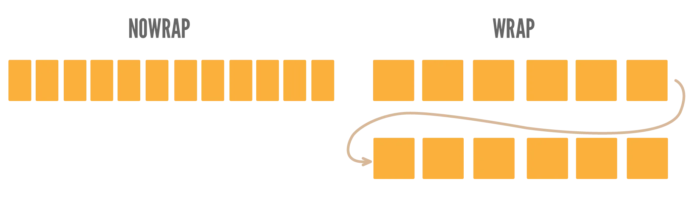
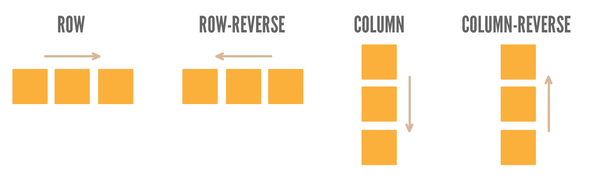
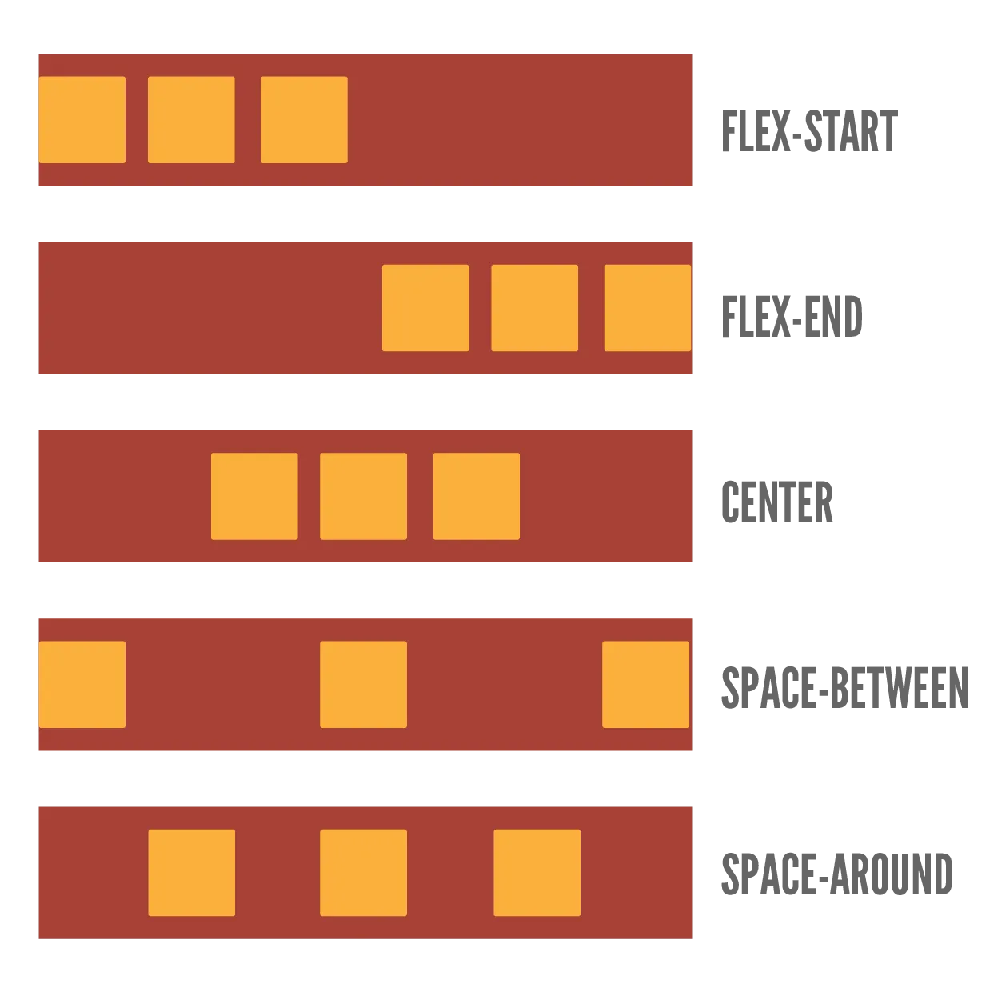
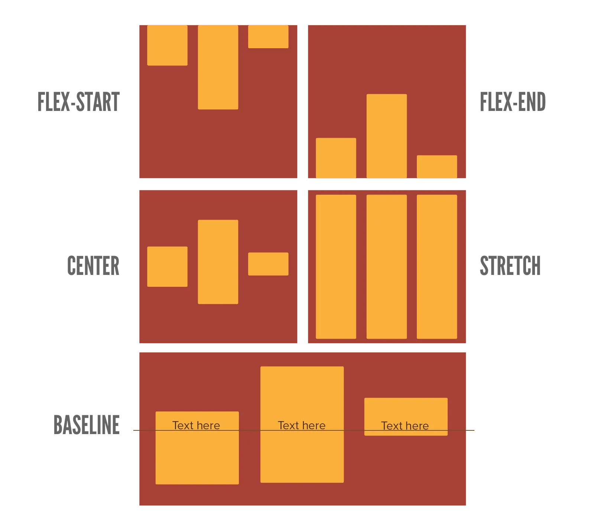
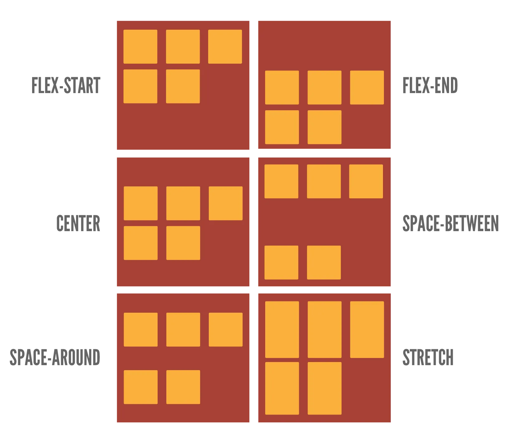
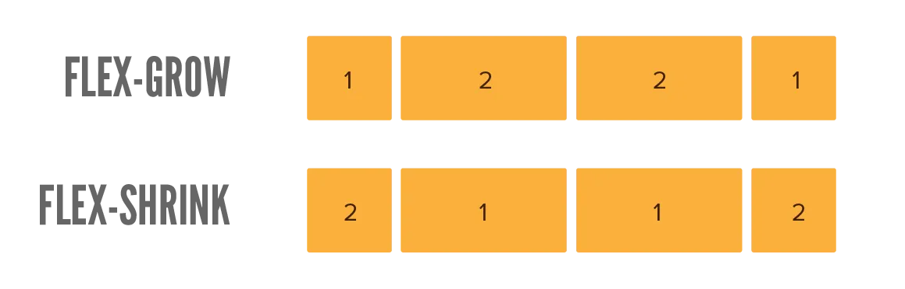
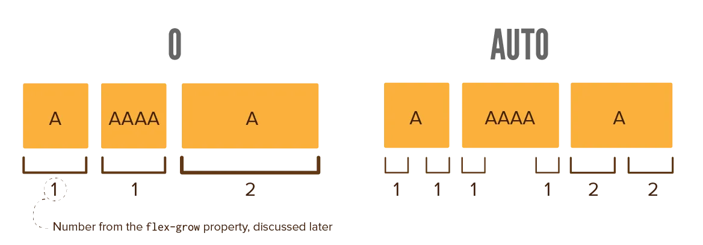

Flexbox is the next concept to learn that decides both _where_ to place multiple elements and their _size_ at the same time. Once understood, you will use it anywhere. It can transform the entire layout of your website with just a few lines of code.

The name says it all. It turns a rigid CSS box into a _flexible_ box. One that rearranges and grows/shrinks its contents in smart and configurable ways.

To turn any container into a "flexbox", use `display: flex`. 

{}
There's that display property again! The very important one that I explained at [The Box Model](../the-box-model/)
{}

From now on, all its direct children are "flex items" and behave in a different way.

## Gap

By default, all these flex items will be pushed against each other. To add whitespace---a gap---between them, use the `gap` property. It accepts any number (with unit, of course).

In the example, try removing the gap or playing with the value.



<section>
    
1

    
2

    
3

    
4

</section>


section {
    display: flex;
    gap: 1em;
}
div {
    background-color: #FFAAAA;
    width: 100%;
    height: 20px;
}



## Wrapping

What does flexbox do? First of all, it moves all its children on the same line. (No wrapping, no elements flowing vertically.)

Sometimes this is what you want. But you can turn this off with `flex-wrap: wrap`, essentially returning to a layout similar to the default page flow.

In the example below, notice how the flex items wrap underneath each other. Remove this property, and they are forced to sit next to each other on the same line.



<section>
    
1

    
2

    
3

    
4

</section>


section {
    display: flex;
    flex-wrap: wrap;
    gap: 1em;
}
div {
    background-color: #FFAAAA;
    width: 100%;
    height: 20px;
}



## Direction

Now we can start to make our flexbox do something special!

The `flex-direction` property can take four values: `row`, `row-reverse`, `column` and `column-reverse`. This determines how the flex items inside are laid out.

This is already really powerful. A vertical ("column") layout is extremely hard to do (well) with just the default page flow.

In the example below, notice how items are laid out vertically (even though wrapping is not enabled!)



<section>
    
1

    
2

    
3

    
4

</section>


section {
    display: flex;
    flex-direction: column;
    gap: 1em;
}
div {
    background-color: #FFAAAA;
    width: 100px;
    height: 20px;
}



## Justify

The `justify` property determines how to align items along the main direction (given by `flex-direction`). 

So, if it's a `row`, it determines how to align the items horizontally. If it's `column`, it aligns the items vertically.

It can take these values, which are best explained with an image:

* `start`
* `end`
* `center`
* `space-evenly`
* `space-between`
* `space-around`

In the example below, notice how the flex items are spread evenly across the main axis (horizontal). Also try playing with the `justify-content` property to see what happens.



<section>
    
1

    
2

    
3 3

    
4

</section>


section {
    display: flex;
    justify-content: space-evenly;
    gap: 1em;
}
div {
    background-color: #FFAAAA;
    min-width: 100px;
}



## Align Items

The `align-items` property aligns items across the _other_ direction (perpendicular to `flex-direction`).

Say the flexbox direction is `row`. Whereas `justify` aligns the items horizontally, `align-items` would align them vertically.

It takes these values, again best explained with an image.

* `start`
* `end`
* `center`
* `stretch`
* `baseline`

In the example below, notice how the elements have different heights. But because `align-items` is set to center, the other elements don't change their height, but instead everything positions around the same center line.



<section>
    
1 1 1

    
2

    
3 3

    
4

</section>


section {
    display: flex;
    justify-content: space-evenly;
    align-items: center;
    gap: 1em;
}
div {
    background-color: #FFAAAA;
    min-width: 100px;
}



## Align Content

This only applies to flexboxes that **wrap**. Why? Because it's about how to align the _entire contents_ of the flexbox, instead of individual items. This only makes sense for a flexbox that wraps and, as such, has dynamic dimensions.

It takes the same values as the `justify` property.

In the example below, notice how the _whole_ flexbox has moved to the end of its container. See what happens when you change `align-content` to something else.



<section>
    
1 1 1

    
2

    
3 3

    
4

</section>


section {
    display: flex;
    justify-content: space-evenly;
    align-items: center;
    align-content: end;
    flex-wrap: wrap;
    height: 120px;
    background-color: #AAFFFF;
    gap: 1em;
}
div {
    background-color: #FFAAAA;
    min-width: 100px;
}



## Grow / Shrink

This is another powerful feature of the flexbox. Because the box resizes and wraps, there will often be "leftover space". Empty space within the flexbox that isn't filled.

With the `flex-grow` and `flex-shrink` properties, you can control how this space is filled. These take a number _without_ unit, as it's a ratio. The default value is `1`: everything grows and shrinks equally.

For example, an element with `flex-grow` set to `0` will _not_ grow. An element with value `2` will grow _twice as fast_ as other elements. (And thus end up grabbing _double_ the empty space that other elements grab.)

Beware! These properties are set on the **flex item**, not the flexbox container.



<section>
    
1 1 1

    
2

    
3 3

    
4

</section>


section {
    display: flex;
    justify-content: space-evenly;
    align-items: center;
    gap: 1em;
}
&nbsp;
div {
    background-color: #FFAAAA;
    flex-basis: 50px;
    flex-shrink: 1;
    flex-grow: 1;
}
&nbsp;
.narrow {
    flex-shrink: 2;
}
&nbsp;
.wide {
    flex-grow: 2;
}



Pay careful attention to this example. The `.wide` element (the third) grows twice as large as the others. Which is expected, because it has `flex-grow: 2`.

But ... why doesn't the `.narrow` element (the first) shrink twice as quickly as the others?

Well, because shrinking only happens if there's too _little_ space. In this case, the default size of the elements is only `50px`, which means there is too _much_ space. So elements can only _grow_.

Change that value to something much bigger (like `300px`), and now elements are too wide. The flexbox has to shrink them, so the `flex-shrink` property takes effect and you should see the narrow element actually shrink faster.

## Basis

The `flex-basis` sets the initial size of a flex item along the main direction. (So `width` for rows and `height` for columns.) 

It takes any number (including unit). By default, it's `auto` (like most default values).

So ... what's the difference with just `width` or `height`? Visually, there isn't really one, as most browsers should handle it just fine.

It is however _cleaner_ and _more correct_ to use this property instead. It leads to fewer bugs and makes sure your CSS clearly states its _intention_: "Hey, this should be the _initial_ size of my item, but I know it will grow / shrink because it's a flex item."

That said, this is by far the least important property to know.

## Conclusion

Flexboxes are really, really useful. 

I come from a time before they were supported everywhere. It was a mess. 

Whenever you wanted to align a set of items, you'd have to resort to loads of tricks, or putting them inside a fake _table_. If you wanted to resize elements nicely on the fly ... forget about it.

With just a few properties, you can turn a container into a flexbox, and can make sure everything lines up perfectly and resizes to fill empty space. I use it all the time, both for big containers (the grid on a homepage), as well as tiny ones (perhaps a horizontal menu that I want nicely centered).

Speaking of grids ... let's quickly move to the next chapter!