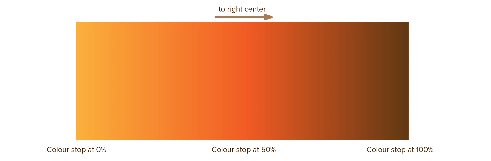
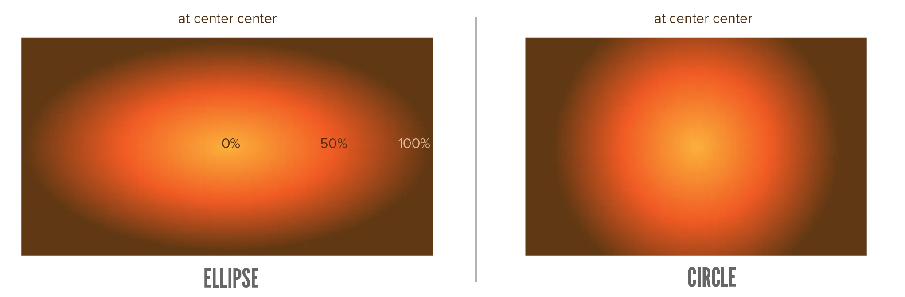

If you thought the examples from last chapter were crazy, you're in for a treat. CSS natively supports creating _gradients_, which has been a never-ending source of tricks and creative designs ever since.

What is a gradient?

Well, last chapter basically explained two extremes:

* How to turn the background into _one solid color_.
* And how to turn it into _any (complex) image_.

Gradients are somewhat of a compromise. A middle ground. Gradients allow you to set a background to **multiple solid colors**.

* You define "color stops": _"At THIS location, I want it to be THIS color."_
* You can define as many as you want, with a comma (`,`) between them.
* Then the gradient interpolates between these stops. (It smoothly transitions from one stop to the next, so it doesn't look sudden or ugly.)

CSS considers gradients "images". So you can supply them to `background-image`, but also `mask-image`, or anything else that wants an image.

It supports three types: **linear**, **radial** and **conic**.

## Linear

This gradient interpolates between the color stops in a **straight line**. (Left to Right, Top to Bottom, however you define them.)

The simplest way to define a color stop is by simply typing a **color**. For example, `red`. 

When you add multiple stops, they are automatically distributed _fairly_. (Say you add 5 stops, then they are placed at 0%, 25%, 50%, 75%, 100%.)

If you want to control the placement, add a percentage behind the color. For example, `25% red`.






div {
  width: 100%;
  height: 100px;
  background-image: linear-gradient(red 0%, yellow 50%, orange 100%);
}



As you see, linear gradients move top to bottom by default. To modify this direction, you can add another input as the very _first_ one.

You have two options.

* Use a common direction. Use `to <direction>`. Possible values are `left`, `right`, `top` and `bottom`. Or any combination of the two, such as `top right`.
* Specify an exact angle, as you normally would. (A number with the unit `deg`.)






div {
  width: 100%;
  height: 100px;
  background-image: linear-gradient(to bottom right, red 0%, yellow 50%, orange 100%);
}



## Radial

This gradient **radiates outward**. 

It starts at the _center_, then moves _outward_ in all directions. (So a color stop at position `0%` would be in the center, while one at position `100%` would be at the outer edge of the circle.)

Its color stops work the same as the linear gradient. 






div {
  width: 100%;
  height: 100px;
  background-image: radial-gradient(red 0%, yellow 50%, orange 100%);
}



And just like the linear gradient, it accepts an optional first argument. But instead of deciding a direction (which makes no sense for a circle), you can now control the **size** and **position** of this circular gradient.

The syntax is: `size at posX posY`.

The size can take these values.

* `closest-side`: the circle is as large as the distance to the closest edge
* `farthest-side`: the circle is as large as the distance to the farthest edge
* `closest-corner`: the circle is as large as the distance to the closest corner
* `farthest-corner`: the circle is as large as the distance to the farthest corner

The position is a _percentage_ of the element's dimensions. So, `50% 50%` is the center (and the default).

This gradient will stretch and squish to match the whole space. Unless your element is exactly square, this means it becomes an _ellipse_. Fortunately, there's an easy way to force it to stay a circle: simply type `circle` as the first input instead.






div {
  width: 100%;
  height: 100px;
  background-image: radial-gradient(closest-side at 75% 75%, red 0%, yellow 50%, orange 100%);
}



## Conic

This gradient interpolates between color stops **in a circle**. It starts at the top, then moves _around_ the center point, completing a full circle, until it ends back where it started.

This type of gradient is quite complicated and very rare. I decided to leave it out of this course, as it would be a lot of information you probably don't need any time soon.

I still wanted to _mention_ it though. So you know it exists and can research it yourself if it's exactly what you need.

## Repeated Gradients

Normally, these gradients fill the whole background. They stretch and squish to fit exactly.

All of these, however, allow adding the prefix `repeating-`. This change means the gradient stays a fixed size and simply _repeats_ to fill the available space. 

This is generally what you want, especially when elements aren't a nice square shape. It's also the most common choice for many "tricks" with pretty gradients.

_But how do you control the gradient's "size"?_ The size is simply the distance between the _first_ and the _last_ color stop. For example, if I add stops at `0%` and `50%`, then the gradient's size will be _half_ the total size of the element. If I set it to repeat, it will display exactly twice to fit the space.






div {
  width: 100%;
  height: 100px;
  background-image: repeating-linear-gradient(to bottom, red 0%, yellow 10%, orange 20%);
}



## A practical example

One common issue in design is _how to display text on top of an image?_ Especially if it's a photo (with lots of different color values), the text quickly becomes unreadable or messy.

One good solution ... is to add a _gradient_ behind the text! 

Wherever the text is displayed, the background is more solid. But at the edges, the gradient smoothly _fades away_ and blends into the image.

Check the example below. I picked a random header with lots of color variation (from a boardgame I worked on recently), then used a gradient to keep text readable on top of it.

Try removing the gradient and see how readable it is without.



<section>
  
  
Here's some text about this game.

</section>


.text-over-img {
  background-image: linear-gradient(to top, rgba(0,0,0,0) 0%, rgba(0,0,0,1.0) 100%);
  position: absolute;
  top: 0;
  left: 0; 
  right: 0;
  color: white;
  text-align: center;
  height: 75px;
  padding: 5px;
}
&nbsp;
section {
  position: relative;
}
&nbsp;
img {
  max-width: 100%;
}

