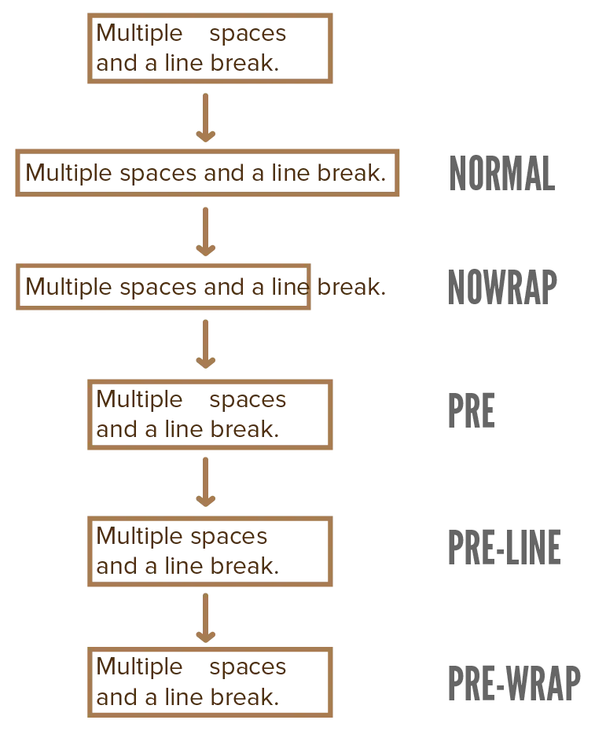

The previous chapter introduced many basic ways to manipulate how text is displayed on your website. I glossed over one _major_ change, however, which is ... the actual font!

Why did I gloss over that? Because it requires a bit more explanation and I wanted to push that to its own chapter.

## Font Family

To set a new font, use the `font-family` property. It allows a list of fonts, separated by a comma (`,`).

Why a list? It tries all the fonts, from left to right, until it finds one that successfully displays. In other words, fonts later on the list are a _fallback_. (Because the worst thing that can happen, is _no_ text or all text in an _ugly_ font you didn't choose.)

How could a font fail to display? Because by default, CSS relies on fonts being _installed_ (on the user's device). If you say `font-family: Calibri;`, it will only display if the user has the font Calibri installed.

Obviously, you can't rely on that. There's only a tiny list of fonts that you can reasonably assume are installed everywhere. (Those are Arial, Georgia, Times New Roman, Helvetica, and Courier.)

To reduce this problem, CSS does provide its own fallback fonts for five different categories: `serif`, `sans-serif`, `monospace` (computer), `cursive` (handwriting), and `fantasy` (decorative). One such category is usually typed at the end of the font list, to ensure it at least has a proper fallback.




Lorem ipsum dolor sit amet, consectetur adipiscing elit, sed do eiusmod tempor incididunt ut labore et dolore magna aliqua. Ut enim ad minim veniam, quis nostrud exercitation ullamco laboris nisi ut aliquip ex ea commodo consequat.
 


p {
  font-family: Garamond, "Times New Roman", serif; 
}



In this example, Garamond is my preferred font, but not everyone has that installed. Also notice how fonts with spaces in their name need to be put between quotes (`"`).

If you know some fun fonts on your system, try them in the example and see if they display!

{}
By the way, I just love the fact that the developers behind CSS actually went for "fantasy" as the keyword for decorative and playful fonts. 
{}

## Custom Fonts

The real solution to the problem, of course, is to actually _load_ the custom fonts your website uses.

To load one version of a font, use the `@font-face {}` rule. Inside, two properties are **required**.

* `font-family`: the name of the font (pick whatever you want)
* `src`: an URL pointing to the font file. (Or a list of URLs to different versions of it, separated by a comma.)

This downloads the font at the URL, then saves it under the name you gave it. From now on, you can use the name and be _certain_ that the user has it.

Font files can be _large_. So large, in fact, that new extensions were developed simply to allow fonts to become smaller and download faster. These are the `woff` and `woff2` extension. You want to use font files in that format, if possible.

Also within this `@font-face` rule, you can set the other properties of this file. The ones we discussed in the previous chapter: `font-weight`, `font-style`, and `font-stretch`.

The example below loads the _bold_ version of a custom font.




Lorem ipsum dolor sit amet, consectetur adipiscing elit, sed do eiusmod tempor incididunt ut labore et dolore magna aliqua. Ut enim ad minim veniam, quis nostrud exercitation ullamco laboris nisi ut aliquip ex ea commodo consequat.
 


@font-face {
  font-family: "SomeFont";
  src: url(/path/to/somefont.woff2);
  font-weight: bold;
}



Finally, it's recommended to always set an extra property here: `font-display: swap;`

What does this mean? It means the webpage already loads using your fallback font, _while_ it still downloads the custom font. Once the download is complete, it automatically swaps the fonts and the webpage is now done.

This prevents having to "wait" on (large) font files to load, displaying an empty (or incorrect) webpage in the meantime. There's basically no reason _not_ to add this.

### Common Questions

_Where do I get font files?_ There are numerous websites with (free) downloadable fonts. Probably the best resource, though, is [Google Fonts](https://fonts.google.com).

It also allows you to merely _link_ to the fonts on Google's server. This saves you bandwidth and storage space, and can be faster to setup for beginners. Ultimately, though, you don't want your website to _depend_ on other websites too much. Over time, I have come to prefer downloading fonts and keeping them on my own server.

For all this, follow the simple instructions on their website.

_How do I convert font files?_ I like to use [Transfonter](https://transfonter.org). It not only converts files, it also provides a stylesheet with the correct `@font-face` rule (and some other features).

## Whitespace

When you learned HTML, you probably learned that it **collapses whitespace**. No matter how many spaces or newlines you add, it all gets collapsed into just one single space.

What if you want to change that? Then you set the property `white-space` to one of the following properties: `normal`, `nowrap`, `pre`, `pre-line`, or `pre-wrap`. The image illustrates how each of these work.

As you see, `nowrap` just completely disables text wrapping.

The `pre` setting preserves the whitespace you entered. The `pre-line` only preserves newlines, not regular spaces. The `pre-wrap` does the same, but allows wrapping.

In the example, check the HTML tab to see the original whitespace in the input.




Lorem      ipsum dolor sit amet
Newlino, newlinus,
Lorem ipsum, lorem ipsum, loremo ipsumo.



p {
  white-space: pre;
}



## Wrapping

By default, words are never broken in two. If a word doesn't fit on the current line, it's moved to the next line in its entirety.

Two issues can arise, however.

**Issue 1:** what if a word is so long that it doesn't even fit on one line on its own? In that case, use the `overflow-wrap` property. 

* Set it to `anywhere` to allow breaking that word, well, _anywhere_.
* Set it to `break-word` to prefer breaking it at sensible places (which is vaguely defined, to be honest).

**Issue 2:** what if I have a design where it just looks ugly to keep words together? (For example, you have a text box with a really tiny width, which means you have lots of lines containing only _one_ word.) Then you can set the `word-break` property to `break-word`. (Yes, the same thing, but reversed.)

In the example, play with the paragraph width to see how words break. Also turn these properties _off_ and see how text overflows.




Lorem ipsum dolor sit amet, consectetur adipiscing elit, sed do eiusmod tempor incididunt ut labore et dolore magna aliqua. Ut enim ad minim veniam, quis nostrud exercitation ullamco laboris nisi ut aliquip ex ea commodo consequat. Duis aute irure dolor in reprehenderit in voluptate velit esse cillum dolore eu fugiat nulla pariatur. Excepteur sint occaecat cupidatat non proident, sunt in culpa qui officia deserunt mollit anim id est laborum.



p {
  width: 50px;
  overflow-wrap: anywhere;
  word-break: break-word;
  background-color: #CCCCCC;
  padding: 2px;
}



## Hyphenation

Breaking words in two is usually only done in _books_, and not recommended on websites. In books they add something else to help the reader understand this break: **hyphens**.

Those can be turned on in CSS as well with the `hyphens: auto;` rule.

This **requires** a language to be set on the element, using the `lang` attribute. Otherwise the browser doesn't know what dictionary to use for intelligently breaking words in two!

This property is supported everywhere, but not every _language_ is supported. (Those dictionaries would bloat the file size of browsers immensely.) The only language you can trust to be supported is, of course, English.




Breaking words in two is usually only done in books, and not recommended on websites. In books they add something else to help the reader understand this break: hyphens. Breaking words in two is usually only done in books, and not recommended on websites. In books they add something else to help the reader understand this break: hyphens. Breaking words in two is usually only done in books, and not recommended on websites. In books they add something else to help the reader understand this break: hyphens. 



p {
  text-align: justify;
  hyphens: auto;
  width: 400px;
}



{}
In the example, you might need to resize the width of the paragraph to make sure a few hyphens appear. This depends on your screen size!
{}

## Conclusion

That concludes our chapters on text, for now. There are a few more properties, but they're more decorative or easier to explain when connected to another topic.

Let's continue to the next chapter, which will explain another major way to spice up your designs. (As well as a new general rule of CSS that will be useful to know from now on.)