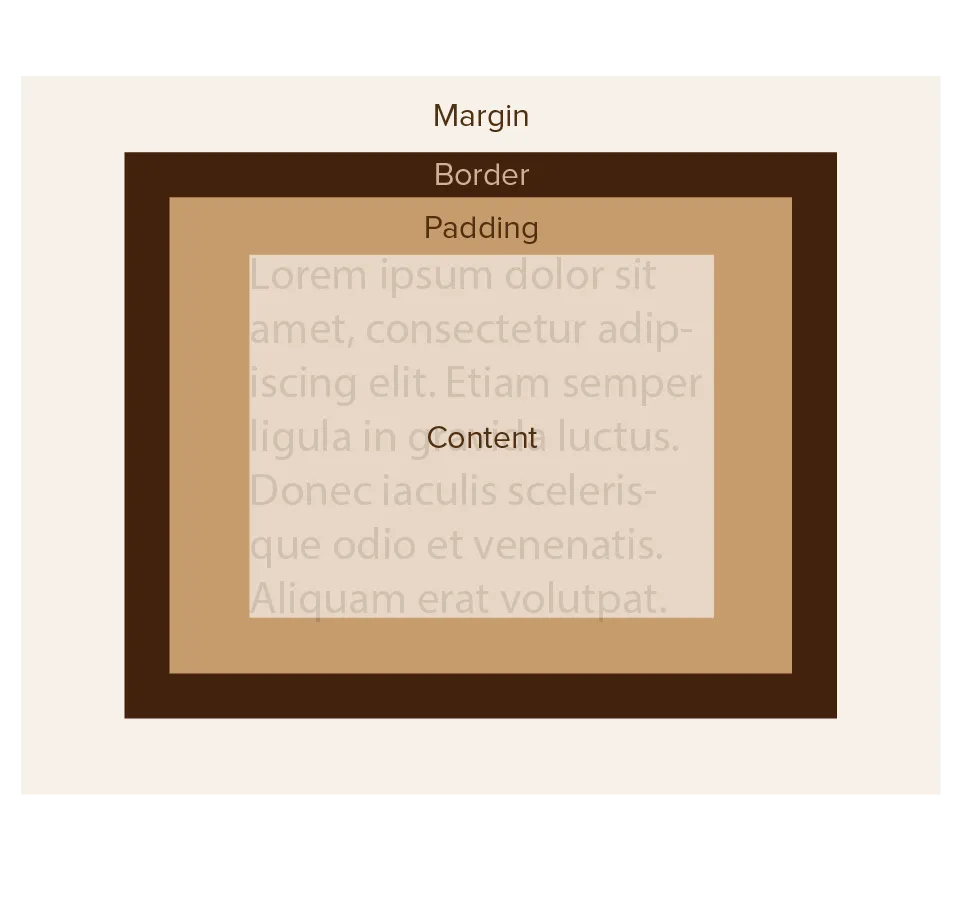
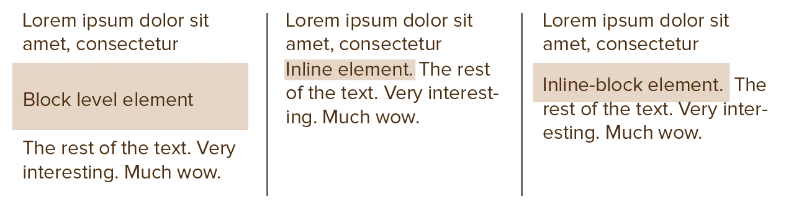

Previous chapter taught you that CSS views _everything_ on the page as a box. A rectangle with a certain size and location. This is called "the box model", which describes the properties you'll probably tweak the most often in your CSS.

## The Box Model

Below is an image of the box model. And yes, it's very simple.

There are four parts.

* `content`: this is the actual content of the element. It might be text. It might be even more boxes.
* `padding`: this is the whitespace between the content and the border.
* `border`: this is a solid border marking the edge of the box
* `margin`: this is the whitespace between the border and whatever is next to us.

You might've noticed in our previous examples that the text in our paragraph was pushed against the edge of its element. No more! Now we know that we can change the _padding_ to add some breathing room.




A paragraph with some nice whitespace around the text.

Another paragraph.



p {
    background-color: #CCCCCC;
    padding: 1em;
}



But do you see what I see? The paragraphs already have some nice whitespace between each other.

Why? Because browsers add `margin` around paragraphs by default. In fact, they do so around most elements, to make sure there is breathing room _between elements_ by default.

This is nice, but it can also be confusing if you don't know this. If an element isn't behaving like it should, it's often because of some default browser style, which is often the `margin`.

Check out what happens if you turn it off. (You can even add _negative_ margin ...)




A paragraph with some nice whitespace around the text.

Another paragraph.



p {
    background-color: #CCCCCC;
    padding: 1em;
    margin: 0;
}



More specifics about these properties, especially the _border_, are explained later in the course. You don't need to know that now.

## Dimensions

As you see, by default, the box will change its size to _fit_ the content. In that sense, the "box" is just a "container". If you put more text inside that paragraph, it will grow in _height_ to fit all of that inside.

Earlier, I explained how boxes first try to fit horizontally, then flow vertically. This is exactly the same: first it fits the width, then it grows in height.

This is usually what you want.

### Width & Height

You can, however, control the width and height more precisely! Use the `width` and `height` properties for that.




A paragraph with only a little bit of text, but a custom height.

A paragraph that's very narrow, so text has to move to a new line pretty soon.



#para-1 {
    height: 100px;
    background-color: #CCCCCC;
}
&nbsp;
#para-2 {
    width: 100px;
    background-color: #CCCCCC;
}



### Min & Max

But we want our websites to be _responsive_, right? We'd like to stick to the automatic resizing, but just ... keep it within certain bounds. 

So, instead of setting a fixed dimension, we can set a **minimum** or **maximum**. Between these extremes, the box is free to resize responsively, as usual.

Use `min-width` and `min-height` for the minimum. As expected, use `max-width` and `max-height` for the maximum. 




The next paragraph has no text, but it's still visible because of min-height. This paragraph, however, is free to grow longer and longer than that! Because it's just a minimum, not a fixed height.



p {
    min-height: 20px;
    background-color: #CCCCCC;
}



Most of the time, you want to work with these boundaries, not a fixed dimension. It allows responsive boxes, while keeping _some_ guidance to make sure they never look too weird.

## But what if the content doesn't fit?

By messing with the dimensions, it can happen that an element "overflows". Its content is bigger than you've allowed with your CSS. 

To deal with this, use the `overflow` property. It takes the following values.

* `hidden`: just hide anything that goes out of bounds
* `scroll`: add scrollbars so the user can reach it
* `visible`: just show it (even if it exceeds the box size)

In the example below, try changing the value and see what happens.




Woah, there's a lot of text within this paragraph. Like, so much that it overflows!



p {
    width: 100px;
    height: 50px;
    overflow: visible;
    background-color: #CCCCCC;
}



## Why do some elements ignore my dimensions?

Broadly speaking, there are two "types" of elements: **block** and **inline**.

Block elements demand to be on their own. By default, they take up the full width (such as the paragraphs in the examples), and don't allow anything next to it.

Inline elements are the opposite. They stay _in line_ with the other elements. They allow other elements next to it and only take up exactly as much space as the content needs.

As such, if you set a `width` on an inline element---for example---it won't do anything. It's an inline element, so it just shrinks to be as small as it can be.

Conversely, even if you make a paragraph only half as wide as the page (`width: 50%;`), it still won't allow anything next to it. It demands to be on its own horizontal line.

How do you control these settings? With the `display` property.

For now, just know there are three possible values.

* `block`
* `inline`
* `inline-block`: a "compromise". It will stay in line with other elements, but allows configuring dimensions manually.




Woah, there's a lot of text within this paragraph. It even contains <a href="https://pandaqi.com">an inline element</a> that doesn't push others away. We can turn it into an inline-block to actually modify its dimensions.

Another paragraph below. Because paragraphs are block level and want to be on their own horizontal line!



p {
    display: block;
    background-color: #CCCCCC;
}
&nbsp;
a {
    display: inline;
    background-color: purple;
    color: white;
    height: 50px; /* does nothing */
}
&nbsp;
span {
    display: inline-block;
    height: 50px; /* actually works */
    background-color: coral;
}



Crucially, **inline** elements allow wrapping. That inline element above can be broken in two (start on the current line, end on the next line of text). If you resize your browser window, you can get that to happen. 

Block or inline-block elements can never wrap like that.

There are several more values for the `display` property. It's perhaps the most powerful one of all! Not surprising, of course, because CSS is all about how to _display_ things. But those values are so powerful that they'll get their own chapters soon enough.